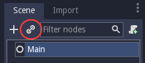
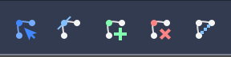
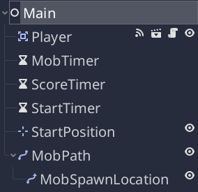

.. _doc_your_first_2d_game_the_main_game_scene:

The main game scene
===================

Now it's time to bring everything we did together into a playable game scene.

Create a new scene and add a :ref:`Node <class_Node>` named ``Main``. Ensure you
create a Node, **not** a Node2D. Click the "Instance" button and select your
saved ``Player.tscn``.

Now, add the following nodes as children of ``Main``, and name them as shown
(values are in seconds):

- :ref:`Timer <class_Timer>` (named ``MobTimer``) - to control how often mobs
   spawn
- :ref:`Timer <class_Timer>` (named ``ScoreTimer``) - to increment the score
   every second
- :ref:`Timer <class_Timer>` (named ``StartTimer``) - to give a delay before
   starting
- :ref:`Position2D <class_Position2D>` (named ``StartPosition``) - to indicate
   the player's start position

Set the ``Wait Time`` property of each of the ``Timer`` nodes as follows:

- ``MobTimer``: ``0.5``
- ``ScoreTimer``: ``1``
- ``StartTimer``: ``2``

In addition, set the ``One Shot`` property of ``StartTimer`` to "On" and set
``Position`` of the ``StartPosition`` node to ``(240, 450)``.

Spawning mobs
~~~~~~~~~~~~~

The Main node will be spawning new mobs, and we want them to appear at a random
location on the edge of the screen. Add a :ref:`Path2D <class_Path2D>` node
named ``MobPath`` as a child of ``Main``. When you select ``Path2D``, you will
see some new buttons at the top of the editor:

Select the middle one ("Add Point") and draw the path by clicking to add the
points at the corners shown. To have the points snap to the grid, make sure "Use
Grid Snap" and "Use Snap" are both selected. These options can be found to the
left of the "Lock" button, appearing as a magnet next to some dots and
intersecting lines, respectively.

.. important:: Draw the path in *clockwise* order, or your mobs will spawn
               pointing *outwards* instead of *inwards*!

.. image:: img/draw_path2d.gif

After placing point ``4`` in the image, click the "Close Curve" button and your
curve will be complete.

Now that the path is defined, add a :ref:`PathFollow2D <class_PathFollow2D>`
node as a child of ``MobPath`` and name it ``MobSpawnLocation``. This node will
automatically rotate and follow the path as it moves, so we can use it to select
a random position and direction along the path.

Your scene should look like this:

Main script
~~~~~~~~~~~

Add a script to ``Main``. At the top of the script, we use ``export
(PackedScene)`` to allow us to choose the Mob scene we want to instance.

.. tabs::
 .. code-tab:: gdscript GDScript

    extends Node

    export(PackedScene) var mob_scene
    var score

    func _ready():
        randomize()

 .. code-tab:: csharp

    public class Main : Node
    {
        // Don't forget to rebuild the project so the editor knows about the new export variable.

    #pragma warning disable 649
        // We assign this in the editor, so we don't need the warning about not being assigned.
        [Export]
        public PackedScene MobScene;
    #pragma warning restore 649

        public int Score;

        public override void _Ready()
        {
            GD.Randomize();
        }
    }

Click the ``Main`` node and you will see the ``Mob`` property in the Inspector
under "Script Variables".

You can assign this property's value in two ways:

- Drag ``Mob.tscn`` from the "FileSystem" panel and drop it in the ``Mob``
  property .
- Click the down arrow next to "[empty]" and choose "Load". Select ``Mob.tscn``.

Next, select the ``Player`` node in the Scene dock, and access the Node dock on
the sidebar. Make sure to have the Signals tab selected in the Node dock.

You should see a list of the signals for the ``Player`` node. Find and
double-click the ``hit`` signal in the list (or right-click it and select
"Connect..."). This will open the signal connection dialog. We want to make a
new function named ``game_over``, which will handle what needs to happen when a
game ends. Type "game_over" in the "Receiver Method" box at the bottom of the
signal connection dialog and click "Connect". Add the following code to the new
function, as well as a ``new_game`` function that will set everything up for a
new game:

.. tabs::
 .. code-tab:: gdscript GDScript

    func game_over():
        $ScoreTimer.stop()
        $MobTimer.stop()

    func new_game():
        score = 0
        $Player.start($StartPosition.position)
        $StartTimer.start()

 .. code-tab:: csharp

    public void GameOver()
    {
        GetNode<Timer>("MobTimer").Stop();
        GetNode<Timer>("ScoreTimer").Stop();
    }

    public void NewGame()
    {
        Score = 0;

        var player = GetNode<Player>("Player");
        var startPosition = GetNode<Position2D>("StartPosition");
        player.Start(startPosition.Position);

        GetNode<Timer>("StartTimer").Start();
    }

Now connect the ``timeout()`` signal of each of the Timer nodes (``StartTimer``,
``ScoreTimer`` , and ``MobTimer``) to the main script. ``StartTimer`` will start
the other two timers. ``ScoreTimer`` will increment the score by 1.

.. tabs::
 .. code-tab:: gdscript GDScript

    func _on_StartTimer_timeout():
        $MobTimer.start()
        $ScoreTimer.start()

    func _on_ScoreTimer_timeout():
        score += 1

 .. code-tab:: csharp

    public void OnStartTimerTimeout()
    {
        GetNode<Timer>("MobTimer").Start();
        GetNode<Timer>("ScoreTimer").Start();
    }

    public void OnScoreTimerTimeout()
    {
        Score++;
    }

In ``_on_MobTimer_timeout()``, we will create a mob instance, pick a random
starting location along the ``Path2D``, and set the mob in motion. The
``PathFollow2D`` node will automatically rotate as it follows the path, so we
will use that to select the mob's direction as well as its position.

Note that a new instance must be added to the scene using ``add_child()``.

.. tabs::
 .. code-tab:: gdscript GDScript

    func _on_MobTimer_timeout():
        # Choose a random location on Path2D.
        var mob_spawn_location = get_node("MobPath/MobSpawnLocation");
        mob_spawn_location.offset = randi()

        # Create a Mob instance and add it to the scene.
        var mob = mob_scene.instance()
        add_child(mob)

        # Set the mob's direction perpendicular to the path direction.
        var direction = mob_spawn_location.rotation + PI / 2

        # Set the mob's position to a random location.
        mob.position = mob_spawn_location.position

        # Add some randomness to the direction.
        direction += rand_range(-PI / 4, PI / 4)
        mob.rotation = direction

        # Choose the velocity.
        var velocity = Vector2(rand_range(mob.min_speed, mob.max_speed), 0)
        mob.linear_velocity = velocity.rotated(direction)

 .. code-tab:: csharp

    public void OnMobTimerTimeout()
    {
        // Note: Normally it is best to use explicit types rather than the `var`
        // keyword. However, var is acceptable to use here because the types are
        // obviously PathFollow2D and Mob, since they appear later on the line.

        // Choose a random location on Path2D.
        var mobSpawnLocation = GetNode<PathFollow2D>("MobPath/MobSpawnLocation");
        mobSpawnLocation.Offset = GD.Randi();

        // Create a Mob instance and add it to the scene.
        var mob = (Mob)MobScene.Instance();
        AddChild(mob);

        // Set the mob's direction perpendicular to the path direction.
        float direction = mobSpawnLocation.Rotation + Mathf.Pi / 2;

        // Set the mob's position to a random location.
        mob.Position = mobSpawnLocation.Position;

        // Add some randomness to the direction.
        direction += (float)GD.RandRange(-Mathf.Pi / 4, Mathf.Pi / 4);
        mob.Rotation = direction;

        // Choose the velocity.
        var velocity = new Vector2((float)GD.RandRange(mob.MinSpeed, mob.MaxSpeed), 0);
        mob.LinearVelocity = velocity.Rotated(direction);
    }

.. important:: Why ``PI``? In functions requiring angles, Godot uses *radians*,
               not degrees. Pi represents a half turn in radians, about
               ``3.1415`` (there is also ``TAU`` which is equal to ``2 * PI``).
               If you're more comfortable working with degrees, you'll need to
               use the ``deg2rad()`` and ``rad2deg()`` functions to convert
               between the two.

Testing the scene
~~~~~~~~~~~~~~~~~

Let's test the scene to make sure everything is working. Add this to
``_ready()``:

.. tabs::
 .. code-tab:: gdscript GDScript

    func _ready():
        randomize()
        new_game()

 .. code-tab:: csharp

    public override void _Ready()
    {
        NewGame();
    }

Let's also assign ``Main`` as our "Main Scene" - the one that runs automatically
when the game launches. Press the "Play" button and select ``Main.tscn`` when
prompted.

You should be able to move the player around, see mobs spawning, and see the
player disappear when hit by a mob.

When you're sure everything is working, remove the call to ``new_game()`` from
``_ready()``.

What's our game lacking? Some user interface. In the next lesson, we'll add a
title screen and display the player's score.
