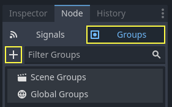

.. _doc_your_first_2d_game_heads_up_display:

Heads up display
================

The final piece our game needs is a User Interface (UI) to display things like
score, a "game over" message, and a restart button.

Create a new scene, and add a :ref:`CanvasLayer <class_CanvasLayer>` node named
``HUD``. "HUD" stands for "heads-up display", an informational display that
appears as an overlay on top of the game view.

The :ref:`CanvasLayer <class_CanvasLayer>` node lets us draw our UI elements on
a layer above the rest of the game, so that the information it displays isn't
covered up by any game elements like the player or mobs.

The HUD needs to display the following information:

- Score, changed by ``ScoreTimer``.
- A message, such as "Game Over" or "Get Ready!"
- A "Start" button to begin the game.

The basic node for UI elements is :ref:`Control <class_Control>`. To create our
UI, we'll use two types of :ref:`Control <class_Control>` nodes: :ref:`Label
<class_Label>` and :ref:`Button <class_Button>`.

Create the following as children of the ``HUD`` node:

- :ref:`Label <class_Label>` named ``ScoreLabel``.
- :ref:`Label <class_Label>` named ``Message``.
- :ref:`Button <class_Button>` named ``StartButton``.
- :ref:`Timer <class_Timer>` named ``MessageTimer``.

Click on the ``ScoreLabel`` and type a number into the ``Text`` field in the
Inspector. The default font for ``Control`` nodes is small and doesn't scale
well. There is a font file included in the game assets called
"Xolonium-Regular.ttf". To use this font, do the following:

1. Under "Theme Overrides > Fonts", choose "Load" and select the "Xolonium-Regular.ttf" file.

.. image:: img/custom_font_load_font.webp

Once you've done this on the ``ScoreLabel``, you can click the down arrow next
to the Font property and choose "Copy", then "Paste" it in the same place
on the other two Control nodes.
Set the "Font Size" property of the ``ScoreLabel`` under "Theme Overrides > Font Sizes".
A setting of ``64`` works well.

.. image:: img/custom_font_size.webp

.. note:: **Anchors:** ``Control`` nodes have a position and size,
          but they also have anchors. Anchors define the origin -
          the reference point for the edges of the node.

Arrange the nodes as shown below.
You can drag the nodes to place them manually, or for more precise placement,
use "Anchor Presets" with the following settings:

ScoreLabel
~~~~~~~~~~

Layout :

-  Anchor Preset : ``Center Top``

Label settings :

-  Text : ``0``
-  Horizontal Alignment : ``Center``
-  Vertical Alignment : ``Center``

Message
~~~~~~~~~~~~

Layout :

-  Anchor Preset : ``Center``

Label settings :

-  Text : ``Dodge the Creeps!``
-  Horizontal Alignment : ``Center``
-  Vertical Alignment : ``Center``
-  Autowrap Mode : ``Word``

StartButton
~~~~~~~~~~~

Layout :

-  Anchor Preset : ``Center Bottom``

Button settings :

-  Text : ``Start``
-  Position Y : ``580`` (Control - Layout/Transform)

On the ``MessageTimer``, set the ``Wait Time`` to ``2`` and set the ``One Shot``
property to "On".

Now add this script to ``HUD``:

.. tabs::
 .. code-tab:: gdscript GDScript

    extends CanvasLayer

    # Notifies `Main` node that the button has been pressed
    signal start_game

 .. code-tab:: csharp

    using Godot;

    public partial class HUD : CanvasLayer
    {
        // Don't forget to rebuild the project so the editor knows about the new signal.

        [Signal]
        public delegate void StartGameEventHandler();
    }

 .. code-tab:: cpp

    // Copy `player.gdns` to `hud.gdns` and replace `Player` with `HUD`.
    // Attach the `hud.gdns` file to the HUD node.

    // Create two files `hud.cpp` and `hud.hpp` next to `entry.cpp` in `src`.
    // This code goes in `hud.hpp`. We also define the methods we'll be using here.
    #ifndef HUD_H
    #define HUD_H

    #include <Button.hpp>
    #include <CanvasLayer.hpp>
    #include <Godot.hpp>
    #include <Label.hpp>
    #include <Timer.hpp>

    class HUD : public godot::CanvasLayer {
        GODOT_CLASS(HUD, godot::CanvasLayer)

        godot::Label *_score_label;
        godot::Label *_message_label;
        godot::Timer *_start_message_timer;
        godot::Timer *_get_ready_message_timer;
        godot::Button *_start_button;
        godot::Timer *_start_button_timer;

    public:
        void _init() {}
        void _ready();
        void show_get_ready();
        void show_game_over();
        void update_score(const int score);
        void _on_StartButton_pressed();
        void _on_StartMessageTimer_timeout();
        void _on_GetReadyMessageTimer_timeout();

        static void _register_methods();
    };

    #endif // HUD_H

We now want to display a message temporarily,
such as "Get Ready", so we add the following code

.. tabs::
 .. code-tab:: gdscript GDScript

    func show_message(text):
        $Message.text = text
        $Message.show()
        $MessageTimer.start()

 .. code-tab:: csharp

    public void ShowMessage(string text)
    {
        var message = GetNode<Label>("Message");
        message.Text = text;
        message.Show();

        GetNode<Timer>("MessageTimer").Start();
    }

 .. code-tab:: cpp

    // This code goes in `hud.cpp`.
    #include "hud.hpp"

    void HUD::_ready() {
        _score_label = get_node<godot::Label>("ScoreLabel");
        _message_label = get_node<godot::Label>("MessageLabel");
        _start_message_timer = get_node<godot::Timer>("StartMessageTimer");
        _get_ready_message_timer = get_node<godot::Timer>("GetReadyMessageTimer");
        _start_button = get_node<godot::Button>("StartButton");
        _start_button_timer = get_node<godot::Timer>("StartButtonTimer");
    }

    void HUD::_register_methods() {
        godot::register_method("_ready", &HUD::_ready);
        godot::register_method("show_get_ready", &HUD::show_get_ready);
        godot::register_method("show_game_over", &HUD::show_game_over);
        godot::register_method("update_score", &HUD::update_score);
        godot::register_method("_on_StartButton_pressed", &HUD::_on_StartButton_pressed);
        godot::register_method("_on_StartMessageTimer_timeout", &HUD::_on_StartMessageTimer_timeout);
        godot::register_method("_on_GetReadyMessageTimer_timeout", &HUD::_on_GetReadyMessageTimer_timeout);
        godot::register_signal<HUD>("start_game", godot::Dictionary());
    }

We also need to process what happens when the player loses. The code below will show "Game Over" for 2 seconds, then return to the title screen and, after a brief pause, show the "Start" button.

.. tabs::
 .. code-tab:: gdscript GDScript

    func show_game_over():
        show_message("Game Over")
        # Wait until the MessageTimer has counted down.
        await $MessageTimer.timeout

        $Message.text = "Dodge the\nCreeps!"
        $Message.show()
        # Make a one-shot timer and wait for it to finish.
        await get_tree().create_timer(1.0).timeout
        $StartButton.show()

 .. code-tab:: csharp

    async public void ShowGameOver()
    {
        ShowMessage("Game Over");

        var messageTimer = GetNode<Timer>("MessageTimer");
        await ToSignal(messageTimer, Timer.SignalName.Timeout);

        var message = GetNode<Label>("Message");
        message.Text = "Dodge the\nCreeps!";
        message.Show();

        await ToSignal(GetTree().CreateTimer(1.0), SceneTreeTimer.SignalName.Timeout);
        GetNode<Button>("StartButton").Show();
    }

 .. code-tab:: cpp

    // This code goes in `hud.cpp`.
    // There is no `yield` in GDExtension, so we need to have every
    // step be its own method that is called on timer timeout.
    void HUD::show_get_ready() {
        _message_label->set_text("Get Ready");
        _message_label->show();
        _get_ready_message_timer->start();
    }

    void HUD::show_game_over() {
        _message_label->set_text("Game Over");
        _message_label->show();
        _start_message_timer->start();
    }

This function is called when the player loses. It will show "Game Over" for 2
seconds, then return to the title screen and, after a brief pause, show the
"Start" button.

.. note:: When you need to pause for a brief time, an alternative to using a
          Timer node is to use the SceneTree's ``create_timer()`` function. This
          can be very useful to add delays such as in the above code, where we
          want to wait some time before showing the "Start" button.

Add the code below to ``HUD`` to update the score

.. tabs::
 .. code-tab:: gdscript GDScript

    func update_score(score):
        $ScoreLabel.text = str(score)

 .. code-tab:: csharp

    public void UpdateScore(int score)
    {
        GetNode<Label>("ScoreLabel").Text = score.ToString();
    }

 .. code-tab:: cpp

    // This code goes in `hud.cpp`.
    void HUD::update_score(const int p_score) {
        _score_label->set_text(godot::Variant(p_score));
    }

Connect the ``timeout()`` signal of ``MessageTimer`` and the ``pressed()``
signal of ``StartButton``, and add the following code to the new functions:

.. tabs::
 .. code-tab:: gdscript GDScript

    func _on_start_button_pressed():
        $StartButton.hide()
        start_game.emit()

    func _on_message_timer_timeout():
        $Message.hide()

 .. code-tab:: csharp

    private void OnStartButtonPressed()
    {
        GetNode<Button>("StartButton").Hide();
        EmitSignal(SignalName.StartGame);
    }

    private void OnMessageTimerTimeout()
    {
        GetNode<Label>("Message").Hide();
    }

 .. code-tab:: cpp

    // This code goes in `hud.cpp`.
    void HUD::_on_StartButton_pressed() {
        _start_button_timer->stop();
        _start_button->hide();
        emit_signal("start_game");
    }

    void HUD::_on_StartMessageTimer_timeout() {
        _message_label->set_text("Dodge the\nCreeps");
        _message_label->show();
        _start_button_timer->start();
    }

    void HUD::_on_GetReadyMessageTimer_timeout() {
        _message_label->hide();
    }

Connecting HUD to Main
~~~~~~~~~~~~~~~~~~~~~~

Now that we're done creating the ``HUD`` scene, go back to ``Main``. Instance
the ``HUD`` scene in ``Main`` like you did the ``Player`` scene. The scene tree
should look like this, so make sure you didn't miss anything:

.. image:: img/completed_main_scene.webp

Now we need to connect the ``HUD`` functionality to our ``Main`` script. This
requires a few additions to the ``Main`` scene:

In the Node tab, connect the HUD's ``start_game`` signal to the ``new_game()``
function of the Main node by clicking the "Pick" button in the "Connect a Signal"
window and selecting the ``new_game()`` method or type "new_game" below "Receiver Method"
in the window. Verify that the green connection icon now appears next to
``func new_game()`` in the script.

In ``new_game()``, update the score display and show the "Get Ready" message:

.. tabs::
 .. code-tab:: gdscript GDScript

        $HUD.update_score(score)
        $HUD.show_message("Get Ready")

 .. code-tab:: csharp

        var hud = GetNode<HUD>("HUD");
        hud.UpdateScore(_score);
        hud.ShowMessage("Get Ready!");

 .. code-tab:: cpp

        _hud->update_score(score);
        _hud->show_get_ready();

In ``game_over()`` we need to call the corresponding ``HUD`` function:

.. tabs::
 .. code-tab:: gdscript GDScript

        $HUD.show_game_over()

 .. code-tab:: csharp

        GetNode<HUD>("HUD").ShowGameOver();

 .. code-tab:: cpp

        _hud->show_game_over();

Just a reminder: we don't want to start the new game automatically, so
remove the call to ``new_game()`` in ``_ready()`` if you haven't yet.

Finally, add this to ``_on_ScoreTimer_timeout()`` to keep the display in sync
with the changing score:

.. tabs::
 .. code-tab:: gdscript GDScript

        $HUD.update_score(score)

 .. code-tab:: csharp

        GetNode<HUD>("HUD").UpdateScore(_score);

 .. code-tab:: cpp

        _hud->update_score(score);

Now you're ready to play! Click the "Play the Project" button. You will be asked
to select a main scene, so choose ``Main.tscn``.

Removing old creeps
~~~~~~~~~~~~~~~~~~~

If you play until "Game Over" and then start a new game right away, the creeps
from the previous game may still be on the screen. It would be better if they
all disappeared at the start of a new game. We just need a way to tell *all* the
mobs to remove themselves. We can do this with the "group" feature.

In the ``Mob`` scene, select the root node and click the "Node" tab next to the
Inspector (the same place where you find the node's signals). Next to "Signals",
click "Groups" and you can type a new group name and click "Add".

Now all mobs will be in the "mobs" group. We can then add the following line to
the ``new_game()`` function in ``Main``:

.. tabs::
 .. code-tab:: gdscript GDScript

        get_tree().call_group("mobs", "queue_free")

 .. code-tab:: csharp

        // Note that for calling Godot-provided methods with strings,
        // we have to use the original Godot snake_case name.
        GetTree().CallGroup("mobs", Node.MethodName.QueueFree);

 .. code-tab:: cpp

        get_tree()->call_group("mobs", "queue_free");

The ``call_group()`` function calls the named function on every node in a
group - in this case we are telling every mob to delete itself.

The game's mostly done at this point. In the next and last part, we'll polish it
a bit by adding a background, looping music, and some keyboard shortcuts.
