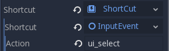

.. _doc_your_first_2d_game_finishing_up:

Finishing up
============

We have now completed all the functionality for our game. Below are some
remaining steps to add a bit more "juice" to improve the game experience.

Feel free to expand the gameplay with your own ideas.

Background
~~~~~~~~~~

The default gray background is not very appealing, so let's change its color.
One way to do this is to use a :ref:`ColorRect <class_ColorRect>` node. Make it
the first node under ``Main`` so that it will be drawn behind the other nodes.
``ColorRect`` only has one property: ``Color``. Choose a color you like and
select "Layout" -> "Full Rect" so that it covers the screen.

You could also add a background image, if you have one, by using a
``TextureRect`` node instead.

Sound effects
~~~~~~~~~~~~~

Sound and music can be the single most effective way to add appeal to the game
experience. In your game assets folder, you have two sound files: "House In a
Forest Loop.ogg" for background music, and "gameover.wav" for when the player
loses.

Add two :ref:`AudioStreamPlayer <class_AudioStreamPlayer>` nodes as children of
``Main``. Name one of them ``Music`` and the other ``DeathSound``. On each one,
click on the ``Stream`` property, select "Load", and choose the corresponding
audio file.

To play the music, add ``$Music.play()`` in the ``new_game()`` function and
``$Music.stop()`` in the ``game_over()`` function.

Finally, add ``$DeathSound.play()`` in the ``game_over()`` function.

Keyboard shortcut
~~~~~~~~~~~~~~~~~

Since the game is played with keyboard controls, it would be convenient if we
could also start the game by pressing a key on the keyboard. We can do this with
the "Shortcut" property of the ``Button`` node.

In the ``HUD`` scene, select the ``StartButton`` and find its *Shortcut*
property in the Inspector. Select "New Shortcut" and click on the "Shortcut"
item. A second *Shortcut* property will appear. Select "New InputEventAction"
and click the new "InputEventAction". Finally, in the *Action* property, type
the name ``ui_select``. This is the default input event associated with the
spacebar.

Now when the start button appears, you can either click it or press :kbd:`Space`
to start the game.
