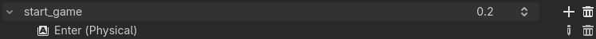
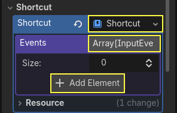
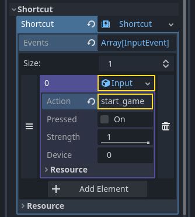
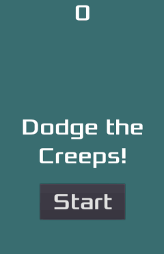

.. _doc_your_first_2d_game_finishing_up:

Finishing up
============

We have now completed all the functionality for our game. Below are some
remaining steps to add a bit more "juice" to improve the game experience.

Feel free to expand the gameplay with your own ideas.

Background
~~~~~~~~~~

The default gray background is not very appealing, so let's change its color.
One way to do this is to use a :ref:`ColorRect <class_ColorRect>` node. Make it
the first node under ``Main`` so that it will be drawn behind the other nodes.
``ColorRect`` only has one property: ``Color``. Choose a color you like and
select "Layout" -> "Anchors Preset" -> "Full Rect" either in the toolbar at the top of the viewport or in the inspector so that it covers the screen.

You could also add a background image, if you have one, by using a
``TextureRect`` node instead.

Sound effects
~~~~~~~~~~~~~

Sound and music can be the single most effective way to add appeal to the game
experience. In your game's **art** folder, you have two sound files: "House In a
Forest Loop.ogg" for background music, and "gameover.wav" for when the player
loses.

Add two :ref:`AudioStreamPlayer <class_AudioStreamPlayer>` nodes as children of
``Main``. Name one of them ``Music`` and the other ``DeathSound``. On each one,
click on the ``Stream`` property, select "Load", and choose the corresponding
audio file.

All audio is automatically imported with the ``Loop`` setting disabled.
If you want the music to loop seamlessly, click on the Stream file arrow,
select ``Make Unique``, then click on the Stream file and check the ``Loop`` box.

To play the music, add ``$Music.play()`` in the ``new_game()``
function and ``$Music.stop()`` in the ``game_over()`` function.

Finally, add ``$DeathSound.play()`` in the ``game_over()`` function.

.. tabs::
 .. code-tab:: gdscript GDScript

    func game_over():
        ...
        $Music.stop()
        $DeathSound.play()

    func new_game():
        ...
        $Music.play()

 .. code-tab:: csharp

    public void GameOver()
    {
        ...
        GetNode<AudioStreamPlayer>("Music").Stop();
        GetNode<AudioStreamPlayer>("DeathSound").Play();
    }

    public void NewGame()
    {
        ...
        GetNode<AudioStreamPlayer>("Music").Play();
    }

Keyboard shortcut
~~~~~~~~~~~~~~~~~

Since the game is played with keyboard controls, it would be convenient if we
could also start the game by pressing a key on the keyboard. We can do this with
the "Shortcut" property of the ``Button`` node.

In a previous lesson, we created four input actions to move the character. We
will create a similar input action to map to the start button.

Select "Project" -> "Project Settings" and then click on the "Input Map"
tab. In the same way you created the movement input actions, create a new
input action called ``start_game`` and add a key mapping for the :kbd:`Enter`
key.

Now would be a good time to add controller support if you have one available.
Attach or pair your controller and then under each input action that you wish
to add controller support for, click on the "+" button and press the corresponding
button, d-pad, or stick direction that you want to map to the respective input action.

In the ``HUD`` scene, select the ``StartButton`` and find its **Shortcut**
property in the Inspector. Create a new :ref:`Shortcut <class_Shortcut>` resource
by clicking within the box, open the **Events** array and add a new array element
to it by clicking on **Array[InputEvent] (size 0)**.

Create a new :ref:`InputEventAction <class_InputEventAction>` and name it ``start_game``.

Now when the start button appears, you can either click it or press :kbd:`Enter`
to start the game.

And with that, you completed your first 2D game in Godot.

You got to make a player-controlled character, enemies that spawn randomly
around the game board, count the score, implement a game over and replay, user
interface, sounds, and more. Congratulations!

There's still much to learn, but you can take a moment to appreciate what you
achieved.

And when you're ready, you can move on to :ref:`doc_your_first_3d_game` to learn
to create a complete 3D game from scratch, in Godot.
