.. _doc_first_3d_game_game_area:

Setting up the game area
========================

In this first part, we're going to set up the game area. Let's get started by
importing the start assets and setting up the game scene.

We've prepared a Godot project with the 3D models and sounds we'll use for this
tutorial, linked in the index page. If you haven't done so yet, you can download
the archive here: `Squash the Creeps assets <https://github.com/godotengine/godot-docs-project-starters/releases/download/latest-4.x/3d_squash_the_creeps_starter.zip>`_.

Once you downloaded it, extract the .zip archive on your computer. Open the
Godot Project Manager and click the *Import* button.

.. image:: img/01.game_setup/01.import_button.webp

In the import popup, enter the full path to the freshly created directory
``3d_squash_the_creeps_starter/``. You can click the *Browse* button on the right to
open a file browser and navigate to the ``project.godot`` file the folder
contains.

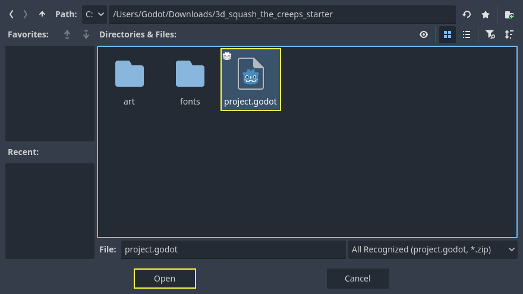

Click *Import* to open the project in the editor.

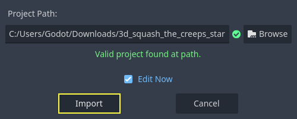

A window notifying you that the project was generated by an older Godot version may appear.
Click *OK* to convert the project to your current Godot version.

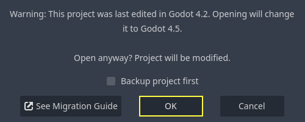

If it doesn't open immediately open the project from your project list.

The start project contains an icon and two folders: ``art/`` and ``fonts/``.
There, you will find the art assets and music we'll use in the game.

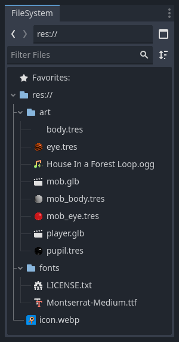

There are two 3D models, ``player.glb`` and ``mob.glb``, some materials that
belong to these models, and a music track.

Setting up the playable area
----------------------------

We're going to create our main scene with a plain :ref:`Node <class_Node>` as its root. In the
*Scene* dock, click the *Add Child Node* button represented by a "+" icon in the
top-left and double-click on *Node*. Name the node ``Main``. An alternate method to rename the node is to right-click on *Node* and choose *Rename* (or :kbd:`F2`). Alternatively, to add
a node to the scene, you can press :kbd:`Ctrl + A` (:kbd:`Cmd + A` on macOS).

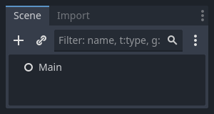

Save the scene as ``main.tscn`` by pressing :kbd:`Ctrl + S` (:kbd:`Cmd + S` on macOS).

We'll start by adding a floor that'll prevent the characters from falling. To
create static colliders like the floor, walls, or ceilings, you can use :ref:`StaticBody3D <class_StaticBody3D>` nodes. They require :ref:`CollisionShape3D <class_CollisionShape3D>` child nodes to
define the collision area. With the ``Main`` node selected, add a :ref:`StaticBody3D <class_StaticBody3D>`
node, then a :ref:`CollisionShape3D <class_CollisionShape3D>`. Rename the :ref:`StaticBody3D <class_StaticBody3D>` to ``Ground``.

.. image:: img/01.game_setup/adding_static_body3D.webp

Your scene tree should look like this

.. image:: img/01.game_setup/06.staticbody_node.webp

A warning sign next to the :ref:`CollisionShape3D <class_CollisionShape3D>` appears because we haven't defined
its shape. If you click the icon, a popup appears to give you more information.

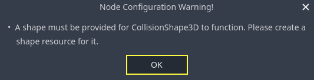

To create a shape, select the :ref:`CollisionShape3D <class_CollisionShape3D>` node, head to the *Inspector*
and click the *<empty>* field next to the *Shape* property. Create a new *BoxShape3D*.

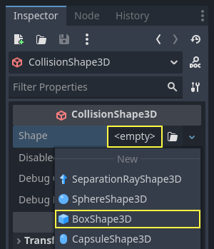

The box shape is perfect for flat ground and walls. Its thickness makes it
reliable to block even fast-moving objects.

A box's wireframe appears in the viewport with three orange dots. You can click
and drag these to edit the shape's extents interactively. We can also precisely
set the size in the inspector. Click on the :ref:`BoxShape3D <class_BoxShape3D>` to expand the resource.
Set its *Size* to ``60`` on the X-axis, ``2`` for the Y-axis, and ``60`` for
the Z-axis.

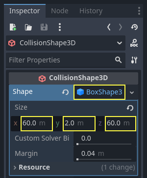

Collision shapes are invisible. We need to add a visual floor that goes along
with it. Select the ``Ground`` node and add a :ref:`MeshInstance3D <class_MeshInstance3D>` as its child.

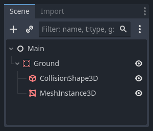

In the *Inspector*, click on the field next to *Mesh* and create a :ref:`BoxMesh <class_BoxMesh>`
resource to create a visible box.

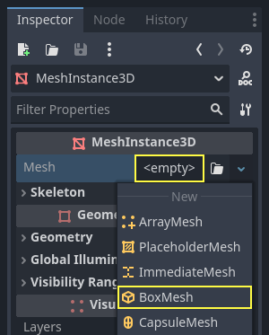

Once again, it's too small by default. Click the box icon to expand the
resource and set its *Size* to ``60``, ``2``, and ``60``.

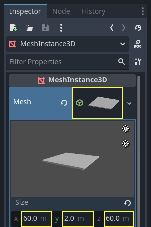

You should see a wide grey slab that covers the grid and blue and red axes in
the viewport.

We're going to move the ground down so we can see the floor grid. To do this, the grid snapping feature can be used.
Grid snapping can be activated 2 ways in the 3D editor.
The first is by pressing the *Use Snap* button (or pressing the :kbd:`Y` key).
The second is by selecting a node, dragging a handle on the gizmo **then** holding :kbd:`Ctrl` while still clicking to enable snapping as long as :kbd:`Ctrl` is held.

Start by setting snapping with your preferred method. Then move the ``Ground`` node using the Y-axis (the green arrow on the gizmo).

.. image:: img/01.game_setup/move_gizmo_y_axis.webp

.. note::

    If you can't see the 3D object manipulator like on the image above, ensure
    the *Select Mode* is active in the toolbar above the view.

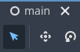

Move the ground down ``1`` meter, in order to have a visible editor grid. A label in the bottom-left corner of the
viewport tells you how much you're translating the node.

.. image:: img/01.game_setup/15.translation_amount.png

.. note::

    Moving the *Ground* node down moves both children along with it.
    Ensure you move the *Ground* node, **not** the *MeshInstance3D* or the
    *CollisionShape3D*.

Ultimately, ``Ground``'s transform.position.y should be -1

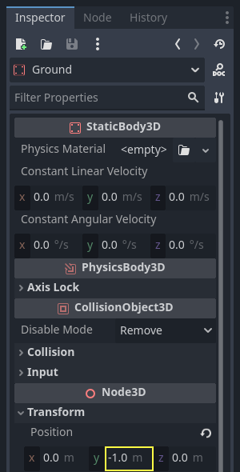

Let's add a directional light so our scene isn't all grey. Select the ``Main``
node and add a child node :ref:`DirectionalLight3D <class_DirectionalLight3D>`.

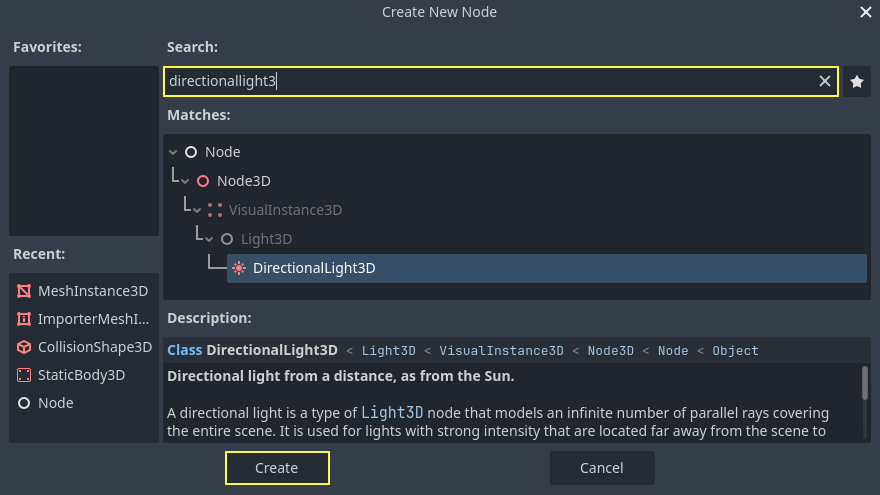

We need to move and rotate the :ref:`DirectionalLight3D <class_DirectionalLight3D>` node.
Move it up by clicking and dragging on the manipulator's green arrow
and click and drag on the red arc to rotate it around the X-axis, until the
ground is lit.

In the *Inspector*, turn on *Shadow* by clicking the checkbox.

.. image:: img/01.game_setup/16.turn_on_shadows.webp

At this point, your project should look like this.

That's our starting point. In the next part, we will work on the player scene
and base movement.
