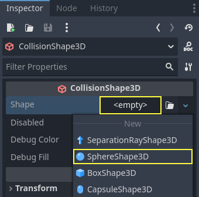
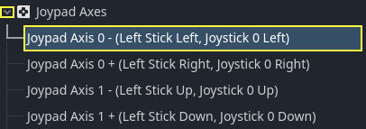

.. _doc_first_3d_game_player_scene_and_input:

Player scene and input actions
==============================

In the next two lessons, we will design the player scene, register custom input
actions, and code player movement. By the end, you'll have a playable character
that moves in eight directions.

.. TODO: add player animated gif?
.. player_movement.gif

Create a new scene by going to the Scene menu in the top-left and clicking *New
Scene*.

|image0|

 Create a :ref:`CharacterBody3D <class_CharacterBody3D>` node as the root

Name the :ref:`CharacterBody3D <class_CharacterBody3D>` to ``Player``.
Character bodies are complementary to the area and rigid bodies used in the 2D
game tutorial. Like rigid bodies, they can move and collide with the
environment, but instead of being controlled by the physics engine, **you** dictate
their movement. You will see how we use the node's unique features when we code
the jump and squash mechanics.

.. seealso::

    To learn more about the different physics node types, see the
    :ref:`doc_physics_introduction`.

For now, we're going to create a basic rig for our character's 3D model. This
will allow us to rotate the model later via code while it plays an animation.

Add a :ref:`Node3D <class_Node3D>` node as a child of ``Player`` and name it ``Pivot``

Then, in the FileSystem dock, expand the ``art/`` folder
by double-clicking it and drag and
drop ``player.glb`` onto ``Pivot``.

|image1|

This should instantiate the model as a child of ``Pivot``.
You can rename it to ``Character``.

|image2|

.. note::

    The ``.glb`` files contain 3D scene data based on the open source GLTF 2.0
    specification. They're a modern and powerful alternative to a proprietary format
    like FBX, which Godot also supports. To produce these files, we designed the
    model in `Blender 3D <https://www.blender.org/>`__ and exported it to GLTF.

As with all kinds of physics nodes, we need a collision shape for our character
to collide with the environment. Select the ``Player`` node again and add a child node
:ref:`CollisionShape3D <class_CollisionShape3D>`. In the *Inspector*, on the *Shape* property, add a new :ref:`SphereShape3D <class_SphereShape3D>`.

The sphere's wireframe appears below the character.

|image3|

It will be the shape the physics engine uses to collide with the environment, so
we want it to better fit the 3D model. Shrink it a bit by dragging the orange
dot in the viewport. My sphere has a radius of about ``0.8`` meters.

Then, move the collision shape up so its bottom roughly aligns with the grid's plane.

|image4|

To make moving the shape easier, you can toggle the model's visibility by clicking
the eye icon next to the ``Character`` or the ``Pivot`` nodes.

|image5|

Save the scene as ``player.tscn``

With the nodes ready, we can almost get coding. But first, we need to define
some input actions.

Creating input actions
----------------------

To move the character, we will listen to the player's input, like pressing the
arrow keys. In Godot, while we could write all the key bindings in code, there's
a powerful system that allows you to assign a label to a set of keys and
buttons. This simplifies our scripts and makes them more readable.

This system is the Input Map. To access its editor, head to the *Project* menu
and select *Project Settings*.

|image6|

At the top, there are multiple tabs. Click on *Input Map*. This window allows
you to add new actions at the top; they are your labels. In the bottom part, you
can bind keys to these actions.

|image7|

Godot projects come with some predefined actions designed for user interface
design (see above screenshot). These will become visible if you enable the
*Show Built-in Actions* toggle. We could use these here, but instead we're
defining our own to support gamepads. Leave *Show Built-in Actions* disabled.

We're going to name our actions ``move_left``, ``move_right``, ``move_forward``,
``move_back``, and ``jump``.

To add an action, write its name in the bar at the top and press Enter.

|image8|

Create the following five actions:

|image9|

To bind a key or button to an action, click the "+" button to its right. Do this
for ``move_left``. Press the left arrow key and click *OK*.

Bind also the :kbd:`A` key, onto the action ``move_left``.

|image12|

Let's now add support for a gamepad's left joystick. Click the "+" button again
but this time, select *Manual Selection -> Joypad Axes*.

Select the negative X axis of the left joystick.

.. image:: img/02.player_input/left_joystick_select.webp

Leave the other values as default and press *OK*

.. note::

    If you want controllers to have different input actions, you should use the Devices option in Additional Options. Device 0 corresponds to the first plugged gamepad, Device 1 corresponds to the second plugged gamepad, and so on.

Do the same for the other input actions. For example, bind the right arrow, D,
and the left joystick's positive axis to ``move_right``. After binding all keys,
your interface should look like this.

|image15|

The final action to set up is the ``jump`` action. Bind the Space key and the gamepad's
A button.

|image16|

Your jump input action should look like this.

|image18|

That's all the actions we need for this game. You can use this menu to label any
groups of keys and buttons in your projects.

In the next part, we'll code and test the player's movement.

.. |image0| image:: img/02.player_input/01.new_scene.png
.. |image1| image:: img/02.player_input/02.instantiating_the_model.webp
.. |image2| image:: img/02.player_input/03.scene_structure.png
.. |image3| image:: img/02.player_input/04.sphere_shape.png
.. |image4| image:: img/02.player_input/05.moving_the_sphere_up.png
.. |image5| image:: img/02.player_input/06.toggling_visibility.webp
.. |image6| image:: img/02.player_input/07.project_settings.png
.. |image7| image:: img/02.player_input/07.input_map_tab.png
.. |image8| image:: img/02.player_input/07.adding_action.png
.. |image9| image:: img/02.player_input/08.actions_list_empty.png
.. |image11| image:: img/02.player_input/09.keyboard_key_popup.png
.. |image12| image:: img/02.player_input/09.keyboard_keys.png
.. |image15| image:: img/02.player_input/12.move_inputs_mapped.webp
.. |image16| image:: img/02.player_input/13.joy_button_option.webp
.. |image17| image:: img/02.player_input/14.add_jump_button.png
.. |image18| image:: img/02.player_input/14.jump_input_action.webp
