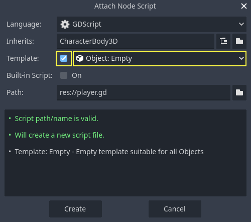
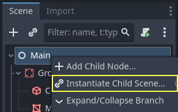
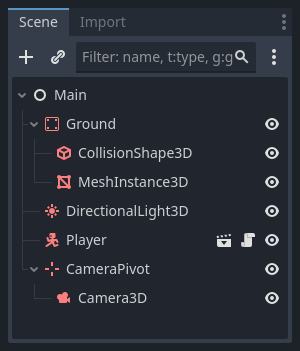

.. _doc_first_3d_game_player_movement:

Moving the player with code
===========================

It's time to code! We're going to use the input actions we created in the last
part to move the character.

.. note:: For this project, we will be following the Godot naming conventions.

          - **GDScript**: Classes (nodes) use PascalCase, variables and
            functions use snake_case, and constants use ALL_CAPS (See
            :ref:`doc_gdscript_styleguide`).

          - **C#**: Classes, export variables and methods use PascalCase,
            private fields use _camelCase, local variables and parameters use
            camelCase (See :ref:`doc_c_sharp_styleguide`). Be careful to type
            the method names precisely when connecting signals.

Right-click the ``Player`` node and select *Attach Script* to add a new script to
it. In the popup, set the *Template* to *Empty* before pressing the *Create*
button. We set it to *Empty* because we want to write our own code for
player movement.

|image0|

Let's start with the class's properties. We're going to define a movement speed,
a fall acceleration representing gravity, and a velocity we'll use to move the
character.

.. tabs::
 .. code-tab:: gdscript GDScript

   extends CharacterBody3D

   # How fast the player moves in meters per second.
   @export var speed = 14
   # The downward acceleration when in the air, in meters per second squared.
   @export var fall_acceleration = 75

   var target_velocity = Vector3.ZERO

 .. code-tab:: csharp

    using Godot;

    public partial class Player : CharacterBody3D
    {
        // Don't forget to rebuild the project so the editor knows about the new export variable.

        // How fast the player moves in meters per second.
        [Export]
        public int Speed { get; set; } = 14;
        // The downward acceleration when in the air, in meters per second squared.
        [Export]
        public int FallAcceleration { get; set; } = 75;

        private Vector3 _targetVelocity = Vector3.Zero;
    }

These are common properties for a moving body. The ``target_velocity`` is a :ref:`3D vector <class_Vector3>`
combining a speed with a direction. Here, we define it as a property because
we want to update and reuse its value across frames.

.. note::

    The values are quite different from 2D code because distances are in meters.
    While in 2D, a thousand units (pixels) may only correspond to half of your
    screen's width, in 3D, it's a kilometer.

Let's code the movement. We start by calculating the input direction vector
using the global ``Input`` object, in ``_physics_process()``.

.. tabs::
 .. code-tab:: gdscript GDScript

   func _physics_process(delta):
       # We create a local variable to store the input direction.
       var direction = Vector3.ZERO

       # We check for each move input and update the direction accordingly.
       if Input.is_action_pressed("move_right"):
           direction.x += 1
       if Input.is_action_pressed("move_left"):
           direction.x -= 1
       if Input.is_action_pressed("move_back"):
           # Notice how we are working with the vector's x and z axes.
           # In 3D, the XZ plane is the ground plane.
           direction.z += 1
       if Input.is_action_pressed("move_forward"):
           direction.z -= 1

 .. code-tab:: csharp

    public override void _PhysicsProcess(double delta)
    {
        // We create a local variable to store the input direction.
        var direction = Vector3.Zero;

        // We check for each move input and update the direction accordingly.
        if (Input.IsActionPressed("move_right"))
        {
            direction.X += 1.0f;
        }
        if (Input.IsActionPressed("move_left"))
        {
            direction.X -= 1.0f;
        }
        if (Input.IsActionPressed("move_back"))
        {
            // Notice how we are working with the vector's X and Z axes.
            // In 3D, the XZ plane is the ground plane.
            direction.Z += 1.0f;
        }
        if (Input.IsActionPressed("move_forward"))
        {
            direction.Z -= 1.0f;
        }
    }

Here, we're going to make all calculations using the ``_physics_process()``
virtual function. Like ``_process()``, it allows you to update the node every
frame, but it's designed specifically for physics-related code like moving a
kinematic or rigid body.

.. seealso::

    To learn more about the difference between ``_process()`` and
    ``_physics_process()``, see :ref:`doc_idle_and_physics_processing`.

We start by initializing a ``direction`` variable to ``Vector3.ZERO``. Then, we
check if the player is pressing one or more of the ``move_*`` inputs and update
the vector's ``x`` and ``z`` components accordingly. These correspond to the
ground plane's axes.

These four conditions give us eight possibilities and eight possible directions.

In case the player presses, say, both W and D simultaneously, the vector will
have a length of about ``1.4``. But if they press a single key, it will have a
length of ``1``. We want the vector's length to be consistent, and not move faster diagonally. To do so, we can
call its ``normalized()`` method.

.. tabs::
 .. code-tab:: gdscript GDScript

   #func _physics_process(delta):
       #...

       if direction != Vector3.ZERO:
           direction = direction.normalized()
           # Setting the basis property will affect the rotation of the node.
           $Pivot.basis = Basis.looking_at(direction)

 .. code-tab:: csharp

    public override void _PhysicsProcess(double delta)
    {
        // ...

        if (direction != Vector3.Zero)
        {
            direction = direction.Normalized();
            // Setting the basis property will affect the rotation of the node.
            GetNode<Node3D>("Pivot").Basis = Basis.LookingAt(direction);
        }
    }

Here, we only normalize the vector if the direction has a length greater than
zero, which means the player is pressing a direction key.

We compute the direction the ``$Pivot`` is looking by creating a :ref:`Basis <class_Basis>`
that looks in the ``direction`` direction.

Then, we update the velocity. We have to calculate the ground velocity and the
fall speed separately. Be sure to go back one tab so the lines are inside the
``_physics_process()`` function but outside the condition we just wrote above.

.. tabs::
 .. code-tab:: gdscript GDScript

    func _physics_process(delta):
        #...
        if direction != Vector3.ZERO:
            #...

        # Ground Velocity
        target_velocity.x = direction.x * speed
        target_velocity.z = direction.z * speed

        # Vertical Velocity
        if not is_on_floor(): # If in the air, fall towards the floor. Literally gravity
            target_velocity.y = target_velocity.y - (fall_acceleration * delta)

        # Moving the Character
        velocity = target_velocity
        move_and_slide()

 .. code-tab:: csharp

    public override void _PhysicsProcess(double delta)
    {
        // ...
        if (direction != Vector3.Zero)
        {
            // ...
        }

        // Ground velocity
        _targetVelocity.X = direction.X * Speed;
        _targetVelocity.Z = direction.Z * Speed;

        // Vertical velocity
        if (!IsOnFloor()) // If in the air, fall towards the floor. Literally gravity
        {
            _targetVelocity.Y -= FallAcceleration * (float)delta;
        }

        // Moving the character
        Velocity = _targetVelocity;
        MoveAndSlide();
    }

The ``CharacterBody3D.is_on_floor()`` function returns ``true`` if the body collided with the floor in this frame. That's why
we apply gravity to the ``Player`` only while it is in the air.

For the vertical velocity, we subtract the fall acceleration multiplied by the
delta time every frame.
This line of code will cause our character to fall in every frame, as long as it is not on or colliding with the floor.

The physics engine can only detect interactions with walls, the floor, or other
bodies during a given frame if movement and collisions happen. We will use this
property later to code the jump.

On the last line, we call ``CharacterBody3D.move_and_slide()`` which is a powerful
method of the ``CharacterBody3D`` class that allows you to move a character
smoothly. If it hits a wall midway through a motion, the engine will try to
smooth it out for you. It uses the *velocity* value native to the :ref:`CharacterBody3D <class_CharacterBody3D>`

.. OLD TEXT: The function takes two parameters: our velocity and the up direction. It moves
.. the character and returns a leftover velocity after applying collisions. When
.. hitting the floor or a wall, the function will reduce or reset the speed in that
.. direction from you. In our case, storing the function's returned value prevents
.. the character from accumulating vertical momentum, which could otherwise get so
.. big the character would move through the ground slab after a while.

And that's all the code you need to move the character on the floor.

Here is the complete ``Player.gd`` code for reference.

.. tabs::
 .. code-tab:: gdscript GDScript

    extends CharacterBody3D

    # How fast the player moves in meters per second.
    @export var speed = 14
    # The downward acceleration when in the air, in meters per second squared.
    @export var fall_acceleration = 75

    var target_velocity = Vector3.ZERO

    func _physics_process(delta):
        var direction = Vector3.ZERO

        if Input.is_action_pressed("move_right"):
            direction.x += 1
        if Input.is_action_pressed("move_left"):
            direction.x -= 1
        if Input.is_action_pressed("move_back"):
            direction.z += 1
        if Input.is_action_pressed("move_forward"):
            direction.z -= 1

        if direction != Vector3.ZERO:
            direction = direction.normalized()
            $Pivot.basis = Basis.looking_at(direction)

        # Ground Velocity
        target_velocity.x = direction.x * speed
        target_velocity.z = direction.z * speed

        # Vertical Velocity
        if not is_on_floor(): # If in the air, fall towards the floor. Literally gravity
            target_velocity.y = target_velocity.y - (fall_acceleration * delta)

        # Moving the Character
        velocity = target_velocity
        move_and_slide()

 .. code-tab:: csharp

    using Godot;

    public partial class Player : CharacterBody3D
    {
        // How fast the player moves in meters per second.
        [Export]
        public int Speed { get; set; } = 14;
        // The downward acceleration when in the air, in meters per second squared.
        [Export]
        public int FallAcceleration { get; set; } = 75;

        private Vector3 _targetVelocity = Vector3.Zero;

        public override void _PhysicsProcess(double delta)
        {
            var direction = Vector3.Zero;

            if (Input.IsActionPressed("move_right"))
            {
                direction.X += 1.0f;
            }
            if (Input.IsActionPressed("move_left"))
            {
                direction.X -= 1.0f;
            }
            if (Input.IsActionPressed("move_back"))
            {
                direction.Z += 1.0f;
            }
            if (Input.IsActionPressed("move_forward"))
            {
                direction.Z -= 1.0f;
            }

            if (direction != Vector3.Zero)
            {
                direction = direction.Normalized();
                GetNode<Node3D>("Pivot").Basis = Basis.LookingAt(direction);
            }

            // Ground velocity
            _targetVelocity.X = direction.X * Speed;
            _targetVelocity.Z = direction.Z * Speed;

            // Vertical velocity
            if (!IsOnFloor()) // If in the air, fall towards the floor. Literally gravity
            {
                _targetVelocity.Y -= FallAcceleration * (float)delta;
            }

            // Moving the character
            Velocity = _targetVelocity;
            MoveAndSlide();
        }
    }

Testing our player's movement
-----------------------------

We're going to put our player in the ``Main`` scene to test it. To do so, we need
to instantiate the player and then add a camera. Unlike in 2D, in 3D, you won't
see anything if your viewport doesn't have a camera pointing at something.

Save your ``Player`` scene and open the ``Main`` scene. You can click on the *Main*
tab at the top of the editor to do so.

|image1|

If you closed the scene before, head to the *FileSystem* dock and double-click
``main.tscn`` to re-open it.

To instantiate the ``Player``, right-click on the ``Main`` node and select *Instantiate
Child Scene*.

|image2|

In the popup, double-click ``player.tscn``. The character should appear in the
center of the viewport.

Adding a camera
~~~~~~~~~~~~~~~

Let's add the camera next. Like we did with our *Player*\ 's *Pivot*, we're
going to create a basic rig. Right-click on the ``Main`` node again and select
*Add Child Node*. Create a new :ref:`Marker3D <class_Marker3D>`, and name it ``CameraPivot``.
Select ``CameraPivot`` and add a child node :ref:`Camera3D <class_Camera3D>` to it.
Your scene tree should look similar to this.

|image3|

Notice the *Preview* checkbox that appears in the top-left of the 3D view when you
have the *Camera* selected. You can click it to preview the in-game camera projection.

|image4|

We're going to use the *Pivot* to rotate the camera as if it was on a crane.
Let's first split the 3D view to be able to freely navigate the scene and see
what the camera sees.

In the toolbar right above the viewport, click on *View*, then *2 Viewports*.
You can also press :kbd:`Ctrl + 2` (:kbd:`Cmd + 2` on macOS).

|image11|

|image5|

On the bottom view, select your :ref:`Camera3D <class_Camera3D>` and turn on camera
Preview by clicking the checkbox.

|image6|

In the top view, make sure your *Camera3D* is selected and move the camera about
``19`` units on the Z axis (drag the blue arrow).

|image7|

Here's where the magic happens. Select the *CameraPivot* and rotate it ``-45``
degrees around the X axis (using the red circle). You'll see the camera move as
if it was attached to a crane.

|image8|

You can run the scene by pressing :kbd:`F6` and press the arrow keys to move the
character.

|image9|

We can see some empty space around the character due to the perspective
projection. In this game, we're going to use an orthographic projection instead
to better frame the gameplay area and make it easier for the player to read
distances.

Select the *Camera* again and in the *Inspector*, set the *Projection* to
*Orthogonal* and the *Size* to ``19``. The character should now look flatter and
the ground should fill the background.

.. note::

    When using an orthogonal camera in Godot 4, directional shadow quality is
    dependent on the camera's *Far* value. The higher the *Far* value, the
    further away the camera will be able to see. However, higher *Far* values
    also decrease shadow quality as the shadow rendering has to cover a greater
    distance.

    If directional shadows look too blurry after switching to an orthogonal
    camera, decrease the camera's *Far* property to a lower value such as
    ``100``. Don't decrease this *Far* property too much, or objects in the
    distance will start disappearing.

|image10|

Test your scene and you should be able to move in all 8 directions and not glitch through the floor!

Ultimately, we have both player movement and the view in place. Next, we will
work on the monsters.

.. |image1| image:: img/03.player_movement_code/02.clicking_main_tab.png

.. |image4| image:: img/03.player_movement_code/05.camera_preview_checkbox.png
.. |image5| image:: img/03.player_movement_code/06.two_viewports.png
.. |image6| image:: img/03.player_movement_code/07.camera_preview_checkbox.png
.. |image7| image:: img/03.player_movement_code/08.camera_moved.png
.. |image8| image:: img/03.player_movement_code/09.camera_rotated.png
.. |image9| image:: img/03.player_movement_code/10.camera_perspective.png
.. |image10| image:: img/03.player_movement_code/13.camera3d_values.webp

