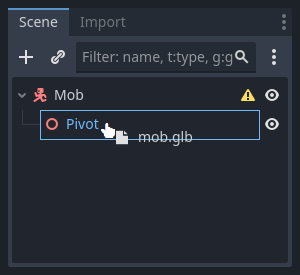
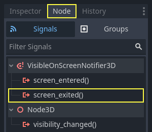
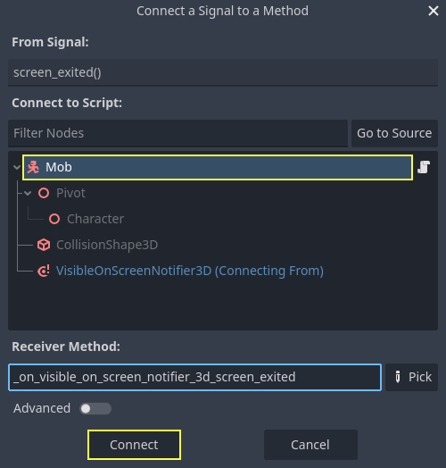

:article_outdated: True

.. _doc_first_3d_game_designing_the_mob_scene:

Designing the mob scene
=======================

In this part, you're going to code the monsters, which we'll call mobs. In the
next lesson, we'll spawn them randomly around the playable area.

Let's design the monsters themselves in a new scene. The node structure is going
to be similar to the ``player.tscn`` scene.

Create a scene with, once again, a :ref:`CharacterBody3D <class_CharacterBody3D>` node as its root. Name it
``Mob``. Add a child node :ref:`Node3D <class_Node3D>`, name it ``Pivot``. And drag and drop
the file ``mob.glb`` from the *FileSystem* dock onto the ``Pivot`` to add the
monster's 3D model to the scene.

You can rename the newly created ``mob`` node
into ``Character``.

|image0|

We need a collision shape for our body to work. Right-click on the ``Mob`` node,
the scene's root, and click *Add Child Node*.

|image1|

Add a :ref:`CollisionShape3D <class_CollisionShape3D>`.

|image2|

In the *Inspector*, assign a *BoxShape3D* to the *Shape* property.

.. image:: img/01.game_setup/08.create_box_shape3D.jpg

We should change its size to fit the 3D model better. You can do so
interactively by clicking and dragging on the orange dots.

The box should touch the floor and be a little thinner than the model. Physics
engines work in such a way that if the player's sphere touches even the box's
corner, a collision will occur. If the box is a little too big compared to the
3D model, you may die at a distance from the monster, and the game will feel
unfair to the players.

|image4|

Notice that my box is taller than the monster. It is okay in this game because
we're looking at the scene from above and using a fixed perspective. Collision
shapes don't have to match the model exactly. It's the way the game feels when
you test it that should dictate their form and size.

Removing monsters off-screen
~~~~~~~~~~~~~~~~~~~~~~~~~~~~

We're going to spawn monsters at regular time intervals in the game level. If
we're not careful, their count could increase to infinity, and we don't want
that. Each mob instance has both a memory and a processing cost, and we don't
want to pay for it when the mob is outside the screen.

Once a monster leaves the screen, we don't need it anymore, so we should delete it.
Godot has a node that detects when objects leave the screen,
:ref:`VisibleOnScreenNotifier3D <class_VisibleOnScreenNotifier3D>`, and we're going to use it to destroy our mobs.

.. note::

    When you keep instancing an object, there's a technique you can
    use to avoid the cost of creating and destroying instances all the time
    called pooling. It consists of pre-creating an array of objects and reusing
    them over and over.

    When working with GDScript, you don't need to worry about this. The main
    reason to use pools is to avoid freezes with garbage-collected languages
    like C# or Lua. GDScript uses a different technique to manage memory,
    reference counting, which doesn't have that caveat. You can learn more
    about that here: :ref:`doc_gdscript_basics_memory_management`.

Select the ``Mob`` node and add a child node :ref:`VisibleOnScreenNotifier3D <class_VisibleOnScreenNotifier3D>`. Another
box, pink this time, appears. When this box completely leaves the screen, the
node will emit a signal.

|image5|

Resize it using the orange dots until it covers the entire 3D model.

|image6|

Coding the mob's movement
-------------------------

Let's implement the monster's motion. We're going to do this in two steps.
First, we'll write a script on the ``Mob`` that defines a function to initialize
the monster. We'll then code the randomized spawn mechanism in the ``main.tscn`` scene
and call the function from there.

Attach a script to the ``Mob``.

|image7|

Here's the movement code to start with. We define two properties, ``min_speed``
and ``max_speed``, to define a random speed range, which we will later use to define ``CharacterBody3D.velocity``.

.. tabs::
 .. code-tab:: gdscript GDScript

    extends CharacterBody3D

    # Minimum speed of the mob in meters per second.
    @export var min_speed = 10
    # Maximum speed of the mob in meters per second.
    @export var max_speed = 18

    func _physics_process(_delta):
        move_and_slide()

 .. code-tab:: csharp

    using Godot;

    public partial class Mob : CharacterBody3D
    {
        // Don't forget to rebuild the project so the editor knows about the new export variable.

        // Minimum speed of the mob in meters per second
        [Export]
        public int MinSpeed { get; set; } = 10;
        // Maximum speed of the mob in meters per second
        [Export]
        public int MaxSpeed { get; set; } = 18;

        public override void _PhysicsProcess(double delta)
        {
            MoveAndSlide();
        }
    }

Similarly to the player, we move the mob every frame by calling the function
``CharacterBody3D.move_and_slide()``. This time, we don't update
the ``velocity`` every frame; we want the monster to move at a constant speed
and leave the screen, even if it were to hit an obstacle.

We need to define another function to calculate the ``CharacterBody3D.velocity``. This
function will turn the monster towards the player and randomize both its angle
of motion and its velocity.

The function will take a ``start_position``,the mob's spawn position, and the
``player_position`` as its arguments.

We position the mob at ``start_position`` and turn it towards the player using
the ``look_at_from_position()`` method, and randomize the angle by rotating a
random amount around the Y axis. Below, ``randf_range()`` outputs a random value
between ``-PI / 4`` radians and ``PI / 4`` radians.

.. tabs::
 .. code-tab:: gdscript GDScript

    # This function will be called from the Main scene.
    func initialize(start_position, player_position):
        # We position the mob by placing it at start_position
        # and rotate it towards player_position, so it looks at the player.
        look_at_from_position(start_position, player_position, Vector3.UP)
        # Rotate this mob randomly within range of -45 and +45 degrees,
        # so that it doesn't move directly towards the player.
        rotate_y(randf_range(-PI / 4, PI / 4))

 .. code-tab:: csharp

    // This function will be called from the Main scene.
    public void Initialize(Vector3 startPosition, Vector3 playerPosition)
    {
        // We position the mob by placing it at startPosition
        // and rotate it towards playerPosition, so it looks at the player.
        LookAtFromPosition(startPosition, playerPosition, Vector3.Up);
        // Rotate this mob randomly within range of -45 and +45 degrees,
        // so that it doesn't move directly towards the player.
        RotateY((float)GD.RandRange(-Mathf.Pi / 4.0, Mathf.Pi / 4.0));
    }

We got a random position, now we need a ``random_speed``. ``randi_range()`` will be useful as it gives random int values, and we will use ``min_speed`` and ``max_speed``.
``random_speed`` is just an integer, and we just use it to multiply our ``CharacterBody3D.velocity``. After ``random_speed`` is applied, we rotate ``CharacterBody3D.velocity`` Vector3 towards the player.

.. tabs::
 .. code-tab:: gdscript GDScript

   func initialize(start_position, player_position):
       # ...

       # We calculate a random speed (integer)
       var random_speed = randi_range(min_speed, max_speed)
       # We calculate a forward velocity that represents the speed.
       velocity = Vector3.FORWARD * random_speed
       # We then rotate the velocity vector based on the mob's Y rotation
       # in order to move in the direction the mob is looking.
       velocity = velocity.rotated(Vector3.UP, rotation.y)

 .. code-tab:: csharp

    public void Initialize(Vector3 startPosition, Vector3 playerPosition)
    {
        // ...

        // We calculate a random speed (integer).
        int randomSpeed = GD.RandRange(MinSpeed, MaxSpeed);
        // We calculate a forward velocity that represents the speed.
        Velocity = Vector3.Forward * randomSpeed;
        // We then rotate the velocity vector based on the mob's Y rotation
        // in order to move in the direction the mob is looking.
        Velocity = Velocity.Rotated(Vector3.Up, Rotation.Y);
    }

Leaving the screen
------------------

We still have to destroy the mobs when they leave the screen. To do so, we'll
connect our :ref:`VisibleOnScreenNotifier3D <class_VisibleOnScreenNotifier3D>` node's ``screen_exited`` signal to the ``Mob``.

Head back to the 3D viewport by clicking on the *3D* label at the top of the
editor. You can also press :kbd:`Ctrl + F2` (:kbd:`Alt + 2` on macOS).

|image8|

Select the :ref:`VisibleOnScreenNotifier3D <class_VisibleOnScreenNotifier3D>` node and on the right side of the interface,
navigate to the *Node* dock. Double-click the ``screen_exited()`` signal.

|image9|

Connect the signal to the ``Mob``

|image10|

This will take you back to the script editor and add a new function for you,
``_on_visible_on_screen_notifier_3d_screen_exited()``. From it, call the ``queue_free()``
method. This function destroys the instance it's called on.

.. tabs::
 .. code-tab:: gdscript GDScript

   func _on_visible_on_screen_notifier_3d_screen_exited():
       queue_free()

 .. code-tab:: csharp

    // We also specified this function name in PascalCase in the editor's connection window
    private void OnVisibilityNotifierScreenExited()
    {
        QueueFree();
    }

Our monster is ready to enter the game! In the next part, you will spawn
monsters in the game level.

Here is the complete ``Mob.gd`` script for reference.

.. tabs::
 .. code-tab:: gdscript GDScript

    extends CharacterBody3D

    # Minimum speed of the mob in meters per second.
    @export var min_speed = 10
    # Maximum speed of the mob in meters per second.
    @export var max_speed = 18

    func _physics_process(_delta):
        move_and_slide()

    # This function will be called from the Main scene.
    func initialize(start_position, player_position):
        # We position the mob by placing it at start_position
        # and rotate it towards player_position, so it looks at the player.
        look_at_from_position(start_position, player_position, Vector3.UP)
        # Rotate this mob randomly within range of -90 and +90 degrees,
        # so that it doesn't move directly towards the player.
        rotate_y(randf_range(-PI / 4, PI / 4))

        # We calculate a random speed (integer)
        var random_speed = randi_range(min_speed, max_speed)
        # We calculate a forward velocity that represents the speed.
        velocity = Vector3.FORWARD * random_speed
        # We then rotate the velocity vector based on the mob's Y rotation
        # in order to move in the direction the mob is looking.
        velocity = velocity.rotated(Vector3.UP, rotation.y)

    func _on_visible_on_screen_notifier_3d_screen_exited():
        queue_free()

 .. code-tab:: csharp

    using Godot;

    public partial class Mob : CharacterBody3D
    {
        // Minimum speed of the mob in meters per second.
        [Export]
        public int MinSpeed { get; set; } = 10;
        // Maximum speed of the mob in meters per second.
        [Export]
        public int MaxSpeed { get; set; } = 18;

        public override void _PhysicsProcess(double delta)
        {
            MoveAndSlide();
        }

        // This function will be called from the Main scene.
        public void Initialize(Vector3 startPosition, Vector3 playerPosition)
        {
            // We position the mob by placing it at startPosition
            // and rotate it towards playerPosition, so it looks at the player.
            LookAtFromPosition(startPosition, playerPosition, Vector3.Up);
            // Rotate this mob randomly within range of -90 and +90 degrees,
            // so that it doesn't move directly towards the player.
            RotateY((float)GD.RandRange(-Mathf.Pi / 4.0, Mathf.Pi / 4.0));

            // We calculate a random speed (integer).
            int randomSpeed = GD.RandRange(MinSpeed, MaxSpeed);
            // We calculate a forward velocity that represents the speed.
            Velocity = Vector3.Forward * randomSpeed;
            // We then rotate the velocity vector based on the mob's Y rotation
            // in order to move in the direction the mob is looking.
            Velocity = Velocity.Rotated(Vector3.Up, Rotation.Y);
        }

        // We also specified this function name in PascalCase in the editor's connection window
        private void OnVisibilityNotifierScreenExited()
        {
            QueueFree();
        }
    }

.. |image0| image:: img/04.mob_scene/01.initial_three_nodes.png
.. |image1| image:: img/04.mob_scene/02.add_child_node.png
.. |image2| image:: img/04.mob_scene/03.scene_with_collision_shape.png
.. |image4| image:: img/04.mob_scene/05.box_final_size.png
.. |image5| image:: img/04.mob_scene/06.visibility_notifier.png
.. |image6| image:: img/04.mob_scene/07.visibility_notifier_bbox_resized.png
.. |image7| image:: img/04.mob_scene/08.mob_attach_script.png
.. |image8| image:: img/04.mob_scene/09.switch_to_3d_workspace.png

