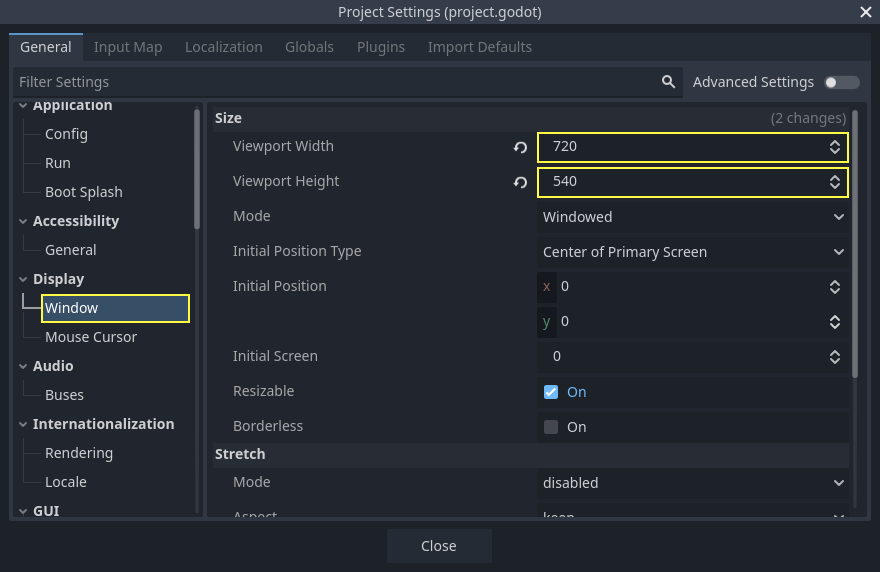
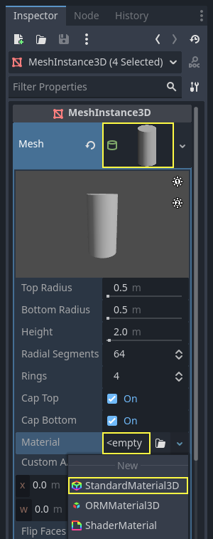
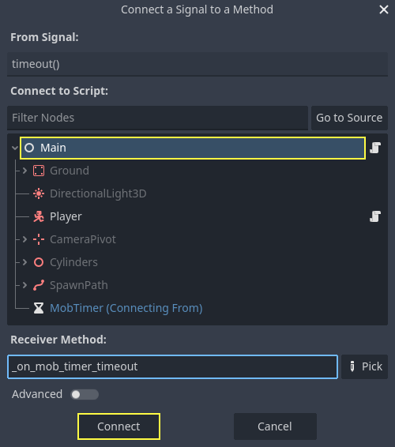

.. _doc_first_3d_game_spawning_monsters:

Spawning monsters
=================

In this part, we're going to spawn monsters along a path randomly. By the end,
you will have monsters roaming the game board.

|image0|

Double-click on ``main.tscn`` in the *FileSystem* dock to open the ``Main`` scene.

Before drawing the path, we're going to change the game resolution. Our game has
a default window size of ``1152x648``. We're going to set it to ``720x540``, a
nice little box.

Go to *Project -> Project Settings*.

|image1|

If you still have *Input Map* open, switch to the *General* tab.

In the left menu, navigate down to *Display -> Window*. On the right, set the
*Width* to ``720`` and the *Height* to ``540``.

|image2|

Creating the spawn path
-----------------------

Like you did in the 2D game tutorial, you're going to design a path and use a
:ref:`PathFollow3D <class_PathFollow3D>` node to sample random locations on it.

In 3D though, it's a bit more complicated to draw the path. We want it to be
around the game view so monsters appear right outside the screen. But if we draw
a path, we won't see it from the camera preview.

To find the view's limits, we can use some placeholder meshes. Your viewport
should still be split into two parts, with the camera preview at the bottom. If
that isn't the case, press :kbd:`Ctrl + 2` (:kbd:`Cmd + 2` on macOS) to split the view into two.
Select the :ref:`Camera3D <class_Camera3D>` node and click the *Preview* checkbox in the bottom
viewport.

|image3|

Adding placeholder cylinders
~~~~~~~~~~~~~~~~~~~~~~~~~~~~

Let's add the placeholder meshes. Add a new :ref:`Node3D <class_Node3D>` as a child of the
``Main`` node and name it ``Cylinders``. We'll use it to group the cylinders. Select ``Cylinders`` and add a child node :ref:`MeshInstance3D <class_MeshInstance3D>`

|image4|

In the *Inspector*, assign a *CylinderMesh* to the *Mesh* property.

|image5|

Set the top viewport to the top orthogonal view using the menu in the viewport's
top-left corner. Alternatively, you can press the keypad's 7 key.

|image6|

The grid may be distracting. You can toggle it by going to the *View*
menu in the toolbar and clicking *View Grid*.

|image7|

You now want to move the cylinder along the ground plane, looking at the camera
preview in the bottom viewport. I recommend using grid snap to do so. You can
toggle it by clicking the magnet icon in the toolbar or pressing Y.

|image8|

Move the cylinder so it's right outside the camera's view in the top-left
corner.

|image9|

We're going to create copies of the mesh and place them around the game area.
Press :kbd:`Ctrl + D` (:kbd:`Cmd + D` on macOS) to duplicate the node. You can also right-click
the node in the *Scene* dock and select *Duplicate*. Move the copy down along
the blue Z axis until it's right outside the camera's preview.

Select both cylinders by pressing the :kbd:`Shift` key and clicking on the unselected
one and duplicate them.

|image10|

Move them to the right by dragging the red X axis.

|image11|

They're a bit hard to see in white, aren't they? Let's make them stand out by
giving them a new material.

In 3D, materials define a surface's visual properties like its color, how it
reflects light, and more. We can use them to change the color of a mesh.

We can update all four cylinders at once. Select all the mesh instances in the
*Scene* dock. To do so, you can click on the first one and Shift click on the
last one.

|image12|

In the *Inspector*, expand the *Material* section and assign a :ref:`StandardMaterial3D <class_StandardMaterial3D>` to slot *0*.

|image13|

.. image:: img/05.spawning_mobs/standard_material.webp

Click the sphere icon to open the material resource. You get a preview of the
material and a long list of sections filled with properties. You can use these
to create all sorts of surfaces, from metal to rock or water.

Expand the *Albedo* section.

.. image:: img/05.spawning_mobs/albedo_section.webp

Set the color to something that contrasts with
the background, like a bright orange.

|image14|

We can now use the cylinders as guides. Fold them in the *Scene* dock by
clicking the grey arrow next to them. Moving forward, you can also toggle their
visibility by clicking the eye icon next to *Cylinders*.

|image15|

Add a child node :ref:`Path3D <class_Path3D>` to ``Main`` node. In the toolbar, four icons appear. Click
the *Add Point* tool, the icon with the green "+" sign.

|image16|

.. note:: You can hover any icon to see a tooltip describing the tool.

Click in the center of each cylinder to create a point. Then, click the *Close
Curve* icon in the toolbar to close the path. If any point is a bit off, you can
click and drag on it to reposition it.

|image17|

Your path should look like this.

|image18|

To sample random positions on it, we need a :ref:`PathFollow3D <class_PathFollow3D>` node. Add a
:ref:`PathFollow3D <class_PathFollow3D>` as a child of the ``Path3D``. Rename the two nodes to ``SpawnLocation`` and
``SpawnPath``, respectively. It's more descriptive of what we'll use them for.

|image19|

With that, we're ready to code the spawn mechanism.

Spawning monsters randomly
--------------------------

Right-click on the ``Main`` node and attach a new script to it.

We first export a variable to the *Inspector* so that we can assign ``mob.tscn``
or any other monster to it.

.. tabs::
 .. code-tab:: gdscript GDScript

   extends Node

   @export var mob_scene: PackedScene

 .. code-tab:: csharp

    using Godot;

    public partial class Main : Node
    {
        // Don't forget to rebuild the project so the editor knows about the new export variable.

        [Export]
        public PackedScene MobScene { get; set; }
    }

We want to spawn mobs at regular time intervals. To do this, we need to go back
to the scene and add a timer. Before that, though, we need to assign the
``mob.tscn`` file to the ``mob_scene`` property above (otherwise it's null!)

Head back to the 3D screen and select the ``Main`` node. Drag ``mob.tscn`` from
the *FileSystem* dock to the *Mob Scene* slot in the *Inspector*.

|image20|

Add a new :ref:`Timer <class_Timer>` node as a child of ``Main``. Name it ``MobTimer``.

|image21|

In the *Inspector*, set its *Wait Time* to ``0.5`` seconds and turn on
*Autostart* so it automatically starts when we run the game.

|image22|

Timers emit a ``timeout`` signal every time they reach the end of their *Wait
Time*. By default, they restart automatically, emitting the signal in a cycle.
We can connect to this signal from the *Main* node to spawn monsters every
``0.5`` seconds.

With the *MobTimer* still selected, head to the *Node* dock on the right, and
double-click the ``timeout`` signal.

|image23|

Connect it to the *Main* node.

|image24|

This will take you back to the script, with a new empty
``_on_mob_timer_timeout()`` function.

Let's code the mob spawning logic. We're going to:

1. Instantiate the mob scene.
2. Sample a random position on the spawn path.
3. Get the player's position.
4. Call the mob's ``initialize()`` method, passing it the random position and
   the player's position.
5. Add the mob as a child of the *Main* node.

.. tabs::
 .. code-tab:: gdscript GDScript

    func _on_mob_timer_timeout():
        # Create a new instance of the Mob scene.
        var mob = mob_scene.instantiate()

        # Choose a random location on the SpawnPath.
        # We store the reference to the SpawnLocation node.
        var mob_spawn_location = get_node("SpawnPath/SpawnLocation")
        # And give it a random offset.
        mob_spawn_location.progress_ratio = randf()

        var player_position = $Player.position
        mob.initialize(mob_spawn_location.position, player_position)

        # Spawn the mob by adding it to the Main scene.
        add_child(mob)

 .. code-tab:: csharp

    // We also specified this function name in PascalCase in the editor's connection window.
    private void OnMobTimerTimeout()
    {
        // Create a new instance of the Mob scene.
        Mob mob = MobScene.Instantiate<Mob>();

        // Choose a random location on the SpawnPath.
        // We store the reference to the SpawnLocation node.
        var mobSpawnLocation = GetNode<PathFollow3D>("SpawnPath/SpawnLocation");
        // And give it a random offset.
        mobSpawnLocation.ProgressRatio = GD.Randf();

        Vector3 playerPosition = GetNode<Player>("Player").Position;
        mob.Initialize(mobSpawnLocation.Position, playerPosition);

        // Spawn the mob by adding it to the Main scene.
        AddChild(mob);
    }

Above, ``randf()`` produces a random value between ``0`` and ``1``, which is
what the *PathFollow* node's ``progress_ratio`` expects:
0 is the start of the path, 1 is the end of the path.
The path we have set is around the camera's viewport, so any random value between 0 and 1
is a random position alongside the edges of the viewport!

Note that if you remove the ``Player`` from the main scene, the following line

.. tabs::
   .. code-tab:: gdscript GDScript

    var player_position = $Player.position

   .. code-tab:: csharp

    Vector3 playerPosition = GetNode<Player>("Player").Position;

gives an error because there is no $Player!

Here is the complete ``main.gd`` script so far, for reference.

.. tabs::
 .. code-tab:: gdscript GDScript

    extends Node

    @export var mob_scene: PackedScene

    func _on_mob_timer_timeout():
        # Create a new instance of the Mob scene.
        var mob = mob_scene.instantiate()

        # Choose a random location on the SpawnPath.
        # We store the reference to the SpawnLocation node.
        var mob_spawn_location = get_node("SpawnPath/SpawnLocation")
        # And give it a random offset.
        mob_spawn_location.progress_ratio = randf()

        var player_position = $Player.position
        mob.initialize(mob_spawn_location.position, player_position)

        # Spawn the mob by adding it to the Main scene.
        add_child(mob)

 .. code-tab:: csharp

    using Godot;

    public partial class Main : Node
    {
        [Export]
        public PackedScene MobScene { get; set; }

        private void OnMobTimerTimeout()
        {
            // Create a new instance of the Mob scene.
            Mob mob = MobScene.Instantiate<Mob>();

            // Choose a random location on the SpawnPath.
            // We store the reference to the SpawnLocation node.
            var mobSpawnLocation = GetNode<PathFollow3D>("SpawnPath/SpawnLocation");
            // And give it a random offset.
            mobSpawnLocation.ProgressRatio = GD.Randf();

            Vector3 playerPosition = GetNode<Player>("Player").Position;
            mob.Initialize(mobSpawnLocation.Position, playerPosition);

            // Spawn the mob by adding it to the Main scene.
            AddChild(mob);
        }
    }

You can test the scene by pressing :kbd:`F6`. You should see the monsters spawn and
move in a straight line.

|image25|

For now, they bump and slide against one another when their paths cross. We'll
address this in the next part.

.. |image0| image:: img/05.spawning_mobs/01.monsters_path_preview.png
.. |image1| image:: img/05.spawning_mobs/02.project_settings.png

.. |image3| image:: img/05.spawning_mobs/04.camera_preview.png
.. |image4| image:: img/05.spawning_mobs/05.cylinders_node.png
.. |image5| image:: img/05.spawning_mobs/06.cylinder_mesh.png
.. |image6| image:: img/05.spawning_mobs/07.top_view.png
.. |image7| image:: img/05.spawning_mobs/08.toggle_view_grid.png
.. |image8| image:: img/05.spawning_mobs/09.toggle_grid_snap.png
.. |image9| image:: img/05.spawning_mobs/10.place_first_cylinder.png
.. |image10| image:: img/05.spawning_mobs/11.both_cylinders_selected.png
.. |image11| image:: img/05.spawning_mobs/12.four_cylinders.png
.. |image12| image:: img/05.spawning_mobs/13.selecting_all_cylinders.png

.. |image14| image:: img/05.spawning_mobs/15.bright-cylinders.png
.. |image15| image:: img/05.spawning_mobs/16.cylinders_fold.png
.. |image16| image:: img/05.spawning_mobs/17.points_options.png
.. |image17| image:: img/05.spawning_mobs/18.close_path.png
.. |image18| image:: img/05.spawning_mobs/19.path_result.png
.. |image19| image:: img/05.spawning_mobs/20.spawn_nodes.png
.. |image20| image:: img/05.spawning_mobs/20.mob_scene_property.png
.. |image21| image:: img/05.spawning_mobs/21.mob_timer.png
.. |image22| image:: img/05.spawning_mobs/22.mob_timer_properties.png
.. |image23| image:: img/05.spawning_mobs/23.timeout_signal.png

.. |image25| image:: img/05.spawning_mobs/25.spawn_result.png
