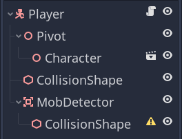
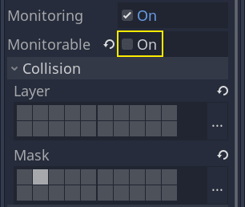
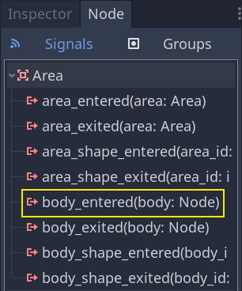
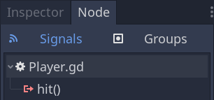

.. _doc_first_3d_game_killing_the_player:

Killing the player
==================

We can kill enemies by jumping on them, but the player still can't die.
Let's fix this.

We want to detect being hit by an enemy differently from squashing them.
We want the player to die when they're moving on the floor, but not if
they're in the air. We could use vector math to distinguish the two
kinds of collisions. Instead, though, we will use an *Area* node, which
works well for hitboxes.

Hitbox with the Area node
-------------------------

Head back to the *Player* scene and add a new *Area* node. Name it
*MobDetector*. Add a *CollisionShape* node as a child of it.

|image0|

In the *Inspector*, assign a cylinder shape to it.

|image1|

Here is a trick you can use to make the collisions only happen when the
player is on the ground or close to it. You can reduce the cylinder's
height and move it up to the top of the character. This way, when the
player jumps, the shape will be too high up for the enemies to collide
with it.

|image2|

You also want the cylinder to be wider than the sphere. This way, the
player gets hit before colliding and being pushed on top of the
monster's collision box.

The wider the cylinder, the more easily the player will get killed.

Next, select the *MobDetector* node again, and in the *Inspector*, turn
off its *Monitorable* property. This makes it so other physics nodes
cannot detect the area. The complementary *Monitoring* property allows
it to detect collisions. Then, remove the *Collision -> Layer* and set
the mask to the "enemies" layer.

|image3|

When areas detect a collision, they emit signals. We're going to connect
one to the *Player* node. In the *Node* tab, double-click the
``body_entered`` signal and connect it to the *Player*.

|image4|

The *MobDetector* will emit ``body_entered`` when a *CharacterBody3D* or a
*RigidBody* node enters it. As it only masks the "enemies" physics
layers, it will only detect the *Mob* nodes.

Code-wise, we're going to do two things: emit a signal we'll later use
to end the game and destroy the player. We can wrap these operations in
a ``die()`` function that helps us put a descriptive label on the code.

.. tabs::
 .. code-tab:: gdscript GDScript

   # Emitted when the player was hit by a mob.
   # Put this at the top of the script.
   signal hit

   # And this function at the bottom.
   func die():
       emit_signal("hit")
       queue_free()

   func _on_MobDetector_body_entered(_body):
       die()

 .. code-tab:: csharp

    // Don't forget to rebuild the project so the editor knows about the new signal.

    // Emitted when the player was hit by a mob.
    [Signal]
    public delegate void HitEventHandler();

    // ...

    private void Die()
    {
        EmitSignal(nameof(Hit));
        QueueFree();
    }

    // We also specified this function name in PascalCase in the editor's connection window
    public void OnMobDetectorBodyEntered(Node body)
    {
        Die();
    }

Try the game again by pressing :kbd:`F5`. If everything is set up correctly,
the character should die when an enemy runs into it.

However, note that this depends entirely on the size and position of the
*Player* and the *Mob*\ 's collision shapes. You may need to move them
and resize them to achieve a tight game feel.

Ending the game
---------------

We can use the *Player*\ 's ``hit`` signal to end the game. All we need
to do is connect it to the *Main* node and stop the *MobTimer* in
reaction.

Open ``Main.tscn``, select the *Player* node, and in the *Node* dock,
connect its ``hit`` signal to the *Main* node.

|image5|

Get and stop the timer in the ``_on_Player_hit()`` function.

.. tabs::
 .. code-tab:: gdscript GDScript

   func _on_Player_hit():
       $MobTimer.stop()

 .. code-tab:: csharp

    // We also specified this function name in PascalCase in the editor's connection window
    public void OnPlayerHit()
    {
        GetNode<Timer>("MobTimer").Stop();
    }

If you try the game now, the monsters will stop spawning when you die,
and the remaining ones will leave the screen.

You can pat yourself in the back: you prototyped a complete 3D game,
even if it's still a bit rough.

From there, we'll add a score, the option to retry the game, and you'll
see how you can make the game feel much more alive with minimalistic
animations.

Code checkpoint
---------------

Here are the complete scripts for the *Main*, *Mob*, and *Player* nodes,
for reference. You can use them to compare and check your code.

Starting with ``Main.gd``.

.. tabs::
 .. code-tab:: gdscript GDScript

   extends Node

   export(PackedScene) var mob_scene

   func _ready():
       randomize()

   func _on_MobTimer_timeout():
       # Create a new instance of the Mob scene.
       var mob = mob_scene.instantiate()

       # Choose a random location on the SpawnPath.
       var mob_spawn_location = get_node("SpawnPath/SpawnLocation")
       # And give it a random offset.
       mob_spawn_location.unit_offset = randf()

       # Communicate the spawn location and the player's location to the mob.
       var player_position = $Player.transform.origin
       mob.initialize(mob_spawn_location.translation, player_position)

       # Spawn the mob by adding it to the Main scene.
       add_child(mob)

   func _on_Player_hit():
       $MobTimer.stop()

 .. code-tab:: csharp

    public class Main : Node
    {
    #pragma warning disable 649
        [Export]
        public PackedScene MobScene;
    #pragma warning restore 649

        public override void _Ready()
        {
            GD.Randomize();
        }

        public void OnMobTimerTimeout()
        {
            // Create a new instance of the Mob scene.
            var mob = (Mob)MobScene.Instantiate();

            // Choose a random location on the SpawnPath.
            // We store the reference to the SpawnLocation node.
            var mobSpawnLocation = GetNode<PathFollow>("SpawnPath/SpawnLocation");
            // And give it a random offset.
            mobSpawnLocation.UnitOffset = GD.Randf();

            // Communicate the spawn location and the player's location to the mob.
            Vector3 playerPosition = GetNode<Player>("Player").Transform.origin;
            mob.Initialize(mobSpawnLocation.Translation, playerPosition);

            // Spawn the mob by adding it to the Main scene.
            AddChild(mob);
        }

        public void OnPlayerHit()
        {
            GetNode<Timer>("MobTimer").Stop();
        }
    }

Next is ``Mob.gd``.

.. tabs::
 .. code-tab:: gdscript GDScript

   extends CharacterBody3D

   # Emitted when the player jumped on the mob.
   signal squashed

   # Minimum speed of the mob in meters per second.
   @export var min_speed = 10
   # Maximum speed of the mob in meters per second.
   @export var max_speed = 18

   var velocity = Vector3.ZERO

   func _physics_process(_delta):
       move_and_slide(velocity)

   func initialize(start_position, player_position):
       look_at_from_position(start_position, player_position, Vector3.UP)
       rotate_y(rand_range(-PI / 4, PI / 4))

       var random_speed = rand_range(min_speed, max_speed)
       velocity = Vector3.FORWARD * random_speed
       velocity = velocity.rotated(Vector3.UP, rotation.y)

    func squash():
       emit_signal("squashed")
       queue_free()

   func _on_VisibilityNotifier_screen_exited():
       queue_free()

 .. code-tab:: csharp

    public class Mob : CharacterBody3D
    {
        // Emitted when the played jumped on the mob.
        [Signal]
        public delegate void SquashedEventHandler();

        // Minimum speed of the mob in meters per second
        [Export]
        public int MinSpeed = 10;
        // Maximum speed of the mob in meters per second
        [Export]
        public int MaxSpeed = 18;

        private Vector3 _velocity = Vector3.Zero;

        public override void _PhysicsProcess(float delta)
        {
            MoveAndSlide(_velocity);
        }

        public void Initialize(Vector3 startPosition, Vector3 playerPosition)
        {
            LookAtFromPosition(startPosition, playerPosition, Vector3.Up);
            RotateY((float)GD.RandRange(-Mathf.Pi / 4.0, Mathf.Pi / 4.0));

            float randomSpeed = (float)GD.RandRange(MinSpeed, MaxSpeed);
            _velocity = Vector3.Forward * randomSpeed;
            _velocity = _velocity.Rotated(Vector3.Up, Rotation.y);
        }

        public void Squash()
        {
            EmitSignal(nameof(Squashed));
            QueueFree();
        }

        public void OnVisibilityNotifierScreenExited()
        {
            QueueFree();
        }
    }

Finally, the longest script, ``Player.gd``.

.. tabs::
 .. code-tab:: gdscript GDScript

   extends CharacterBody3D

   # Emitted when a mob hit the player.
   signal hit

   # How fast the player moves in meters per second.
   @export var speed = 14
   # The downward acceleration when in the air, in meters per second squared.
   @export var fall_acceleration = 75
   # Vertical impulse applied to the character upon jumping in meters per second.
   @export var jump_impulse = 20
   # Vertical impulse applied to the character upon bouncing over a mob in meters per second.
   @export var bounce_impulse = 16

   var velocity = Vector3.ZERO

   func _physics_process(delta):
       var direction = Vector3.ZERO

       if Input.is_action_pressed("move_right"):
           direction.x += 1
       if Input.is_action_pressed("move_left"):
           direction.x -= 1
       if Input.is_action_pressed("move_back"):
           direction.z += 1
       if Input.is_action_pressed("move_forward"):
           direction.z -= 1

       if direction != Vector3.ZERO:
           direction = direction.normalized()
           $Pivot.look_at(translation + direction, Vector3.UP)

       velocity.x = direction.x * speed
       velocity.z = direction.z * speed

       # Jumping.
       if is_on_floor() and Input.is_action_just_pressed("jump"):
           velocity.y += jump_impulse

       velocity.y -= fall_acceleration * delta
       velocity = move_and_slide(velocity, Vector3.UP)

       for index in range(get_slide_count()):
           var collision = get_slide_collision(index)
           if collision.collider.is_in_group("mob"):
               var mob = collision.collider
               if Vector3.UP.dot(collision.normal) > 0.1:
                   mob.squash()
                   velocity.y = bounce_impulse

   func die():
       emit_signal("hit")
       queue_free()

   func _on_MobDetector_body_entered(_body):
       die()

 .. code-tab:: csharp

    public class Player : CharacterBody3D
    {
        // Emitted when the player was hit by a mob.
        [Signal]
        public delegate void HitEventHandler();

        // How fast the player moves in meters per second.
        [Export]
        public int Speed = 14;
        // The downward acceleration when in the air, in meters per second squared.
        [Export]
        public int FallAcceleration = 75;
        // Vertical impulse applied to the character upon jumping in meters per second.
        [Export]
        public int JumpImpulse = 20;
        // Vertical impulse applied to the character upon bouncing over a mob in meters per second.
        [Export]
        public int BounceImpulse = 16;

        private Vector3 _velocity = Vector3.Zero;

        public override void _PhysicsProcess(float delta)
        {
            var direction = Vector3.Zero;

            if (Input.IsActionPressed("move_right"))
            {
                direction.x += 1f;
            }
            if (Input.IsActionPressed("move_left"))
            {
                direction.x -= 1f;
            }
            if (Input.IsActionPressed("move_back"))
            {
                direction.z += 1f;
            }
            if (Input.IsActionPressed("move_forward"))
            {
                direction.z -= 1f;
            }

            if (direction != Vector3.Zero)
            {
                direction = direction.Normalized();
                GetNode<Node3D>("Pivot").LookAt(Translation + direction, Vector3.Up);
            }

            _velocity.x = direction.x * Speed;
            _velocity.z = direction.z * Speed;

            // Jumping.
            if (IsOnFloor() && Input.IsActionJustPressed("jump"))
            {
                _velocity.y += JumpImpulse;
            }

            _velocity.y -= FallAcceleration * delta;
            _velocity = MoveAndSlide(_velocity, Vector3.Up);

            for (int index = 0; index < GetSlideCount(); index++)
            {
                KinematicCollision3D collision = GetSlideCollision(index);
                if (collision.Collider is Mob mob && mob.IsInGroup("mob"))
                {
                    if (Vector3.Up.Dot(collision.Normal) > 0.1f)
                    {
                        mob.Squash();
                        _velocity.y = BounceImpulse;
                    }
                }
            }
        }

        private void Die()
        {
            EmitSignal(nameof(Hit));
            QueueFree();
        }

        public void OnMobDetectorBodyEntered(Node body)
        {
            Die();
        }
    }

See you in the next lesson to add the score and the retry option.

.. |image1| image:: img/07.killing_player/02.cylinder_shape.png
.. |image2| image:: img/07.killing_player/03.cylinder_in_editor.png

