.. _doc_first_3d_game_score_and_replay:

Score and replay
================

In this part, we'll add the score, music playback, and the ability to restart
the game.

We have to keep track of the current score in a variable and display it on
screen using a minimal interface. We will use a text label to do that.

In the main scene, add a new *Control* node as a child of *Main* and name it
*UserInterface*. You will automatically be taken to the 2D screen, where you can
edit your User Interface (UI).

Add a *Label* node and rename it to *ScoreLabel*.

|image0|

In the *Inspector*, set the *Label*'s *Text* to a placeholder like "Score: 0".

|image1|

Also, the text is white by default, like our game's background. We need to
change its color to see it at runtime.

Scroll down to *Theme Overrides*, and expand *Colors* and click the black box next to *Font Color* to
tint the text.

|image2|

Pick a dark tone so it contrasts well with the 3D scene.

|image3|

Finally, click and drag on the text in the viewport to move it away from the
top-left corner.

|image4|

The *UserInterface* node allows us to group our UI in a branch of the scene tree
and use a theme resource that will propagate to all its children. We'll use it
to set our game's font.

Creating a UI theme
-------------------

Once again, select the *UserInterface* node. In the *Inspector*, create a new
theme resource in *Theme -> Theme*.

|image5|

Click on it to open the theme editor In the bottom panel. It gives you a preview
of how all the built-in UI widgets will look with your theme resource.

|image6|

By default, a theme only has one property, the *Default Font*.

.. seealso::

    You can add more properties to the theme resource to design complex user
    interfaces, but that is beyond the scope of this series. To learn more about
    creating and editing themes, see :ref:`doc_gui_skinning`.

Click the *Default Font* property and create a new *DynamicFont*.

|image7|

Expand the *DynamicFont* by clicking on it and expand its *Font* section. There,
you will see an empty *Font Data* field.

|image8|

This one expects a font file like the ones you have on your computer. Two common
font file formats are TrueType Font (TTF) and OpenType Font (OTF).

In the *FileSystem* dock, Expand the ``fonts`` directory and click and drag the
``Montserrat-Medium.ttf`` file we included in the project onto the *Font Data*.
The text will reappear in the theme preview.

The text is a bit small. Set the *Settings -> Size* to ``22`` pixels to increase
the text's size.

|image9|

Keeping track of the score
--------------------------

Let's work on the score next. Attach a new script to the *ScoreLabel* and define
the ``score`` variable.

.. tabs::
 .. code-tab:: gdscript GDScript

   extends Label

   var score = 0

 .. code-tab:: csharp

    public class ScoreLabel : Label
    {
        private int _score = 0;
    }

The score should increase by ``1`` every time we squash a monster. We can use
their ``squashed`` signal to know when that happens. However, as we instantiate
monsters from the code, we cannot do the connection in the editor.

Instead, we have to make the connection from the code every time we spawn a
monster.

Open the script ``Main.gd``. If it's still open, you can click on its name in
the script editor's left column.

|image10|

Alternatively, you can double-click the ``Main.gd`` file in the *FileSystem*
dock.

At the bottom of the ``_on_MobTimer_timeout()`` function, add the following
line.

.. tabs::
 .. code-tab:: gdscript GDScript

   func _on_MobTimer_timeout():
       #...
       # We connect the mob to the score label to update the score upon squashing one.
       mob.connect("squashed", $UserInterface/ScoreLabel, "_on_Mob_squashed")

 .. code-tab:: csharp

    public void OnMobTimerTimeout()
    {
        // ...
        // We connect the mob to the score label to update the score upon squashing one.
        mob.Squashed += GetNode<ScoreLabel>("UserInterface/ScoreLabel").OnMobSquashed;
    }

This line means that when the mob emits the ``squashed`` signal, the
*ScoreLabel* node will receive it and call the function ``_on_Mob_squashed()``.

Head back to the ``ScoreLabel.gd`` script to define the ``_on_Mob_squashed()``
callback function.

There, we increment the score and update the displayed text.

.. tabs::
 .. code-tab:: gdscript GDScript

   func _on_Mob_squashed():
       score += 1
       text = "Score: %s" % score

 .. code-tab:: csharp

    public void OnMobSquashed()
    {
        _score += 1;
        Text = string.Format("Score: {0}", _score);
    }

The second line uses the value of the ``score`` variable to replace the
placeholder ``%s``. When using this feature, Godot automatically converts values
to text, which is convenient to output text in labels or using the ``print()``
function.

.. seealso::

    You can learn more about string formatting here: :ref:`doc_gdscript_printf`.

You can now play the game and squash a few enemies to see the score
increase.

|image11|

.. note::

    In a complex game, you may want to completely separate your user interface
    from the game world. In that case, you would not keep track of the score on
    the label. Instead, you may want to store it in a separate, dedicated
    object. But when prototyping or when your project is simple, it is fine to
    keep your code simple. Programming is always a balancing act.

Retrying the game
-----------------

We'll now add the ability to play again after dying. When the player dies, we'll
display a message on the screen and wait for input.

Head back to the *Main* scene, select the *UserInterface* node, add a
*ColorRect* node as a child of it and name it *Retry*. This node fills a
rectangle with a uniform color and will serve as an overlay to darken the
screen.

To make it span over the whole viewport, you can use the *Layout* menu in the
toolbar.

|image12|

Open it and apply the *Full Rect* command.

|image13|

Nothing happens. Well, almost nothing: only the four green pins move to the
corners of the selection box.

|image14|

This is because UI nodes (all the ones with a green icon) work with anchors and
margins relative to their parent's bounding box. Here, the *UserInterface* node
has a small size and the *Retry* one is limited by it.

Select the *UserInterface* and apply *Layout -> Full Rect* to it as well. The
*Retry* node should now span the whole viewport.

Let's change its color so it darkens the game area. Select *Retry* and in the
*Inspector*, set its *Color* to something both dark and transparent. To do so,
in the color picker, drag the *A* slider to the left. It controls the color's
alpha channel, that is to say, its opacity.

|image15|

Next, add a *Label* as a child of *Retry* and give it the *Text* "Press Enter to
retry."

|image16|

To move it and anchor it in the center of the screen, apply *Layout -> Center*
to it.

|image17|

Coding the retry option
~~~~~~~~~~~~~~~~~~~~~~~

We can now head to the code to show and hide the *Retry* node when the player
dies and plays again.

Open the script ``Main.gd``. First, we want to hide the overlay at the start of
the game. Add this line to the ``_ready()`` function.

.. tabs::
 .. code-tab:: gdscript GDScript

   func _ready():
       #...
       $UserInterface/Retry.hide()

 .. code-tab:: csharp

    public override void _Ready()
    {
        // ...
        GetNode<Control>("UserInterface/Retry").Hide();
    }

Then, when the player gets hit, we show the overlay.

.. tabs::
 .. code-tab:: gdscript GDScript

   func _on_Player_hit():
       #...
       $UserInterface/Retry.show()

 .. code-tab:: csharp

    public void OnPlayerHit()
    {
        //...
        GetNode<Control>("UserInterface/Retry").Show();
    }

Finally, when the *Retry* node is visible, we need to listen to the player's
input and restart the game if they press enter. To do this, we use the built-in
``_unhandled_input()`` callback.

If the player pressed the predefined ``ui_accept`` input action and *Retry* is
visible, we reload the current scene.

.. tabs::
 .. code-tab:: gdscript GDScript

   func _unhandled_input(event):
       if event.is_action_pressed("ui_accept") and $UserInterface/Retry.visible:
           # This restarts the current scene.
           get_tree().reload_current_scene()

 .. code-tab:: csharp

    public override void _UnhandledInput(InputEvent @event)
    {
        if (@event.IsActionPressed("ui_accept") && GetNode<Control>("UserInterface/Retry").Visible)
        {
            // This restarts the current scene.
            GetTree().ReloadCurrentScene();
        }
    }

The function ``get_tree()`` gives us access to the global :ref:`SceneTree
<class_SceneTree>` object, which allows us to reload and restart the current
scene.

Adding music
------------

To add music that plays continuously in the background, we're going to use
another feature in Godot: :ref:`autoloads <doc_singletons_autoload>`.

To play audio, all you need to do is add an *AudioStreamPlayer* node to your
scene and attach an audio file to it. When you start the scene, it can play
automatically. However, when you reload the scene, like we do to play again, the
audio nodes are also reset, and the music starts back from the beginning.

You can use the autoload feature to have Godot load a node or a scene
automatically at the start of the game, outside the current scene. You can also
use it to create globally accessible objects.

Create a new scene by going to the *Scene* menu and clicking *New Scene*.

|image18|

Click the *Other Node* button to create an *AudioStreamPlayer* and rename it to
*MusicPlayer*.

|image19|

We included a music soundtrack in the ``art/`` directory, ``House In a Forest
Loop.ogg``. Click and drag it onto the *Stream* property in the *Inspector*.
Also, turn on *Autoplay* so the music plays automatically at the start of the
game.

|image20|

Save the scene as ``MusicPlayer.tscn``.

We have to register it as an autoload. Head to the *Project -> Project
Settings…* menu and click on the *Autoload* tab.

In the *Path* field, you want to enter the path to your scene. Click the folder
icon to open the file browser and double-click on ``MusicPlayer.tscn``. Then,
click the *Add* button on the right to register the node.

|image21|

If you run the game now, the music will play automatically. And even when you
lose and retry, it keeps going.

Before we wrap up this lesson, here's a quick look at how it works under the
hood. When you run the game, your *Scene* dock changes to give you two tabs:
*Remote* and *Local*.

|image22|

The *Remote* tab allows you to visualize the node tree of your running game.
There, you will see the *Main* node and everything the scene contains and the
instantiated mobs at the bottom.

|image23|

At the top are the autoloaded *MusicPlayer* and a *root* node, which is your
game's viewport.

And that does it for this lesson. In the next part, we'll add an animation to
make the game both look and feel much nicer.

Here is the complete ``Main.gd`` script for reference.

.. tabs::
 .. code-tab:: gdscript GDScript

   extends Node

   @export var mob_scene: PackedScene

   func _ready():
       randomize()
       $UserInterface/Retry.hide()

   func _unhandled_input(event):
       if event.is_action_pressed("ui_accept") and $UserInterface/Retry.visible:
           get_tree().reload_current_scene()

   func _on_MobTimer_timeout():
       var mob = mob_scene.instance()

       var mob_spawn_location = get_node("SpawnPath/SpawnLocation")
       mob_spawn_location.unit_offset = randf()

       var player_position = $Player.transform.origin
       mob.initialize(mob_spawn_location.translation, player_position)

       add_child(mob)
       mob.connect("squashed", $UserInterface/ScoreLabel, "_on_Mob_squashed")

   func _on_Player_hit():
       $MobTimer.stop()
       $UserInterface/Retry.show()

 .. code-tab:: csharp

    public class Main : Node
    {
    #pragma warning disable 649
        [Export]
        public PackedScene MobScene;
    #pragma warning restore 649

        public override void _Ready()
        {
            GD.Randomize();
            GetNode<Control>("UserInterface/Retry").Hide();
        }

        public override void _UnhandledInput(InputEvent @event)
        {
            if (@event.IsActionPressed("ui_accept") && GetNode<Control>("UserInterface/Retry").Visible)
            {
                GetTree().ReloadCurrentScene();
            }
        }

        public void OnMobTimerTimeout()
        {
            Mob mob = (Mob)MobScene.Instance();

            var mobSpawnLocation = GetNode<PathFollow>("SpawnPath/SpawnLocation");
            mobSpawnLocation.UnitOffset = GD.Randf();

            Vector3 playerPosition = GetNode<Player>("Player").Transform.origin;
            mob.Initialize(mobSpawnLocation.Translation, playerPosition);

            AddChild(mob);
            mob.Squashed += GetNode<ScoreLabel>("UserInterface/ScoreLabel").OnMobSquashed;
        }

        public void OnPlayerHit()
        {
            GetNode<Timer>("MobTimer").Stop();
            GetNode<Control>("UserInterface/Retry").Show();
        }
    }

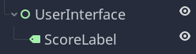
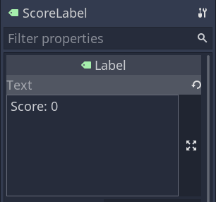
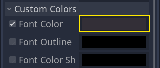
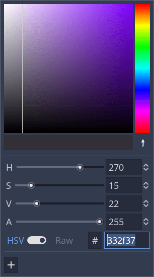
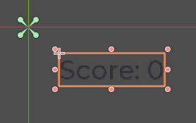
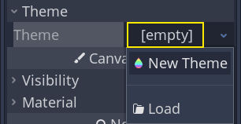
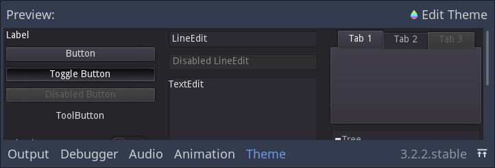
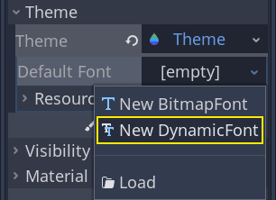
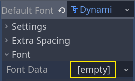
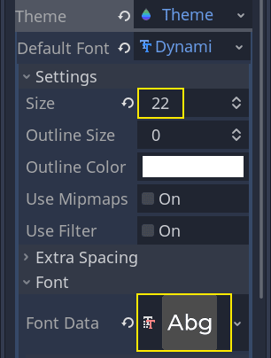
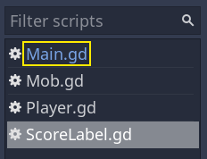
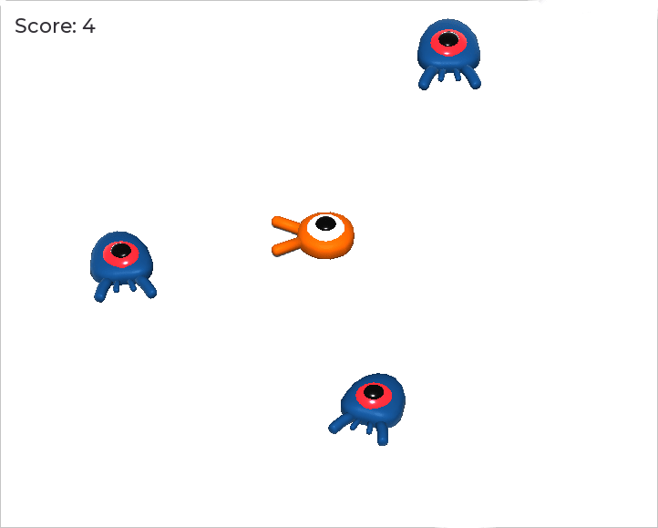
.. |image12| image:: img/08.score_and_replay/10.layout_icon.png
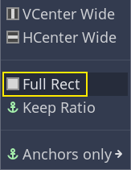
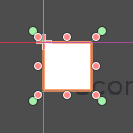
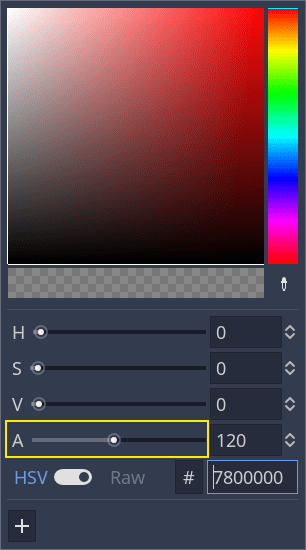
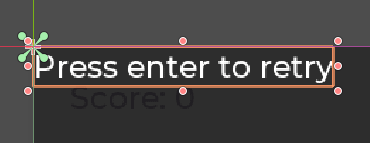
.. |image17| image:: img/08.score_and_replay/15.layout_center.png
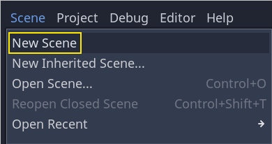
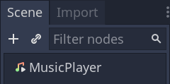
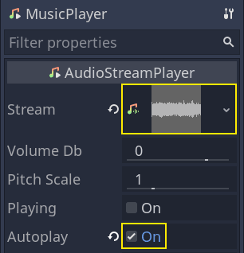
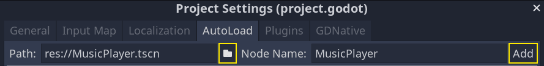
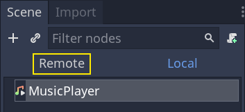
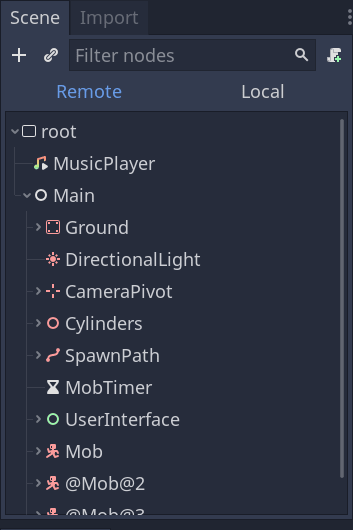
