.. _doc_first_3d_game_character_animation:

Character animation
===================

In this final lesson, we'll use Godot's built-in animation tools to make our
characters float and flap. You'll learn to design animations in the editor and
use code to make your game feel alive.

|image0|

We'll start with an introduction to using the animation editor.

Using the animation editor
--------------------------

The engine comes with tools to author animations in the editor. You can then use
the code to play and control them at runtime.

Open the player scene, select the player node, and add an animation player node.

The *Animation* dock appears in the bottom panel.

|image1|

It features a toolbar and the animation drop-down menu at the top, a track
editor in the middle that's currently empty, and filter, snap, and zoom options
at the bottom.

Let's create an animation. Click on *Animation -> New*.

|image2|

Name the animation "float".

|image3|

Once you created the animation, the timeline appears with numbers representing
time in seconds.

|image4|

We want the animation to start playback automatically at the start of the game.
Also, it should loop.

To do so, you can click the button with an "A+" icon in the animation toolbar
and the looping arrows, respectively.

|image5|

You can also pin the animation editor by clicking the pin icon in the top-right.
This prevents it from folding when you click on the viewport and deselect the
nodes.

|image6|

Set the animation duration to ``1.2`` seconds in the top-right of the dock.

|image7|

You should see the gray ribbon widen a bit. It shows you the start and end of
your animation and the vertical blue line is your time cursor.

|image8|

You can click and drag the slider in the bottom-right to zoom in and out of the
timeline.

|image9|

The float animation
-------------------

With the animation player node, you can animate most properties on as many nodes
as you need. Notice the key icon next to properties in the *Inspector*. You can
click any of them to create a keyframe, a time and value pair for the
corresponding property. The keyframe gets inserted where your time cursor is in
the timeline.

Let's insert our first keys. Here, we will animate both the translation and the
rotation of the *Character* node.

Select the *Character* and click the key icon next to *Translation* in the
*Inspector*. Do the same for *Rotation Degrees*.

|image10|

Two tracks appear in the editor with a diamond icon representing each keyframe.

|image11|

You can click and drag on the diamonds to move them in time. Move the
translation key to ``0.2`` seconds and the rotation key to ``0.1`` seconds.

|image12|

Move the time cursor to ``0.5`` seconds by clicking and dragging on the gray
timeline. In the *Inspector*, set the *Translation*'s *Y* axis to about
``0.65`` meters and the *Rotation Degrees*' *X* axis to ``8``.

|image13|

Create a keyframe for both properties and shift the translation key to ``0.7``
seconds by dragging it on the timeline.

|image14|

.. note::

    A lecture on the principles of animation is beyond the scope of this
    tutorial. Just note that you don't want to time and space everything evenly.
    Instead, animators play with timing and spacing, two core animation
    principles. You want to offset and contrast in your character's motion to
    make them feel alive.

Move the time cursor to the end of the animation, at ``1.2`` seconds. Set the Y
translation to about ``0.35`` and the X rotation to ``-9`` degrees. Once again,
create a key for both properties.

You can preview the result by clicking the play button or pressing :kbd:`Shift + D`.
Click the stop button or press :kbd:`S` to stop playback.

|image15|

You can see that the engine interpolates between your keyframes to produce a
continuous animation. At the moment, though, the motion feels very robotic. This
is because the default interpolation is linear, causing constant transitions,
unlike how living things move in the real world.

We can control the transition between keyframes using easing curves.

Click and drag around the first two keys in the timeline to box select them.

|image16|

You can edit the properties of both keys simultaneously in the *Inspector*,
where you can see an *Easing* property.

|image17|

Click and drag on the curve, pulling it towards the left. This will make it
ease-out, that is to say, transition fast initially and slow down as the time
cursor reaches the next keyframe.

|image18|

Play the animation again to see the difference. The first half should already
feel a bit bouncier.

Apply an ease-out to the second keyframe in the rotation track.

|image19|

Do the opposite for the second translation keyframe, dragging it to the right.

|image20|

Your animation should look something like this.

|image21|

.. note::

    Animations update the properties of the animated nodes every frame,
    overriding initial values. If we directly animated the *Player* node, it
    would prevent us from moving it in code. This is where the *Pivot* node
    comes in handy: even though we animated the *Character*, we can still move
    and rotate the *Pivot* and layer changes on top of the animation in a
    script.

If you play the game, the player's creature will now float!

If the creature is a little too close to the floor, you can move the *Pivot* up
to offset it.

Controlling the animation in code
~~~~~~~~~~~~~~~~~~~~~~~~~~~~~~~~~

We can use code to control the animation playback based on the player's input.
Let's change the animation speed when the character is moving.

Open the *Player*'s script by clicking the script icon next to it.

|image22|

In ``_physics_process()``, after the line where we check the ``direction``
vector, add the following code.

.. tabs::
 .. code-tab:: gdscript GDScript

   func _physics_process(delta):
       #...
       #if direction != Vector3.ZERO:
           #...
           $AnimationPlayer.playback_speed = 4
       else:
           $AnimationPlayer.playback_speed = 1

 .. code-tab:: csharp

    public override void _PhysicsProcess(float delta)
    {
        // ...
        if (direction != Vector3.Zero)
        {
            // ...
            GetNode<AnimationPlayer>("AnimationPlayer").PlaybackSpeed = 4;
        }
        else
        {
            GetNode<AnimationPlayer>("AnimationPlayer").PlaybackSpeed = 1;
        }
    }

This code makes it so when the player moves, we multiply the playback speed by
``4``. When they stop, we reset it to normal.

We mentioned that the pivot could layer transforms on top of the animation. We
can make the character arc when jumping using the following line of code. Add it
at the end of ``_physics_process()``.

.. tabs::
 .. code-tab:: gdscript GDScript

   func _physics_process(delta):
       #...
       $Pivot.rotation.x = PI / 6 * velocity.y / jump_impulse

 .. code-tab:: csharp

    public override void _PhysicsProcess(float delta)
    {
        // ...
        var pivot = GetNode<Spatial>("Pivot");
        pivot.Rotation = new Vector3(Mathf.Pi / 6f * _velocity.y / JumpImpulse, pivot.Rotation.y, pivot.Rotation.z);
    }

Animating the mobs
------------------

Here's another nice trick with animations in Godot: as long as you use a similar
node structure, you can copy them to different scenes.

For example, both the *Mob* and the *Player* scenes have a *Pivot* and a
*Character* node, so we can reuse animations between them.

Open the *Player* scene, select the animation player node and open the "float" animation.
Next, click on **Animation > Copy**. Then open ``Mob.tscn`` and open its animation
player. Click **Animation > Paste**. That's it; all monsters will now play the float
animation.

We can change the playback speed based on the creature's ``random_speed``. Open
the *Mob*'s script and at the end of the ``initialize()`` function, add the
following line.

.. tabs::
 .. code-tab:: gdscript GDScript

   func initialize(start_position, player_position):
       #...
       $AnimationPlayer.playback_speed = random_speed / min_speed

 .. code-tab:: csharp

    public void Initialize(Vector3 startPosition, Vector3 playerPosition)
    {
        // ...
        GetNode<AnimationPlayer>("AnimationPlayer").PlaybackSpeed = randomSpeed / MinSpeed;
    }

And with that, you finished coding your first complete 3D game.

**Congratulations**!

In the next part, we'll quickly recap what you learned and give you some links
to keep learning more. But for now, here are the complete ``Player.gd`` and
``Mob.gd`` so you can check your code against them.

Here's the *Player* script.

.. tabs::
 .. code-tab:: gdscript GDScript

   extends KinematicBody

   # Emitted when the player was hit by a mob.
   signal hit

   # How fast the player moves in meters per second.
   @export var speed = 14
   # The downward acceleration when in the air, in meters per second per second.
   @export var fall_acceleration = 75
   # Vertical impulse applied to the character upon jumping in meters per second.
   @export var jump_impulse = 20
   # Vertical impulse applied to the character upon bouncing over a mob in meters per second.
   @export var bounce_impulse = 16

   var velocity = Vector3.ZERO

   func _physics_process(delta):
       var direction = Vector3.ZERO

       if Input.is_action_pressed("move_right"):
           direction.x += 1
       if Input.is_action_pressed("move_left"):
           direction.x -= 1
       if Input.is_action_pressed("move_back"):
           direction.z += 1
       if Input.is_action_pressed("move_forward"):
           direction.z -= 1

       if direction != Vector3.ZERO:
           direction = direction.normalized()
           $Pivot.look_at(translation + direction, Vector3.UP)
           $AnimationPlayer.playback_speed = 4
       else:
           $AnimationPlayer.playback_speed = 1

       velocity.x = direction.x * speed
       velocity.z = direction.z * speed

       # Jumping
       if is_on_floor() and Input.is_action_just_pressed("jump"):
           velocity.y += jump_impulse

       velocity.y -= fall_acceleration * delta
       velocity = move_and_slide(velocity, Vector3.UP)

       for index in range(get_slide_count()):
           var collision = get_slide_collision(index)
           if collision.collider.is_in_group("mob"):
               var mob = collision.collider
               if Vector3.UP.dot(collision.normal) > 0.1:
                   mob.squash()
                   velocity.y = bounce_impulse

       $Pivot.rotation.x = PI / 6 * velocity.y / jump_impulse

   func die():
       emit_signal("hit")
       queue_free()

   func _on_MobDetector_body_entered(_body):
       die()

 .. code-tab:: csharp

    public class Player : KinematicBody
    {
        // Emitted when the player was hit by a mob.
        [Signal]
        public delegate void HitEventHandler();

        // How fast the player moves in meters per second.
        [Export]
        public int Speed = 14;
        // The downward acceleration when in the air, in meters per second squared.
        [Export]
        public int FallAcceleration = 75;
        // Vertical impulse applied to the character upon jumping in meters per second.
        [Export]
        public int JumpImpulse = 20;
        // Vertical impulse applied to the character upon bouncing over a mob in meters per second.
        [Export]
        public int BounceImpulse = 16;

        private Vector3 _velocity = Vector3.Zero;

        public override void _PhysicsProcess(float delta)
        {
            var direction = Vector3.Zero;

            if (Input.IsActionPressed("move_right"))
            {
                direction.x += 1f;
            }
            if (Input.IsActionPressed("move_left"))
            {
                direction.x -= 1f;
            }
            if (Input.IsActionPressed("move_back"))
            {
                direction.z += 1f;
            }
            if (Input.IsActionPressed("move_forward"))
            {
                direction.z -= 1f;
            }

            if (direction != Vector3.Zero)
            {
                direction = direction.Normalized();
                GetNode<Spatial>("Pivot").LookAt(Translation + direction, Vector3.Up);
                GetNode<AnimationPlayer>("AnimationPlayer").PlaybackSpeed = 4;
            }
            else
            {
                GetNode<AnimationPlayer>("AnimationPlayer").PlaybackSpeed = 1;
            }

            _velocity.x = direction.x * Speed;
            _velocity.z = direction.z * Speed;

            // Jumping.
            if (IsOnFloor() && Input.IsActionJustPressed("jump"))
            {
                _velocity.y += JumpImpulse;
            }

            _velocity.y -= FallAcceleration * delta;
            _velocity = MoveAndSlide(_velocity, Vector3.Up);

            for (int index = 0; index < GetSlideCount(); index++)
            {
                KinematicCollision collision = GetSlideCollision(index);
                if (collision.Collider is Mob mob && mob.IsInGroup("mob"))
                {
                    if (Vector3.Up.Dot(collision.Normal) > 0.1f)
                    {
                        mob.Squash();
                        _velocity.y = BounceImpulse;
                    }
                }
            }

            var pivot = GetNode<Spatial>("Pivot");
            pivot.Rotation = new Vector3(Mathf.Pi / 6f * _velocity.y / JumpImpulse, pivot.Rotation.y, pivot.Rotation.z);
        }

        private void Die()
        {
            EmitSignal(nameof(Hit));
            QueueFree();
        }

        public void OnMobDetectorBodyEntered(Node body)
        {
            Die();
        }
    }

And the *Mob*'s script.

.. tabs::
 .. code-tab:: gdscript GDScript

   extends KinematicBody

   # Emitted when the player jumped on the mob.
   signal squashed

   # Minimum speed of the mob in meters per second.
   @export var min_speed = 10
   # Maximum speed of the mob in meters per second.
   @export var max_speed = 18

   var velocity = Vector3.ZERO

   func _physics_process(_delta):
       move_and_slide(velocity)

   func initialize(start_position, player_position):
       look_at_from_position(start_position, player_position, Vector3.UP)
       rotate_y(rand_range(-PI / 4, PI / 4))

       var random_speed = rand_range(min_speed, max_speed)
       velocity = Vector3.FORWARD * random_speed
       velocity = velocity.rotated(Vector3.UP, rotation.y)

       $AnimationPlayer.playback_speed = random_speed / min_speed

    func squash():
       emit_signal("squashed")
       queue_free()

   func _on_VisibilityNotifier_screen_exited():
       queue_free()

 .. code-tab:: csharp

    public class Mob : KinematicBody
    {
        // Emitted when the played jumped on the mob.
        [Signal]
        public delegate void SquashedEventHandler();

        // Minimum speed of the mob in meters per second
        [Export]
        public int MinSpeed = 10;
        // Maximum speed of the mob in meters per second
        [Export]
        public int MaxSpeed = 18;

        private Vector3 _velocity = Vector3.Zero;

        public override void _PhysicsProcess(float delta)
        {
            MoveAndSlide(_velocity);
        }

        public void Initialize(Vector3 startPosition, Vector3 playerPosition)
        {
            LookAtFromPosition(startPosition, playerPosition, Vector3.Up);
            RotateY((float)GD.RandRange(-Mathf.Pi / 4.0, Mathf.Pi / 4.0));

            float randomSpeed = (float)GD.RandRange(MinSpeed, MaxSpeed);
            _velocity = Vector3.Forward * randomSpeed;
            _velocity = _velocity.Rotated(Vector3.Up, Rotation.y);

            GetNode<AnimationPlayer>("AnimationPlayer").PlaybackSpeed = randomSpeed / MinSpeed;
        }

        public void Squash()
        {
            EmitSignal(nameof(Squashed));
            QueueFree();
        }

        public void OnVisibilityNotifierScreenExited()
        {
            QueueFree();
        }
    }

.. |image0| image:: img/squash-the-creeps-final.gif
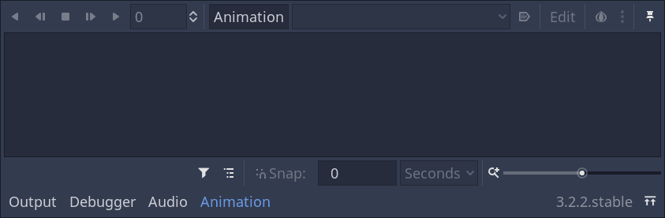
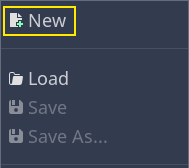
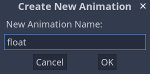
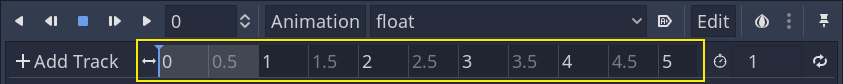
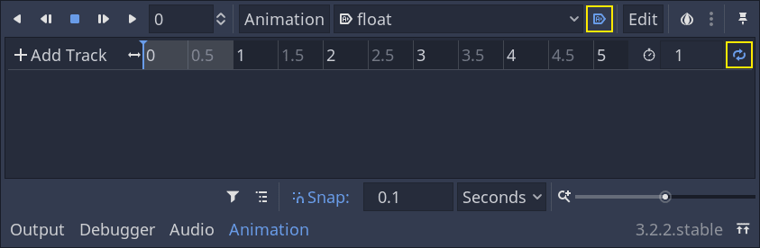

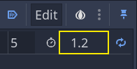
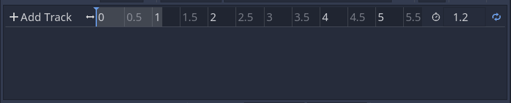
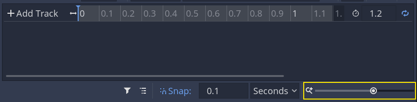
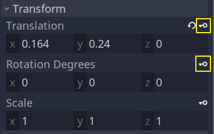
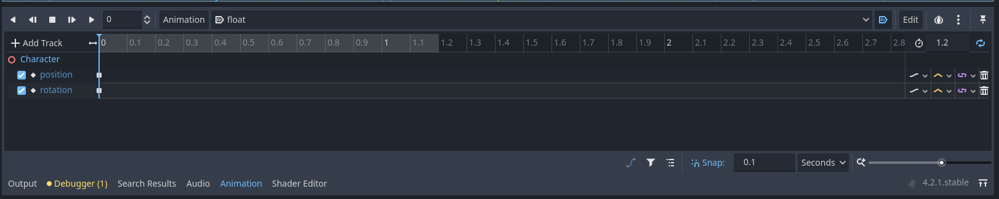
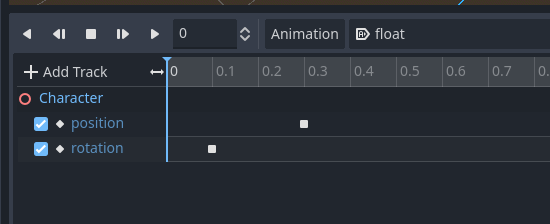
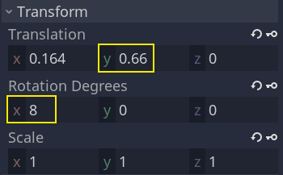

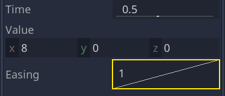
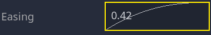
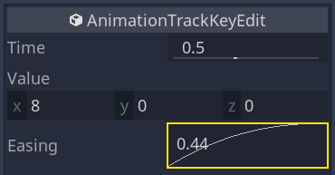
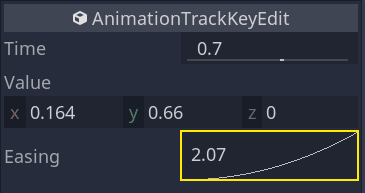
.. |image21| image:: img/09.adding_animations/20.float_animation.gif
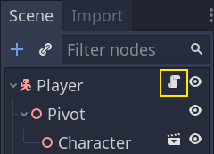
