.. _doc_first_3d_game_character_animation:

Character animation
===================

In this final lesson, we'll use Godot's built-in animation tools to make our
characters float and flap. You'll learn to design animations in the editor and
use code to make your game feel alive.

|image0|

We'll start with an introduction to using the animation editor.

Using the animation editor
--------------------------

The engine comes with tools to author animations in the editor. You can then use
the code to play and control them at runtime.

Open the player scene, select the ``Player`` node, and add an :ref:`AnimationPlayer <class_AnimationPlayer>` node.

The *Animation* dock appears in the bottom panel.

|image1|

It features a toolbar and the animation drop-down menu at the top, a track
editor in the middle that's currently empty, and filter, snap, and zoom options
at the bottom.

Let's create an animation. Click on *Animation -> New*.

|image2|

Name the animation "float".

|image3|

Once you've created the animation, the timeline appears with numbers representing
time in seconds.

|image4|

We want the animation to start playback automatically at the start of the game.
Also, it should loop.

To do so, you can click the autoplay button (|Autoplay|) in the animation toolbar
and the looping arrows, respectively.

|image5|

You can also pin the animation editor by clicking the pin icon in the top-right.
This prevents it from folding when you click on the viewport and deselect the
nodes.

|image6|

Set the animation duration to ``1.2`` seconds in the top-right of the dock.

You should see the gray ribbon widen a bit. It shows you the start and end of
your animation and the vertical blue line is your time cursor.

|image7|

You can click and drag the slider in the bottom-right to zoom in and out of the
timeline.

|image8|

The float animation
-------------------

With the animation player node, you can animate most properties on as many nodes
as you need. Notice the key icon next to properties in the *Inspector*. You can
click any of them to create a keyframe, a time and value pair for the
corresponding property. The keyframe gets inserted where your time cursor is in
the timeline.

Let's insert our first keys. Here, we will animate both the position and the
rotation of the ``Character`` node.

Select the ``Character`` and in the *Inspector* expand the *Transform* section. Click the key icon next to *Position*, and *Rotation*.

|image9|

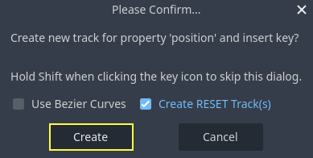

For this tutorial, just create RESET Track(s) which is the default choice

Two tracks appear in the editor with a diamond icon representing each keyframe.

|image10|

You can click and drag on the diamonds to move them in time. Move the
position key to ``0.3`` seconds and the rotation key to ``0.1`` seconds.

|image11|

Move the time cursor to ``0.5`` seconds by clicking and dragging on the gray
timeline, or by entering it into the input field.

|timeline_05_click|

In the *Inspector*, set the *Position*'s *Y* axis to ``0.65`` meters and the
*Rotation*' *X* axis to ``8``.

If you don't see the properties in the *Inspector* panel, first click on the
``Character`` node again in the *Scene* dock.

|image12|

Create a keyframe for both properties

|second_keys_both|

Now, move the position keyframe to ``0.7``
seconds by dragging it on the timeline.

|image13|

.. note::

    A lecture on the principles of animation is beyond the scope of this
    tutorial. Just note that you don't want to time and space everything evenly.
    Instead, animators play with timing and spacing, two core animation
    principles. You want to offset and contrast in your character's motion to
    make them feel alive.

Move the time cursor to the end of the animation, at ``1.2`` seconds. Set the Y
position to about ``0.35`` and the X rotation to ``-9`` degrees. Once again,
create a key for both properties.

|animation_final_keyframes|

You can preview the result by clicking the play button or pressing :kbd:`Shift + D`.
Click the stop button or press :kbd:`S` to stop playback.

|image14|

You can see that the engine interpolates between your keyframes to produce a
continuous animation. At the moment, though, the motion feels very robotic. This
is because the default interpolation is linear, causing constant transitions,
unlike how living things move in the real world.

We can control the transition between keyframes using easing curves.

Click and drag around the first two keys in the timeline to box select them.

|image15|

You can edit the properties of both keys simultaneously in the *Inspector*,
where you can see an *Easing* property.

|image16|

Click and drag on the curve, pulling it towards the left. This will make it
ease-out, that is to say, transition fast initially and slow down as the time
cursor reaches the next keyframe.

|image17|

Play the animation again to see the difference. The first half should already
feel a bit bouncier.

Apply an ease-out to the second keyframe in the rotation track.

|image18|

Do the opposite for the second position keyframe, dragging it to the right.

|image19|

Your animation should look something like this.

|image20|

.. note::

    Animations update the properties of the animated nodes every frame,
    overriding initial values. If we directly animated the *Player* node, it
    would prevent us from moving it in code. This is where the *Pivot* node
    comes in handy: even though we animated the *Character*, we can still move
    and rotate the *Pivot* and layer changes on top of the animation in a
    script.

If you play the game, the player's creature will now float!

If the creature is a little too close to the floor, you can move the ``Pivot`` up
to offset it.

Controlling the animation in code
~~~~~~~~~~~~~~~~~~~~~~~~~~~~~~~~~

We can use code to control the animation playback based on the player's input.
Let's change the animation speed when the character is moving.

Open the ``Player``'s script by clicking the script icon next to it.

|image21|

In ``_physics_process()``, after the line where we check the ``direction``
vector, add the following code.

.. tabs::
 .. code-tab:: gdscript GDScript

   func _physics_process(delta):
       #...
       if direction != Vector3.ZERO:
           #...
           $AnimationPlayer.speed_scale = 4
       else:
           $AnimationPlayer.speed_scale = 1

 .. code-tab:: csharp

    public override void _PhysicsProcess(double delta)
    {
        // ...
        if (direction != Vector3.Zero)
        {
            // ...
            GetNode<AnimationPlayer>("AnimationPlayer").SpeedScale = 4;
        }
        else
        {
            GetNode<AnimationPlayer>("AnimationPlayer").SpeedScale = 1;
        }
    }

This code makes it so when the player moves, we multiply the playback speed by
``4``. When they stop, we reset it to normal.

We mentioned that the ``Pivot`` could layer transforms on top of the animation. We
can make the character arc when jumping using the following line of code. Add it
at the end of ``_physics_process()``.

.. tabs::
 .. code-tab:: gdscript GDScript

   func _physics_process(delta):
       #...
       $Pivot.rotation.x = PI / 6 * velocity.y / jump_impulse

 .. code-tab:: csharp

    public override void _PhysicsProcess(double delta)
    {
        // ...
        var pivot = GetNode<Node3D>("Pivot");
        pivot.Rotation = new Vector3(Mathf.Pi / 6.0f * Velocity.Y / JumpImpulse, pivot.Rotation.Y, pivot.Rotation.Z);
    }

Animating the mobs
------------------

Here's another nice trick with animations in Godot: as long as you use a similar
node structure, you can copy them to different scenes.

For example, both the ``Mob`` and the ``Player`` scenes have a ``Pivot`` and a
``Character`` node, so we can reuse animations between them.

Open the *Player* scene, select the AnimationPlayer node and then click on
**Animation > Manage Animations...**. Click the *Copy animation to clipboard* button
(two small squares) alongside the *float* animation. Click OK to close the window.

Then open ``mob.tscn``, create an :ref:`AnimationPlayer <class_AnimationPlayer>` child
node and select it. Click **Animation > Manage Animations**, then **New Library**. You
should see the message "Global library will be created." Leave the text field blank and
click OK. Click the *Paste* icon (clipboard) and it should appear in the window. Click OK
to close the window.

Next, make sure that the autoplay button (|Autoplay|) and the looping
arrows (Animation looping) are also turned on in the animation editor in the bottom panel.
That's it; all monsters will now play the float animation.

We can change the playback speed based on the creature's ``random_speed``. Open
the *Mob*'s script and at the end of the ``initialize()`` function, add the following line.

.. tabs::
 .. code-tab:: gdscript GDScript

   func initialize(start_position, player_position):
       #...
       $AnimationPlayer.speed_scale = random_speed / min_speed

 .. code-tab:: csharp

    public void Initialize(Vector3 startPosition, Vector3 playerPosition)
    {
        // ...
        GetNode<AnimationPlayer>("AnimationPlayer").SpeedScale = randomSpeed / MinSpeed;
    }

And with that, you finished coding your first complete 3D game.

**Congratulations**!

In the next part, we'll quickly recap what you learned and give you some links
to keep learning more. But for now, here are the complete ``player.gd`` and
``mob.gd`` so you can check your code against them.

Here's the *Player* script.

.. tabs::
 .. code-tab:: gdscript GDScript

    extends CharacterBody3D

    signal hit

    # How fast the player moves in meters per second.
    @export var speed = 14
    # The downward acceleration while in the air, in meters per second squared.
    @export var fall_acceleration = 75
    # Vertical impulse applied to the character upon jumping in meters per second.
    @export var jump_impulse = 20
    # Vertical impulse applied to the character upon bouncing over a mob
    # in meters per second.
    @export var bounce_impulse = 16

    var target_velocity = Vector3.ZERO

    func _physics_process(delta):
        # We create a local variable to store the input direction
        var direction = Vector3.ZERO

        # We check for each move input and update the direction accordingly
        if Input.is_action_pressed("move_right"):
            direction.x = direction.x + 1
        if Input.is_action_pressed("move_left"):
            direction.x = direction.x - 1
        if Input.is_action_pressed("move_back"):
            # Notice how we are working with the vector's x and z axes.
            # In 3D, the XZ plane is the ground plane.
            direction.z = direction.z + 1
        if Input.is_action_pressed("move_forward"):
            direction.z = direction.z - 1

        # Prevent diagonal movement being very fast
        if direction != Vector3.ZERO:
            direction = direction.normalized()
            # Setting the basis property will affect the rotation of the node.
            $Pivot.basis = Basis.looking_at(direction)
            $AnimationPlayer.speed_scale = 4
        else:
            $AnimationPlayer.speed_scale = 1

        # Ground Velocity
        target_velocity.x = direction.x * speed
        target_velocity.z = direction.z * speed

        # Vertical Velocity
        if not is_on_floor(): # If in the air, fall towards the floor
            target_velocity.y = target_velocity.y - (fall_acceleration * delta)

        # Jumping.
        if is_on_floor() and Input.is_action_just_pressed("jump"):
            target_velocity.y = jump_impulse

        # Iterate through all collisions that occurred this frame
        # in C this would be for(int i = 0; i < collisions.Count; i++)
        for index in range(get_slide_collision_count()):
            # We get one of the collisions with the player
            var collision = get_slide_collision(index)

            # If the collision is with ground
            if collision.get_collider() == null:
                continue

            # If the collider is with a mob
            if collision.get_collider().is_in_group("mob"):
                var mob = collision.get_collider()
                # we check that we are hitting it from above.
                if Vector3.UP.dot(collision.get_normal()) > 0.1:
                    # If so, we squash it and bounce.
                    mob.squash()
                    target_velocity.y = bounce_impulse
                    # Prevent further duplicate calls.
                    break

        # Moving the Character
        velocity = target_velocity
        move_and_slide()

        $Pivot.rotation.x = PI / 6 * velocity.y / jump_impulse

    # And this function at the bottom.
    func die():
        hit.emit()
        queue_free()

    func _on_mob_detector_body_entered(body):
        die()

 .. code-tab:: csharp

    using Godot;

    public partial class Player : CharacterBody3D
    {
        // Emitted when the player was hit by a mob.
        [Signal]
        public delegate void HitEventHandler();

        // How fast the player moves in meters per second.
        [Export]
        public int Speed { get; set; } = 14;
        // The downward acceleration when in the air, in meters per second squared.
        [Export]
        public int FallAcceleration { get; set; } = 75;
        // Vertical impulse applied to the character upon jumping in meters per second.
        [Export]
        public int JumpImpulse { get; set; } = 20;
        // Vertical impulse applied to the character upon bouncing over a mob in meters per second.
        [Export]
        public int BounceImpulse { get; set; } = 16;

        private Vector3 _targetVelocity = Vector3.Zero;

        public override void _PhysicsProcess(double delta)
        {
            // We create a local variable to store the input direction.
            var direction = Vector3.Zero;

            // We check for each move input and update the direction accordingly.
            if (Input.IsActionPressed("move_right"))
            {
                direction.X += 1.0f;
            }
            if (Input.IsActionPressed("move_left"))
            {
                direction.X -= 1.0f;
            }
            if (Input.IsActionPressed("move_back"))
            {
                // Notice how we are working with the vector's X and Z axes.
                // In 3D, the XZ plane is the ground plane.
                direction.Z += 1.0f;
            }
            if (Input.IsActionPressed("move_forward"))
            {
                direction.Z -= 1.0f;
            }

            // Prevent diagonal movement being very fast.
            if (direction != Vector3.Zero)
            {
                direction = direction.Normalized();
                // Setting the basis property will affect the rotation of the node.
                GetNode<Node3D>("Pivot").Basis = Basis.LookingAt(direction);
                GetNode<AnimationPlayer>("AnimationPlayer").SpeedScale = 4;
            }
            else
            {
                GetNode<AnimationPlayer>("AnimationPlayer").SpeedScale = 1;
            }

            // Ground velocity
            _targetVelocity.X = direction.X * Speed;
            _targetVelocity.Z = direction.Z * Speed;

            // Vertical velocity
            if (!IsOnFloor())
            {
                _targetVelocity.Y -= FallAcceleration * (float)delta;
            }

            // Jumping.
            if (IsOnFloor() && Input.IsActionJustPressed("jump"))
            {
                _targetVelocity.Y += JumpImpulse;
            }

            // Iterate through all collisions that occurred this frame.
            for (int index = 0; index < GetSlideCollisionCount(); index++)
            {
                // We get one of the collisions with the player.
                KinematicCollision3D collision = GetSlideCollision(index);

                // If the collision is with a mob.
                if (collision.GetCollider() is Mob mob)
                {
                    // We check that we are hitting it from above.
                    if (Vector3.Up.Dot(collision.GetNormal()) > 0.1f)
                    {
                        // If so, we squash it and bounce.
                        mob.Squash();
                        _targetVelocity.Y = BounceImpulse;
                        // Prevent further duplicate calls.
                        break;
                    }
                }
            }

            // Moving the character
            Velocity = _targetVelocity;
            MoveAndSlide();

            var pivot = GetNode<Node3D>("Pivot");
            pivot.Rotation = new Vector3(Mathf.Pi / 6.0f * Velocity.Y / JumpImpulse, pivot.Rotation.Y, pivot.Rotation.Z);
        }

        private void Die()
        {
            EmitSignal(SignalName.Hit);
            QueueFree();
        }

        private void OnMobDetectorBodyEntered(Node body)
        {
            Die();
        }
    }

And the *Mob*'s script.

.. tabs::
 .. code-tab:: gdscript GDScript

    extends CharacterBody3D

    # Minimum speed of the mob in meters per second.
    @export var min_speed = 10
    # Maximum speed of the mob in meters per second.
    @export var max_speed = 18

    # Emitted when the player jumped on the mob
    signal squashed

    func _physics_process(_delta):
        move_and_slide()

    # This function will be called from the Main scene.
    func initialize(start_position, player_position):
        # We position the mob by placing it at start_position
        # and rotate it towards player_position, so it looks at the player.
        look_at_from_position(start_position, player_position, Vector3.UP)
        # Rotate this mob randomly within range of -45 and +45 degrees,
        # so that it doesn't move directly towards the player.
        rotate_y(randf_range(-PI / 4, PI / 4))

        # We calculate a random speed (integer)
        var random_speed = randi_range(min_speed, max_speed)
        # We calculate a forward velocity that represents the speed.
        velocity = Vector3.FORWARD * random_speed
        # We then rotate the velocity vector based on the mob's Y rotation
        # in order to move in the direction the mob is looking.
        velocity = velocity.rotated(Vector3.UP, rotation.y)

        $AnimationPlayer.speed_scale = random_speed / min_speed

    func _on_visible_on_screen_notifier_3d_screen_exited():
        queue_free()

    func squash():
        squashed.emit()
        queue_free() # Destroy this node

 .. code-tab:: csharp

    using Godot;

    public partial class Mob : CharacterBody3D
    {
        // Emitted when the played jumped on the mob.
        [Signal]
        public delegate void SquashedEventHandler();

        // Minimum speed of the mob in meters per second
        [Export]
        public int MinSpeed { get; set; } = 10;
        // Maximum speed of the mob in meters per second
        [Export]
        public int MaxSpeed { get; set; } = 18;

        public override void _PhysicsProcess(double delta)
        {
            MoveAndSlide();
        }

        // This function will be called from the Main scene.
        public void Initialize(Vector3 startPosition, Vector3 playerPosition)
        {
            // We position the mob by placing it at startPosition
            // and rotate it towards playerPosition, so it looks at the player.
            LookAtFromPosition(startPosition, playerPosition, Vector3.Up);
            // Rotate this mob randomly within range of -45 and +45 degrees,
            // so that it doesn't move directly towards the player.
            RotateY((float)GD.RandRange(-Mathf.Pi / 4.0, Mathf.Pi / 4.0));

            // We calculate a random speed (integer).
            int randomSpeed = GD.RandRange(MinSpeed, MaxSpeed);
            // We calculate a forward velocity that represents the speed.
            Velocity = Vector3.Forward * randomSpeed;
            // We then rotate the velocity vector based on the mob's Y rotation
            // in order to move in the direction the mob is looking.
            Velocity = Velocity.Rotated(Vector3.Up, Rotation.Y);

            GetNode<AnimationPlayer>("AnimationPlayer").SpeedScale = randomSpeed / MinSpeed;
        }

        public void Squash()
        {
            EmitSignal(SignalName.Squashed);
            QueueFree(); // Destroy this node
        }

        private void OnVisibilityNotifierScreenExited()
        {
            QueueFree();
        }
    }

.. |image0| image:: img/squash-the-creeps-final.gif
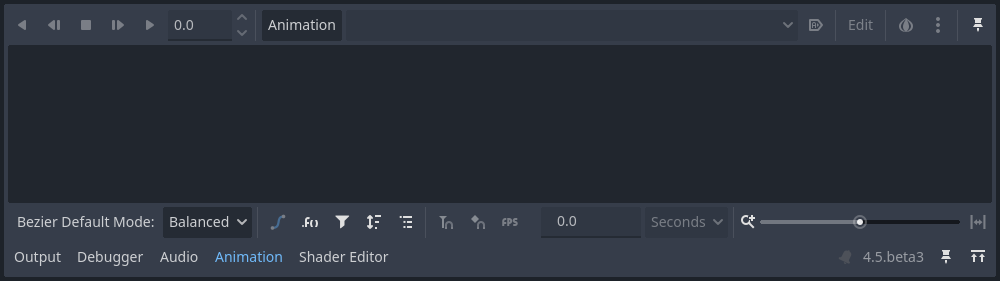
.. |image2| image:: img/09.adding_animations/02.new_animation.webp
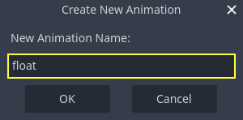
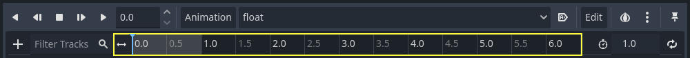
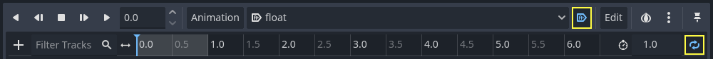

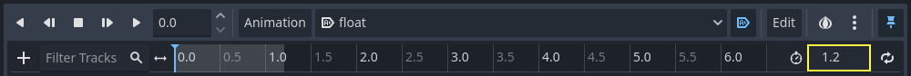
.. |image8| image:: img/09.adding_animations/08.zoom_slider.webp
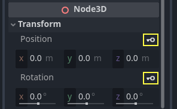
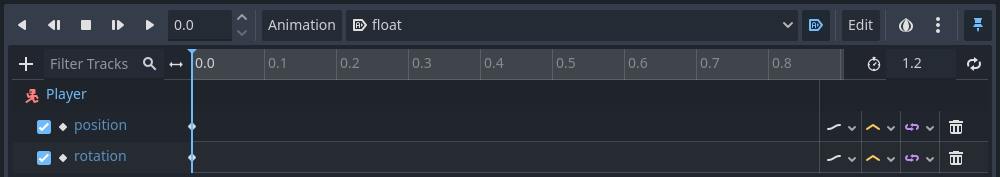
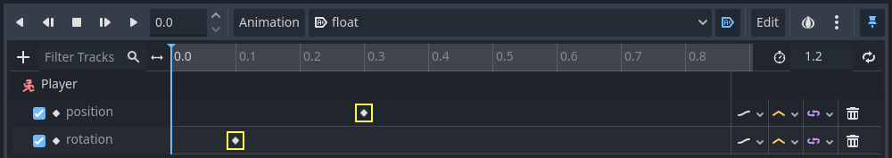
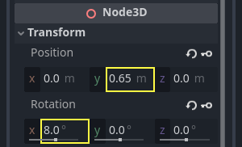
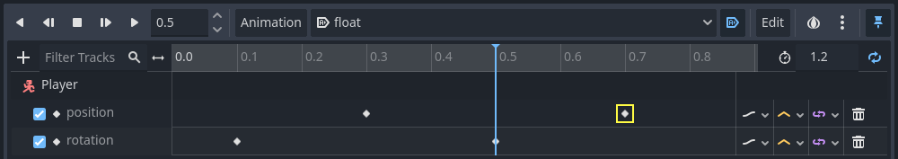

.. |image15| image:: img/09.adding_animations/15.box_select.webp
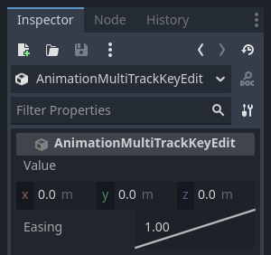
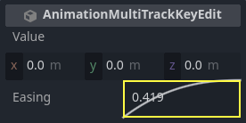
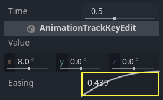
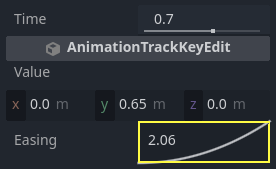
.. |image20| image:: img/09.adding_animations/20.float_animation.gif
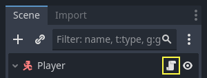
.. |animation_final_keyframes| image:: img/09.adding_animations/animation_final_keyframes.webp
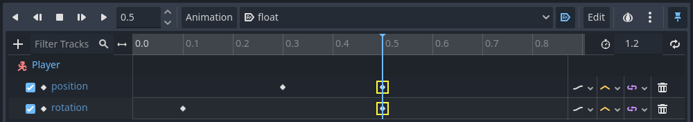
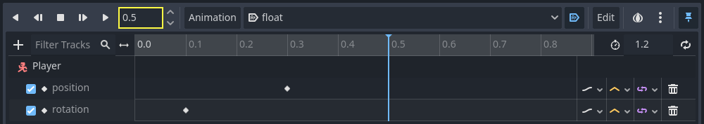
.. |Autoplay| image:: img/09.adding_animations/autoplay_button.webp
