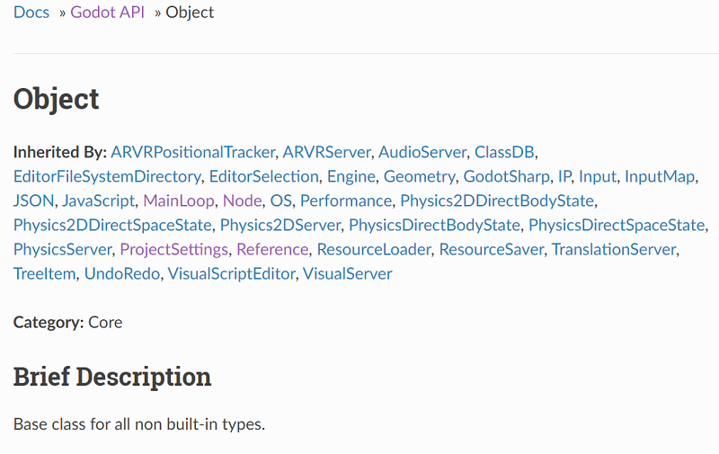
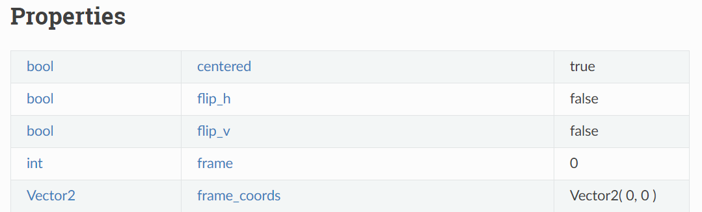
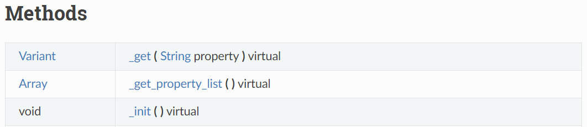
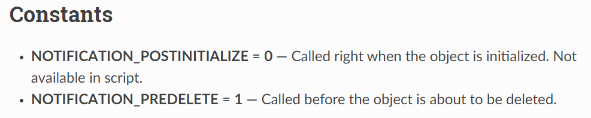
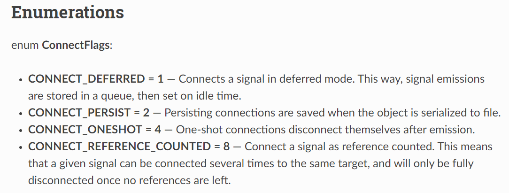
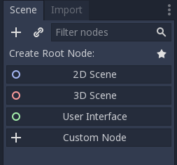

.. _doc_godot_essentials:

Godot essentials guide
======================

If you've come here, you must want to create a game. You know the idea
of what you want to build, but not *how* to build it *in Godot*. If so,
you've come to the right place.

Object-oriented design
----------------------

Godot Engine uses an Object-Oriented design. This means it is
made up of abstract templates that allow you to build concrete things.
Godot calls an abstract template a *class*. The things you actually interact
with are *instances* of a class.

Users can create content with Godot's large library of built-in classes, but
the first one to learn is the base Object class. It can define the
following elements:

- variables: Pieces of data. Also known as "properties" when associated
  with a class.

- functions: Pieces of behavior. Also known as "methods" when associated
  with a class.

- constants: *Static* and unchanging pieces of data. By *static*, we
  mean that the class owns the data, not any one instance.

- signals: Declarations that something happened, like events in other game
  engines.

Every other class in Godot ``extends Object``, or extends something else that
extends Object, at some remove. Each possesses all the properties, methods,
constants, and signals of the class it extends plus those unique to
it. Programmers refer to this chaining of elements in classes as "Inheritance."

As a Godot user, you will create a script file that defines a base class and
a list of custom elements. These elements are then appended to the base class.
You can also override base class methods. Calling ``.new()`` on the script
instantiates a new instance of the base class and assigns the script to it.

To see examples of these elements defined in Godot's scripting languages,
please see the language-specific sections of the :ref:`scripting documentation <doc_scripting>`.

To see a full description of any class, you can check the
:ref:`Class Reference <doc_classes>`, also known as the 
`API <https://en.wikipedia.org/wiki/Application_programming_interface>`__.
The :ref:`Object API docs <class_Object>` help to show the above concepts.

.. _doc_reading_the_class_api:

Reading the Class Reference
---------------------------

Each page details the name and description of a class along with the class
it inherits, those which inherit from it, and all elements related to it.

The properties table has three columns. On the left is the
"data type". This could be a class, like ``Object``, or a primitive like int 
(``5``), float (``3.14``), or bool (``true``/``false``). In the middle is the
text identifier, i.e. name. On the right is the default value of the property.

The methods table is a bit more complex. The left-hand column has the data type
that the method returns to you when you call it. A ``void``
data type means that it does not return a value; the method itself does
something. The right-hand column starts with the name of the method. A 
parentheses-enclosed list of variables then follows. These are the "parameters"
that you must give to the method to call it. This demonstrates what
values you can give to the method. It is not an example of *syntax*.

Each parameter in the list follows the format
``DataType ParameterName[= OptionalDefaultValue][Comma]``. You must provide
parameters in the same order with compatible data types. If a default value is
present, then you can omit it to have Godot assume its value.

Some methods have special suffixes to better describe their behavior.

- `const`: calling the method on an instance does not change that instance's
  data.

- `virtual`: you can write your own version of the method to plug in behavior
  somewhere else.

- `vararg`: the method accepts an unlimited number of parameters, indicated by
  a `...` at the end of the method's parameter list.

The constants section gives the name of the constant and the integer value it
corresponds to.

Enumerations are groups of constants with their own
*data type*. For example, Object defines a ``ConnectFlags`` data type with
enumerated values that appear as constants starting with ``CONNECT_*``.

Some classes also have a Tutorial section that provides links to other official,
related web documentation.

.. note::

  The entire API is also available offline from the Godot Editor's
  "Search Help" utility. Press ``Shift + F1`` or go to ``Help > Search Help``
  in the main toolbar to access it.

.. note::

  If you'd like to learn how to contribute to the Class Reference, please
  see the related documentation on
  :ref:`Submitting a pull request <doc_pr_workflow>` and
  :ref:`Updating the Class Reference <doc_updating_the_class_reference>`.

MainLoop and the SceneTree
--------------------------

The next class to learn about is the :ref:`MainLoop <class_MainLoop>` class. It
manages the game's core iteration loop and the OS window that it runs in. It
detects when the window is in focus, when the game crashes, and when the user
quits, among other things. The data it provides changes based on the platform
Godot runs on (desktop, web, mobile). It also handles iterative processes like
frame calculations and checking for input.

MainLoop is then inherited by the :ref:`SceneTree <class_SceneTree>` class.
The SceneTree is your actual Godot game instance. It builds on top of MainLoop
to enable users to manage a world of content, change it, organize it, and help
it communicate over networks. To be more specific, SceneTree manages a tree
hierarchy of :ref:`Nodes <class_Node>`.

Nodes, Node trees
-----------------

Nodes are Godot's fundamental worldbuilding unit. They can each have one
parent node and many child nodes. Attaching one node to another forms a
tree. Trees are recursive structures, built out of subtrees. In fact, a tree
can even be a single node. This grants them many significant features. You
can...

1. build nodes into a tree.
2. subdivide a tree into smaller trees.
3. attach trees to other trees as children.
4. reorganize the nodes within a tree to produce a new tree.
5. masquerade a tree as a node.
6. create and delete entire trees.
7. move nodes between trees.

We'll refer to these later in this guide as "tree features".

The lack of a major distinction between a tree of nodes and a single node
is what sets Godot apart. Nodes serve as the foundation of a flexible game
world that bends to your will.

Notifications
-------------

Nodes are also entry points for interacting with the world. The SceneTree
sends all nodes inside it *notifications* about things that happen like
advancing to a new frame or an input detection. Nodes can then opt-in to
respond to these notifications and do things in the world.

Users create a script that ``extends Node`` and which defines methods that
respond to notifications. The Node instance passes these methods
*back* to the engine which *calls* them at the correct time; Thus, they
are known as *callbacks*. They appear as virtual methods with leading
underscores in the Class Reference. See the "Methods" table at the top of the
:ref:`Node API docs<class_Node>` for examples.

While the most frequently-used notifications have their own callbacks,
Godot also has a master callback for handling any notification:
:ref:`Object._notification <class_Object_method__notification>`. As
you can see, notifications are an Object feature, so you will find them
scattered throughout the Class Reference. For more information, see
the best practices documentation on
:ref:`Godot notifications <doc_godot_notifications>`.

Scenes
------

So you've `downloaded <https://godotengine.org/download>`__ a copy of
Godot and :ref:`created a new project <doc_creating_a_new_project>`. How
do you actually start building your SceneTree content?

On the left side of the editor, you should see a "Scene" dock:

Right now, because it is empty, it offers suggestions for a "root node" that
you could add to a "scene". But this image alone gives rise to several
questions:

What is a "scene"?

  Users build a node tree to form the game world, but it wouldn't be reasonable to
  build the entire tree in one
  `hardcoded <https://stackoverflow.com/questions/1895789/what-does-hard-coded-mean>`__,
  `monolithic <https://www.quora.com/What-is-the-difference-modular-vs-monolithic-programming-for-applications>`__ node hierarchy.
  
  Instead, we use tree feature #2 and subdivide our SceneTree's
  node tree into subtrees. This lets us examine each
  subtree in isolation to develop it, test it, and track its dependencies.
  We call these subtrees "scenes" and save them to files:
  ``.tscn`` and ``.scn`` for text and binary, respectively.

  Due to tree feature #3, you can nest scenes within other scenes. This builds
  a *tree of scenes* managed by your *SceneTree* instance.

What is a "root node"?

  Because every scene is a tree, it must have a root node.
  Godot's architecture forces an Object-Oriented paradigm at every level
  of game design. All world content, even your environments, must be a direct
  extension of a single Node class.

How do I decide which node to use as root?

  Which node you choose as the root affects how the scene interacts with others.

  For example, if you create 2D content, you can put it under a
  :ref:`Node <class_Node>` root or a :ref:`Node2D <class_Node2D>` root,
  among other things. Each has a unique impact on their relationship with the
  content.

  A Node2D will position itself relative to its parent Node2D's
  :ref:`Transform2D <class_Transform2D>`. But, a Node will ignore the
  parent's Transform2D because it does not have one. So, your scene's 2D
  content either will or will not follow a moving parent. This kind of
  `declarative code <https://stackoverflow.com/questions/129628/what-is-declarative-programming>`__
  by way of node composition is a core feature of Godot Engine.

  The root node also dictates how other scenes perceive the current
  scene. By default, nested scenes appear as a single node (the root). The root
  node's script then
  `encapsulates <https://en.wikipedia.org/wiki/Encapsulation_(computer_programming)>`__
  its internal nodes with an interface.
  
  Scenes allow users to design a class's
  `constructor <https://www.techopedia.com/definition/5656/constructor>`__
  in a visual editor.
  
Why would a root node ever NOT be in 3D, 2D, or UI space?

  Not every class you create will need to have a position in space. Some
  will be bundles of data or behavior with a direct link to the world. 
  
  This includes nodes that enable a behavior for something else. For example,
  you might have a Jump node that configures and calculates jump logic.
  Anything with a Jump node then has a common jump API and implementation.
  
  It also includes nodes that serve as standalone gameplay systems. For
  example, you might have a TurnBasedCombat singleton that manages a game
  genre's state. Other nodes in the game then have a common (and *safe*)
  point of reference for handling data
  :ref:`they don't own <doc_autoloads_versus_internal_nodes>`.

In other engines, users often have a workflow like this:

1. Create an ``entity``.
2. Add behavioral ``components`` to it
3. Save it as a reproducible ``prefab``
4. Stick many instances of this prefab inside a ``level`` container.

Godot instead makes everything a ``node``.

1. Build a unique ``node`` that does what you need.
   1. A ``node`` that represents a thing in your world is an ``entity`` in name only.
   1. A ``node`` with data or behavior for a parent to use is a ``component`` in name only.
   1. Users design a ``node``, and the children it wraps, as a reproducible class via a scene and/or script.
   1. Nodes wrap other nodes and thus are containers too.

So Godot unifies entities, components, prefabs, and levels all together into
node classes. The Godot Editor is a visual class
editor. Even the Godot Editor itself is a single
`EditorNode <https://github.com/godotengine/godot/blob/master/editor/editor_node.h>`__
class!

For more information on how Godot's classes work, see the best practices
documentation on :ref:`what Godot classes are <doc_what_are_godot_classes>`.

For more information on how easily nodes can be rearranged to fit your needs,
see the tutorial on :ref:`Node flexibility <doc_node_flexibility>`.

Servers and RIDs
----------------

Nodes embody Godot's high-level API. But, nodes are not optimal for
high-performance code. When developers need to simulate anywhere up to tens of
thousands of data points, nodes are bloated in comparison. They consume more
memory than necessary and go through bottlenecks like tree traversal.

For these situations, consider using Godot's
`low-level Server API <https://godotengine.org/article/why-does-godot-use-servers-and-rids>`__.
These are optimized systems that execute multithreaded rendering and physics
processes. 

Users can organize data however they want and pass them to the servers via
opaque :ref:`RIDs <class_RID>`.

For more information on using servers in script code, click
:ref:`here <doc_using_servers>`.

For more information on writing your own server in C++ engine code, click
:ref:`here <doc_custom_godot_servers>`.

To write your own server-like script code in Godot, try combining an
:ref:`autoload singleton <doc_singletons_autoload>` with
:ref:`multithreaded <class_Thread>` code.

For more information on writing multithreaded code, click
:ref:`here <doc_using_multiple_threads>`.

For more information on which APIs in Godot are thread-safe, click
:ref:`here <doc_thread_safe_apis>`.

Navigating trees
----------------

So, you can build a tree of nodes and add scripts to them for custom data and
behaviors. But how do you actually make one node interact with another node?

NodePaths
  The first and most common way is to use a :ref:`NodePath <class_NodePath>`. These
  data types outline a path to another node. Paths can be relative through a
  node tree or absolute from the SceneTree's root. Their syntax is like a linux
  file system. See the NodePath API docs linked above for examples.

  Once you have a NodePath, you can call
  :ref:`Node.get_node() <class_Node_method_get_node>` to fetch references to
  nodes.

  .. note::

    NodePaths affect the relationship between nodes. Relying on a NodePath
    implies having a dependency. For more information on scene relationships,
    please see the best practices documentation on
    :ref:`scene organization <doc_scene_organization>`.
    
  .. note::

    GDScript has special shorthand symbols for creating NodePaths and fetching
    nodes.

    .. tabs::
      .. code-tab:: gdscript GDScript

        "A/B" # regular string
        @"A/B" # equal to NodePath("A/B")
        $"A/B" # equal to get_node("A/B")
        $A/B # $-syntax also works without quotes in descendant cases (no "..").

Groups

  Sometimes you need cross-scene collections of nodes. You could be cycling
  through cameras, tracking lights, or iterating over enemies.
  
  For these situations, you can use "groups". A group is a string that you
  associate with a Node. The SceneTree instance will keep a list of which nodes
  are in which group.

  .. image:: img/essentials_node_dock_groups.png

  Nodes can be in any number of groups. You can
  :ref:`add them <class_Node_add_to_group>` to groups,
  :ref:`remove them <class_Node_remove_from_group>` from groups,
  :ref:`fetch all nodes <class_SceneTree_method_get_nodes_in_group>` in a group,
  :ref:`check if a group exists <class_SceneTree_method_has_group>`, and even
  :ref:`call a method on every node <class_SceneTree_method_call_group>` in a
  group, among other things.

  For more examples of groups in action, see the 
  :ref:`step-by-step tutorial's group introduction <doc_scripting_continued>` or
  the best practices documentation on
  :ref:`method propagation <doc_propagation>` within the 
  :ref:`godot notifications <doc_godot_notifications>` section, its
  illustration of :ref:`groups as implied interfaces <doc_godot_interfaces>`,
  or its use of groups to
  :ref:`organize scene relationships <doc_scene_organization>`.

Signals

  So far, you've learned how to work with descendant nodes and a scene's
  internal nodes. You've also learned how to work with mass groups of
  related nodes across scenes (groups). How then do you work with nodes higher
  up the chain? Ancestral dependencies inhibit the reuse of scripts and scenes
  and invite maintenance costs.

  What you want is for your descendant to know nothing about the ancestor.
  To call a method on the parent though, we must assume the parent has said
  method. How to resolve this? Well, we can use Godot's
  :ref:`Object.call <class_Object_method_call>` method to look up
  and execute method calls. Couldn't we then declare that we want to call
  *other* instances' methods?
  
  If we specify a function signature, we can wait
  for other instances to register their methods for us to call. We then iterate
  through the connected methods and execute them. We never even need to learn
  which instance does what.

  Godot refers to this concept as a "signal". Instances "connect" methods to
  another instance's signal. When that instance "emits" the signal, it calls
  all connected methods. The signaling instance knows nothing of the
  connected methods or their owning instances!

  General convention is to "call down, signal up" when communicating in a tree
  hierarchy. This keeps your nodes free of hierarchical dependencies and allows
  you to reuse them in any manner of situations.

  For more information and examples of signals, see the relevant documentation
  in 
  :ref:`GDScript <doc_signals>`, :ref:`C# <doc_c_sharp_differences>`,
  :ref:`VisualScript <doc_getting_started_visual_script>`, and
  :ref:`NativeScript C++ <doc_gdnative_cpp_example>` as well as how to
  :ref:`instance scenes via signals <doc_instancing_with_signals>`.

  For more practical information on when to use signals, see the best practices
  documentation on :ref:`scene organization <doc_scene_organization>`.

Memory with nodes, references, and resources
--------------------------------------------

Computer science has many topics related to memory that are worth
researching such as
`stack vs. heap <https://www.geeksforgeeks.org/stack-vs-heap-memory-allocation>`__,
`a breadth/depth of knowledge on data structures <https://www.studytonight.com/data-structures/stack-data-structure>`__,
`algorithm analysis <https://www.studytonight.com/data-structures/aysmptotic-notations>`__, and
`data-oriented design <https://en.wikipedia.org/wiki/Data-oriented_design>`__.
But, as a Godot user, the primary memory 
issue you must learn to handle is memory management.

Godot uses manual memory management. This means that you are
responsible for allocating and freeing your own memory. Your
game *has* to clean up memory at some point. You can either
do it yourself or via
`garbage collection <https://en.wikipedia.org/wiki/Garbage_collection_(computer_science)>`__.
If you do it, you have full control over when you free memory (it is
"deterministic"). If a garbage collector does it, it will stop
your game at unpredictable points to handle it for you.

.. note::

  You can read the specifics of Godot's memory handling
  in its :ref:`core types <doc_core_types>` documentation.

You can delete any Godot Object immediately with the
`:ref:`.free() <class_Object_method_free>`` method. But, low-level memory
management is a hassle, so Godot provides tools to help you. Most of the
time, you work with Objects deriving from either
:ref:`Node <class_Node>` or :ref:`Resource <class_Resource>`. These classes
have built-in systems to help you manage memory in deterministic ways.

Nodes
  Nodes, as you've learned, form node tree hierarchies. Whenever you delete a
  node, it automatically deletes its children beforehand. And when
  each of those children receive the command to delete themselves, then they
  too will delete their children beforehand. This recursive process continues
  until the leaf nodes, with no children, finally delete themselves. The node
  tree systematically deletes itself from the bottom up!

  Nodes in particular also have a
  :ref:`queue_free() <class_Node_method_queue_free>` method. This delays
  their deletion until the next idle frame to reduce any discernible
  lag.

Resources
  Resources extend the :ref:`Reference <class_Reference>` class.
  References are Objects that use "reference-counted" memory. These keep track
  of how many references to the instance exist in 
  `scope <https://en.wikipedia.org/wiki/Scope_(computer_science)>`__. Only when
  all references are gone do they finally delete their instance.

  For example, let's say you create an Object inside of a function and then end
  the function. The Object's variable exits scope, removing all references to
  the Object instance. But, you have not deleted the Object, so it's memory
  continues to be in use. It has created a "memory leak." Every time you
  execute that function, you leak more memory. If you execute this function
  often, then it will consume ever-larger amounts of RAM. After a while, this
  can lag the user's computer or even crash the program.

  But, if you create a Reference inside of a function and then end
  the function. When the variable exits scope, the Reference sees that the
  last data reference is gone. It triggers an automatic ``free()`` on the
  instance in the background. You do not leak any memory and your game continues
  running smoothly.

  Resources will track references in the same way. Loading a file for the
  first time allocates a new instance. Later loads only return
  the existing instance. If you no longer have any references, they
  delete themselves for you.

  .. note::
  
    The Godot Editor has a built-in feature to cache resources.

Scripts and Scenes
  Scripts are also resources. Every script file loads as a
  :ref:`Script <class_Script>` instance. And because every script file is a
  class, each constant that file declares is *static*. The data belongs to
  the Script instance, not Object instances to which you've assigned it.

  Godot likewise loads a scene file
  into a :ref:`PackedScene <class_PackedScene>` instance. These are resources
  that cache information about creating and initializing a node hierarchy.
  You can even build your own scenes using the
  :ref:`PackedScene.pack() <class_PackedScene_method_pack>` method.

  .. note::

    Godot's resources can both reference other resources and internally
    store their own sub-resources.

    This extends to scenes. They can have embedded resources such as
    meshes, materials, shaders, particle effects, etc.
    
    However, Godot will try to save on memory allocations unless directed
    otherwise. If you duplicate a scene, or if you copy/paste a
    sub-resource, then it will NOT create a new resource. Instead, it
    makes both scenes reference the same sub-resource.

    To force Godot to create a new sub-resource, do X.

If you load a filepath, you will get a Resource. Loading that same filepath
again returns the same Resource instance. That is unless you release all
references to the previous instance and free it.

You can create a new instance of a Resource...

- in code by calling ``.new()`` on a Resource-deriving script.
- in code by calling
  :ref:`duplicate() <class_Resource_method_duplicate>``
  on an existing Resource instance.
- in the editor by clicking the "New" icon in the Inspector.
- in the editor by duplicating a Resource file in the FileSystem dock.

You can also create your own
:ref:`custom Resource types <doc_resources_custom_resources>`.
They are effective tools for designing and organizing your project's data
structures. The linked documentation describes many more benefits.

Godot Engine doesn't, by default, keep track of scripts' names. It recognizes
them like any other Resource: by their file path. But, Godot 3.1 added the
ability to define
:ref:`script classes <doc_scripting_continued_class_name>`, i.e. global names
for scripts. Only a few languages have script class support for now, but
Godot will add more in the future.

.. note::

  C# has its own internal ability to define names for scripts and reference
  them within other C# scripts. This is not the result of script classes.
  Script classes would enable other languages and the editor itself to also
  see C# class names.

For more information on reference-counting, see
`this article <https://mortoray.com/2012/01/08/what-is-reference-counting/>`__.

For more information on how reference-counting
compares to garbage collection, see
`this article <https://medium.com/computed-comparisons/garbage-collection-vs-automatic-reference-counting-a420bd4c7c81>`__.

The editor, tools, and plugins
------------------------------

One of the most empowering features Godot has is the fact that the
editor itself is also built using Godot Engine. This is a matter of
function more than marketability.

Because the Godot Editor has a SceneTree, it is possible to inject
your own Nodes into it. This makes the creation of custom tools
straightforward with almost no learning curve.

1. You can declare any script as a "tool" script. This enables
   that script's logic to execute in the editor.

   To specify editor-only or game-only logic, you can check the 
   script's current execution mode with
   :ref:`Engine.is_editor_hint <class_Engine_property_is_editor_hint>`.
   
   Each scripting language will have its own syntax for declaring tools. Please
   consult the scripting documentation for your language of choice for more
   information.

2. If you need to change the editor itself, Godot provides an
   easy-to-use
   :ref:`plugin API <class_EditorPlugin>`. For one-off edits, you can also
   write :ref:`standalone editor scripts <class_EditorScript>`.
   For more information about how to create plugins,
   :ref:`click here <doc_making_plugins>`.

3. There's no need to learn a domain-specific language for plugins.
   Instead, Godot enables you to re-use your game UI knowledge.

4. While writing a plugin, you can also add
   :ref:`EditorInspectorPlugins <class_EditorInspectorPlugin>`
   which let you override how your Nodes and Resources' data are
   displayed in the Editor.
