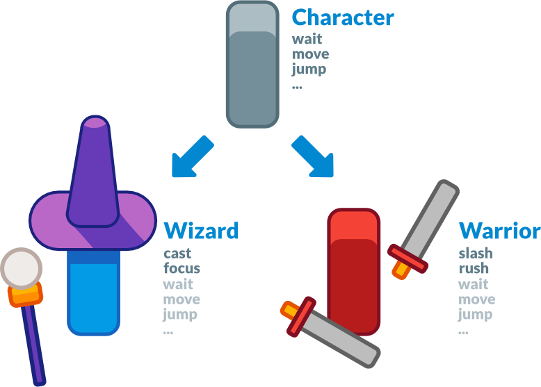
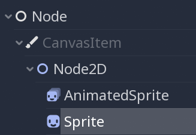
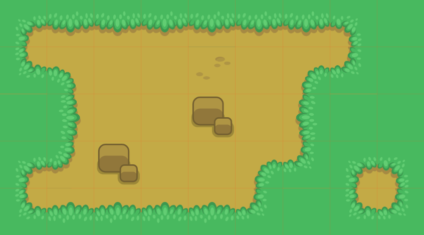
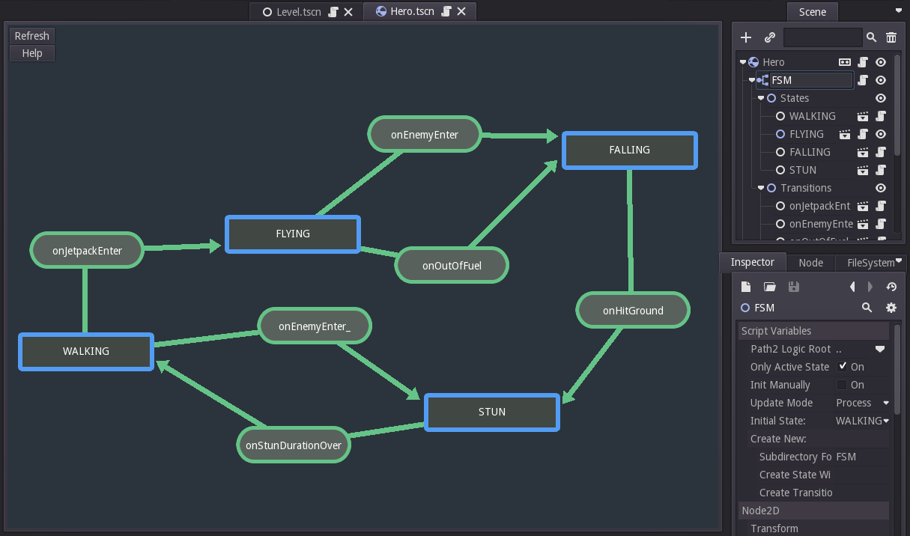
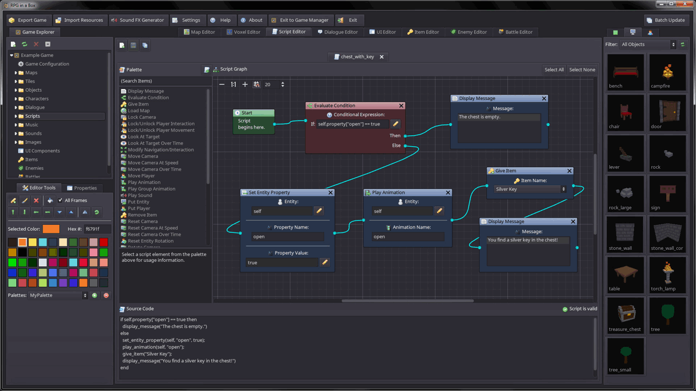

.. _doc_godot_design_philosophy:

Godot's design philosophy
=========================

Now that you've gotten your feet wet, let's talk about Godot's design.

**Every game engine is different and fits different needs.**
Not only do they offer a range of features, but the design of each engine
is unique. This leads to different workflows and different ways to form
your games' structures. This all stems from their respective design philosophies.

This page is here to help you understand how Godot works, starting
with some of its core pillars. It is not a list of available features, nor
is it an engine comparison. To know if any engine can be a good fit for
your project, you need to try it out for yourself and
understand its design and limitations.

Please watch
`Godot explained in 5 minutes <https://www.youtube.com/watch?v=KjX5llYZ5eQ>`_
if you're looking for an overview of the engine's features.

Object-oriented design and composition
--------------------------------------

Godot embraces object-oriented design at its core with its flexible
scene system and Node hierarchy. It tries to stay away from strict
programming patterns to offer an intuitive way to structure your game.

For one, Godot lets you **compose or aggregate** scenes.
It's like nested prefabs: you can create a BlinkingLight scene and
a BrokenLantern scene that uses the BlinkingLight.
Then, create a city filled with BrokenLanterns.
Change the BlinkingLight's color, save, and all the
BrokenLanterns in the city will update instantly.

On top of that, you can **inherit** from any scene.

A Godot scene could be a Weapon, a Character, an Item, a Door, a Level,
part of a level… anything you'd like. It works like a class in pure code,
except you're free to design it by using the editor, using only the
code, or mixing and matching the two.

It's different from prefabs you find in several 3D engines, as you can
then inherit from and extend those scenes. You may create a Magician
that extends your Character. Modify the Character in the editor and the Magician
will update as well. It helps you build your projects so that their
structure matches the game's design.

|image0|

Also note that Godot offers many different types of objects called
nodes, each with a specific purpose. Nodes are part of a tree and always
inherit from their parents up to the Node class. Although the engine
does feature some nodes like collision shapes that a parent physics
body will use, most nodes work independently from one another.

In other words, Godot's nodes do not work like components in some
other game engines.

|image1|

Sprite2D is a Node2D, a CanvasItem and a Node. It has all the properties
and features of its three parent classes, like transforms or the ability
to draw custom shapes and render with a custom shader.

All-inclusive package
---------------------

Godot tries to provide its own tools to answer most common
needs. It has a dedicated scripting workspace, an animation editor, a
tilemap editor, a shader editor, a debugger, a profiler,
the ability to hot-reload locally and on remote devices, etc.

|image2|

The goal is to offer a full package to create games and a continuous
user experience. You can still work with external programs as long as
there is an import plugin available in Godot for it. Or you can create one, like the `Tiled
Map Importer <https://github.com/vnen/godot-tiled-importer>`__.

That is also partly why Godot offers its own programming language
GDScript along with C#. GDScript is designed for the needs
of game developers and game designers, and is tightly integrated in
the engine and the editor.

GDScript lets you write code using an indentation-based syntax,
yet it detects types and offers a static language's quality of auto-completion.
It is also optimized for gameplay code with built-in types like Vectors and Colors.

Note that with GDExtension, you can write high-performance code using compiled
languages like C, C++, Rust, D, Haxe, or Swift without recompiling the engine.

Note that the 3D workspace doesn't feature as many tools as the 2D workspace.
You'll need external programs or add-ons to edit terrains, animate complex characters, and so on.
Godot provides a complete API to extend the editor's functionality using
game code. See `The Godot editor is a Godot game`_ below.

|image4|

*A State Machine editor plugin in Godot 2 by kubecz3k. It lets you
manage states and transitions visually.*

Open source
-----------

Godot offers a fully open source codebase under the **MIT license**.
This means all the technologies that ship with it have to be Free
(as in freedom) as well.
For the most part, they're developed from the ground up by contributors.

Anyone can plug in proprietary tools for the needs of their projects —
they just won't ship with the engine. This may include Google AdMob,
or FMOD. Any of these can come as
third-party plugins instead.

On the other hand, an open codebase means you can **learn from and extend
the engine** to your heart's content. You can also debug games easily,
as Godot will print errors with a stack trace, even if they come from the engine itself.

.. note::

   This **does not affect the work you do with Godot** in any way: there's
   no strings attached to the engine or anything you make with it.

Community-driven
----------------

**Godot is made by its community, for the community, and for all game
creators out there.** It's the needs of the users and open discussions
that drive the core updates. New features from the core developers often
focus on what will benefit the most users first.

That said, although a handful of core developers work on it full-time,
the project has over 600 contributors at the time of writing. Benevolent
programmers work on features they may need themselves, so you'll see
improvements in all corners of the engine at the same time in every
major release.

The Godot editor is a Godot game
--------------------------------

The Godot editor runs on the game engine. It uses the engine's own UI
system, it can hot-reload code and scenes when you test your projects,
or run game code in the editor. This means you can **use the same code**
and scenes for your games, or **build plugins and extend the editor.**

This leads to a reliable and flexible UI system, as it powers the editor
itself. With the ``@tool`` annotation, you can run any game code in the editor.

|image5|

*RPG in a Box is a voxel RPG editor made with Godot 2. It uses Godot's
UI tools for its node-based programming system and for the rest of the
interface.*

Put the ``@tool`` annotation at the top of any GDScript file and it will run
in the editor. This lets you import and export plugins, create plugins
like custom level editors, or create scripts with the same nodes and API
you use in your projects.

.. note::

   The editor is fully written in C++ and is statically compiled into the
   binary. This means you can't import it as a typical project that would have a
   ``project.godot`` file.

Separate 2D and 3D engines
--------------------------

Godot offers dedicated 2D and 3D rendering engines. As a result, **the
base unit for 2D scenes is pixels.** Even though the engines are
separate, you can render 2D in 3D, 3D in 2D, and overlay 2D sprites and
interfaces over your 3D world.

