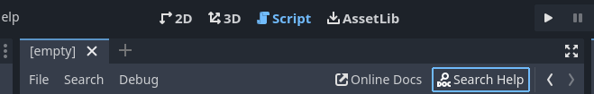
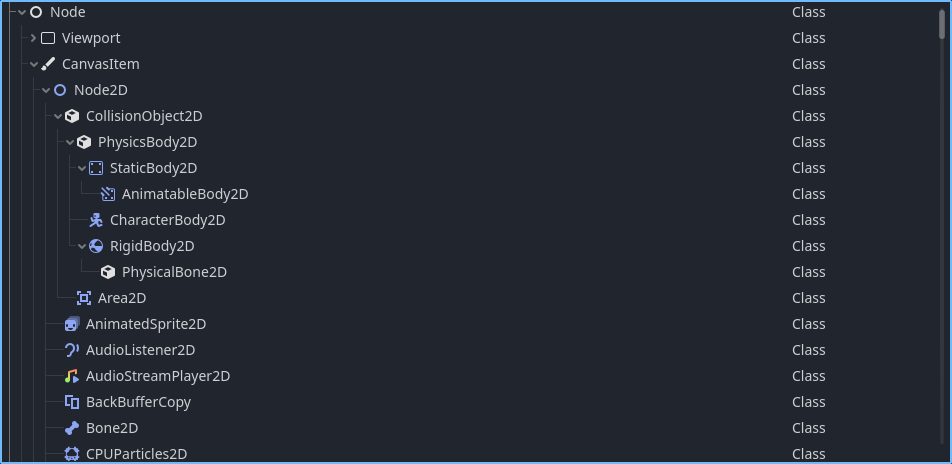
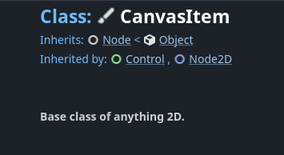
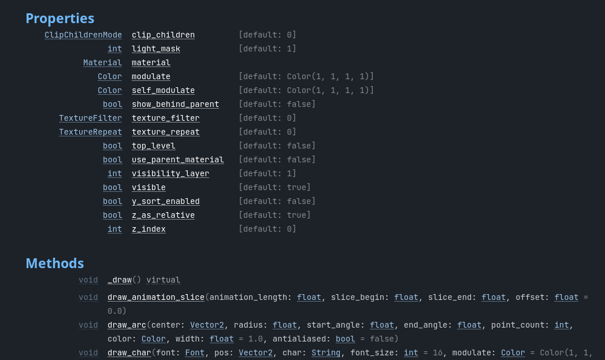
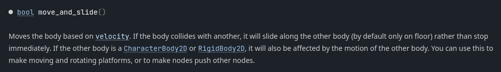

.. _doc_reading_the_class_reference:

Reading the Class Reference
===========================

Godot has over 200 unique Nodes at your disposal, and over 500 different types
in total. As any tool of that size should, Godot offers a Class Reference to
gather various important pieces of info about each class all in once place.

Class Reference
---------------

The Godot Class Reference can be viewed online :ref:`here <doc_class_reference>`
as well as directly within the editor. From the Script window, click "Search
Help" (or press :kbd:`F1`) to open it.

From there, you can select any Node (or other type) in the engine to learn
more about it.

Class Reference Page
--------------------

Each class's page includes the following information (a single given page
may not have all of these):

- Inherited class.
- Inheriting class(es).
- Description.
- Tutorials.
- Property List.
- Method List.
- Signals.
- Enumerations.
- Constants.
- Property/Method Details.

Inheritance
-----------

Godot make use of Object Oriented Programming (OOP), which allows one class to
inherit the attributes of another. In this specific case, it can be seen that
:ref:`CanvasItem <class_CanvasItem>` inherits :ref:`Node <class_Node>`, which in
turn inherits :ref:`Object <class_Object>`, and also is inherited by :ref:`Node2D
<class_Node2D>` and :ref:`Control <class_Control>`. In OOP terminology, a
CanvasItem "is a" Node, and a Node2D "is a" CanvasItem.

Description
-----------

This section describes what the class is, what it can be used for, as well as
some general tips and recommendations.

Tutorials
---------

Any specific tutorials that directly relate to this class may be linked here.

.. note:: General Tutorials are not viewable from within the editor.

Properties/Methods
------------------

A quick listing of all of the properties and methods defined for **this** class
comes next, with more detailed descriptions being lower down the page.

.. note:: Only those defined specifically for **this** class are listed here
   (this also applies to signals, enums, and constants). As Godot uses OOP,
   other classes can inherit these fields, and this class can inherit from
   others.

   For example, if you look at the Node2D page to try to see how to make it
   invisible, you won't find that there, because the ``visible`` property is
   defined as part of CanvasItem, which Node2D inherits.

The detailed description of any built-in method or property can also be jumped
to directly by :kbd:`Ctrl` + Clicking on it in the script editor.

:kbd:`Ctrl` + clicking here ...

Can take you straight here

.. note:: The engine needs to know exactly which class to link to for this
   to work. If it is unclear whether the above code referred to the
   :ref:`CharacterBody2D <class_CharacterBody2D>` ``move_and_slide()``,
   the :ref:`CharacterBody3D <class_CharacterBody3D>` ``move_and_slide()``,
   or perhaps even some other ``move_and_slide()`` you defined yourself, it
   won't be linked to any class page. Use of :ref:`static typing
   <doc_gdscript_static_typing>` can help alleviate any discrepancies.

Signals
-------

Signals defined for this class are also listed. See :ref:`here <doc_signals>`
for more about signals.

Enums/Constants
---------------

These are unchangeable values that are associated with the class.
