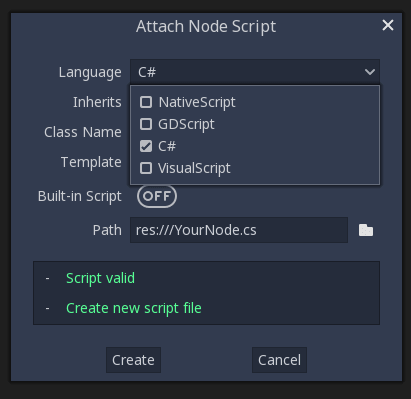

.. _doc_c_sharp:

Introduction
============

.. warning:: C# support is a new feature available since Godot 3.0.
             As such, you may still run into some issues, or find spots
             where the documentation could be improved.
             Please report issues with C# in Godot on the
             `engine GitHub page <https://github.com/godotengine/godot/issues>`_,
             and any documentation issues on the
             `documentation GitHub page <https://github.com/godotengine/godot-docs/issues>`_.

This page provides a brief introduction to C#, both what it is and
how to use it in Godot. Afterwards, you may want to look at
:ref:`how to use specific features <doc_c_sharp_features>`, read about the
:ref:`differences between the C# and the GDScript API <doc_c_sharp_differences>`
and (re)visit the :ref:`Scripting section <doc_scripting>` of the
step-by-step tutorial.

C# is a high-level programming language developed by Microsoft. In Godot,
it is implemented with the Mono 6.x .NET framework, including full support
for C# 8.0. Mono is an open source implementation of Microsoft's .NET Framework
based on the ECMA standards for C# and the Common Language Runtime.
A good starting point for checking its capabilities is the
`Compatibility <http://www.mono-project.com/docs/about-mono/compatibility/>`_
page in the Mono documentation.

.. note:: This is **not** a full-scale tutorial on the C# language as a whole.
        If you aren't already familiar with its syntax or features,
        see the
        `Microsoft C# guide <https://docs.microsoft.com/en-us/dotnet/csharp/index>`_
        or look for a suitable introduction elsewhere.

Setting up C# for Godot
-----------------------

Windows (Visual Studio)
~~~~~~~~~~~~~~~~~~~~~~~

Download and install the latest version of
`Visual Studio <https://visualstudio.microsoft.com/downloads/>`_
(*not* Visual Studio Code), which contains utilities required to use
C# in Godot. If you don't plan on using the Visual Studio IDE,
you can download just the
`Visual Studio Build Tools <https://visualstudio.microsoft.com/thank-you-downloading-visual-studio/?sku=BuildTools&rel=15>`_
instead.
Make sure you at least have the .NET Framework 4.5 targeting pack installed, you can get it using any of the installers mentioned above inside the "Individual components" tab.

Windows (JetBrains Rider)
~~~~~~~~~~~~~~~~~~~~~~~~~

JetBrains Rider comes with bundled MSBuild, so nothing extra is required.
Make sure to set the following preferences:

- In Godot:

   - Mono External Editor to JetBrains Rider
   - Mono Build Tool to JetBrains Mono.

- In Rider:

   - Set ``MSBuild version`` to either bundled with Rider or .NET Core.
   - Install **Godot support** plugin.

macOS and Linux
~~~~~~~~~~~~~~~

Download and install the latest version of the
`Mono SDK <http://www.mono-project.com/download/>`_. As of Godot 3.1 beta 3,
the version number doesn't matter since Godot bundles its own Mono 5.18
installation. We only need the Mono installation for NuGet and MSBuild
which are required to use C# in Godot.

.. note:: To download Mono on macOS, use the "Stable Channel" link
          from the `Mono Downloads Page <http://www.mono-project.com/download/>`_.
          The Visual Studio channel is an earlier version of Mono and
          will not work.

Additional notes
~~~~~~~~~~~~~~~~

Your Godot version must have Mono support enabled,
so make sure to download the **Mono version** of Godot.
If you are building Godot from source, make sure to follow the steps to
enable Mono support in your build as outlined in the
:ref:`doc_compiling_with_mono` page.

In summary, you must have installed Visual Studio or Mono (depending
on your operating system) **and** the Mono-enabled version of Godot.

Configuring an external editor
------------------------------

C# support in Godot's script editor is minimal. Consider using an
external IDE or editor, such as  `Visual Studio Code <https://code.visualstudio.com/>`_
or MonoDevelop. These provide autocompletion, debugging, and other
useful features for C#. To select an external editor in Godot,
click on **Editor → Editor Settings** and scroll down to
**Mono**. Under **Mono**, click on **Editor**, and select your
external editor of choice. Godot currently supports the following
external editors:

- Visual Studio 2019
- Visual Studio Code
- MonoDevelop
- Visual Studio for Mac
- JetBrains Rider

.. note:: If you are using Visual Studio Code, ensure you download and install
          the `C# extension <https://marketplace.visualstudio.com/items?itemName=ms-vscode.csharp>`_
          to enable features like syntax highlighting and IntelliSense.


.. note:: If you are using Visual Studio 2019, you must follow the instructions found in the "Configure VS2019 for Debugging" section below.


Creating a C# script
--------------------

After you successfully set up C# for Godot, you should see the following option
when selecting ``Attach script`` in the context menu of a node in your scene:



Note that while some specifics change, most concepts work the same
when using C# for scripting. If you're new to Godot, you may want to follow
the tutorials on :ref:`doc_scripting` at this point.
While some places in the documentation still lack C# examples, most concepts
can be transferred easily from GDScript.

Project setup and workflow
--------------------------

When you create the first C# script, Godot initializes the C# project files
for your Godot project. This includes generating a C# solution (``.sln``)
and a project file (``.csproj``), as well as some utility files and folders
(``.mono`` and ``Properties/AssemblyInfo.cs``).
All of these but ``.mono`` are important and should be committed to your
version control system. ``.mono`` can be safely added to the ignore list of your VCS.
When troubleshooting, it can sometimes help to delete the ``.mono`` folder
and let it regenerate.

Note that currently, there are some issues where Godot and the C# project
don't stay in sync; if you delete, rename or move a C# script, the change
may not be reflected in the C# project file.
In cases like this, you will have to edit the C# project file manually.

For example, if you created a script (e.g. ``Test.cs``) and delete it in Godot,
compilation will fail because the missing file is still expected to be there
by the C# project file. For now, you can simply open up the ``.csproj`` file
and look for the ``ItemGroup``, there should be a line included
like the following:

.. code-block:: xml
    :emphasize-lines: 2

    <ItemGroup>
        <Compile Include="Test.cs" />
        <Compile Include="AnotherTest.cs" />
    </ItemGroup>

Simply remove that line and your project should build correctly again.
Same for renaming and moving things, simply rename and move them
in the project file if needed.

Example
-------

Here's a blank C# script with some comments to demonstrate how it works.

.. code-block:: csharp

    using Godot;
    using System;

    public class YourCustomClass : Node
    {
        // Member variables here, example:
        private int a = 2;
        private string b = "textvar";

        public override void _Ready()
        {
            // Called every time the node is added to the scene.
            // Initialization here.
            GD.Print("Hello from C# to Godot :)");
        }

        public override void _Process(float delta)
        {
            // Called every frame. Delta is time since the last frame.
            // Update game logic here.
        }
    }

As you can see, functions normally in global scope in GDScript like Godot's
``print`` function are available in the ``GD`` class which is part of
the ``Godot`` namespace. For a list of methods in the ``GD`` class, see the
class reference pages for
:ref:`@GDScript <class_@gdscript>` and :ref:`@GlobalScope <class_@globalscope>`.

.. note::
    Keep in mind that the class you wish to attach to your node should have the same
    name as the ``.cs`` file. Otherwise, you will get the following error
    and won't be able to run the scene:
    *"Cannot find class XXX for script res://XXX.cs"*

General differences between C# and GDScript
-------------------------------------------

The C# API uses ``PascalCase`` instead of ``snake_case`` in GDScript/C++.
Where possible, fields and getters/setters have been converted to properties.
In general, the C# Godot API strives to be as idiomatic as is reasonably possible.

For more information, see the :ref:`doc_c_sharp_differences` page.

Current gotchas and known issues
--------------------------------

As C# support is quite new in Godot, there are some growing pains and things
that need to be ironed out. Below is a list of the most important issues
you should be aware of when diving into C# in Godot, but if in doubt, also
take a look over the official
`issue tracker for Mono issues <https://github.com/godotengine/godot/labels/topic%3Amono>`_.

- As explained above, the C# project isn't always kept in sync automatically
  when things are deleted, renamed or moved in Godot
  (`#12917 <https://github.com/godotengine/godot/issues/12917>`_).
- Writing editor plugins is possible, but it is currently quite convoluted.
- State is currently not saved and restored when hot-reloading,
  with the exception of exported variables.
- Exporting Mono projects is supported for desktop platforms
  (Linux, Windows and macOS), Android, HTML5, and iOS. UWP is not currently supported.
  (`#20271 <https://github.com/godotengine/godot/issues/20271>`_).
- Attached C# scripts should refer to a class that has a class name
  that matches the file name.
- There are some methods such as ``Get()``/``Set()``, ``Call()``/``CallDeferred()``
  and signal connection method ``Connect()`` that rely on Godot's ``snake_case`` API
  naming conventions.
  So when using e.g. ``CallDeferred("AddChild")``, ``AddChild`` will not work because
  the API is expecting the original ``snake_case`` version ``add_child``. However, you
  can use any custom properties or methods without this limitation.

Performance of C# in Godot
--------------------------

According to some preliminary `benchmarks <https://github.com/cart/godot3-bunnymark>`_,
the performance of C# in Godot — while generally in the same order of magnitude
— is roughly **~4×** that of GDScript in some naive cases. C++ is still
a little faster; the specifics are going to vary according to your use case.
GDScript is likely fast enough for most general scripting workloads.
C# is faster, but requires some expensive marshalling when talking to Godot.

Using NuGet packages in Godot
-----------------------------

`NuGet <https://www.nuget.org/>`_ packages can be installed and used with Godot,
as with any C# project. Many IDEs are able to add packages directly.
They can also be added manually by adding the package reference in
the ``.csproj`` file located in the project root:

.. code-block:: xml
    :emphasize-lines: 2

        <ItemGroup>
            <PackageReference Include="Newtonsoft.Json">
              <Version>11.0.2</Version>
            </PackageReference>
        </ItemGroup>
        ...
    </Project>

.. note::
    By default, tools like NuGet put ``Version`` as an attribute of the ```PackageReference``` Node. **You must manually create a Version node as shown above.**  This is because the version of MSBuild used requires this. (This will be fixed in Godot 4.0.)

Whenever packages are added or modified, run ``nuget restore`` (*not* ``dotnet restore``) in the root of the
project directory. To ensure that NuGet packages will be available for
msbuild to use, run:

.. code-block:: none

    msbuild /t:restore

Profiling your C# code
----------------------

- `Mono log profiler <https://www.mono-project.com/docs/debug+profile/profile/profiler/>`_ is available for Linux and macOS. Due to a Mono change, it does not work on Windows currently.
- External Mono profiler like `JetBrains dotTrace <https://www.jetbrains.com/profiler/>`_ can be used as described `here <https://github.com/godotengine/godot/pull/34382>`_.

Configuring VS 2019 for debugging
---------------------------------

.. note::

    Godot has built-in support for workflows involving several popular C# IDEs.
    Built-in support for Visual Studio will be including in future versions,
    but in the meantime, the steps below can let you configure VS 2019 for use
    with Godot C# projects.

1. Install VS 2019 with ``.NET desktop development`` and ``Desktop development with C++`` workloads selected.
2. **Ensure that you do not have Xamarin installed.** Do not choose the ``Mobile development with .NET`` workload. Xamarin changes the DLLs used by MonoDebugger, which breaks debugging.
3. Install the `VSMonoDebugger extension <https://marketplace.visualstudio.com/items?itemName=GordianDotNet.VSMonoDebugger0d62>`_.
4. In VS 2019 --> Extensions --> Mono --> Settings:

   - Select ``Debug/Deploy to local Windows``.
   - Leave ``Local Deploy Path`` blank.
   - Set the ``Mono Debug Port`` to the port in Godot --> Project --> Project Settings --> Mono --> Debugger Agent.
   - Also select ``Wait for Debugger`` in the Godot Mono options. `This Godot Addon <https://godotengine.org/asset-library/asset/435>`_ may be helpful.

5. Run the game in Godot. It should hang at the Godot splash screen while it waits for your debugger to attach.
6. In VS 2019, open your project and choose Extensions --> Mono --> Attach to Mono Debugger.

Configuring Visual Studio Code for debugging
--------------------------------------------

To configure Visual Studio Code for debugging open up a project in Godot. Click on Project
and open the project settings. Scroll down and click on Debugger Agent under the Mono
category. Then turn on the setting "wait for debugger." Next, copy the port number
and open up Visual Studio Code.

You need to download the Mono Debug extension from Microsoft. Then open the Godot
project folder. Go to the run tab and click on create a launch.json file. Select C#
Mono from the dropdown menu. When the launch.json file is automatically opened,
change the port number to the number you copied previously and save the file. On the
run tab, switch the run setting from launch to attach. Whenever you want to debug,
make sure Wait for Debugger is turned on in Godot, run the project, and run the
debugger in Visual Studio Code.
