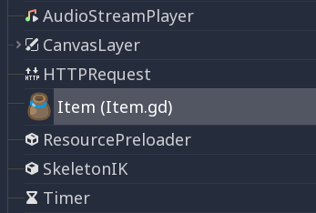
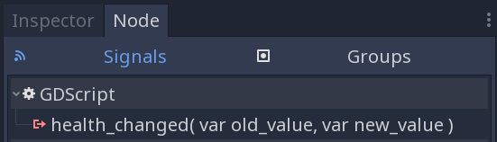

.. _doc_gdscript:

GDScript basics
===============

Introduction
------------

*GDScript* is a high-level, dynamically typed programming language used to
create content. It uses a syntax similar to
`Python <https://en.wikipedia.org/wiki/Python_%28programming_language%29>`_
(blocks are indent-based and many keywords are similar). Its goal is
to be optimized for and tightly integrated with Godot Engine, allowing great
flexibility for content creation and integration.

History
~~~~~~~

.. note::

    Documentation about GDScript's history has been moved to the
    :ref:`Frequently Asked Questions <doc_faq_what_is_gdscript>`.

Example of GDScript
~~~~~~~~~~~~~~~~~~~

Some people can learn better by taking a look at the syntax, so
here's a simple example of how GDScript looks.

::

    # A file is a class!

    # Inheritance

    extends BaseClass

    # (optional) class definition with a custom icon

    class_name MyClass, "res://path/to/optional/icon.svg"

    # Member variables

    var a = 5
    var s = "Hello"
    var arr = [1, 2, 3]
    var dict = {"key": "value", 2: 3}
    var typed_var: int
    var inferred_type := "String"

    # Constants

    const ANSWER = 42
    const THE_NAME = "Charly"

    # Enums

    enum {UNIT_NEUTRAL, UNIT_ENEMY, UNIT_ALLY}
    enum Named {THING_1, THING_2, ANOTHER_THING = -1}

    # Built-in vector types

    var v2 = Vector2(1, 2)
    var v3 = Vector3(1, 2, 3)

    # Function

    func some_function(param1, param2):
        var local_var = 5

        if param1 < local_var:
            print(param1)
        elif param2 > 5:
            print(param2)
        else:
            print("Fail!")

        for i in range(20):
            print(i)

        while param2 != 0:
            param2 -= 1

        var local_var2 = param1 + 3
        return local_var2

    # Functions override functions with the same name on the base/parent class.
    # If you still want to call them, use '.' (like 'super' in other languages).

    func something(p1, p2):
        .something(p1, p2)

    # Inner class

    class Something:
        var a = 10

    # Constructor

    func _init():
        print("Constructed!")
        var lv = Something.new()
        print(lv.a)

If you have previous experience with statically typed languages such as
C, C++, or C# but never used a dynamically typed one before, it is advised you
read this tutorial: :ref:`doc_gdscript_more_efficiently`.

Language
--------

In the following, an overview is given to GDScript. Details, such as which
methods are available to arrays or other objects, should be looked up in
the linked class descriptions.

Identifiers
~~~~~~~~~~~

Any string that restricts itself to alphabetic characters (``a`` to
``z`` and ``A`` to ``Z``), digits (``0`` to ``9``) and ``_`` qualifies
as an identifier. Additionally, identifiers must not begin with a digit.
Identifiers are case-sensitive (``foo`` is different from ``FOO``).

Keywords
~~~~~~~~

The following is the list of keywords supported by the language. Since
keywords are reserved words (tokens), they can't be used as identifiers.
Operators (like ``in``, ``not``, ``and`` or ``or``) and names of built-in types
as listed in the following sections are also reserved.

Keywords are defined in the `GDScript tokenizer <https://github.com/godotengine/godot/blob/master/modules/gdscript/gdscript_tokenizer.cpp>`_
in case you want to take a look under the hood.

+------------+---------------------------------------------------------------------------------------------------------------+
|  Keyword   | Description                                                                                                   |
+============+===============================================================================================================+
| if         | See `if/else/elif`_.                                                                                          |
+------------+---------------------------------------------------------------------------------------------------------------+
| elif       | See `if/else/elif`_.                                                                                          |
+------------+---------------------------------------------------------------------------------------------------------------+
| else       | See `if/else/elif`_.                                                                                          |
+------------+---------------------------------------------------------------------------------------------------------------+
| for        | See for_.                                                                                                     |
+------------+---------------------------------------------------------------------------------------------------------------+
| while      | See while_.                                                                                                   |
+------------+---------------------------------------------------------------------------------------------------------------+
| match      | See match_.                                                                                                   |
+------------+---------------------------------------------------------------------------------------------------------------+
| break      | Exits the execution of the current ``for`` or ``while`` loop.                                                 |
+------------+---------------------------------------------------------------------------------------------------------------+
| continue   | Immediately skips to the next iteration of the ``for`` or ``while`` loop.                                     |
+------------+---------------------------------------------------------------------------------------------------------------+
| pass       | Used where a statement is required syntactically but execution of code is undesired, e.g. in empty functions. |
+------------+---------------------------------------------------------------------------------------------------------------+
| return     | Returns a value from a function.                                                                              |
+------------+---------------------------------------------------------------------------------------------------------------+
| class      | Defines a class.                                                                                              |
+------------+---------------------------------------------------------------------------------------------------------------+
| extends    | Defines what class to extend with the current class.                                                          |
+------------+---------------------------------------------------------------------------------------------------------------+
| is         | Tests whether a variable extends a given class, or is of a given built-in type.                               |
+------------+---------------------------------------------------------------------------------------------------------------+
| as         | Cast the value to a given type if possible.                                                                   |
+------------+---------------------------------------------------------------------------------------------------------------+
| self       | Refers to current class instance.                                                                             |
+------------+---------------------------------------------------------------------------------------------------------------+
| tool       | Executes the script in the editor.                                                                            |
+------------+---------------------------------------------------------------------------------------------------------------+
| signal     | Defines a signal.                                                                                             |
+------------+---------------------------------------------------------------------------------------------------------------+
| func       | Defines a function.                                                                                           |
+------------+---------------------------------------------------------------------------------------------------------------+
| static     | Defines a static function. Static member variables are not allowed.                                           |
+------------+---------------------------------------------------------------------------------------------------------------+
| const      | Defines a constant.                                                                                           |
+------------+---------------------------------------------------------------------------------------------------------------+
| enum       | Defines an enum.                                                                                              |
+------------+---------------------------------------------------------------------------------------------------------------+
| var        | Defines a variable.                                                                                           |
+------------+---------------------------------------------------------------------------------------------------------------+
| onready    | Initializes a variable once the Node the script is attached to and its children are part of the scene tree.   |
+------------+---------------------------------------------------------------------------------------------------------------+
| export     | Saves a variable along with the resource it's attached to and makes it visible and modifiable in the editor.  |
+------------+---------------------------------------------------------------------------------------------------------------+
| setget     | Defines setter and getter functions for a variable.                                                           |
+------------+---------------------------------------------------------------------------------------------------------------+
| breakpoint | Editor helper for debugger breakpoints.                                                                       |
+------------+---------------------------------------------------------------------------------------------------------------+
| preload    | Preloads a class or variable. See `Classes as resources`_.                                                    |
+------------+---------------------------------------------------------------------------------------------------------------+
| yield      | Coroutine support. See `Coroutines with yield`_.                                                              |
+------------+---------------------------------------------------------------------------------------------------------------+
| assert     | Asserts a condition, logs error on failure. Ignored in non-debug builds. See `Assert keyword`_.               |
+------------+---------------------------------------------------------------------------------------------------------------+
| remote     | Networking RPC annotation. See :ref:`high-level multiplayer docs <doc_high_level_multiplayer>`.               |
+------------+---------------------------------------------------------------------------------------------------------------+
| master     | Networking RPC annotation. See :ref:`high-level multiplayer docs <doc_high_level_multiplayer>`.               |
+------------+---------------------------------------------------------------------------------------------------------------+
| puppet     | Networking RPC annotation. See :ref:`high-level multiplayer docs <doc_high_level_multiplayer>`.               |
+------------+---------------------------------------------------------------------------------------------------------------+
| remotesync | Networking RPC annotation. See :ref:`high-level multiplayer docs <doc_high_level_multiplayer>`.               |
+------------+---------------------------------------------------------------------------------------------------------------+
| mastersync | Networking RPC annotation. See :ref:`high-level multiplayer docs <doc_high_level_multiplayer>`.               |
+------------+---------------------------------------------------------------------------------------------------------------+
| puppetsync | Networking RPC annotation. See :ref:`high-level multiplayer docs <doc_high_level_multiplayer>`.               |
+------------+---------------------------------------------------------------------------------------------------------------+
| PI         | PI constant.                                                                                                  |
+------------+---------------------------------------------------------------------------------------------------------------+
| TAU        | TAU constant.                                                                                                 |
+------------+---------------------------------------------------------------------------------------------------------------+
| INF        | Infinity constant. Used for comparisons.                                                                      |
+------------+---------------------------------------------------------------------------------------------------------------+
| NAN        | NAN (not a number) constant. Used for comparisons.                                                            |
+------------+---------------------------------------------------------------------------------------------------------------+

Operators
~~~~~~~~~

The following is the list of supported operators and their precedence.

+---------------------------------------------------------------+-----------------------------------------+
| **Operator**                                                  | **Description**                         |
+---------------------------------------------------------------+-----------------------------------------+
| ``x[index]``                                                  | Subscription (highest priority)         |
+---------------------------------------------------------------+-----------------------------------------+
| ``x.attribute``                                               | Attribute reference                     |
+---------------------------------------------------------------+-----------------------------------------+
| ``foo()``                                                     | Function call                           |
+---------------------------------------------------------------+-----------------------------------------+
| ``is``                                                        | Instance type checker                   |
+---------------------------------------------------------------+-----------------------------------------+
| ``~``                                                         | Bitwise NOT                             |
+---------------------------------------------------------------+-----------------------------------------+
| ``-x``                                                        | Negative / Unary negation               |
+---------------------------------------------------------------+-----------------------------------------+
| ``*`` ``/`` ``%``                                             | Multiplication / Division / Remainder   |
|                                                               |                                         |
|                                                               | These operators have the same behavior  |
|                                                               | as C++. Integer division is truncated   |
|                                                               | rather than returning a fractional      |
|                                                               | number, and the % operator is only      |
|                                                               | available for ints ("fmod" for floats)  |
+---------------------------------------------------------------+-----------------------------------------+
| ``+``                                                         | Addition / Concatenation of arrays      |
+---------------------------------------------------------------+-----------------------------------------+
| ``-``                                                         | Subtraction                             |
+---------------------------------------------------------------+-----------------------------------------+
| ``<<`` ``>>``                                                 | Bit shifting                            |
+---------------------------------------------------------------+-----------------------------------------+
| ``&``                                                         | Bitwise AND                             |
+---------------------------------------------------------------+-----------------------------------------+
| ``^``                                                         | Bitwise XOR                             |
+---------------------------------------------------------------+-----------------------------------------+
| ``|``                                                         | Bitwise OR                              |
+---------------------------------------------------------------+-----------------------------------------+
| ``<`` ``>`` ``==`` ``!=`` ``>=`` ``<=``                       | Comparisons                             |
+---------------------------------------------------------------+-----------------------------------------+
| ``in``                                                        | Content test                            |
+---------------------------------------------------------------+-----------------------------------------+
| ``!`` ``not``                                                 | Boolean NOT                             |
+---------------------------------------------------------------+-----------------------------------------+
| ``and`` ``&&``                                                | Boolean AND                             |
+---------------------------------------------------------------+-----------------------------------------+
| ``or`` ``||``                                                 | Boolean OR                              |
+---------------------------------------------------------------+-----------------------------------------+
| ``if x else``                                                 | Ternary if/else                         |
+---------------------------------------------------------------+-----------------------------------------+
| ``as``                                                        | Type casting                            |
+---------------------------------------------------------------+-----------------------------------------+
| ``=`` ``+=`` ``-=`` ``*=`` ``/=`` ``%=`` ``&=`` ``|=``        | Assignment (lowest priority)            |
+---------------------------------------------------------------+-----------------------------------------+

Literals
~~~~~~~~

+--------------------------+----------------------------------------+
| **Literal**              | **Type**                               |
+--------------------------+----------------------------------------+
| ``45``                   | Base 10 integer                        |
+--------------------------+----------------------------------------+
| ``0x8F51``               | Base 16 (hexadecimal) integer          |
+--------------------------+----------------------------------------+
| ``0b101010``             | Base 2 (binary) integer                |
+--------------------------+----------------------------------------+
| ``3.14``, ``58.1e-10``   | Floating-point number (real)           |
+--------------------------+----------------------------------------+
| ``"Hello"``, ``"Hi"``    | Strings                                |
+--------------------------+----------------------------------------+
| ``"""Hello"""``          | Multiline string                       |
+--------------------------+----------------------------------------+
| ``@"Node/Label"``        | :ref:`class_NodePath` or StringName    |
+--------------------------+----------------------------------------+
| ``$NodePath``            | Shorthand for ``get_node("NodePath")`` |
+--------------------------+----------------------------------------+

Comments
~~~~~~~~

Anything from a ``#`` to the end of the line is ignored and is
considered a comment.

::

    # This is a comment.

.. _doc_gdscript_builtin_types:

Built-in types
--------------

Built-in types are stack-allocated. They are passed as values. This means a copy
is created on each assignment or when passing them as arguments to functions.
The only exceptions are ``Array``\ s and ``Dictionaries``, which are passed by
reference so they are shared. (Pooled arrays such as ``PoolByteArray`` are still
passed as values.)

Basic built-in types
~~~~~~~~~~~~~~~~~~~~

A variable in GDScript can be assigned to several built-in types.

null
^^^^

``null`` is an empty data type that contains no information and can not
be assigned any other value.

:ref:`bool <class_bool>`
^^^^^^^^^^^^^^^^^^^^^^^^

Short for "boolean", it can only contain ``true`` or ``false``.

:ref:`int <class_int>`
^^^^^^^^^^^^^^^^^^^^^^

Short for "integer", it stores whole numbers (positive and negative).
It is stored as a 64-bit value, equivalent to "int64_t" in C++.

:ref:`float <class_float>`
^^^^^^^^^^^^^^^^^^^^^^^^^^

Stores real numbers, including decimals, using floating-point values.
It is stored as a 64-bit value, equivalent to "double" in C++.
Note: Currently, data structures such as Vector2, Vector3, and
PoolRealArray store 32-bit single-precision "float" values.

:ref:`String <class_String>`
^^^^^^^^^^^^^^^^^^^^^^^^^^^^

A sequence of characters in `Unicode format <https://en.wikipedia.org/wiki/Unicode>`_.
Strings can contain
`standard C escape sequences <https://en.wikipedia.org/wiki/Escape_sequences_in_C>`_.
GDScript also supports :ref:`doc_gdscript_printf`.

Vector built-in types
~~~~~~~~~~~~~~~~~~~~~

:ref:`Vector2 <class_Vector2>`
^^^^^^^^^^^^^^^^^^^^^^^^^^^^^^

2D vector type containing ``x`` and ``y`` fields. Can also be
accessed as an array.

:ref:`Rect2 <class_Rect2>`
^^^^^^^^^^^^^^^^^^^^^^^^^^

2D Rectangle type containing two vectors fields: ``position`` and ``size``.
Also contains an ``end`` field which is ``position + size``.

:ref:`Vector3 <class_Vector3>`
^^^^^^^^^^^^^^^^^^^^^^^^^^^^^^

3D vector type containing ``x``, ``y`` and ``z`` fields. This can also
be accessed as an array.

:ref:`Transform2D <class_Transform2D>`
^^^^^^^^^^^^^^^^^^^^^^^^^^^^^^^^^^^^^^

3×2 matrix used for 2D transforms.

:ref:`Plane <class_Plane>`
^^^^^^^^^^^^^^^^^^^^^^^^^^

3D Plane type in normalized form that contains a ``normal`` vector field
and a ``d`` scalar distance.

:ref:`Quat <class_Quat>`
^^^^^^^^^^^^^^^^^^^^^^^^

Quaternion is a datatype used for representing a 3D rotation. It's
useful for interpolating rotations.

:ref:`AABB <class_AABB>`
^^^^^^^^^^^^^^^^^^^^^^^^

Axis-aligned bounding box (or 3D box) contains 2 vectors fields: ``position``
and ``size``. Also contains an ``end`` field which is
``position + size``.

:ref:`Basis <class_Basis>`
^^^^^^^^^^^^^^^^^^^^^^^^^^

3x3 matrix used for 3D rotation and scale. It contains 3 vector fields
(``x``, ``y`` and ``z``) and can also be accessed as an array of 3D
vectors.

:ref:`Transform <class_Transform>`
^^^^^^^^^^^^^^^^^^^^^^^^^^^^^^^^^^

3D Transform contains a Basis field ``basis`` and a Vector3 field
``origin``.

Engine built-in types
~~~~~~~~~~~~~~~~~~~~~

:ref:`Color <class_Color>`
^^^^^^^^^^^^^^^^^^^^^^^^^^

Color data type contains ``r``, ``g``, ``b``, and ``a`` fields. It can
also be accessed as ``h``, ``s``, and ``v`` for hue/saturation/value.

:ref:`NodePath <class_NodePath>`
^^^^^^^^^^^^^^^^^^^^^^^^^^^^^^^^

Compiled path to a node used mainly in the scene system. It can be
easily assigned to, and from, a String.

:ref:`RID <class_RID>`
^^^^^^^^^^^^^^^^^^^^^^

Resource ID (RID). Servers use generic RIDs to reference opaque data.

:ref:`Object <class_Object>`
^^^^^^^^^^^^^^^^^^^^^^^^^^^^

Base class for anything that is not a built-in type.

Container built-in types
~~~~~~~~~~~~~~~~~~~~~~~~

:ref:`Array <class_Array>`
^^^^^^^^^^^^^^^^^^^^^^^^^^

Generic sequence of arbitrary object types, including other arrays or dictionaries (see below).
The array can resize dynamically. Arrays are indexed starting from index ``0``.
Negative indices count from the end.

::

    var arr = []
    arr = [1, 2, 3]
    var b = arr[1] # This is 2.
    var c = arr[arr.size() - 1] # This is 3.
    var d = arr[-1] # Same as the previous line, but shorter.
    arr[0] = "Hi!" # Replacing value 1 with "Hi!".
    arr.append(4) # Array is now ["Hi!", 2, 3, 4].

GDScript arrays are allocated linearly in memory for speed.
Large arrays (more than tens of thousands of elements) may however cause
memory fragmentation. If this is a concern, special types of
arrays are available. These only accept a single data type. They avoid memory
fragmentation and use less memory, but are atomic and tend to run slower than generic
arrays. They are therefore only recommended to use for large data sets:

- :ref:`PoolByteArray <class_PoolByteArray>`: An array of bytes (integers from 0 to 255).
- :ref:`PoolIntArray <class_PoolIntArray>`: An array of integers.
- :ref:`PoolRealArray <class_PoolRealArray>`: An array of floats.
- :ref:`PoolStringArray <class_PoolStringArray>`: An array of strings.
- :ref:`PoolVector2Array <class_PoolVector2Array>`: An array of :ref:`Vector2 <class_Vector2>` objects.
- :ref:`PoolVector3Array <class_PoolVector3Array>`: An array of :ref:`Vector3 <class_Vector3>` objects.
- :ref:`PoolColorArray <class_PoolColorArray>`: An array of :ref:`Color <class_Color>` objects.

:ref:`Dictionary <class_Dictionary>`
^^^^^^^^^^^^^^^^^^^^^^^^^^^^^^^^^^^^

Associative container which contains values referenced by unique keys.

::

    var d = {4: 5, "A key": "A value", 28: [1, 2, 3]}
    d["Hi!"] = 0
    d = {
        22: "value",
        "some_key": 2,
        "other_key": [2, 3, 4],
        "more_key": "Hello"
    }

Lua-style table syntax is also supported. Lua-style uses ``=`` instead of ``:``
and doesn't use quotes to mark string keys (making for slightly less to write).
However, keys written in this form can't start with a digit (like any GDScript
identifier).

::

    var d = {
        test22 = "value",
        some_key = 2,
        other_key = [2, 3, 4],
        more_key = "Hello"
    }

To add a key to an existing dictionary, access it like an existing key and
assign to it::

    var d = {} # Create an empty Dictionary.
    d.waiting = 14 # Add String "waiting" as a key and assign the value 14 to it.
    d[4] = "hello" # Add integer 4 as a key and assign the String "hello" as its value.
    d["Godot"] = 3.01 # Add String "Godot" as a key and assign the value 3.01 to it.

    var test = 4
    # Prints "hello" by indexing the dictionary with a dynamic key.
    # This is not the same as `d.test`. The bracket syntax equivalent to
    # `d.test` is `d["test"]`.
    print(d[test])

.. note::

    The bracket syntax can be used to access properties of any
    :ref:`class_Object`, not just Dictionaries. Keep in mind it will cause a
    script error when attempting to index a non-existing property. To avoid
    this, use the :ref:`Object.get() <class_Object_method_get>` and
    :ref:`Object.set() <class_Object_method_set>` methods instead.

Data
----

Variables
~~~~~~~~~

Variables can exist as class members or local to functions. They are
created with the ``var`` keyword and may, optionally, be assigned a
value upon initialization.

::

    var a # Data type is 'null' by default.
    var b = 5
    var c = 3.8
    var d = b + c # Variables are always initialized in order.

Variables can optionally have a type specification. When a type is specified,
the variable will be forced to have always that same type, and trying to assign
an incompatible value will raise an error.

Types are specified in the variable declaration using a ``:`` (colon) symbol
after the variable name, followed by the type.

::

    var my_vector2: Vector2
    var my_node: Node = Sprite.new()

If the variable is initialized within the declaration, the type can be inferred, so
it's possible to omit the type name::

    var my_vector2 := Vector2() # 'my_vector2' is of type 'Vector2'.
    var my_node := Sprite.new() # 'my_node' is of type 'Sprite'.

Type inference is only possible if the assigned value has a defined type, otherwise
it will raise an error.

Valid types are:

- Built-in types (Array, Vector2, int, String, etc.).
- Engine classes (Node, Resource, Reference, etc.).
- Constant names if they contain a script resource (``MyScript`` if you declared ``const MyScript = preload("res://my_script.gd")``).
- Other classes in the same script, respecting scope (``InnerClass.NestedClass`` if you declared ``class NestedClass`` inside the ``class InnerClass`` in the same scope).
- Script classes declared with the ``class_name`` keyword.

Casting
^^^^^^^

Values assigned to typed variables must have a compatible type. If it's needed to
coerce a value to be of a certain type, in particular for object types, you can
use the casting operator ``as``.

Casting between object types results in the same object if the value is of the
same type or a subtype of the cast type.

::

    var my_node2D: Node2D
    my_node2D = $Sprite as Node2D # Works since Sprite is a subtype of Node2D.

If the value is not a subtype, the casting operation will result in a ``null`` value.

::

    var my_node2D: Node2D
    my_node2D = $Button as Node2D # Results in 'null' since a Button is not a subtype of Node2D.

For built-in types, they will be forcibly converted if possible, otherwise the
engine will raise an error.

::

    var my_int: int
    my_int = "123" as int # The string can be converted to int.
    my_int = Vector2() as int # A Vector2 can't be converted to int, this will cause an error.

Casting is also useful to have better type-safe variables when interacting with
the scene tree::

    # Will infer the variable to be of type Sprite.
    var my_sprite := $Character as Sprite

    # Will fail if $AnimPlayer is not an AnimationPlayer, even if it has the method 'play()'.
    ($AnimPlayer as AnimationPlayer).play("walk")

Constants
~~~~~~~~~

Constants are similar to variables, but must be constants or constant
expressions and must be assigned on initialization.

::

    const A = 5
    const B = Vector2(20, 20)
    const C = 10 + 20 # Constant expression.
    const D = Vector2(20, 30).x # Constant expression: 20.
    const E = [1, 2, 3, 4][0] # Constant expression: 1.
    const F = sin(20) # 'sin()' can be used in constant expressions.
    const G = x + 20 # Invalid; this is not a constant expression!
    const H = A + 20 # Constant expression: 25.

Although the type of constants is inferred from the assigned value, it's also
possible to add explicit type specification::

    const A: int = 5
    const B: Vector2 = Vector2()

Assigning a value of an incompatible type will raise an error.

Enums
^^^^^

Enums are basically a shorthand for constants, and are pretty useful if you
want to assign consecutive integers to some constant.

If you pass a name to the enum, it will put all the keys inside a constant
dictionary of that name.

.. important:: In Godot 3.1 and later, keys in a named enum are not registered
               as global constants. They should be accessed prefixed by the
               enum's name (``Name.KEY``); see an example below.

::

    enum {TILE_BRICK, TILE_FLOOR, TILE_SPIKE, TILE_TELEPORT}
    # Is the same as:
    const TILE_BRICK = 0
    const TILE_FLOOR = 1
    const TILE_SPIKE = 2
    const TILE_TELEPORT = 3

    enum State {STATE_IDLE, STATE_JUMP = 5, STATE_SHOOT}
    # Is the same as:
    const State = {STATE_IDLE = 0, STATE_JUMP = 5, STATE_SHOOT = 6}
    # Access values with State.STATE_IDLE, etc.

Functions
~~~~~~~~~

Functions always belong to a `class <Classes_>`_. The scope priority for
variable look-up is: local → class member → global. The ``self`` variable is
always available and is provided as an option for accessing class members, but
is not always required (and should *not* be sent as the function's first
argument, unlike Python).

::

    func my_function(a, b):
        print(a)
        print(b)
        return a + b  # Return is optional; without it 'null' is returned.

A function can ``return`` at any point. The default return value is ``null``.

Functions can also have type specification for the arguments and for the return
value. Types for arguments can be added in a similar way to variables::

    func my_function(a: int, b: String):
        pass

If a function argument has a default value, it's possible to infer the type::

    func my_function(int_arg := 42, String_arg := "string"):
        pass

The return type of the function can be specified after the arguments list using
the arrow token (``->``)::

    func my_int_function() -> int:
        return 0

Functions that have a return type **must** return a proper value. Setting the
type as ``void`` means the function doesn't return anything. Void functions can
return early with the ``return`` keyword, but they can't return any value.

::

    void_function() -> void:
        return # Can't return a value

.. note:: Non-void functions must **always** return a value, so if your code has
          branching statements (such as an ``if``/``else`` construct), all the
          possible paths must have a return. E.g., if you have a ``return``
          inside an ``if`` block but not after it, the editor will raise an
          error because if the block is not executed, the function won't have a
          valid value to return.

Referencing functions
^^^^^^^^^^^^^^^^^^^^^

Contrary to Python, functions are *not* first-class objects in GDScript. This
means they cannot be stored in variables, passed as an argument to another
function or be returned from other functions. This is for performance reasons.

To reference a function by name at run-time, (e.g. to store it in a variable, or
pass it to another function as an argument) one must use the ``call`` or
``funcref`` helpers::

    # Call a function by name in one step.
    my_node.call("my_function", args)

    # Store a function reference.
    var my_func = funcref(my_node, "my_function")
    # Call stored function reference.
    my_func.call_func(args)

Static functions
^^^^^^^^^^^^^^^^

A function can be declared static. When a function is static, it has no
access to the instance member variables or ``self``. This is mainly
useful to make libraries of helper functions::

    static func sum2(a, b):
        return a + b

Statements and control flow
~~~~~~~~~~~~~~~~~~~~~~~~~~~

Statements are standard and can be assignments, function calls, control
flow structures, etc (see below). ``;`` as a statement separator is
entirely optional.

if/else/elif
^^^^^^^^^^^^

Simple conditions are created by using the ``if``/``else``/``elif`` syntax.
Parenthesis around conditions are allowed, but not required. Given the
nature of the tab-based indentation, ``elif`` can be used instead of
``else``/``if`` to maintain a level of indentation.

::

    if [expression]:
        statement(s)
    elif [expression]:
        statement(s)
    else:
        statement(s)

Short statements can be written on the same line as the condition::

    if 1 + 1 == 2: return 2 + 2
    else:
        var x = 3 + 3
        return x

Sometimes, you might want to assign a different initial value based on a
boolean expression. In this case, ternary-if expressions come in handy::

    var x = [value] if [expression] else [value]
    y += 3 if y < 10 else -1

while
^^^^^

Simple loops are created by using ``while`` syntax. Loops can be broken
using ``break`` or continued using ``continue``:

::

    while [expression]:
        statement(s)

for
^^^

To iterate through a range, such as an array or table, a *for* loop is
used. When iterating over an array, the current array element is stored in
the loop variable. When iterating over a dictionary, the *index* is stored
in the loop variable.

::

    for x in [5, 7, 11]:
        statement # Loop iterates 3 times with 'x' as 5, then 7 and finally 11.

    var dict = {"a": 0, "b": 1, "c": 2}
    for i in dict:
        print(dict[i]) # Prints 0, then 1, then 2.

    for i in range(3):
        statement # Similar to [0, 1, 2] but does not allocate an array.

    for i in range(1, 3):
        statement # Similar to [1, 2] but does not allocate an array.

    for i in range(2, 8, 2):
        statement # Similar to [2, 4, 6] but does not allocate an array.

    for c in "Hello":
        print(c) # Iterate through all characters in a String, print every letter on new line.

    for i in 3:
        statement # Similar to range(3)

    for i in 2.2:
        statement # Similar to range(ceil(2.2))

match
^^^^^

A ``match`` statement is used to branch execution of a program.
It's the equivalent of the ``switch`` statement found in many other languages, but offers some additional features.

Basic syntax::

    match [expression]:
        [pattern](s):
            [block]
        [pattern](s):
            [block]
        [pattern](s):
            [block]

**Crash-course for people who are familiar with switch statements**:

1. Replace ``switch`` with ``match``.
2. Remove ``case``.
3. Remove any ``break``\ s. If you don't want to ``break`` by default, you can use ``continue`` for a fallthrough.
4. Change ``default`` to a single underscore.

**Control flow**:

The patterns are matched from top to bottom.
If a pattern matches, the first corresponding block will be executed. After that, the execution continues below the ``match`` statement.
If you want to have a fallthrough, you can use ``continue`` to stop execution in the current block and check for an additional match in the patterns below it.

There are 6 pattern types:

- Constant pattern
    Constant primitives, like numbers and strings::

        match x:
            1:
                print("We are number one!")
            2:
                print("Two are better than one!")
            "test":
                print("Oh snap! It's a string!")

- Variable pattern
    Matches the contents of a variable/enum::

        match typeof(x):
            TYPE_REAL:
                print("float")
            TYPE_STRING:
                print("text")
            TYPE_ARRAY:
                print("array")

- Wildcard pattern
    This pattern matches everything. It's written as a single underscore.

    It can be used as the equivalent of the ``default`` in a ``switch`` statement in other languages::

        match x:
            1:
                print("It's one!")
            2:
                print("It's one times two!")
            _:
                print("It's not 1 or 2. I don't care to be honest.")

- Binding pattern
    A binding pattern introduces a new variable. Like the wildcard pattern, it matches everything - and also gives that value a name.
    It's especially useful in array and dictionary patterns::

        match x:
            1:
                print("It's one!")
            2:
                print("It's one times two!")
            var new_var:
                print("It's not 1 or 2, it's ", new_var)

- Array pattern
    Matches an array. Every single element of the array pattern is a pattern itself, so you can nest them.

    The length of the array is tested first, it has to be the same size as the pattern, otherwise the pattern doesn't match.

    **Open-ended array**: An array can be bigger than the pattern by making the last subpattern ``..``.

    Every subpattern has to be comma-separated.

    ::

        match x:
            []:
                print("Empty array")
            [1, 3, "test", null]:
                print("Very specific array")
            [var start, _, "test"]:
                print("First element is ", start, ", and the last is \"test\"")
            [42, ..]:
                print("Open ended array")

- Dictionary pattern
    Works in the same way as the array pattern. Every key has to be a constant pattern.

    The size of the dictionary is tested first, it has to be the same size as the pattern, otherwise the pattern doesn't match.

    **Open-ended dictionary**: A dictionary can be bigger than the pattern by making the last subpattern ``..``.

    Every subpattern has to be comma separated.

    If you don't specify a value, then only the existence of the key is checked.

    A value pattern is separated from the key pattern with a ``:``.

    ::

        match x:
            {}:
                print("Empty dict")
            {"name": "Dennis"}:
                print("The name is Dennis")
            {"name": "Dennis", "age": var age}:
                print("Dennis is ", age, " years old.")
            {"name", "age"}:
                print("Has a name and an age, but it's not Dennis :(")
            {"key": "godotisawesome", ..}:
                print("I only checked for one entry and ignored the rest")

- Multiple patterns
    You can also specify multiple patterns separated by a comma. These patterns aren't allowed to have any bindings in them.

    ::

        match x:
            1, 2, 3:
                print("It's 1 - 3")
            "Sword", "Splash potion", "Fist":
                print("Yep, you've taken damage")

Classes
~~~~~~~

By default, all script files are unnamed classes. In this case, you can only
reference them using the file's path, using either a relative or an absolute
path. For example, if you name a script file ``character.gd``::

   # Inherit from 'Character.gd'.

   extends "res://path/to/character.gd"

   # Load character.gd and create a new node instance from it.

   var Character = load("res://path/to/character.gd")
   var character_node = Character.new()

Instead, you can give your class a name to register it as a new type in Godot's
editor. For that, you use the ``class_name`` keyword. You can add an
optional comma followed by a path to an image, to use it as an icon. Your class
will then appear with its new icon in the editor::

   # Item.gd

   extends Node
   class_name Item, "res://interface/icons/item.png"

Here's a class file example:

::

    # Saved as a file named 'character.gd'.

    class_name Character

    var health = 5

    func print_health():
        print(health)

    func print_this_script_three_times():
        print(get_script())
        print(ResourceLoader.load("res://character.gd"))
        print(Character)

.. note:: Godot's class syntax is compact: it can only contain member variables or
          functions. You can use static functions, but not static member variables. In the
          same way, the engine initializes variables every time you create an instance,
          and this includes arrays and dictionaries. This is in the spirit of thread
          safety, since scripts can be initialized in separate threads without the user
          knowing.

Inheritance
^^^^^^^^^^^

A class (stored as a file) can inherit from:

- A global class.
- Another class file.
- An inner class inside another class file.

Multiple inheritance is not allowed.

Inheritance uses the ``extends`` keyword::

    # Inherit/extend a globally available class.
    extends SomeClass

    # Inherit/extend a named class file.
    extends "somefile.gd"

    # Inherit/extend an inner class in another file.
    extends "somefile.gd".SomeInnerClass

To check if a given instance inherits from a given class,
the ``is`` keyword can be used::

    # Cache the enemy class.
    const Enemy = preload("enemy.gd")

    # [...]

    # Use 'is' to check inheritance.
    if entity is Enemy:
        entity.apply_damage()

To call a function in a *parent class* (i.e. one ``extend``-ed in your current
class), prepend ``.`` to the function name::

    .base_func(args)

This is especially useful because functions in extending classes replace
functions with the same name in their parent classes. If you still want to
call them, you can prefix them with ``.`` (like the ``super`` keyword
in other languages)::

    func some_func(x):
        .some_func(x) # Calls the same function on the parent class.

.. note:: Default functions like  ``_init``, and most notifications such as
          ``_enter_tree``, ``_exit_tree``, ``_process``, ``_physics_process``,
          etc. are called in all parent classes automatically.
          There is no need to call them explicitly when overloading them.

Class Constructor
^^^^^^^^^^^^^^^^^

The class constructor, called on class instantiation, is named ``_init``. As
mentioned earlier, the constructors of parent classes are called automatically
when inheriting a class. So, there is usually no need to call ``._init()``
explicitly.

Unlike the call of a regular function, like in the above example with
``.some_func``, if the constructor from the inherited class takes arguments,
they are passed like this::

    func _init(args).(parent_args):
       pass

This is better explained through examples. Consider this scenario::

    # State.gd (inherited class)
    var entity = null
    var message = null

    func _init(e=null):
        entity = e

    func enter(m):
        message = m

    # Idle.gd (inheriting class)
    extends "State.gd"

    func _init(e=null, m=null).(e):
        # Do something with 'e'.
        message = m

There are a few things to keep in mind here:

1. If the inherited class (``State.gd``) defines a ``_init`` constructor that takes
   arguments (``e`` in this case), then the inheriting class (``Idle.gd``) *must*
   define ``_init`` as well and pass appropriate parameters to ``_init`` from ``State.gd``.
2. ``Idle.gd`` can have a different number of arguments than the parent class ``State.gd``.
3. In the example above, ``e`` passed to the ``State.gd`` constructor is the same ``e`` passed
   in to ``Idle.gd``.
4. If ``Idle.gd``'s ``_init`` constructor takes 0 arguments, it still needs to pass some value
   to the ``State.gd`` parent class, even if it does nothing. This brings us to the fact that you
   can pass literals in the base constructor as well, not just variables. eg.::

    # Idle.gd

    func _init().(5):
        pass

Inner classes
^^^^^^^^^^^^^

A class file can contain inner classes. Inner classes are defined using the
``class`` keyword. They are instanced using the ``ClassName.new()``
function.

::

    # Inside a class file.

    # An inner class in this class file.
    class SomeInnerClass:
        var a = 5

        func print_value_of_a():
            print(a)

    # This is the constructor of the class file's main class.
    func _init():
        var c = SomeInnerClass.new()
        c.print_value_of_a()

.. _doc_gdscript_classes_as_resources:

Classes as resources
^^^^^^^^^^^^^^^^^^^^

Classes stored as files are treated as :ref:`resources <class_GDScript>`. They
must be loaded from disk to access them in other classes. This is done using
either the ``load`` or ``preload`` functions (see below). Instancing of a loaded
class resource is done by calling the ``new`` function on the class object::

    # Load the class resource when calling load().
    var my_class = load("myclass.gd")

    # Preload the class only once at compile time.
    const MyClass = preload("myclass.gd")

    func _init():
        var a = MyClass.new()
        a.some_function()

Exports
~~~~~~~

.. note::

    Documentation about exports has been moved to :ref:`doc_gdscript_exports`.

Setters/getters
~~~~~~~~~~~~~~~

It is often useful to know when a class' member variable changes for
whatever reason. It may also be desired to encapsulate its access in some way.

For this, GDScript provides a *setter/getter* syntax using the ``setget`` keyword.
It is used directly after a variable definition:

::

    var variable = value setget setterfunc, getterfunc

Whenever the value of ``variable`` is modified by an *external* source
(i.e. not from local usage in the class), the *setter* function (``setterfunc`` above)
will be called. This happens *before* the value is changed. The *setter* must decide what to do
with the new value. Vice versa, when ``variable`` is accessed, the *getter* function
(``getterfunc`` above) must ``return`` the desired value. Below is an example::

    var my_var setget my_var_set, my_var_get

    func my_var_set(new_value):
        my_var = new_value

    func my_var_get():
        return my_var # Getter must return a value.

Either of the *setter* or *getter* functions can be omitted::

    # Only a setter.
    var my_var = 5 setget my_var_set
    # Only a getter (note the comma).
    var my_var = 5 setget ,my_var_get

Setters and getters are useful when :ref:`exporting variables <doc_gdscript_exports>`
to the editor in tool scripts or plugins, for validating input.

As said, *local* access will *not* trigger the setter and getter. Here is an
illustration of this:

::

    func _init():
        # Does not trigger setter/getter.
        my_integer = 5
        print(my_integer)

        # Does trigger setter/getter.
        self.my_integer = 5
        print(self.my_integer)

.. _doc_gdscript_tool_mode:

Tool mode
~~~~~~~~~

By default, scripts don't run inside the editor and only the exported
properties can be changed. In some cases, it is desired that they do run
inside the editor (as long as they don't execute game code or manually
avoid doing so). For this, the ``tool`` keyword exists and must be
placed at the top of the file::

    tool
    extends Button

    func _ready():
        print("Hello")

See :ref:`doc_running_code_in_the_editor` for more information.

.. warning:: Be cautious when freeing nodes with ``queue_free()`` or ``free()``
             in a tool script (especially the script's owner itself). As tool
             scripts run their code in the editor, misusing them may lead to
             crashing the editor.

Memory management
~~~~~~~~~~~~~~~~~

If a class inherits from :ref:`class_Reference`, then instances will be
freed when no longer in use. No garbage collector exists, just
reference counting. By default, all classes that don't define
inheritance extend **Reference**. If this is not desired, then a class
must inherit :ref:`class_Object` manually and must call instance.free(). To
avoid reference cycles that can't be freed, a ``weakref`` function is
provided for creating weak references.

Alternatively, when not using references, the
``is_instance_valid(instance)`` can be used to check if an object has been
freed.

.. _doc_gdscript_signals:

Signals
~~~~~~~

Signals are a tool to emit messages from an object that other objects can react
to. To create custom signals for a class, use the ``signal`` keyword.

::

   extends Node

   # A signal named health_depleted.
   signal health_depleted

.. note::

   Signals are a `Callback
   <https://en.wikipedia.org/wiki/Callback_(computer_programming)>`_
   mechanism. They also fill the role of Observers, a common programming
   pattern. For more information, read the `Observer tutorial
   <https://gameprogrammingpatterns.com/observer.html>`_ in the
   Game Programming Patterns ebook.

You can connect these signals to methods the same way you connect built-in
signals of nodes like :ref:`class_Button` or :ref:`class_RigidBody`.

In the example below, we connect the ``health_depleted`` signal from a
``Character`` node to a ``Game`` node. When the ``Character`` node emits the
signal, the game node's ``_on_Character_health_depleted`` is called::

    # Game.gd

    func _ready():
        var character_node = get_node('Character')
        character_node.connect("health_depleted", self, "_on_Character_health_depleted")

    func _on_Character_health_depleted():
        get_tree().reload_current_scene()

You can emit as many arguments as you want along with a signal.

Here is an example where this is useful. Let's say we want a life bar on screen
to react to health changes with an animation, but we want to keep the user
interface separate from the player in our scene tree.

In our ``Character.gd`` script, we define a ``health_changed`` signal and emit
it with :ref:`Object.emit_signal() <class_Object_method_emit_signal>`, and from
a ``Game`` node higher up our scene tree, we connect it to the ``Lifebar`` using
the :ref:`Object.connect() <class_Object_method_connect>` method::

    # Character.gd

    ...
    signal health_changed

    func take_damage(amount):
        var old_health = health
        health -= amount

        # We emit the health_changed signal every time the
        # character takes damage.
        emit_signal("health_changed", old_health, health)
    ...

::

    # Lifebar.gd

    # Here, we define a function to use as a callback when the
    # character's health_changed signal is emitted.

    ...
    func _on_Character_health_changed(old_value, new_value):
        if old_value > new_value:
            progress_bar.modulate = Color.red
        else:
            progress_bar.modulate = Color.green

        # Imagine that `animate` is a user-defined function that animates the
        # bar filling up or emptying itself.
        progress_bar.animate(old_value, new_value)
    ...

.. note::

    To use signals, your class has to extend the ``Object`` class or any
    type extending it like ``Node``, ``KinematicBody``, ``Control``...

In the ``Game`` node, we get both the ``Character`` and ``Lifebar`` nodes, then
connect the character, that emits the signal, to the receiver, the ``Lifebar``
node in this case.

::

    # Game.gd

    func _ready():
        var character_node = get_node('Character')
        var lifebar_node = get_node('UserInterface/Lifebar')

        character_node.connect("health_changed", lifebar_node, "_on_Character_health_changed")

This allows the ``Lifebar`` to react to health changes without coupling it to
the ``Character`` node.

You can write optional argument names in parentheses after the signal's
definition::

    # Defining a signal that forwards two arguments.
    signal health_changed(old_value, new_value)

These arguments show up in the editor's node dock, and Godot can use them to
generate callback functions for you. However, you can still emit any number of
arguments when you emit signals; it's up to you to emit the correct values.

GDScript can bind an array of values to connections between a signal
and a method. When the signal is emitted, the callback method receives
the bound values. These bound arguments are unique to each connection,
and the values will stay the same.

You can use this array of values to add extra constant information to the
connection if the emitted signal itself doesn't give you access to all the data
that you need.

Building on the example above, let's say we want to display a log of the damage
taken by each character on the screen, like ``Player1 took 22 damage.``. The
``health_changed`` signal doesn't give us the name of the character that took
damage. So when we connect the signal to the in-game console, we can add the
character's name in the binds array argument::

    # Game.gd

    func _ready():
        var character_node = get_node('Character')
        var battle_log_node = get_node('UserInterface/BattleLog')

        character_node.connect("health_changed", battle_log_node, "_on_Character_health_changed", [character_node.name])

Our ``BattleLog`` node receives each element in the binds array as an extra argument::

    # BattleLog.gd

    func _on_Character_health_changed(old_value, new_value, character_name):
        if not new_value <= old_value:
            return

        var damage = old_value - new_value
        label.text += character_name + " took " + str(damage) + " damage."

Coroutines with yield
~~~~~~~~~~~~~~~~~~~~~

GDScript offers support for `coroutines <https://en.wikipedia.org/wiki/Coroutine>`_
via the :ref:`yield<class_@GDScript_method_yield>` built-in function. Calling ``yield()`` will
immediately return from the current function, with the current frozen
state of the same function as the return value. Calling ``resume()`` on
this resulting object will continue execution and return whatever the
function returns. Once resumed, the state object becomes invalid. Here is
an example::

    func my_func():
        print("Hello")
        yield()
        print("world")

    func _ready():
        var y = my_func()
        # Function state saved in 'y'.
        print("my dear")
        y.resume()
        # 'y' resumed and is now an invalid state.

Will print::

    Hello
    my dear
    world

It is also possible to pass values between ``yield()`` and ``resume()``,
for example::

    func my_func():
        print("Hello")
        print(yield())
        return "cheers!"

    func _ready():
        var y = my_func()
        # Function state saved in 'y'.
        print(y.resume("world"))
        # 'y' resumed and is now an invalid state.

Will print::

    Hello
    world
    cheers!

Remember to save the new function state, when using multiple ``yield``\s::

    func co_func():
        for i in range(1, 5):
            print("Turn %d" % i)
            yield();

    func _ready():
        var co = co_func();
        while co is GDScriptFunctionState && co.is_valid():
            co = co.resume();

Coroutines & signals
^^^^^^^^^^^^^^^^^^^^

The real strength of using ``yield`` is when combined with signals.
``yield`` can accept two arguments, an object and a signal. When the
signal is received, execution will recommence. Here are some examples::

    # Resume execution the next frame.
    yield(get_tree(), "idle_frame")

    # Resume execution when animation is done playing.
    yield(get_node("AnimationPlayer"), "animation_finished")

    # Wait 5 seconds, then resume execution.
    yield(get_tree().create_timer(5.0), "timeout")

Coroutines themselves use the ``completed`` signal when they transition
into an invalid state, for example::

    func my_func():
        yield(button_func(), "completed")
        print("All buttons were pressed, hurray!")

    func button_func():
        yield($Button0, "pressed")
        yield($Button1, "pressed")

``my_func`` will only continue execution once both buttons have been pressed.

You can also get the signal's argument once it's emitted by an object:

::

    # Wait for when any node is added to the scene tree.
    var node = yield(get_tree(), "node_added")

If you're unsure whether a function may yield or not, or whether it may yield
multiple times, you can yield to the ``completed`` signal conditionally:

::

    func generate():
        var result = rand_range(-1.0, 1.0)

        if result < 0.0:
            yield(get_tree(), "idle_frame")

        return result

    func make():
        var result = generate()

        if result is GDScriptFunctionState: # Still working.
            result = yield(result, "completed")

        return result

This ensures that the function returns whatever it was supposed to return
irregardless of whether coroutines were used internally. Note that using
``while`` would be redundant here as the ``completed`` signal is only emitted
when the function didn't yield anymore.

Onready keyword
~~~~~~~~~~~~~~~

When using nodes, it's common to desire to keep references to parts
of the scene in a variable. As scenes are only warranted to be
configured when entering the active scene tree, the sub-nodes can only
be obtained when a call to ``Node._ready()`` is made.

::

    var my_label

    func _ready():
        my_label = get_node("MyLabel")

This can get a little cumbersome, especially when nodes and external
references pile up. For this, GDScript has the ``onready`` keyword, that
defers initialization of a member variable until ``_ready()`` is called. It
can replace the above code with a single line::

    onready var my_label = get_node("MyLabel")

Assert keyword
~~~~~~~~~~~~~~

The ``assert`` keyword can be used to check conditions in debug builds. These
assertions are ignored in non-debug builds. This means that the expression
passed as argument won't be evaluated in a project exported in release mode.
Due to this, assertions must **not** contain expressions that have
side effects. Otherwise, the behavior of the script would vary
depending on whether the project is run in a debug build.

::

    # Check that 'i' is 0. If 'i' is not 0, an assertion error will occur.
    assert(i == 0)

When running a project from the editor, the project will be paused if an
assertion error occurs.
