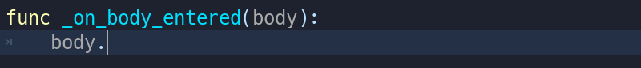
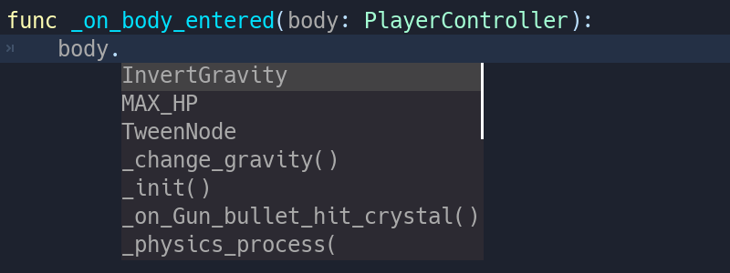

.. _doc_gdscript_static_typing:

Static typing in GDScript
=========================

In this guide, you will learn:

-  **How to use types in GDScript**
-  That **static types can help you avoid bugs**

Where and how you use this new language feature is entirely up to you:
you can use it only in some sensitive GDScript files, use it everywhere,
or write code like you always did!

Static types can be used on variables, constants, functions, parameters,
and return types.

.. note::

    Typed GDScript is available since Godot 3.1.

A brief look at static typing
-----------------------------

With typed GDScript, Godot can detect even more errors as you write
code! It gives you and your teammates more information as you're
working, as the arguments' types show up when you call a method.

Imagine you're programming an inventory system. You code an ``Item``
node, then an ``Inventory``. To add items to the inventory, the people
who work with your code should always pass an ``Item`` to the
``Inventory.add`` method. With types, you can enforce this:

::

    # In 'Item.gd'.
    class_name Item
    # In 'Inventory.gd'.
    class_name Inventory

    func add(reference: Item, amount: int = 1):
        var item = find_item(reference)
        if not item:
            item = _instance_item_from_db(reference)

        item.amount += amount

Another significant advantage of typed GDScript is the new **warning
system**. From version 3.1, Godot gives you warnings about your code as
you write it: the engine identifies sections of your code that may lead
to issues at runtime, but lets you decide whether or not you want to
leave the code as it is. More on that in a moment.

Static types also give you better code completion options. Below, you
can see the difference between a dynamic and a static typed completion
options for a class called ``PlayerController``.

You've probably stored a node in a variable before, and typed a dot to
be left with no autocomplete suggestions:

This is due to dynamic code. Godot cannot know what node or value type
you're passing to the function. If you write the type explicitly
however, you will get all public methods and variables from the node:

In the future, typed GDScript will also increase code performance:
Just-In-Time compilation and other compiler improvements are already
on the roadmap!

Overall, typed programming gives you a more structured experience. It
helps prevent errors and improves the self-documenting aspect of your
scripts. This is especially helpful when you're working in a team or on
a long-term project: studies have shown that developers spend most of
their time reading other people's code, or scripts they wrote in the
past and forgot about. The clearer and the more structured the code, the
faster it is to understand, the faster you can move forward.

How to use static typing
------------------------

To define the type of a variable or a constant, write a colon after the
variable's name, followed by its type. E.g. ``var health: int``. This
forces the variable's type to always stay the same:

::

    var damage: float = 10.5
    const MOVE_SPEED: float = 50.0

Godot will try to infer types if you write a colon, but you omit the
type:

::

    var life_points := 4
    var damage := 10.5
    var motion := Vector2()

Currently you can use three types of… types:

1. :ref:`Built-in <doc_gdscript_builtin_types>`
2. Core classes and nodes (``Object``, ``Node``, ``Area2D``,
   ``Camera2D``, etc.)
3. Your own, custom classes. Look at the new :ref:`class_name <doc_scripting_continued_class_name>`
   feature to register types in the editor.

.. note::

    You don't need to write type hints for constants, as Godot sets it automatically from the assigned value. But you can still do so to make the intent of your code clearer.

Custom variable types
~~~~~~~~~~~~~~~~~~~~~

You can use any class, including your custom classes, as types. There
are two ways to use them in scripts. The first method is to preload the
script you want to use as a type in a constant:

::

    const Rifle = preload("res://player/weapons/Rifle.gd")
    var my_rifle: Rifle

The second method is to use the ``class_name`` keyword when you create.
For the example above, your Rifle.gd would look like this:

::

    extends Node2D
    class_name Rifle

If you use ``class_name``, Godot registers the Rifle type globally in
the editor, and you can use it anywhere, without having to preload it
into a constant:

::

    var my_rifle: Rifle

Variable casting
~~~~~~~~~~~~~~~~

Type casting is a key concept in typed languages.
Casting is the conversion of a value from one type to another.

Imagine an Enemy in your game, that ``extends Area2D``. You want it to
collide with the Player, a ``KinematicBody2D`` with a script called
``PlayerController`` attached to it. You use the ``on_body_entered``
signal to detect the collision. With typed code, the body you detect is
going to be a generic ``PhysicsBody2D``, and not your
``PlayerController`` on the ``_on_body_entered`` callback.

You can check if this ``PhysicsBody2D`` is your Player with the ``as``
casting keyword, and using the colon ``:`` again to force the variable
to use this type. This forces the variable to stick to the
``PlayerController`` type:

::

    func _on_body_entered(body: PhysicsBody2D) -> void:
        var player := body as PlayerController
        if not player:
            return

        player.damage()

As we're dealing with a custom type, if the ``body`` doesn't extend
``PlayerController``, the ``player``\ variable will be set to ``null``.
We can use this to check if the body is the player or not. We will also
get full autocompletion on the player variable thanks to that cast.

.. note::

    If you try to cast with a built-in type and it fails, Godot will throw an error.

Safe lines
^^^^^^^^^^

You can also use casting to ensure safe lines. Safe lines are a new
tool in Godot 3.1 to tell you when ambiguous lines of code are
type-safe. As you can mix and match typed and dynamic code, at times,
Godot doesn't have enough information to know if an instruction will trigger
an error or not at runtime.

This happens when you get a child node. Let's take a timer for example:
with dynamic code, you can get the node with ``$Timer``. GDScript
supports `duck-typing <https://stackoverflow.com/a/4205163/8125343>`__,
so even if your timer is of type ``Timer``, it is also a ``Node`` and an
``Object``, two classes it extends. With dynamic GDScript, you also
don't care about the node's type as long as it has the methods you need
to call.

You can use casting to tell Godot the type you expect when you get a
node: ``($Timer as Timer)``, ``($Player as KinematicBody2D)``, etc.
Godot will ensure the type works and if so, the line number will turn
green at the left of the script editor.

   Unsafe line (line 7) vs Safe Lines (line 6 and 8)

.. note::

    You can turn off safe lines or change their color in the editor settings.

Define the return type of a function with the arrow ->
~~~~~~~~~~~~~~~~~~~~~~~~~~~~~~~~~~~~~~~~~~~~~~~~~~~~~~

To define the return type of a function, write a dash and a right angle
bracket ``->`` after its declaration, followed by the return type:

::

    func _process(delta: float) -> void:
        pass

The type ``void`` means the function does not return anything. You can
use any type, as with variables:

::

    func hit(damage: float) -> bool:
        health_points -= damage
        return health_points <= 0

You can also use your own nodes as return types:

::

    # Inventory.gd

    # Adds an item to the inventory and returns it.
    func add(reference: Item, amount: int) -> Item:
        var item: Item = find_item(reference)
        if not item:
            item = ItemDatabase.get_instance(reference)

        item.amount += amount
        return item

Typed or dynamic: stick to one style
------------------------------------

Typed GDScript and dynamic GDScript can coexist in the same project. But
I recommended to stick to either style for consistency in your codebase,
and for your peers. It's easier for everyone to work together if you
follow the same guidelines, and faster to read and understand other
people's code.

Typed code takes a little more writing, but you get the benefits we
discussed above. Here's an example of the same, empty script, in a
dynamic style:

::

    extends Node

    func _ready():
        pass

    func _process(delta):
        pass

And with static typing:

::

    extends Node

    func _ready() -> void:
        pass

    func _process(delta: float) -> void:
        pass

As you can see, you can also use types with the engine's virtual
methods. Signal callbacks, like any methods, can also use types. Here's
a ``body_entered`` signal in a dynamic style:

::

    func _on_Area2D_body_entered(body):
        pass

And the same callback, with type hints:

::

    func _on_area_entered(area: CollisionObject2D) -> void:
        pass

You're free to replace, e.g. the ``CollisionObject2D``, with your own type,
to cast parameters automatically:

::

    func _on_area_entered(bullet: Bullet) -> void:
        if not bullet:
            return

        take_damage(bullet.damage)

The ``bullet`` variable could hold any ``CollisionObject2D`` here, but
we make sure it is our ``Bullet``, a node we created for our project. If
it's anything else, like an ``Area2D``, or any node that doesn't extend
``Bullet``, the ``bullet`` variable will be ``null``.

Warning system
--------------

.. note::

    Documentation about the GDScript warning system has been moved to
    :ref:`doc_gdscript_warning_system`.

Cases where you can't specify types
-----------------------------------

To wrap up this introduction, let's cover a few cases where you can't
use type hints. All the examples below **will trigger errors**.

You can't use Enums as types:

::

    enum MoveDirection {UP, DOWN, LEFT, RIGHT}
    var current_direction: MoveDirection

You can't specify the type of individual members in an array. This will
give you an error:

::

    var enemies: Array = [$Goblin: Enemy, $Zombie: Enemy]

You can't force the assignment of types in a ``for`` loop, as each
element the ``for`` keyword loops over already has a different type. So you
**cannot** write:

::

    var names = ["John", "Marta", "Samantha", "Jimmy"]
    for name: String in names:
        pass

Two scripts can't depend on each other in a cyclic fashion:

::

    # Player.gd

    extends Area2D
    class_name Player

    var rifle: Rifle

::

    # Rifle.gd

    extends Area2D
    class_name Rifle

    var player: Player

Summary
-------

Typed GDScript is a powerful tool. Available as of version 3.1 of Godot, it
helps you write more structured code, avoid common errors, and
create scalable systems. In the future, static types will also bring you
a nice performance boost thanks to upcoming compiler optimizations.
