.. _doc_getting_started_visual_script:

Getting started with Visual Scripting
=====================================

As with everything in Godot, we prioritize a good experience over copying or integrating third party solutions
which might not fit nicely in the current workflow. This led us to write our own version of how we believe
this feature would work best with the engine.

In Godot, a Visual Script fits smoothly together with regular scripts in the Editor tab

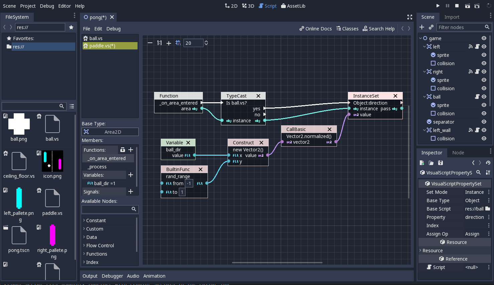

In fact, Visual Scripting integrates so well to Godot that it's hard to believe it was added only
in version 3.0. This is because, when editing, the rest of Godot panels and docks act like a
palette from where you can drag and drop all sorts of information to the script canvas:

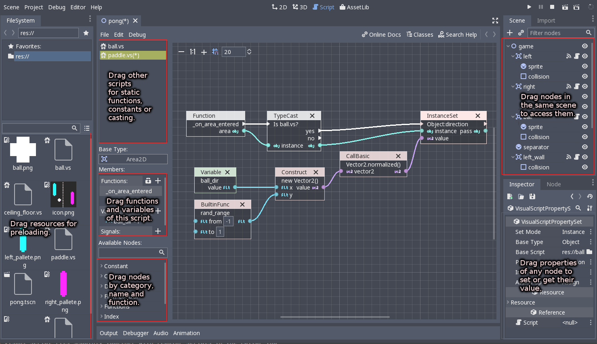

Creating a script
-----------------

Creating scripts works the same as with other scripting languages: Select any node in the scene
and push the "New Script" button at the top right corner of the Scene Tree dock:

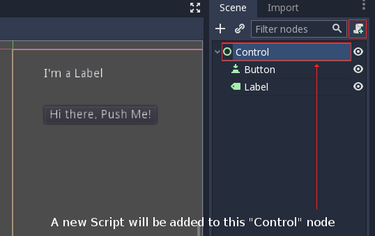

Once it opens, the script type "Visual Script" must be selected from the drop down list. The script extension
must be ".vs" (for Visual Script!).

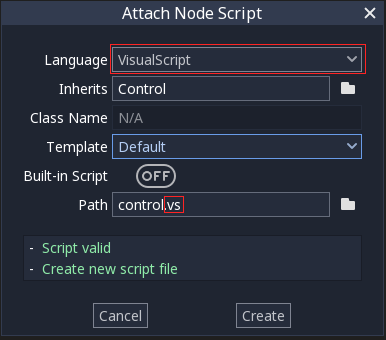

Finally, the Script Editor will open, allowing you to start editing the visual script:

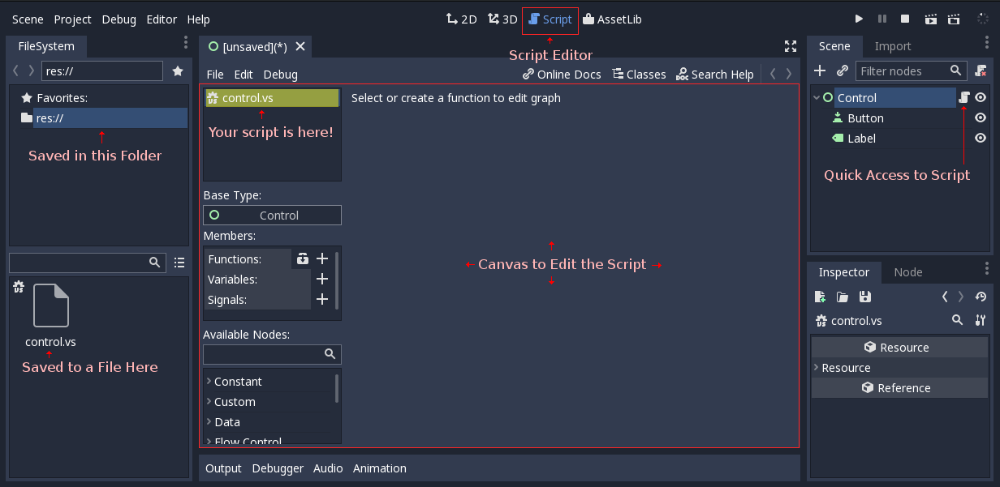

Adding a function
-----------------

Unlike other visual scripting implementations, Visual Scripting in Godot is heavily based on functions.
This happens because it uses the same interface to communicate with the engine as other scripting engines.
In Godot, the scripting interface is universal and all implementations conform to it.

A function is an individual canvas with nodes connected.

A single script can contain many functions, each of which will have a canvas of its own, allowing for more organization.

There are three main ways to add functions in a script:

Overriding a virtual function
~~~~~~~~~~~~~~~~~~~~~~~~~~~~~

Most types of nodes and other types of objects in Godot contain virtual functions. These are functions that
will be called (run your code) when something happens and can be looked up in the reference. Virtual functions
are listed when pressing the "Override" icon in the member panel:

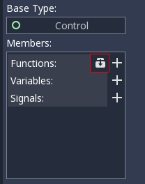

In the following example, a function will be executed when the node is loaded and added to the running scene.
For this, the _ready() virtual method will be overridden:

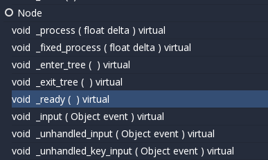

Finally, a canvas appears for this function, showing the override:

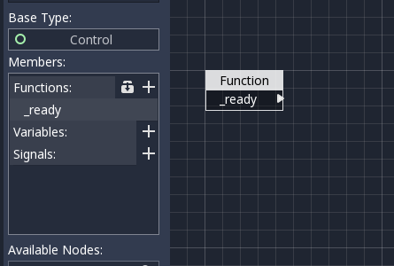

As some functions expect you to return a value, they will also add a return node where such value is supposed to be
provided:

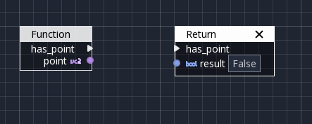

Connecting a signal to a function
~~~~~~~~~~~~~~~~~~~~~~~~~~~~~~~~~

Nodes in a tree emit signals when something happens. Godot uses signals for all sorts of things.
A typical example would be a button that emits a "pressed" signal when actually pressed.

For this, a node must be selected and the Node tab opened. This will allow inspecting the signals.
Once they are displayed, connect the "pressed" signal:

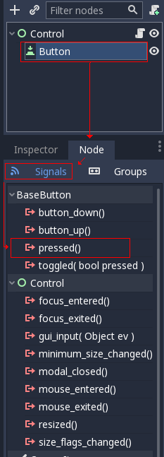

This will open the connection dialog. In this dialog, you must select the node where the signal will be
connected to, and the function that will receive the signal:

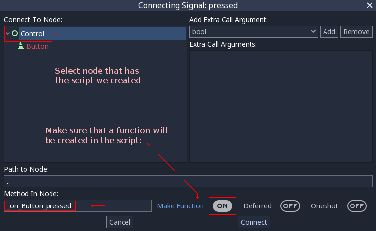

If this is done right, a new function will be created in our script and a signal will automatically be
connected to it:

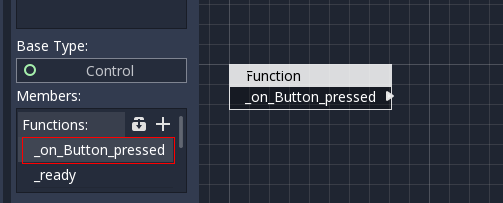

Creating a function manually
~~~~~~~~~~~~~~~~~~~~~~~~~~~~

The last way to create functions is to do it manually. In general, this is not as common unless you
really need it. Custom functions work when another (or the same) script calls them manually.
The main use cases for this are breaking a larger function up into several manageable chunks and reusing your visual code.

To create a function manually, push the big "Plus" button, and a new function will be added
with a default name:

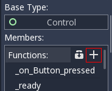

This will add a new function, which can be renamed by simply double clicking its name:

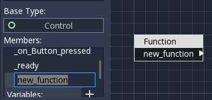

To edit the "arguments" this function can get (the values you pass to it when you call this function),
simply click the Function node and check the inspector:

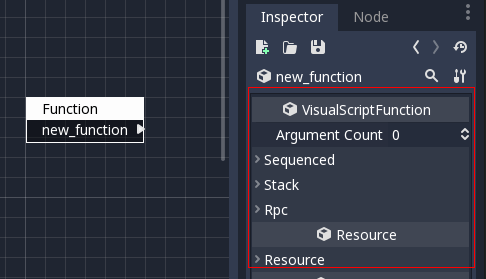

More on that will be explained later in this document.
