.. _doc_nodes_purposes_visual_script:

Nodes and terminology
=====================

Before continuing, it must be noted that the *Node* terminology needs to be used with care.
When referring to *Visual Script Nodes* (or generally *Nodes*) this text will refer to the little boxes you connect with lines, which are part of a graph.
When referring to *Scene Nodes*, it is implied that the elements that make up a Scene are being referred, which are part of a tree. Their naming is similar but their function is different.
When referring to *Node* here, it will be implied that a *Visual Script Node* is referred to unless indicated otherwise.

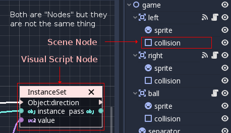

Node properties
---------------

Like in most visual scripting implementations, each node has editable properties. In Godot, though, we try to avoid
bloating the nodes with editable controls for the sake of readability.

Nodes still display the required information as text, but editing is done via the *Inspector*. To edit them,
select any node and edit its properties in the *Inspector*.

Ports and connections
---------------------

Programming in Godot Visual Scripting is done via *Nodes* and *Port Connections* inside each function.

Ports
~~~~~

Nodes in Godot Visual Scripting have *Ports*. These are endpoints that appear to the
left and right of nodes and which can be used to make *Connections*:
There are two types of *Ports*: *Sequence* and *Data*.

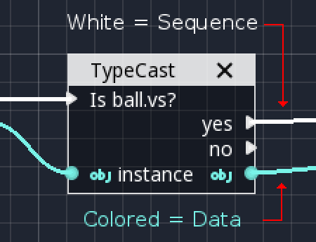

*Sequence Ports* indicate the order in which operations are executed.
Typically when a *Node* is done processing, it will go to the next node from one of the ports at the right.
If nothing is connected, the function may end, or another output *Sequence Port* might be tried (this depends on the node).
Thanks to this, you can follow the logic flow within a function by following the white lines.
Not every *Node* has *Sequence Ports*. In fact, most do not.

*Data Ports* ports contain typed values. Types can be any regular Godot types,
such as a boolean, an integer, a string, a Vector3, an array, any Object or Scene Node, etc.
A *Data Port* on the right side of a node is considered an output, while,
a port on the left side is an input. Connecting them allows information to flow to the next node.

Not all *Data Port* types are compatible and will allow connections, though.
Pay special attention to colors and icons, as each type has a different representation:

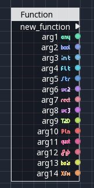

Connections
~~~~~~~~~~~

Connecting is a relatively simple process. Drag an *Output Port* towards an *Input Port*.

.. image:: img/visual_script_connect.gif

Disconnecting takes a bit more practice. Disconnecting in *Data Ports* happens by
dragging the *Input* away, while for *Sequence Ports*, this happens by dragging the *Output* away.

.. image:: img/visual_script_disconnect.gif

This may seem strange at first, but it happens because *Data Ports* are 1:N
(A single output port can connect to many inputs), while *Sequence Ports* are N:1
(Many sequence outputs can be connected to a single input).

Connecting to empty space (drag to connect but unpress over empty space) is also context sensitive, it will supply
a list of most common operations. For sequences, it will be conditional nodes:

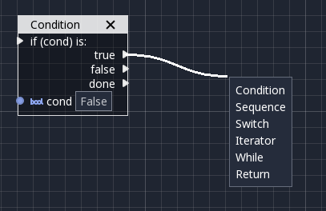

While, for data, a contextual set/get/call menu will open:

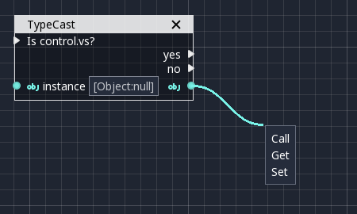

Adding nodes
------------

Finally! We got to the fun part! But, before explaining in more detail what each type of node does,
let's take a short look at how nodes are most commonly added and dealt with.

Accessing scene nodes
~~~~~~~~~~~~~~~~~~~~~

One of the most common tasks is accessing Scene Tree Nodes (again, not to mistake with *Visual Script Nodes*).
Dragging from the Scene Tree and dropping into the canvas will ask you to *call a method* (sometimes referred to as *member function*) on this node.

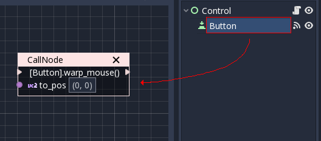

While accessing properties is desired in most cases (more on that below), sometimes *calling methods* can be useful too.
Methods execute specific actions on objects. In the above case, the mouse pointer can be warped to a position in local
coordinates to the control. Another common use case is queueing a node for deletion, which is done with the *queue_free* method.

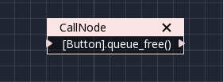

Care must be taken that this only works if the scene being edited contains your *Visual Script* in one of the nodes! Otherwise, a warning will be shown.

Accessing scene node properties
~~~~~~~~~~~~~~~~~~~~~~~~~~~~~~~

This is the most common way to edit *Scene Nodes* in Visual Scripting. Select a *Scene Node* from the *Scene Tree*, go to the Inspector, find *the Name* of the property you want to edit (hint, *not* the value!) and drag it to the canvas:

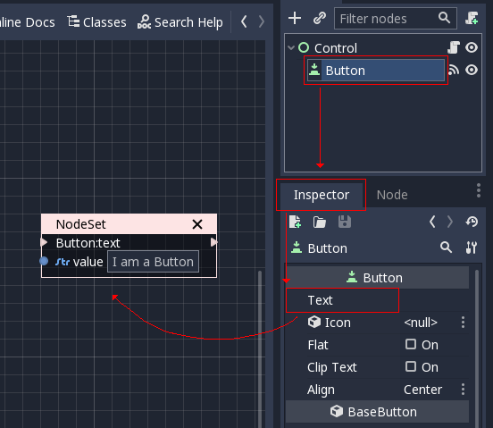

The result is that this value can be changed from your script by writing to a *Data Port*.

If instead reading this value is desired, drag the node again but hold :kbd:`Ctrl` (or :kbd:`Cmd` on macOS). This will create a getter:

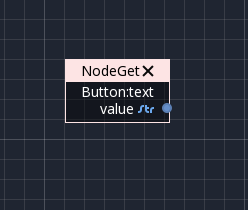

In this case, the value can be read from a *Data Port*.

Variables
~~~~~~~~~

Variables are memory containers local to the script which can hold a value. This value can be read from any of the functions of the script or from other scripts via the method described in the previous step.

To add a Variable, push the "+" button on the *Variables* section of the Members panel. Double-click the new variable to rename it:

.. image:: img/visual_script23.png

Right-clicking the variable allows you to configure its properties:

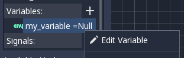

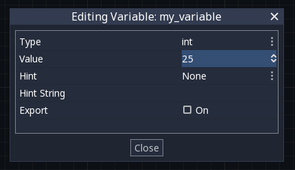

As it can be seen above, the type and initial value of the variable can be changed, as well as some property hints.
Ticking the "Export" option makes the variable visible in the Inspector when selecting the node. This also makes it available to other scripts via the method described in the previous step.

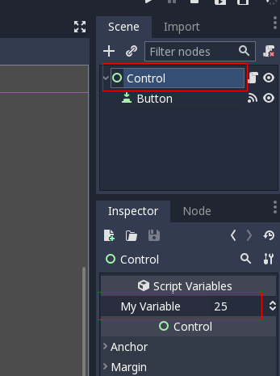

To use the variable in the script, simply drag it to the canvas to create a getter:

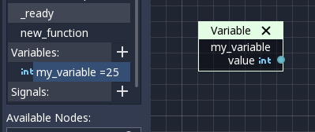

Likewise, hold :kbd:`Ctrl` (or :kbd:`Cmd` on macOS) to drop a setter:

.. image:: img/visual_script27.png

Signals
~~~~~~~

It is also possible to create your own signals in a script and use them. For this, do the same steps you did for variables in the previous step, except for *Signals*:

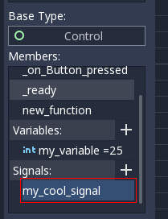

A signal can also be edited via the right-click menu to customize its arguments:

.. image:: img/visual_script30.png

The signal you have created will appear in the Inspector, along with the built-in node signals. This allows you to connect it from another script from another *Scene Node*:

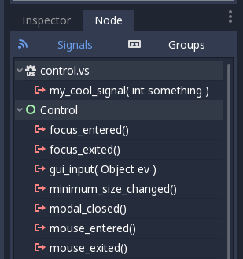

Finally, to emit the signal, simply drag it to the canvas:

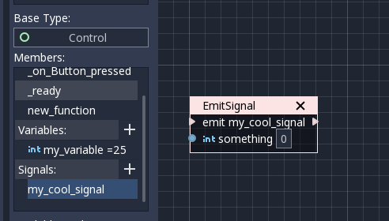

Remember that emitting a signal is a sequenced operation, so it must come from a Sequence port.

Adding more nodes
-----------------

Now that the basics are covered, let's discuss the large amount of utility nodes available for your canvas!
Below the member panel, exists the list of all available node types:

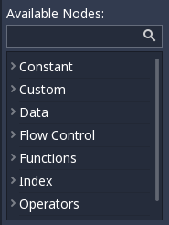

Pressing :kbd:`Ctrl + F` (or :kbd:`Cmd + F` on macOS) allows you to search the list.

Any of them can be dragged to the scene. Unlike nodes (e.g. dragging a property
from the Inspector sets the context to the node being edited automatically), these are added without any "contextual" information, so this has to be done manually.

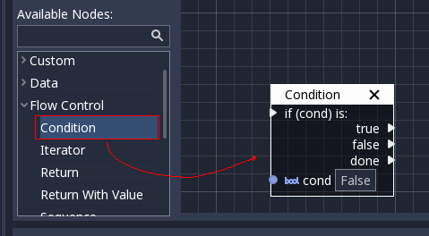

Remember that you can check the class reference for what each node does, as they are documented there. That mentioned,
a brief overview of node types follows:

Constants
~~~~~~~~~

Constant nodes are nodes that provide values that, while not changing over time, can be useful as reference values.
Most of the time they are integer or float.

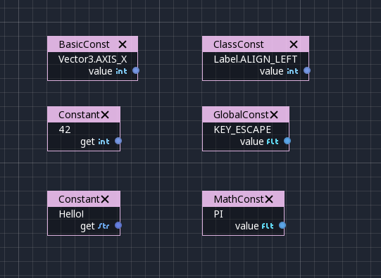

The first one is "Constant", which allows you to select any value of any type as constant, from an integer (42) to a String ("Hello!"). In general, this node is not used that often because of default input values in *Data Ports*, but it's good to know it exists.

The second is the GlobalConstant node, which contains a long list of constants for global types in Godot. In there
you can find some useful constants to refer to key names, joystick or mouse buttons, etc.

The third one is MathConstant, which provides typical mathematical constants, such as PI, E, etc.

Data
~~~~

Data nodes deal with all sorts of access to information. Any information in Godot is accessed via these nodes, so
they are some of the most important ones to use and pretty diverse.

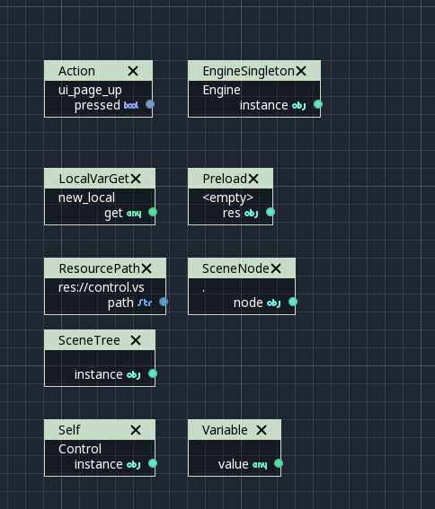

There are many types of nodes of interest here, so a short attempt to describe them will follow:

Action
^^^^^^

Action nodes are vital when dealing with input from a device. You can read more about actions in the (@TODO ACTION TUTE LINK).
In the following example below, the control is moved to the right when the "move_right" action is pressed.

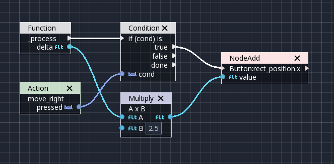

Engine Singleton
^^^^^^^^^^^^^^^^

Engine singletons are global interfaces (meaning they can be accessed without a reference; unlike Scene Nodes, they are always available).
They have several purposes, but in general, they are useful for low-level access or OS-related access.

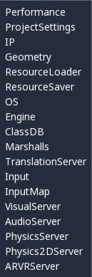

Remember that dragging a connection to empty space will help you call functions or set/get properties on these:

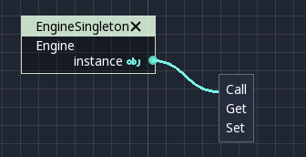

Local Variables
^^^^^^^^^^^^^^^

These are nodes you can use as temporary storage for your graphs. Make sure they all have the same name and type when using them and they will reference the same piece of memory.

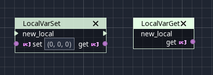

As it can be seen above, there are two nodes available: A simple getter, and a sequenced getter (setting requires a sequence port).

Scene Node
^^^^^^^^^^

This is just a reference to a node in the tree, but it's easier to use this node by dragging the actual node
from the scene tree to the canvas (this will create it and configure it).

Self
^^^^

In some rare occasions, it may be desired to pass this Scene Node as argument.
It can be used to call functions and set/get properties, or drag nodes (or event the node itself that has the script) from the Scene Tree to the canvas for this.

SceneTree
^^^^^^^^^

This node is similar to the Singleton node because it references the SceneTree, which contains the active scene.
SceneTree, however, only works when the node is sitting in the scene and active, otherwise accessing it will
return an error.

SceneTree allows for many low-level things, like setting stretch options, calling groups, make timers, or even
load another scene. It's a good class to get familiar with.

Preload
^^^^^^^

This does the same function as preload() in GDScript. It maintains this resource loaded and ready to use. Rather than
instancing the node, it's simpler to drag the desired resource from the filesystem dock to the canvas.

Resource Path
^^^^^^^^^^^^^

This node is a simple helper to get a string with a path to a resource you can pick. It's useful in functions that
load things from disk.

Comment
^^^^^^^

A Comment node works as a node you can resize to put around other nodes. It will not try to get focus or be brought
to top when selecting it. It can also be used to write text on it.

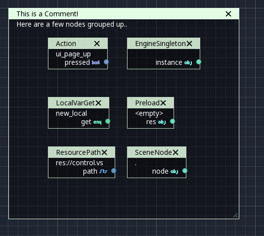

Flow Control
~~~~~~~~~~~~

Flow control nodes allow the execution to take different branches, usually depending on a
given condition.

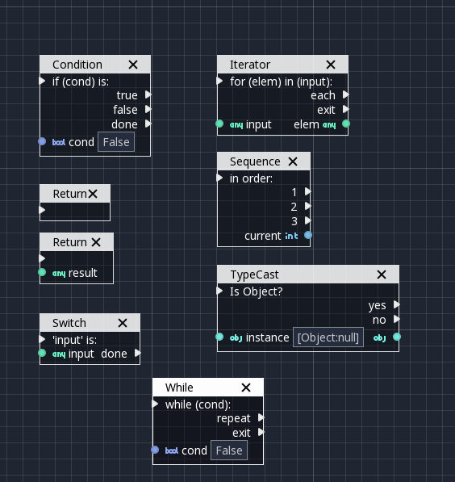

Condition
^^^^^^^^^

This is a simple node that checks a bool port. If ``true``, it will go via the "true" sequence port. If ``false``,
the second. After going for either of them, it goes via the "done" port. Leaving sequence
ports disconnected is fine if not all of them are used.

Iterator
^^^^^^^^

Some data types in Godot (ie, arrays, dictionaries) are iterable. This means that a bit of code can run
for each element that it has.

The Iterator node goes through all elements and, for each of them, it goes via the "each" sequence port,
making the element available in the "elem" data port.

When done, it goes via the "exit" sequence port.

Return
^^^^^^

Some functions can return values. In general for virtual ones, Godot will add the Return node for you.
A return node forces the function to end.

Sequence
^^^^^^^^

This node is useful mostly for organizing your graph. It calls its sequence ports in order.

TypeCast
^^^^^^^^

This is a useful and commonly used node. You can use it to cast arguments or other objects
to the type you desire. Afterwards, you can even drag the object output to get full completion.

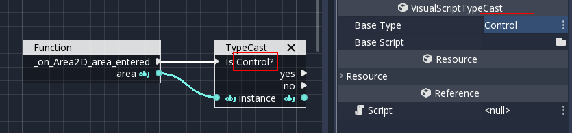

It is also possible to cast to a script, which will allow complete script properties and functions:

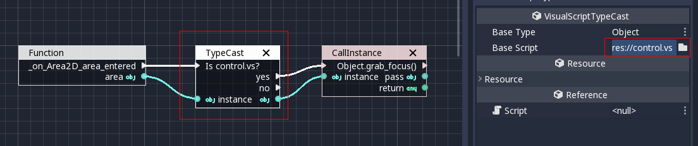

Switch
^^^^^^

The Switch node is similar to the Condition node, but it matches many values at the same time.

While
^^^^^

This is a more primitive form of iteration. "repeat" sequence output will be called as long as
the condition in the "cond" data port is met.

Functions
~~~~~~~~~

Functions are simple helpers, most of the time deterministic. They take some arguments as
input and return an output. They are almost never sequenced.

Built-In
^^^^^^^^

There is a list of built-in helpers. The list is almost identical to the one from :ref:`GDScript<class_@GDScript>`. Most of them are mathematical functions, but others can be useful helpers. Make sure to take a look at the list
at some point.

By Type
^^^^^^^

Those are the methods available to basic types. For example, if you want a dot-product, you can search for "dot" instead of the Vector3 category.
In most cases just search the list of nodes, it should be faster.

Call
^^^^

This is the generic calling node. It is rarely used directly but by dragging to empty space on an already configured node.

Constructors
^^^^^^^^^^^^

These are all the functions needed to create Godot basic datatypes. For example, If you need to create a Vector3 out of 3 floats, a constructor must be used.

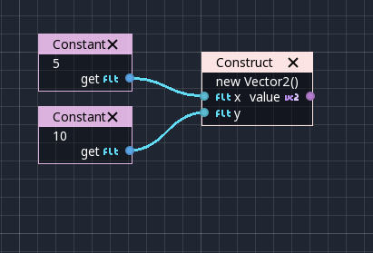

Destructor
^^^^^^^^^^

This is the opposite to Constructor, it allows to separate any basic type (ie, Vector3) into its sub-elements.

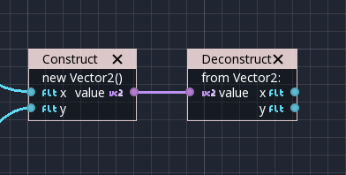

Emit Signal
^^^^^^^^^^^

Emits signals from any object. In general it's not that useful, as dragging a signal to the canvas works better.

Get/Set
^^^^^^^

Generic Getter/Setter node. Dragging properties from the Inspector works better, as they appear properly configured on drop.

Wait
^^^^

The Wait nodes will suspend execution of the function until something happens (many frames can pass until resuming, in fact).
Default nodes allow you to wait for a frame to pass, a fixed frame or a given amount of time until execution is resumed.

Yield
^^^^^

This node completely suspends the execution of the script, and it will make the function return a value that can be used to resume execution.

Yield Signal
^^^^^^^^^^^^

Same as Yield, but will wait until a given signal is emitted.

Index
~~~~~

Generic indexing operator, not often used but it's good that it exists just in case.

Operators
~~~~~~~~~

These are mostly generic operators, such as addition, multiplication, comparison, etc.
By default, these mostly accept any datatype (and will throw an error at run-time if the types
fed do not match those expected by the operator). It is always recommended to set the right
type for operators to catch errors faster and make the graph easier to read.

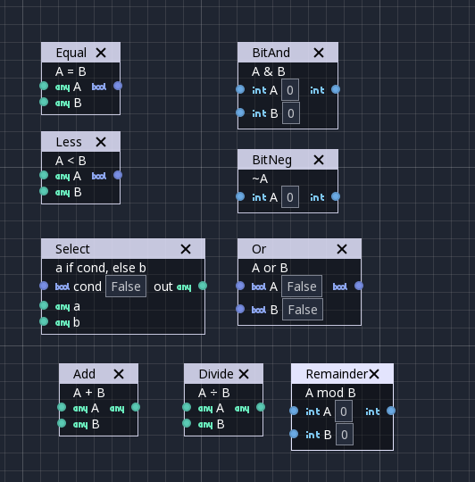

Expression Node
^^^^^^^^^^^^^^^

Among the operators, the *Expression* node is the most powerful. If well used, it allows you to enormously simplify
visual scripts that are math or logic heavy. Type any expression on it and it will be executed in real-time.

Expression nodes can:

- Perform math and logic expressions based on custom inputs (eg: "a*5+b", where a and b are custom inputs):

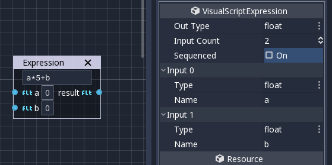

- Access local variables or properties:

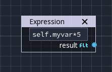

- Use most of the existing built-in functions that are available to GDScript, such as ``sin()``, ``cos()``, ``print()``, as well as constructors, such as ``Vector3(x, y, z)``, ``Rect2(...)``, etc.:

.. image:: img/visual_script49.png

- Call API functions:

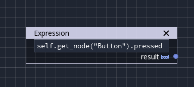

- Use sequenced mode, which makes more sense in case of respecting the processing order:

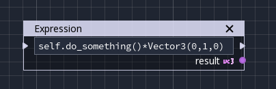
