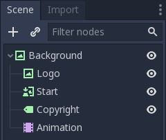
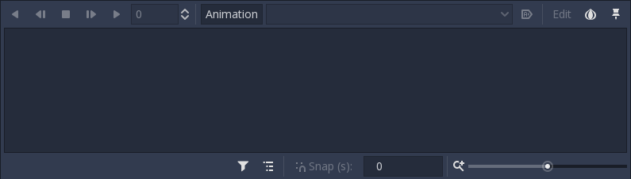
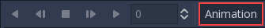
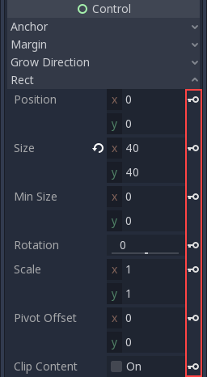
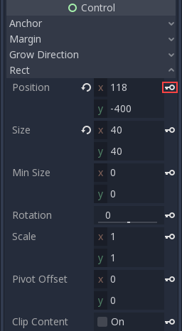
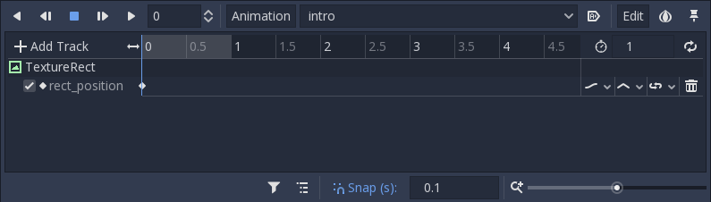
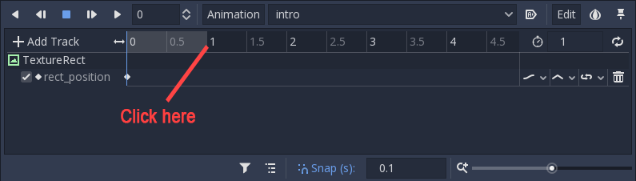
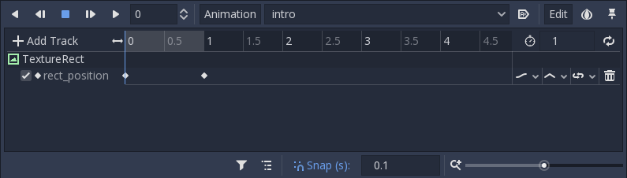
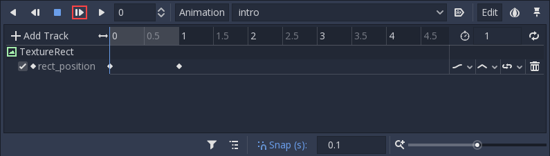
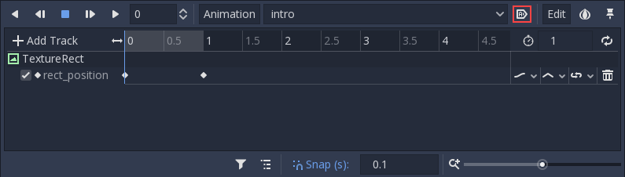

.. _doc_animations:

Animations
==========

Introduction
------------

Godot's animation system is extremely powerful and flexible.

To begin, let's use the scene from the previous tutorial (:ref:`doc_splash_screen`).
The goal is to add a "fade-in" animation to the splash image. Here's a copy
just in case: :download:`robisplash.zip <files/robisplash.zip>`.

Add an animation player
-----------------------

First of all, add an :ref:`AnimationPlayer <class_AnimationPlayer>`
node to the scene as a child of "background" (the root node):

When a node of this type is selected, the animation editor panel will
appear:

The animation editor panel stays visible until manually hidden.

Creating the animation
----------------------

It's time to create a new animation! Press the Animation button then select
new from the menu. Name the animation "intro" when the dialog appears.

.. image:: img/robisplash_anim_new.png

Now that we have an animation, the property editor enters
"animation editing" mode. In this mode, a key icon appears next to
every property of the property editor. In Godot, any property of an object
can be animated:

Editing the animation
---------------------

The logo will appear from the top of the screen.

With the animation editor panel open, select the "logo" node and set the
"Rect / Position" property to ``(118, -400)`` and press the key button next
to the property to add a keyframe:

When the dialog appears, confirm that you are creating a new track.

The keyframe will be added in the animation player editor:

Move the editor cursor forward in time by clicking here:

Change the logo position to ``(118, 0)`` and add a keyframe again. With two
keyframes with different values, the animation happens.

Pressing "Play selected animation from start" button on the animation panel (or :kbd:`Shift + D` on keyboard)
will make the logo descend.

Click the "Autoplay on Load" button to set the animation to start automatically
when the scene starts.

And finally, when running the scene, the animation should look like
this:

