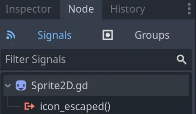
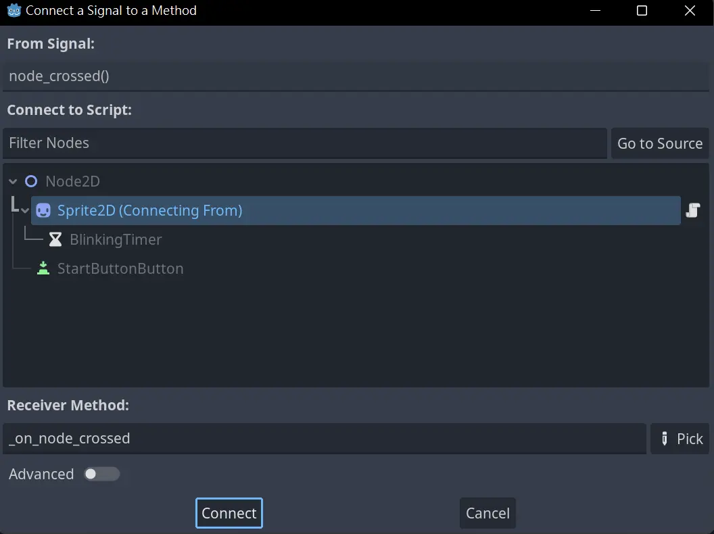
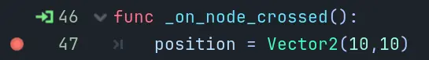
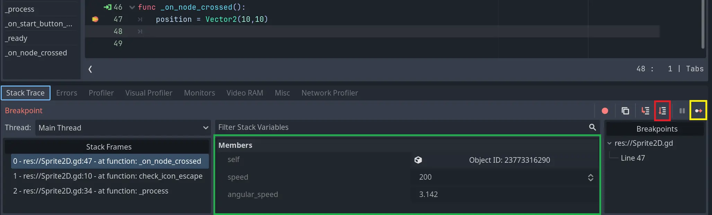

.. Intention:
    Introduce breakpoints in the debugger. It will help beginners to trace their codes.
    
.. Todo:
    All the contents about C# are not included. The author is not familiar with C#.

.. _doc_trace_code_with_debugger_:

Using the debugger
==================

In this lesson we will look at the breakpoints in Godot's built-in debugger.
We will write a bottom line checker to check if the position of the ``Sprite2D`` node 
is below the specific bottom line. The bottom line checker will send the ``Sprite2D`` 
node back to the desired position if it's found below the bottom line.
We will also set breakpoints to see if the checker is being called after the 
``Sprite2D`` node crosses the bottom line.

.. note:: A more detailed introduction to the debugger can be found in page 
          :ref:`doc_debugger_panel`

Setup scene
-----------

In :ref:`doc_scripting_player_input`, you should be able to control the ``Sprite2D``
node via arrows keys. Now, we need to make sure that the ``Sprite2D`` node will not cross 
the bottom line. Once the bottom line is crossed, we must send it back.

First we need to define a custom signal. Once the bottom line checker finds that
the ``Sprite2D`` node has crossed the bottom line, it will emit the signal. 

.. tabs::
 .. code-tab:: gdscript GDScript

    extends Node2D

    signal node_crossed

Then check if the ``Sprite2D`` node has crossed the bottom line every frame. Once the 
``Sprite2D`` node crosses the bottom line, the ``icon_escaped`` signal will be emitted.

.. tabs::
 .. code-tab:: gdscript GDScript

    func check_bottom_line_crossed():
        if position.y > 600:
            icon_escaped.emit()

    func _process(delta): 
        # Arrow control logic.
        var direction = 0
        if Input.is_action_pressed("ui_left"):
            direction = -1
        if Input.is_action_pressed("ui_right"):
            direction = 1

        rotation += angular_speed * direction * delta

        var velocity = Vector2.ZERO
        if Input.is_action_pressed("ui_up"):
            velocity = Vector2.UP.rotated(rotation) * speed
	        
        position += velocity * delta
        check_bottom_line_crossed()

Now we need to connect the signal to the method. The method will be called 
after the signal is emitted. To do so, double-click on the ``icon_escaped``
signal in Node tab.

Click the ``Connect`` button. The method will be added automatically.

Now you should be able to see that the ``_on_node_crossed`` method has appeared.
Once the method is called, we will send the ``Sprite2D`` node back to position 
``(10, 10)``.

.. tabs::
 .. code-tab:: gdscript GDScript

    func _on_node_crossed():
        position = Vector2(10,10)

Hit :kbd:`F6` (:kbd:`Cmd + R` on macOS) to run it. Use the arrow keys to control 
the ``Sprite2D`` node moving down. It should be teleported back to ``(10, 10)`` 
once it descends low enough.

Setup breakpoints
-----------------

Now let's examine the breakpoints and use them to trace our code. When the breakpoint
is hit, the game will be paused. At the same time we can check the values in variables
to make sure that the game is running correctly.

Add a breakpoint at the ``position = Vector2(10, 10)`` line, to see if it's called 
or not. To do so, click the left side of the line number to add the breakpoint.

Hit :kbd:`F6` (:kbd:`Cmd + R` on macOS) and move the ``Sprite2D`` node down. 
After the ``Sprite2D`` node crosses the bottom line, the game will be paused and 
you will be switched back to the debugger.

The debugger panel will appear at the bottom panel. Clicking the button in the yellow
box will continue running the game, until the breakpoints are triggered again. 
Clicking the button in the red box will run the game for another line of code and 
then pause again. When the game is paused, you can check the values of local variables,
as shown in the green box in the image.

Summary
-------

In this lesson we use the signal to check if the ``Sprite2D`` node crossed the bottom line.
We also use breakpoints and the debugger to trace the code.
