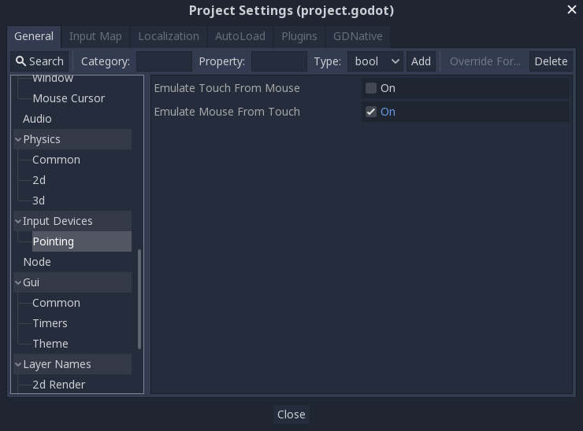
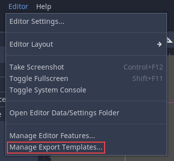
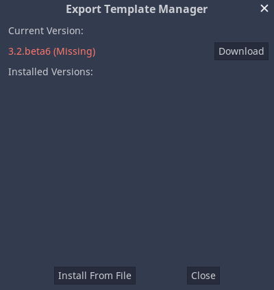
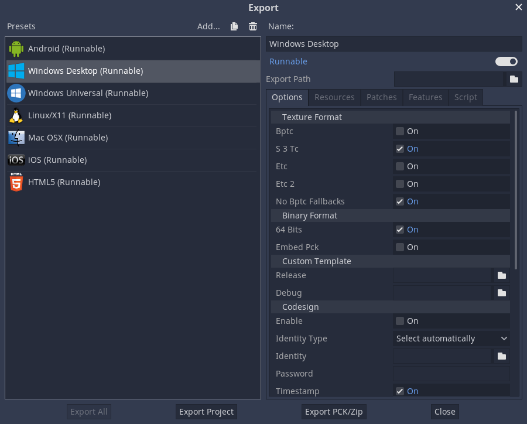
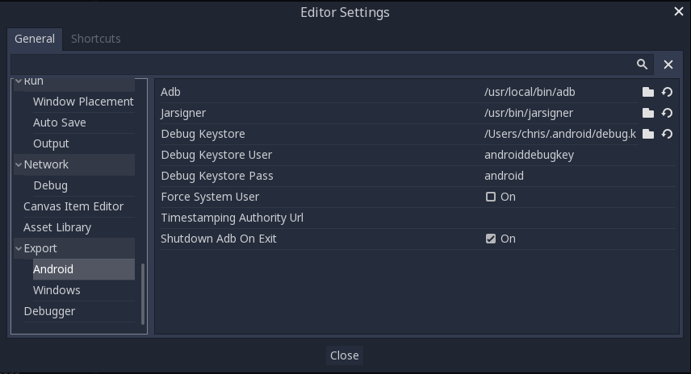
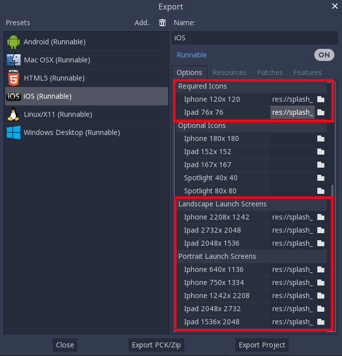
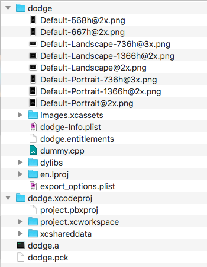
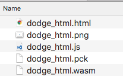
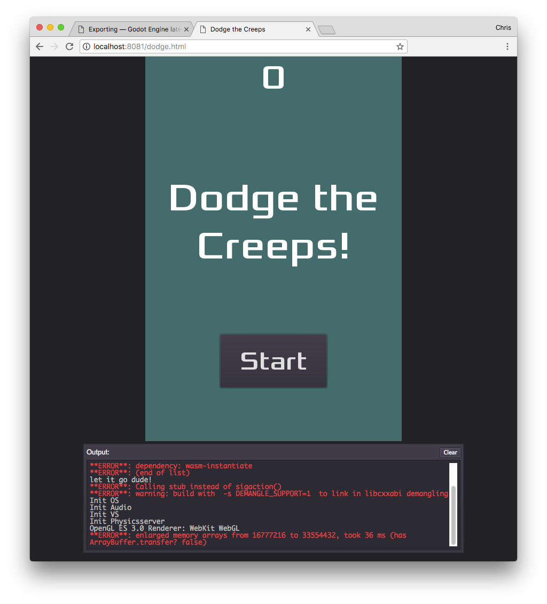

.. _doc_exporting:

Exporting
=========

Overview
--------

Now that you have a working game, you probably want to share your success with
others. However, it's not practical to ask your friends to download Godot
just so they can open your project. Instead, you can *export* your project,
converting it into a "package" that can be run by anyone.

The way you export your game depends on what platform you are targeting. In
this tutorial, you'll learn how to export the "Dodge the Creeps" game for a
variety of platforms. First, however, we need to make some changes to the
way the game works.

.. note:: If you haven't made "Dodge the Creeps" yourself yet, please read
          :ref:`doc_your_first_game` before continuing with this tutorial.

Preparing the project
---------------------

In "Dodge the Creeps" we used keyboard controls to move the player's character.
This is fine if your game is being played on a PC platform, but on a phone
or tablet, you need to support touchscreen input. Because a click event can
be treated the same as a touch event, we'll convert the game to a click-and-move
input style.

The first step is to open "Project Settings" and find the *Handheld* section.
Enable the *Emulate Touchscreen* option. This lets you treat mouse click
events the same as touch events, so you can test the game on a computer without
a touchscreen. Also, make sure to select "portrait" under *Orientation*.

In the *Stretch* section, set *Mode* to "2d" and *Aspect* to "keep". This
ensures that the game scales consistently on different sized screens.

Next, we need to modify the ``Player.gd`` script to change the input method.
We'll remove the key inputs and make the player move towards a "target" that's
set by the touch (or click) event.

Here is the full script for the player, with comments noting what we've
changed:

.. tabs::
 .. code-tab:: gdscript GDScript

    extends Area2D

    signal hit

    export (int) var speed
    var velocity = Vector2()
    var screensize
    # Add this variable to hold the clicked position.
    var target = Vector2()

    func _ready():
        hide()
        screensize = get_viewport_rect().size

    func start(pos):
        position = pos
        # Initial target is the start position.
        target = pos
        show()
        $CollisionShape2D.disabled = false

    # Change the target whenever a touch event happens.
    func _input(event):
        if event is InputEventScreenTouch and event.pressed:
            target = event.position

    func _process(delta):
        # Move towards the target and stop when close.
        if position.distance_to(target) > 10:
            velocity = (target - position).normalized() * speed
        else:
            velocity = Vector2()

    # Remove keyboard controls.
    #   if Input.is_action_pressed("ui_right"):
    #       velocity.x += 1
    #	if Input.is_action_pressed("ui_left"):
    #		velocity.x -= 1
    #	if Input.is_action_pressed("ui_down"):
    #		velocity.y += 1
    #	if Input.is_action_pressed("ui_up"):
    #		velocity.y -= 1

        if velocity.length() > 0:
            velocity = velocity.normalized() * speed
            $AnimatedSprite.play()
            $Trail.emitting = true
        else:
            $AnimatedSprite.stop()
            $Trail.emitting = false

    	position += velocity * delta
        # We don't need to clamp the player's position
        # because you can't click outside the screen.
        # position.x = clamp(position.x, 0, screensize.x)
        # position.y = clamp(position.y, 0, screensize.y)

        if velocity.x != 0:
            $AnimatedSprite.animation = "right"
            $AnimatedSprite.flip_v = false
            $AnimatedSprite.flip_h = velocity.x < 0
        elif velocity.y != 0:
            $AnimatedSprite.animation = "up"
            $AnimatedSprite.flip_v = velocity.y > 0

    func _on_Player_body_entered( body ):
        $Collision.disabled = true
        hide()
        emit_signal("hit")

Export templates
----------------

In order to export, you need to download the *export templates* from the
http://godotengine.org/download. These templates are optimized versions of the engine
without the editor pre-compiled for each platform . You can also
download them in Godot by clicking on *Editor -> Manage Export Templates*:

In the window that appears, you can click "Download" to get the template
version that matches your version of Godot.

.. note:: If you upgrade Godot, you must download templates that match the new version
          or your exported projects may not work correctly.

Export presets
--------------

Next, you can configure the export settings by clicking on *Project -> Export*:

Create a new export preset by clicking "Add..." and selecting a platform. You
can make as many presets as you like with different settings.

At the bottom of the window are two buttons. "Export PCK/ZIP" only creates
a packed version of your project's data. This doesn't include an executable
so the project can't be run on its own.

The second button, "Export Project", creates a complete executable version
of your game, such as an `.apk` for Android or an `.exe` for Windows.

In the "Resources" and "Features" tabs you can customize how the game is
exported for each platform. We can leave those settings alone for now.

Exporting by platform
---------------------

In this section, we'll walk through the process for each platform,
including any additional software or requirements you'll need.

PC (Linux/macOS/Windows)
~~~~~~~~~~~~~~~~~~~~~~~~

Exporting PC platforms works the same across the three supported operating
systems. Open the export window and click "Add.." to create the preset(s) you
want to make. Then click "Export Project" and choose a name and destination
folder. Choose a location *outside* of your project folder.

Click "Save" and the engine will build the export files.

.. note:: When exporting for MacOS, if you export on a MacOS computer, you'll
          end up with a `.dmg` file, while using Linux or Windows
          produces a `.zip`. In either case, the compressed file contains
          a MacOS `.app` that you can double-click and run.

.. note:: On Windows, if you want your exported executable to have a different
          icon than the default one, you need to change it manually. See:
          :ref:`doc_changing_application_icon_for_windows`.

Android
~~~~~~~

.. tip:: Mobile devices come with a wide variety of capabilities.
          In most cases, Godot's default settings will work, but mobile
          development is sometimes more art than science, and you may
          need to do some experimenting and searching for help in order
          to get everything working.

Before you can export your project for Android, you must download the following
software:

* Android SDK: https://developer.android.com/studio/
* Java JDK: http://www.oracle.com/technetwork/java/javase/downloads/index.html

When you run Android Studio for the first time, click on *Configure -> SDK Manager*
and install "Android SDK Platform Tools". This installs the `adb` command-line
tool that Godot uses to communicate with your device.

Next, create a debug keystore with by running the following command on your
system's command line:

::

    keytool -keyalg RSA -genkeypair -alias androiddebugkey -keypass android -keystore debug.keystore -storepass android -dname "CN=Android Debug,O=Android,C=US" -validity 9999

Click on *Editor -> Editor Settings* in Godot and select the *Export/Android*
section. Here, you need to set the paths to the Android SDK applications on
your system and the location of the keystore you just created.

Now you're ready to export. Click on *Project -> Export* and add a preset
for Android (see above).

Click the "Export Project" button and Godot will build an APK you can download
on your device. To do this on the command line, use the following:

::

    adb install dodge.apk

.. note:: Your device may need to be in *developer mode*. Consult your
          device's documentation for details.

If your system supports it, connecting a compatible Android device will cause
a "One-click Deploy" button to appear in Godot's playtest button area:

Clicking this button builds the APK and copies it onto your device in one step.

iOS
~~~

.. note:: In order to build your game for iOS, you must have a computer running
          MacOS with Xcode installed.

Before exporting, there are some settings that you *must* complete for the project
to export successfully. First, the "App Store Team Id", which you can find by
logging in to your Apple developer account and looking in the "Membership" section.

You must also provide icons and splash screen images as shown below:

Click "Export Project" and select a destination folder.

Once you have successfully exported the project, you'll find the following
folders and files have been created in your selected location:

You can now open the project in Xcode and build the project for iOS. Xcode
build procedure is beyond the scope of this tutorial. See
https://help.apple.com/xcode/mac/current/#/devc8c2a6be1 for
more information.

HTML5 (web)
~~~~~~~~~~~

Click "Export Project" on the HTML5 preset. We don't need to change any
of the default settings.

When the export is complete, you'll have a folder containing the following
files:

Viewing the `.html` file in your browser lets you play the game. However, you
can't open the file directly, it neds to be served by a web server. If you don't
have one set up on your computer, you can use Google to find suggestions for
your specific OS.

Point your browser at the URL where you've placed the html file. You may have
to wait a few moments while the game loads before you see the start screen.

The console window beneath the game tells you if anything goes wrong. You can
disable it by setting "Export With Debug" off when you export the project.

.. note:: Browser support for WASM is not very widespread. Firefox and Chrome
          both support it, but you may still find some things that don't work.
          Make sure you have updated your browser to the most recent version,
          and report any bugs you find at the `Godot Github repository <https://github.com/godotengine/godot/issues>`_.
