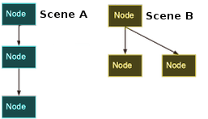
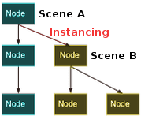
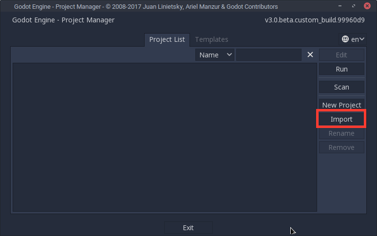
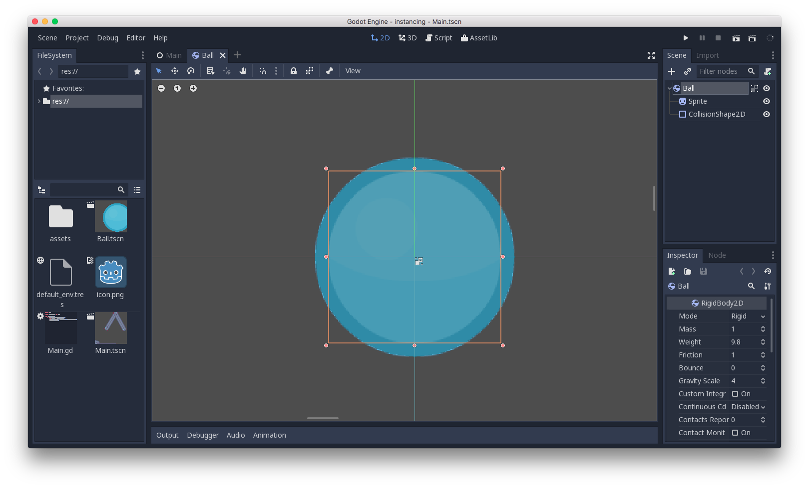
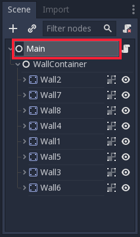
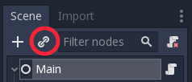
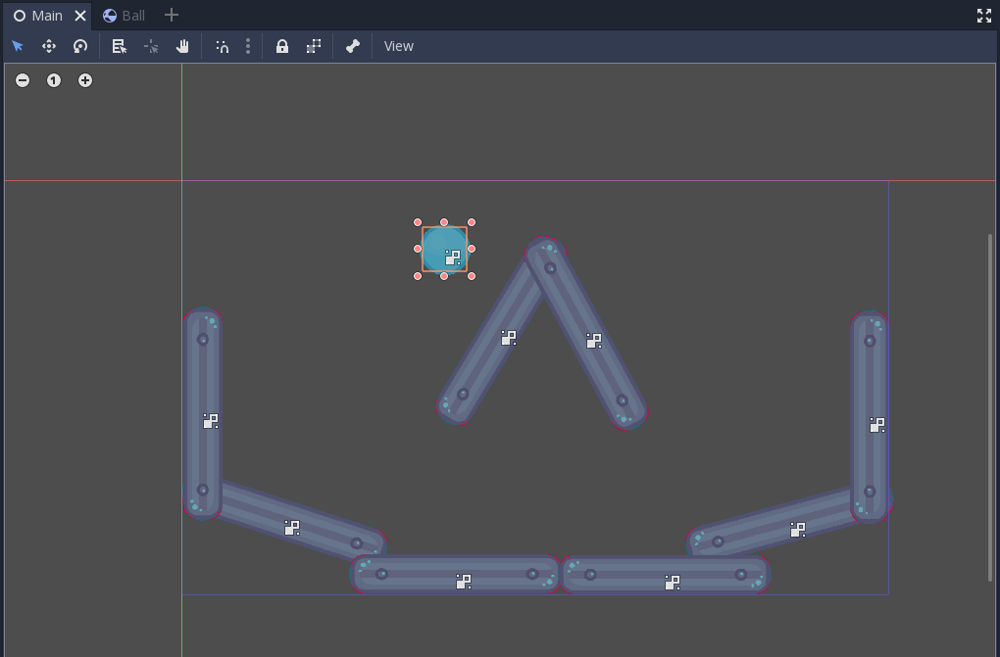
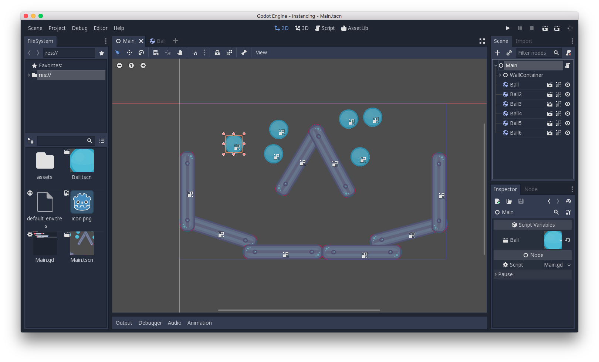
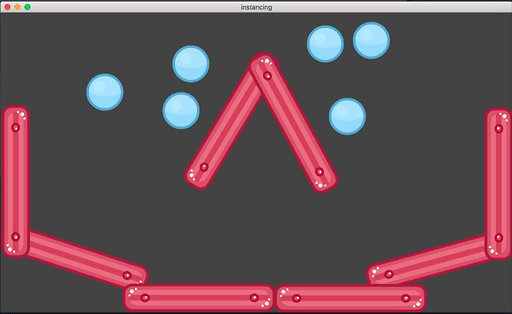

.. _doc_instancing:

Instancing
==========

Introduction
------------

Creating a single scene and adding nodes into it might work for small
projects, but as a project grows in size and complexity, the number of nodes
can quickly become unmanageable. To address this, Godot allows a project
to be separated into any number of scenes. This provides you with a powerful
tool that helps you organize the different components of your game.

In :ref:`doc_scenes_and_nodes` you learned that a scene is a collection of
nodes organized in a tree structure, with a single node as the tree root.

.. image:: img/tree.png

You can create as many scenes as you like and save them to disk. Scenes
saved in this manner are called "Packed Scenes" and have a ``.tscn`` filename
extension.

Once a scene has been saved, it can be instanced into another scene as
if it were any other node.

In the above picture, Scene B was added to Scene A as an instance.

Instancing by example
---------------------

To learn how instancing works, let's start by downloading a sample
project: :download:`instancing.zip <files/instancing.zip>`.

Unzip this project anywhere you like. Then open Godot and add this project to
the project manager using the 'Import' button:

Browse to the folder you extracted and open the "project.godot" file you
can find inside it. After doing this, the new project will appear on the list
of projects. Edit the project by pressing the 'Edit' button.

This project contains two scenes: "Ball.tscn" and "Main.tscn". The ball
scene uses a :ref:`RigidBody2D <class_RigidBody2D>` to provide physics
behavior while the main scene has a set of obstacles for the ball to
collide with (using :ref:`StaticBody2D <class_StaticBody2D>`).

.. image:: img/instancing_mainscene.png

Open the ``Main`` scene, and then select the root node:

We want to add an instance of the ``Ball`` scene as a child of ``Main``.
Click the "link"-shaped button (its hover-text says "Instance a scene file
as a Node.") and select the ``Ball.tscn`` file.

The ball will be placed at the top-left corner of the screen area (this is
``(0, 0)`` in screen coordinates). Click and drag the ball somewhere near
the top-center of the scene:

Press "Play" and watch the ball fall to the bottom of the screen:

Multiple instances
------------------

You can add as many instances as you like to a scene, either by using the
"Instance" button again, or by clicking on the ball instance and pressing
"Duplicate" (Ctrl-D):

Run the scene again and all of the balls will fall.

Editing instances
-----------------

Open the ``Ball`` scene and change the ``Bounce`` property in the Inspector
to `1`. Press "Play" and notice that all of the instanced balls are now
much more bouncy. Because the instanced balls are based on the saved scene,
changes to that scene will affect all instances.

You can also adjust individual instances. Set the bounce value back to ``0.5``
and then in the ``Main`` scene, select one of the instanced balls. Set its
``Bounce`` to ``1`` and press "Play".

Notice that a grey "revert" button appears next to the adjusted property. When
this button is present, it means you modified a property in the
instanced scene to override its value in the saved scene. Even
if that property is modified in the original scene, the custom value
will remain. Pressing the revert button will restore the property to the
value in the saved scene.

Conclusion
----------

Instancing can be useful when you want to create many copies of the
same object. It is also possible to create instances in code by using
GDScript, see :ref:`doc_scripting_continued`.
