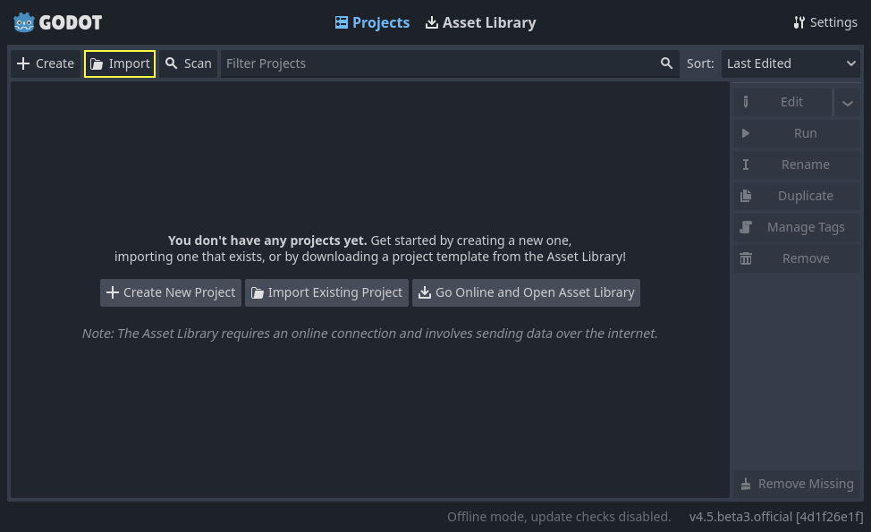
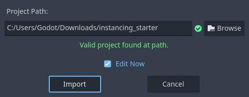
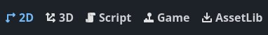
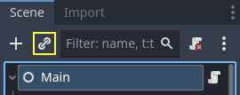
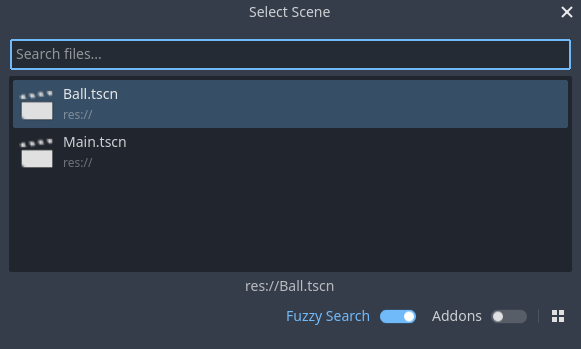
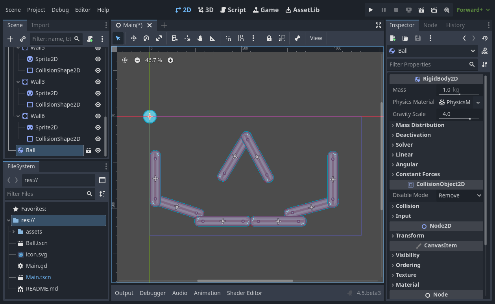
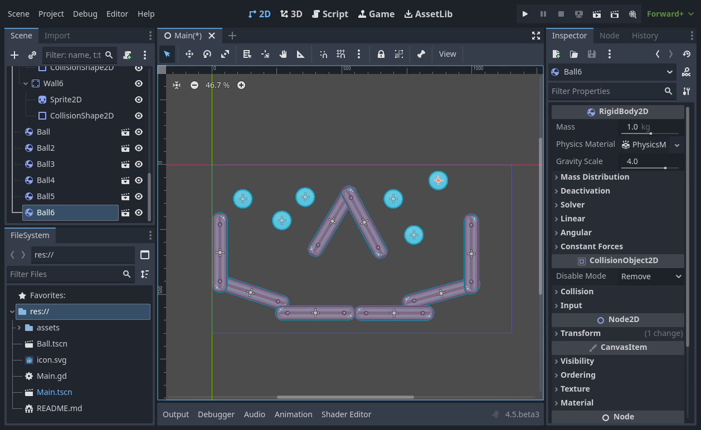

.. _doc_instancing:

Creating instances
==================

In the previous part, we saw that a scene is a collection of nodes organized in
a tree structure, with a single node as its root. You can split your project
into any number of scenes. This feature helps you break down and organize your
game's different components.

You can create as many scenes as you'd like and save them as files with the
``.tscn`` extension, which stands for "text scene". The ``label.tscn`` file from
the previous lesson was an example. We call those files "Packed Scenes" as they
pack information about your scene's content.

Here's an example of a ball. It's composed of a :ref:`RigidBody2D
<class_RigidBody2D>` node as its root named Ball, which allows the ball to fall
and bounce on walls, a :ref:`Sprite2D <class_Sprite2D>` node, and a
:ref:`CollisionShape2D <class_CollisionShape2D>`.

.. image:: img/instancing_ball_scene.webp

Once you saved a scene, it works as a blueprint: you can reproduce it in other
scenes as many times as you'd like. Replicating an object from a template like
this is called **instancing**.

.. image:: img/instancing_ball_instances_example.webp

As we mentioned in the previous part, instanced scenes behave like a node: the
editor hides their content by default. When you instance the Ball, you only see
the Ball node. Notice also how each duplicate has a unique name.

Every instance of the Ball scene starts with the same structure and properties
as ``ball.tscn``. However, you can modify each independently, such as changing
how they bounce, how heavy they are, or any property exposed by the source
scene.

In practice
-----------

Let's use instancing in practice to see how it works in Godot. We invite
you to download the ball's sample project we prepared for you:
`instancing_starter.zip <https://github.com/godotengine/godot-docs-project-starters/releases/download/latest-4.x/instancing_starter.zip>`_.

Extract the archive on your computer. To import it, you need the Project Manager.
The Project Manager is accessed by opening Godot, or if you already have Godot opened, click on *Project -> Quit to Project List* (:kbd:`Ctrl + Shift + Q`, :kbd:`Ctrl + Option + Cmd + Q` on macOS)

In the Project Manager, click the *Import* button to import the project.

In the pop-up that appears navigate to the folder you extracted.
Double-click the ``project.godot`` file to open it.

.. image:: img/instancing_import_project_file.webp

Finally, click the Import & Edit button.

The project contains two packed scenes: ``main.tscn``, containing walls against
which the ball collides, and ``ball.tscn``. The Main scene should open
automatically. If you're seeing an empty 3D scene instead of the main scene, click the 2D button at the top of the screen.

.. image:: img/instancing_main_scene.webp

Let's add a ball as a child of the Main node. In the Scene dock, select the Main
node. Then, click the link icon at the top of the scene dock. This button allows
you to add an instance of a scene as a child of the currently selected node.

Double-click the ball scene to instance it.

The ball appears in the top-left corner of the viewport.

Click on it and drag it towards the center of the view.

.. image:: img/instancing_ball_moved.webp

Play the game by pressing :kbd:`F5` (:kbd:`Cmd + B` on macOS). You should see it fall.

Now, we want to create more instances of the Ball node. With the ball still
selected, press :kbd:`Ctrl + D` (:kbd:`Cmd + D` on macOS) to call the duplicate
command. Click and drag to move the new ball to a different location.

You can repeat this process until you have several in the scene.

Play the game again. You should now see every ball fall independently from one
another. This is what instances do. Each is an independent reproduction of a
template scene.

Editing scenes and instances
----------------------------

There is more to instances. With this feature, you can:

1. Change the properties of one ball without affecting the others using the
   Inspector.
2. Change the default properties of every Ball by opening the ``ball.tscn`` scene
   and making a change to the Ball node there. Upon saving, all instances of the
   Ball in the project will see their values update.

.. note:: Changing a property on an instance always overrides values from the
          corresponding packed scene.

Let's try this. Open ``ball.tscn`` and select the Ball node. In the Inspector on
the right, click on the PhysicsMaterial property to expand it.

.. image:: img/instancing_physics_material_expand.webp

Set its Bounce property to ``0.5`` by clicking on the number field, typing ``0.5``,
and pressing :kbd:`Enter`.

.. image:: img/instancing_property_bounce_updated.webp

Play the game by pressing :kbd:`F5` (:kbd:`Cmd + B` on macOS) and notice how all balls now bounce a lot
more. As the Ball scene is a template for all instances, modifying it and saving
causes all instances to update accordingly.

Let's now adjust an individual instance. Head back to the Main scene by clicking
on the corresponding tab above the viewport.

.. image:: img/instancing_scene_tabs.webp

Select one of the instanced Ball nodes and, in the Inspector, set its Gravity
Scale value to ``10``.

.. image:: img/instancing_property_gravity_scale.png

A grey "revert" button appears next to the adjusted property.

.. image:: img/instancing_property_revert_icon.png

This icon indicates you are overriding a value from the source packed scene.
Even if you modify the property in the original scene, the value override will
be preserved in the instance. Clicking the revert icon will restore the
property to the value in the saved scene.

Rerun the game and notice how this ball now falls much faster than the others.

.. note:: You may notice you are unable to change the values of the ``PhysicsMaterial``
          of the ball. This is because ``PhysicsMaterial`` is a resource, and needs
          to be made unique before you can edit it in a scene that is linking to its
          original scene. To make a resource unique for one instance, right-click on
          it in the Inspector and click Make Unique in the contextual menu.

          Resources are another essential building block of Godot games we will
          cover in a later lesson.

Scene instances as a design language
------------------------------------

Instances and scenes in Godot offer an excellent design language, setting the
engine apart from others out there. We designed Godot around this concept from
the ground up.

We recommend dismissing architectural code patterns when making games with
Godot, such as Model-View-Controller (MVC) or Entity-Relationship diagrams.
Instead, you can start by imagining the elements players will see in your game
and structure your code around them.

For example, you could break down a shooter game like so:

.. image:: img/instancing_diagram_shooter.png

You can come up with a diagram like this for almost any type of game. Each
rectangle represents an entity that's visible in the game from the player's
perspective. The arrows tell you which scene owns which.

Once you have a diagram, we recommend creating a scene for each element listed
in it to develop your game. You'll use instancing, either by code or directly in
the editor, to build your tree of scenes.

Programmers tend to spend a lot of time designing abstract architectures and
trying to fit components into it. Designing based on scenes makes development
faster and more straightforward, allowing you to focus on the game logic itself.
Because most game components map directly to a scene, using a design based on
scene instantiation means you need little other architectural code.

Here's the example of a scene diagram for an open-world game with tons of assets
and nested elements:

.. image:: img/instancing_diagram_open_world.png

Imagine we started by creating the room. We could make a couple of different
room scenes, with unique arrangements of furniture in them. Later, we could make
a house scene that uses multiple room instances for the interior. We would
create a citadel out of many instanced houses and a large terrain on which we
would place the citadel. Each of these would be a scene instancing one or more sub-scenes.

Later, we could create scenes representing guards and add them to the citadel.
They would be indirectly added to the overall game world.

With Godot, it's easy to iterate on your game like this, as all you need to do
is create and instantiate more scenes. We designed the editor to be accessible
to programmers, designers, and artists alike. A typical team development process
can involve 2D or 3D artists, level designers, game designers, and animators,
all working with the Godot editor.

Summary
-------

Instancing, the process of producing an object from a blueprint, has many handy
uses. With scenes, it gives you:

- The ability to divide your game into reusable components.
- A tool to structure and encapsulate complex systems.
- A language to think about your game project's structure in a natural way.
