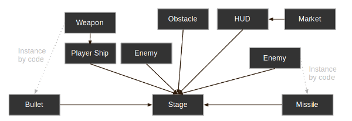
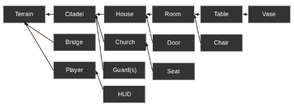

.. _doc_instancing_continued:

Instancing (continued)
======================

Recap
-----

Instancing has many handy uses. At a glance, with instancing you have:

-  The ability to subdivide scenes and make them easier to manage.
-  A tool to manage and edit multiple node instances at once.
-  A way to organize and embed complex game flows or even UIs (in Godot, UI
   Elements are nodes, too).

Design language
---------------

But the greatest strength that comes with instancing scenes is that it works
as an excellent design language. This distinguishes Godot
from all the other engines out there. Godot was designed from the ground up
around this concept.

When making games with Godot, the recommended approach is to dismiss most
common design patterns, such as MVC or Entity-Relationship diagrams, and
instead think about your scenes in a more natural way. Start by imagining the
visible elements in your game, the ones that can be named not just by a
programmer, but by anyone.

For example, here's how a simple shooter game could be imagined:

You can come up with a diagram like this for almost any kind
of game. Write down the parts of the game that you can visualize, and then
add arrows to represent ownership of one component by another.

Once you have a diagram like this, the recommended process for making a game is
to create a scene for each element listed in the diagram. You'll use instancing
(either by code or directly in the editor) for the ownership relationships.

A lot of time spent in programming games (or software in general) is on
designing an architecture and fitting game components to that architecture.
Designing based on scenes replaces that approach and makes development much
faster and more straightforward, allowing you to concentrate on the game logic
itself. Because most game components map directly to a scene, using a design based on scene instantiation means little other architectural code is needed.

Let's take a look at one more, somewhat more complex, example of an open-world
type game with lots of assets and nested elements:

Take a look at the room element. Let's say we started there. We could make a
couple of different room scenes, with different arrangements of furniture (also
scenes) in them. Later, we could make a house scene, connecting rooms to make
up its interior.

Then, we could make a citadel scene, which is made out of many instanced
houses. Then, we could start working on the world map terrain, adding the
citadel onto it.

Later, we could create scenes that represent guards (and other NPCs) and add
them to the citadel as well. As a result, they would be indirectly added to the
overall game world.

With Godot, it's easy to iterate on your game like this, as all you need to do
is create and instance more scenes. Furthermore, the editor UI is designed to be user
friendly for programmers and non-programmers alike. A typical team development
process can involve 2D or 3D artists, level designers, game designers,
and animators, all working with the editor interface.

Information overload!
---------------------

This has been a lot of high level information dropped on you all at once.
However, the important part of this tutorial was to create an awareness of how
scenes and instancing are used in real projects.

Everything discussed here will become second nature to you once you start
making games and putting these concepts into practice. For now, don't worry
about it too much, and go on to the next tutorial!
