.. _doc_intro_to_the_editor_interface:

Introduction to Godot's editor
==============================

This tutorial will run you through Godot's interface. We're going to
look at the **Project Manager, docks, workspaces** and everything you
need to know to get started with the engine.

Project manager
---------------

When you launch Godot, the first window you'll see is the Project
Manager. Since you have no projects there will be a popup asking if you
want to open the asset library, just click cancel, we'll look at it later.

.. image:: img/project_manager_first_open.png

Now you should see the project manager. It lets you create, remove, import
or play game projects.

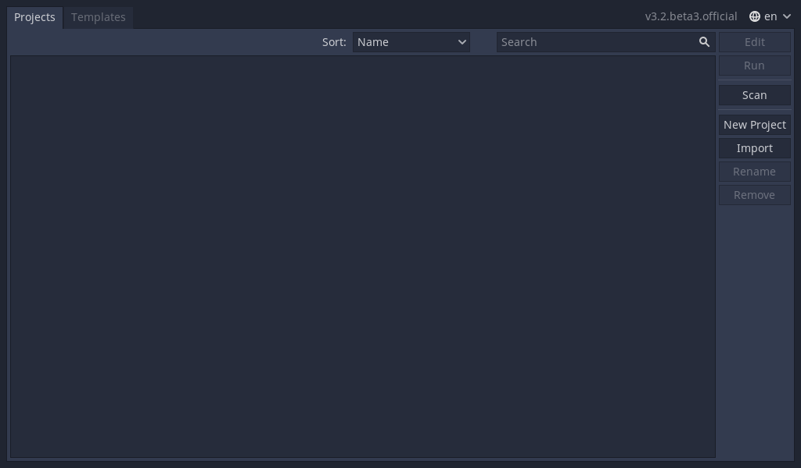

In the top-right corner you'll find a drop-down menu to change the
editor's language.

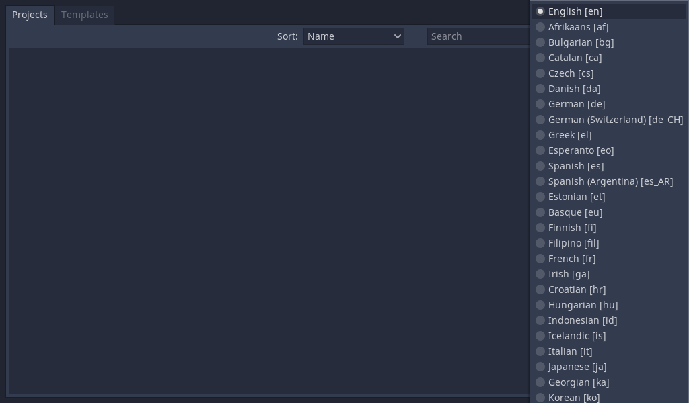

From the **Templates** tab you can download open source project templates and
demos from the Asset Library to help you get started faster. Just select the
template or demo you want, click download, once it's finished downloading click
install and choose where you want the project to go. You can learn more about
it in :ref:`doc_what_is_assetlib`.

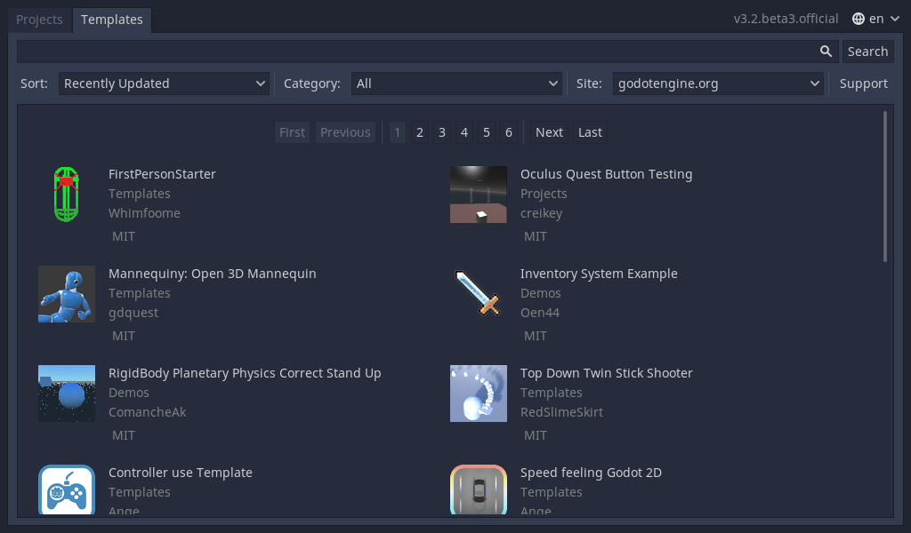

Create or import a project
~~~~~~~~~~~~~~~~~~~~~~~~~~

To create a new project, click the ``New Project`` button on the right. Here
you give it a name, choose an empty folder on your computer to save it to,
and choose a renderer.

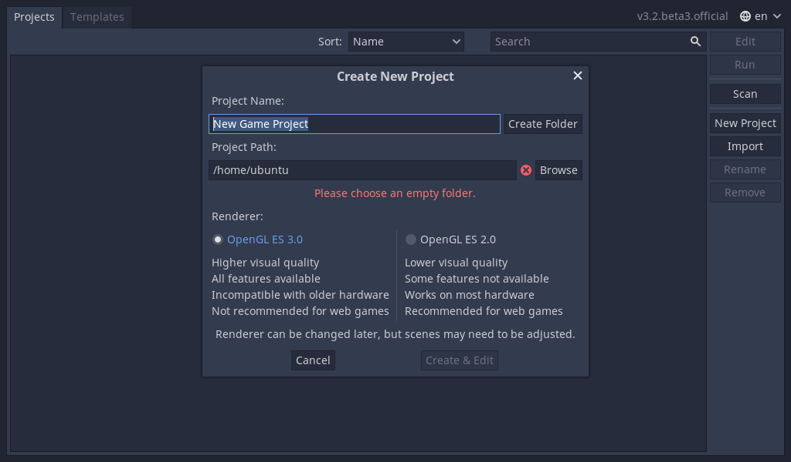

Click the Browse button to open Godot's file browser and pick a location
or type the folder's path in the Project Path field.

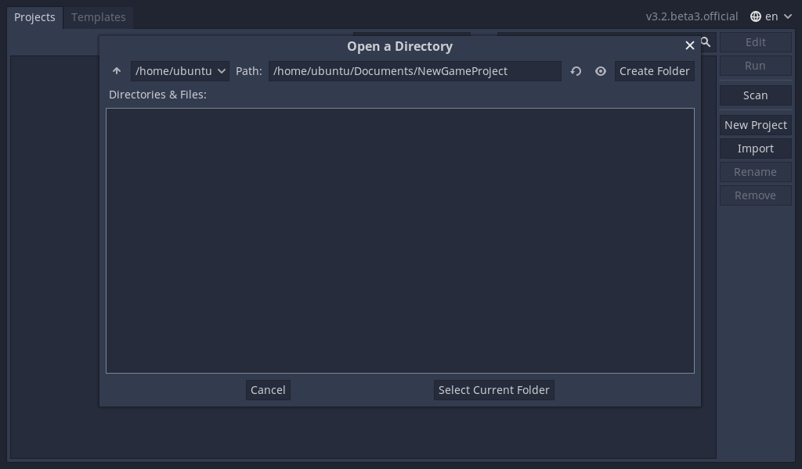

When you see the green tick on the right, it means the engine detects an
empty folder. You can also click the ``Create Folder`` button next to your
project name and an empty folder will be created with that name for the project.

Finally, you need to choose which renderer to use (OpenGL ES 3.0 or OpenGL
ES 2.0). The advantages and disadvantages of each are listed to help you choose,
and you can refer to :ref:`doc_gles2_gles3_differences` for more details. Note
that you can change the backend from the project settings if you change your mind
later on. For this tutorial either backend is fine.

Once you are done click ``Create & Edit``. Godot will create
the project for you and open it in the editor.

The next time you open the project manager, you'll see your new project in the
list. Double click on it to open it in the editor.

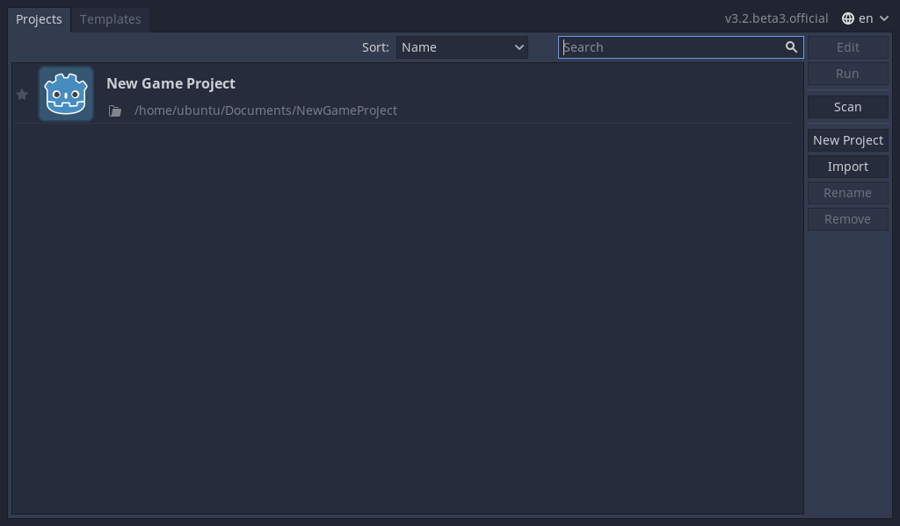

You can import existing projects in a similar way, using the Import
button. Locate the folder that contains the project or the
``project.godot`` file to import and edit it.

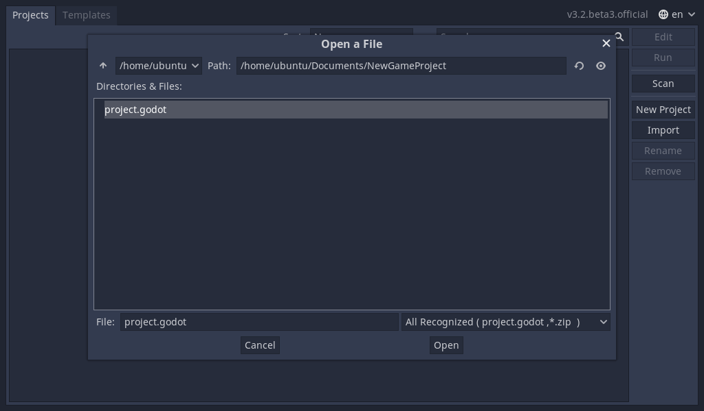

When the folder path is correct, you'll see a green checkmark.

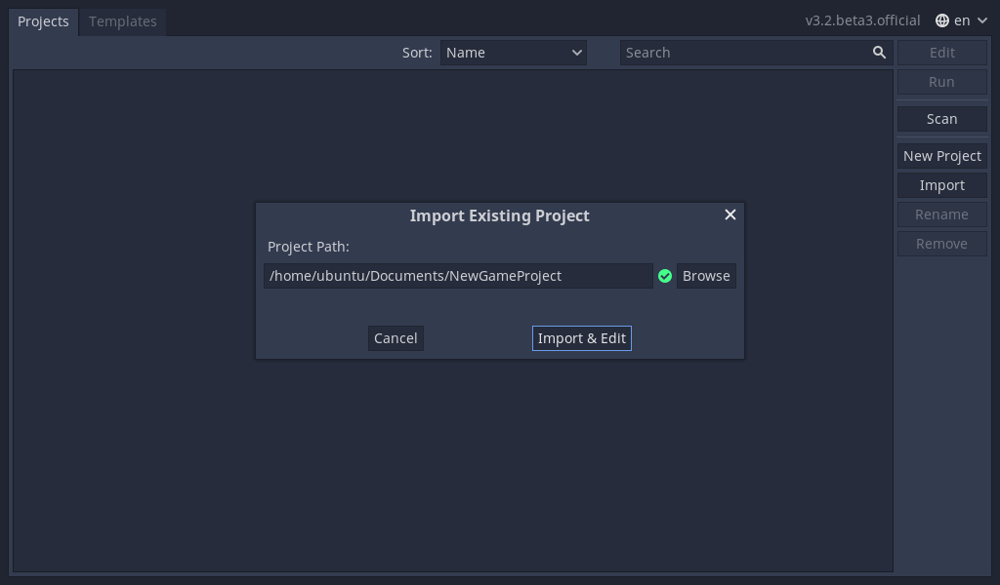

Your first look at Godot's editor
---------------------------------

Welcome to Godot! With your project open, you should see the editor's interface
with menus along the top of the interface and docks along the far extremes of
the interface on either side of the viewport.

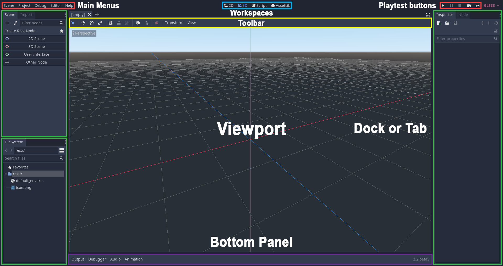

At the top, from left to right, you can see the **main menus**, the
**workspaces**, and the **playtest buttons**.

The **FileSystem dock** is where you'll manage your project files and assets.

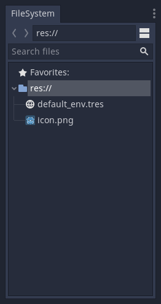

The **Scene dock** lists the active scene's content and the **Inspector**
allows for the management of the properties of a scene's content.

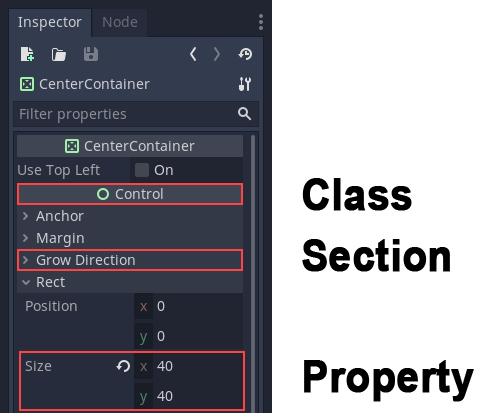

In the center, you have the **Toolbar** at the top, where you'll find
tools to move, scale or lock your scene's objects. It changes as you
jump to different workspaces.

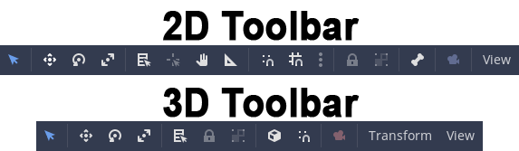

The **Bottom Panel** is the host for the debug console, the animation
editor, the audio mixer… They are wide and can take precious space.
That's why they're folded by default.

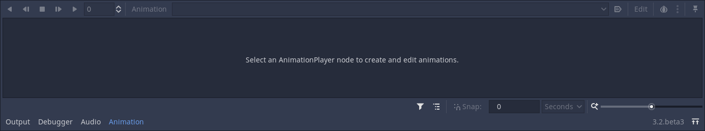

The workspaces
--------------

You can see four workspace buttons at the top: 2D, 3D, Script and
AssetLib.

You'll use the **2D workspace** for all types of games. In addition to 2D games,
the 2D workspace is where you'll build your interfaces. Press :kbd:`F1`
(or :kbd:`Alt + 1` on macOS) to access it.

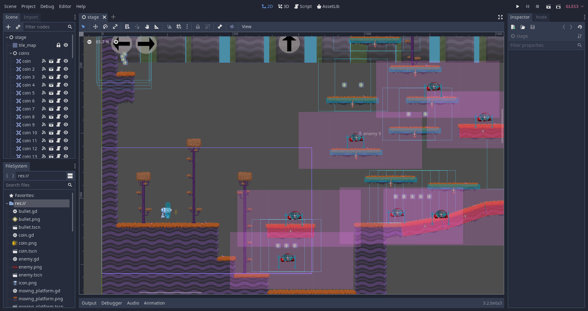

In the **3D workspace**, you can work with meshes, lights, and design
levels for 3D games. Press :kbd:`F2` (or :kbd:`Alt + 2` on macOS) to access it.

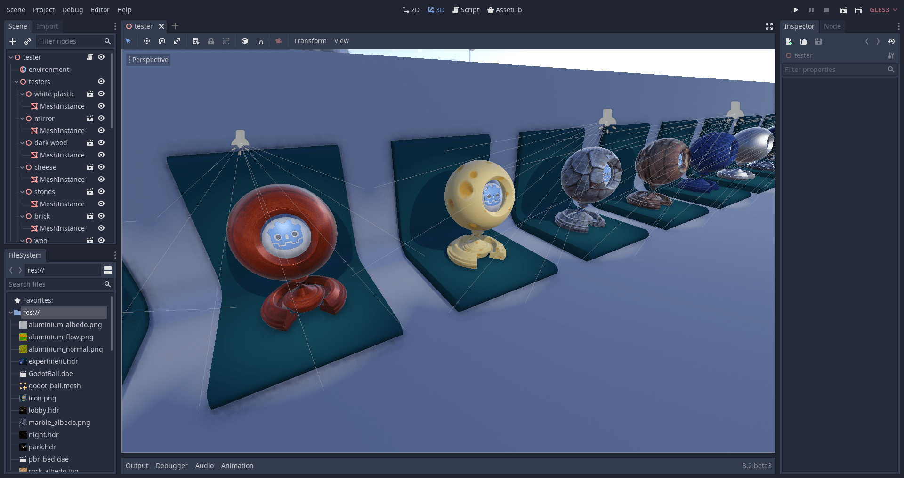

Notice the perspective button under the toolbar, it opens a list of options
related to the 3D viewport.

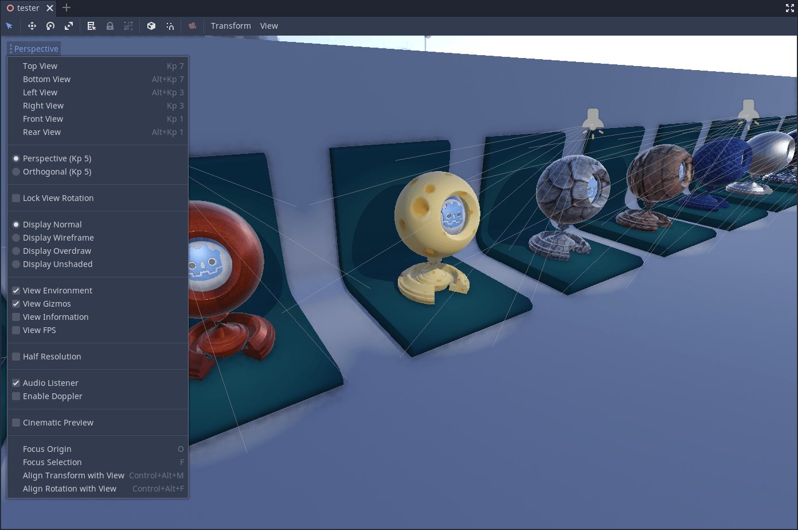

.. note:: Read :ref:`doc_introduction_to_3d` for more detail about **3D workspace**.

The **Script** workspace is a complete code editor with a debugger, rich
auto-completion, and built-in code reference. Press :kbd:`F3` (or :kbd:`Alt + 3` on macOS)
to access it, and :kbd:`F4` to search the reference.

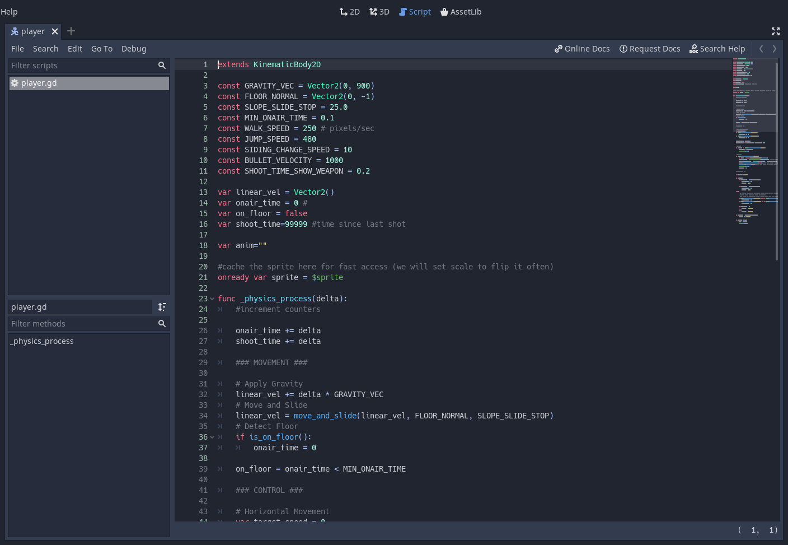

To search for information about a class, method, property, constant, or signal
in the engine while you are writing a script, press the "Search Help" button at
the top right of the Script workspace.

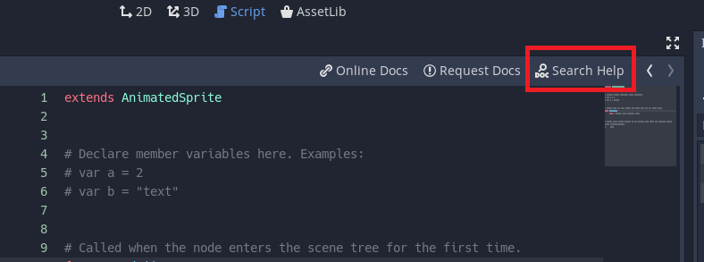

A new window will pop up. Search for the item that you want to find information
about.

.. image:: img/editor_ui_intro_script_search_help_window.png

Click on the item you are looking for and press open. The documentation for the
item will be displayed in the script workspace.

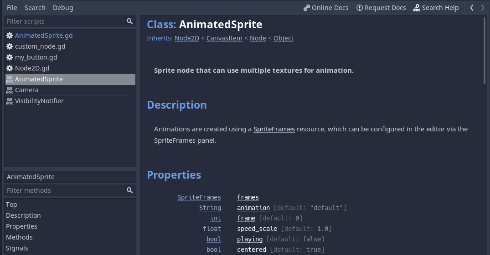

Finally, the **AssetLib** is a library of free and open source add-ons, scripts
and assets to use in your projects.

Modify the interface
--------------------

Godot's interface lives in a single window. You cannot split it across
multiple screens although you can work with an external code editor like
Atom or Visual Studio Code for instance.

Move and resize docks
~~~~~~~~~~~~~~~~~~~~~

Click and drag on the edge of any dock or panel to resize it
horizontally or vertically.

Click the three-dotted icon at the top of any dock to change its
location.

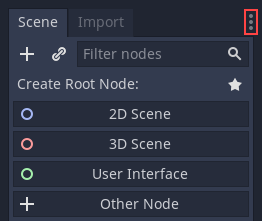

Go to the ``Editor`` menu and ``Editor Settings`` to fine-tune the look
and feel of the editor.
