.. _doc_scenes_and_nodes:

Scenes and nodes
================

Introduction
------------

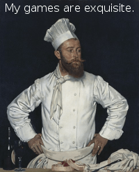

Imagine for a second that you are not a game developer anymore. Instead,
you're a chef! Change your hipster outfit for a toque and a double
breasted jacket. Now, instead of making games, you create new and
delicious recipes for your guests.

So, how does a chef create a recipe? Recipes are divided into two
sections: the first is the ingredients and the second is the
instructions to prepare it. This way, anyone can follow the recipe and
savor your magnificent creation.

Making games in Godot feels pretty much the same way. Using the engine
feels like being in a kitchen. In this kitchen, *nodes* are like a
refrigerator full of fresh ingredients with which to cook.

There are many types of nodes. Some show images, others play sound,
other nodes display 3D models, etc. There are dozens of them.

Nodes
-----

But let's start with the basics. Nodes are fundamental building blocks for
creating a game. As mentioned above, a node can perform a variety of specialized 
functions. However, any given node always has the following attributes:

-  It has a name.
-  It has editable properties.
-  It can receive a callback to process every frame.
-  It can be extended (to have more functions).
-  It can be added to other nodes as a child.

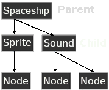

The last one is important. Nodes can have other nodes as
children. When arranged in this way, the nodes become a **tree**.

In Godot, the ability to arrange nodes in this way creates a powerful
tool for organizing projects. Since different nodes have different
functions, combining them allows for the creation of more complex functions.

Don't worry if this doesn't click yet. We will continue to explore this over
the next few sections. The most important fact to remember for now is that
nodes exist and can be arranged this way.

Scenes
------

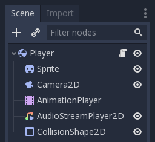

Now that the concept of nodes has been defined, the next logical
step is to explain what a Scene is.

A scene is composed of a group of nodes organized hierarchically (in
tree fashion). Furthermore, a scene:

-  always has one root node.
-  can be saved to disk and loaded back.
-  can be *instanced* (more on that later).

Running a game means running a scene. A project can contain several scenes,
but for the game to start, one of them must be selected as the main scene.

Basically, the Godot editor is a **scene editor**. It has plenty of tools for
editing 2D and 3D scenes as well as user interfaces, but the editor is based on
the concept of editing a scene and the nodes that compose it.

Creating a new project
----------------------

Let's make these abstract concepts more concrete with an example. Following a
long tradition in tutorials, we'll start with a "Hello World" project.
This will introduce us to using the editor.

If you run the godot executable outside of a project, the Project Manager
appears. This helps developers manage their projects.

.. image:: img/project_manager.png

To create a new project, click the "New Project" option. Choose and create a
path for the project and specify the project name "New Project":

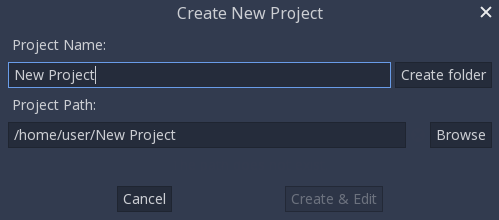

Editor
------

Once you've created the "New Project", then open it. This will open the Godot
editor:

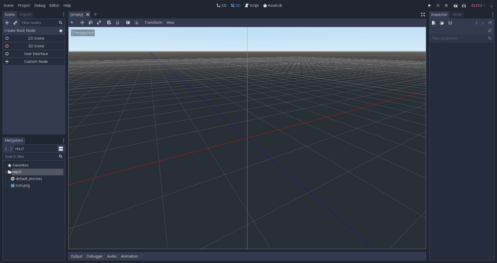

As mentioned before, making games in Godot feels like being in a
kitchen, so let's open the refrigerator and add some fresh nodes to the
project. We'll begin with a "Hello World" message that we'll put on the
screen.

To do this, press the "New Node" button (which looks like a plus symbol):

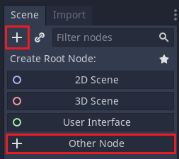

This will open the Create Node dialog, showing the long list of nodes
that can be created:

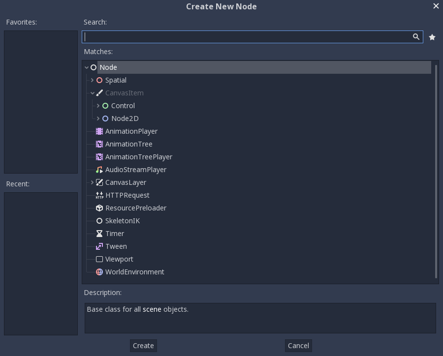

From there, select the "Label" node first. Searching for it is probably
the fastest way:

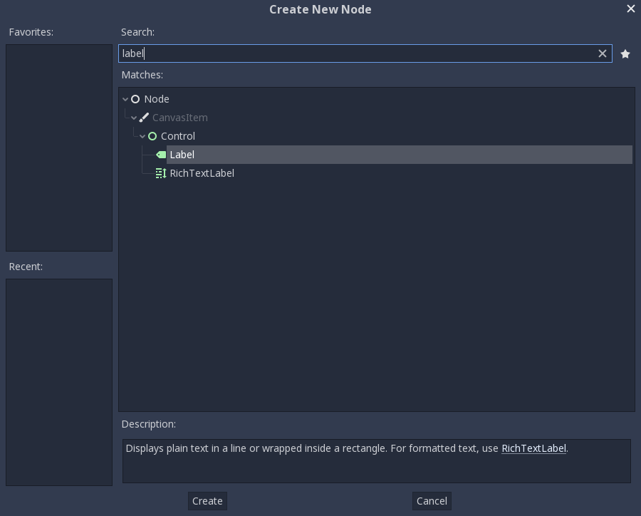

And finally, create the Label! A lot happens when Create is pressed:

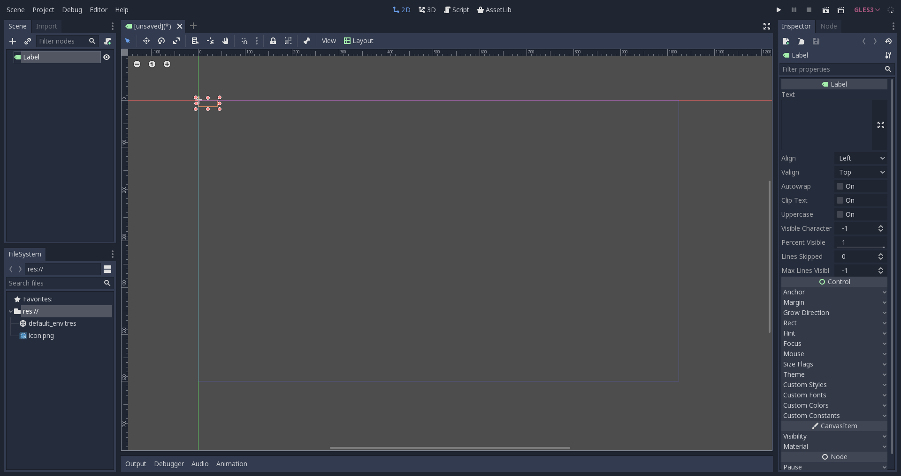

First of all, the scene changes to the 2D editor (because Label is a 2D Node
type), and the Label appears, selected, at the top left corner of the viewport.

The node appears in the scene tree editor (box in the top right
corner), and the label properties appear in the Inspector (box in the
bottom right corner).

The next step will be to change the "Text" Property of the label. Let's
change it to "Hello World":

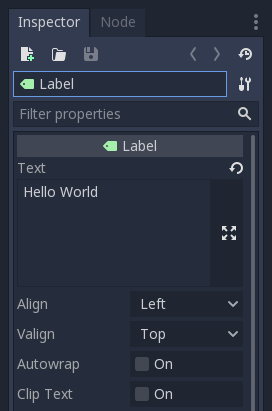

Ok, everything's ready to run the scene! Press the PLAY SCENE Button on
the top bar (or hit F6):

Aaaand... Oops.

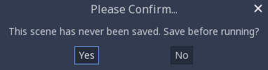

Scenes need to be saved to be run, so save the scene to something like
hello.tscn in Scene -> Save:

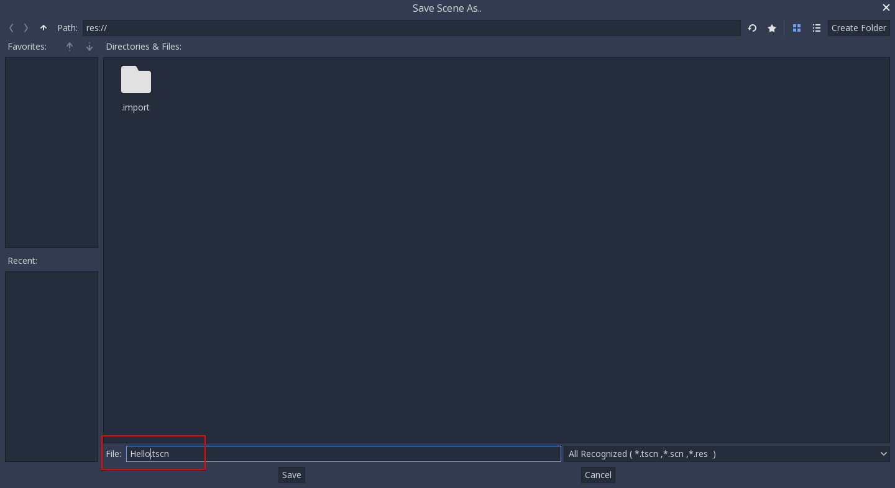

And here's when something funny happens. The file dialog is a special
file dialog, and only allows you to save inside the project. The project
root is "res://" which means "resource path". This means that files can
only be saved inside the project. For the future, when doing file
operations in Godot, remember that "res://" is the resource path, and no
matter the platform or install location, it is the way to locate where
resource files are from inside the game.

After saving the scene and pressing run scene again, the "Hello World"
demo should finally execute:

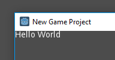

Success!

.. _doc_scenes_and_nodes-configuring_the_project:

Configuring the project
-----------------------

Ok, it's time to configure the project. Right now, the only way to run
something is to execute the current scene. Projects, however, may have several
scenes, so one of them must be set as the main scene. This is the scene that
will be loaded any time the project is run. 

These settings are all stored in a project.godot file, which is a plaintext
file in win.ini format (for easy editing). There are dozens of settings that
you can change in this file to alter how a project executes. To simplify this
process, Godot provides a project settings dialog, which acts as a sort of
frontend to editing a project.godot file.

To access that dialog, select Project -> Project Settings. Try it now.

Once the window opens, let's select a main scene. Locate the
`Application/Run/Main Scene` property and click on it to select 'hello.tscn'.

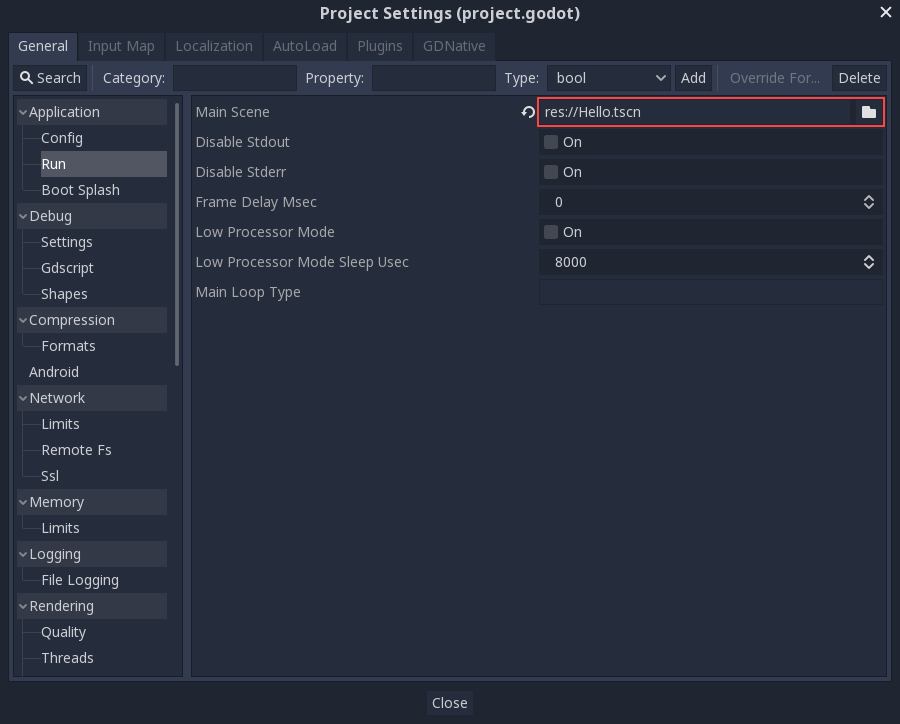

Now, with this change, when you press the regular Play button (or F5), this
scene will run, no matter which scene is actively being edited.

The project settings dialog provides a lot of options that can be saved to a
project.godot file and shows their default values. If you change a value, a
tick is marked to the left of its name. This means that the property will be
saved to the project.godot file and remembered.

As a side note, it is also possible to add custom configuration options and 
read them in at run-time using the :ref:`ProjectSettings <class_ProjectSettings>` singleton.

To be continued...
------------------

This tutorial talked about "scenes and nodes", but so far there has been
only *one* scene and *one* node! Don't worry, the next tutorial will
expand on that...
