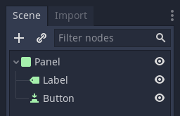
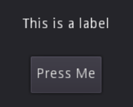
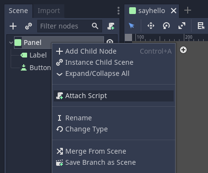
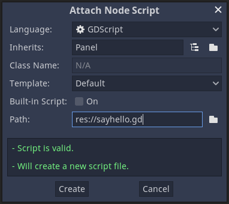
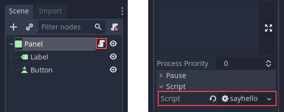
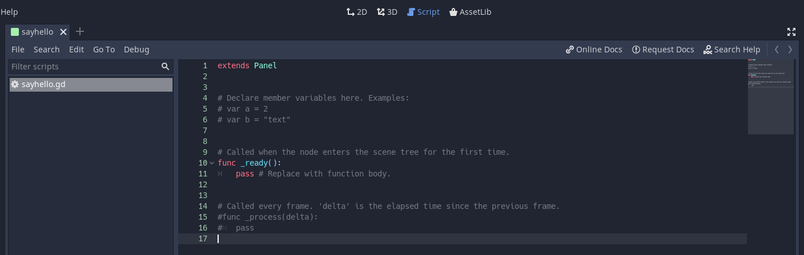
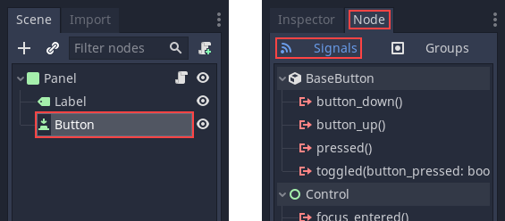
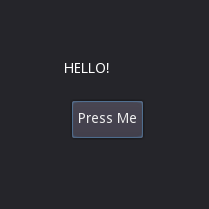

.. _doc_scripting:

Scripting
=========

Introduction
------------

Before Godot 3.0, the only choice for scripting a game was to use
:ref:`doc_gdscript`. Nowadays, Godot has four (yes, four!) official languages
and the ability to add extra scripting languages dynamically!

This is great, mostly due the large amount of flexibility provided, but
it also makes our work supporting languages more difficult.

The "Main" languages in Godot, though, are GDScript and VisualScript. The
main reason to choose them is their level of integration with Godot, as this
makes the experience smoother; both have very slick editor integration, while
C# and C++ need to be edited in a separate IDE. If you are a big fan of statically typed languages, go with C# and C++ instead.

GDScript
~~~~~~~~

:ref:`doc_gdscript` is, as mentioned above, the main language used in Godot.
Using it has some positive points compared to other languages due
to its high integration with Godot:

* It's simple, elegant, and designed to be familiar for users of other languages such as Lua, Python, Squirrel, etc.
* Loads and compiles blazingly fast.
* The editor integration is a pleasure to work with, with code completion for nodes, signals, and many other items pertaining to the scene being edited.
* Has vector types built-in (such as Vectors, transforms, etc.), making it efficient for heavy use of linear algebra.
* Supports multiple threads as efficiently as statically typed languages - one of the limitations that made us avoid VMs such as Lua, Squirrel, etc.
* Uses no garbage collector, so it trades a small bit of automation (most objects are reference counted anyway), by determinism.
* Its dynamic nature makes it easy to optimize sections of code in C++ (via GDNative) if more performance is required, all without recompiling the engine.

If you're undecided and have experience with programming, especially dynamically
typed languages, go for GDScript!

VisualScript
~~~~~~~~~~~~

Beginning with 3.0, Godot offers :ref:`Visual Scripting<doc_what_is_visual_script>`. This is a
typical implementation of a "blocks and connections" language, but
adapted to how Godot works.

Visual scripting is a great tool for non-programmers, or even for experienced developers
who want to make parts of the code more accessible to others,
like game designers or artists.

It can also be used by programmers to build state machines or custom
visual node workflows - for example, a dialogue system.

.NET / C#
~~~~~~~~~

As Microsoft's C# is a favorite amongst game developers, we have added
official support for it. C# is a mature language with tons of code
written for it, and support was added thanks to
a generous donation from Microsoft.

It has an excellent tradeoff between performance and ease of use,
although one must be aware of its garbage collector.

C# is usually the best choice for companies. The large amount of
programmers familiar with it means less time can be spent learning
Godot and more time can be spent programming with it.

Since Godot uses the `Mono <https://mono-project.com>`_ .NET runtime, in theory
any third-party .NET library or framework can be used for scripting in Godot, as
well as any Common Language Infrastructure-compliant programming language, such as
F#, Boo or ClojureCLR. In practice however, C# is the only officially supported .NET option.

GDNative / C++
~~~~~~~~~~~~~~

Finally, one of our brightest additions for the 3.0 release: 
GDNative allows scripting in C++ without needing to recompile (or even
restart) Godot.

Any C++ version can be used, and mixing compiler brands and versions for the 
generated shared libraries works perfectly, thanks to our use of an internal C
API Bridge.

This language is the best choice for performance and does not need to be
used throughout an entire game, as other parts can be written in GDScript or Visual
Script. However the API is clear and easy to use as it resembles, mostly,
Godot's actual C++ API.

More languages can be made available through the GDNative interface, but keep in mind
we don't have official support for them.

Scripting a scene
-----------------

For the rest of this tutorial we'll set up a GUI scene consisting of a
button and a label, where pressing the button will update the label. This will
demonstrate:

- Writing a script and attaching it to a node.
- Hooking up UI elements via signals.
- Writing a script that can access other nodes in the scene.

Before continuing, please make sure to read the :ref:`doc_gdscript` reference.
It's a language designed to be simple, and the reference is short, so it will not take more
than a few minutes to get an overview of the concepts.

Scene setup
~~~~~~~~~~~

Use the "Add Child Node" dialogue accessed from the Scene tab (or by pressing ``Ctrl+A``) to create a hierarchy with the following
nodes:

- Panel

  * Label
  * Button

The scene tree should look like this:

Use the 2D editor to position and resize the Button and Label so that they
look like the image below. You can set the text from the Inspector tab.

Finally, save the scene with a name such as ``sayhello.tscn``.

.. _doc_scripting-adding_a_script:

Adding a script
~~~~~~~~~~~~~~~

Right click on the Panel node, then select "Attach Script" from the context
menu:

The script creation dialog will pop up. This dialog allows you to set the
script's language, class name, and other relevant options.

In GDScript the file itself represents the class, so
the class name field will not be editable.

The node we're attaching the script to is a panel, so the Inherits field
will automatically be filled in with "Panel". This is what we want, as the
script's goal is to extend the functionality of our panel node.

Finally, enter a path name for the script and select Create:

The script will then be created and added to the node. You can
see this as an "Open script" icon next to the node in the Scene tab,
as well as in the script property under Inspector:

To edit the script, select either of these buttons, both of which are highlighted in the above image.
This will bring you to the script editor where a default template will be included:

There's not much there. The ``_ready()`` function is called when the
node, and all its children, enters the active scene. **Note:** ``_ready()`` is not
the constructor; the constructor is instead ``_init()``.

The role of the script
~~~~~~~~~~~~~~~~~~~~~~

A script adds behavior to a node. It is used to control how the node functions
as well as how it interacts with other nodes: children, parent, siblings,
and so on. The local scope of the script is the node. In other words, the script
inherits the functions provided by that node.

.. image:: /img/brainslug.jpg

Handling a signal
~~~~~~~~~~~~~~~~~

Signals are "emitted" when some specific kind of action happens, and they can be
connected to any function of any script instance. Signals are used mostly in
GUI nodes, although other nodes have them too, and you can even define custom
signals in your own scripts.

In this step, we'll connect the "pressed" signal to a custom function.

The editor provides an interface for connecting signals to your scripts. You
can access this by selecting the Button node in the scene tree and then selecting the
"Node" tab. Next, make sure that you have "Signals" selected.

At this point, you could use the visual interface to hook up the "pressed"
signal by double clicking on it and selecting a target node that already has a
script attached to it. But for the sake of learning, we're going to code up the
connection manually.

To accomplish this, we will introduce a function that is probably the most used
by Godot programmers: :ref:`Node.get_node() <class_Node_get_node>`.
This function uses paths to fetch nodes anywhere in the scene, relative to the
node that owns the script.

For the sake of convenience, delete everything underneath ``extends Panel``.
You will fill out the rest of the script manually.

Because the Button and Label are siblings under the Panel
where the script is attached, you can fetch the Button by typing
the following underneath ``extends Panel``:

.. tabs::
 .. code-tab:: gdscript GDScript

    get_node("Button")

 .. code-tab:: csharp

    GetNode("Button")

Next, write a function which will be called when the button is pressed:

.. tabs::
 .. code-tab:: gdscript GDScript

    func _on_button_pressed():  
        get_node("Label").text = "HELLO!"

 .. code-tab:: csharp

    public void _OnButtonPressed()
    {
        var label = (Label)GetNode("Label");
        label.Text = "HELLO!";
    }

Finally, connect the button's "pressed" signal to ``_ready()`` by
using :ref:`Object.connect() <class_Object_connect>`.

.. tabs::
 .. code-tab:: gdscript GDScript

    func _ready():
        get_node("Button").connect("pressed", self, "_on_button_pressed")

 .. code-tab:: csharp

    public override void _Ready()
    {
        GetNode("Button").Connect("pressed", this, nameof(_OnButtonPressed));
    }

The final script should look like this:

.. tabs::
 .. code-tab:: gdscript GDScript

    extends Panel

    func _on_button_pressed():
        get_node("Label").text = "HELLO!"

    func _ready():
        get_node("Button").connect("pressed", self, "_on_button_pressed")

 .. code-tab:: csharp

    using Godot;

    // IMPORTANT: the name of the class MUST match the filename exactly.
    // this is case sensitive!
    public class sayhello : Panel
    {
        public void _OnButtonPressed()
        {
            var label = (Label)GetNode("Label");
            label.Text = "HELLO!";
        }

        public override void _Ready()
        {
            GetNode("Button").Connect("pressed", this, nameof(_OnButtonPressed));
        }
    }

Run the scene and press the button. You should get the following result:

Why, hello there! Congratulations on scripting your first scene.

**Note:** A common misunderstanding regarding this tutorial is how ``get_node(path)``
works. For a given node, ``get_node(path)`` searches its immediate children.
In the above code, this means that Button must be a child of Panel. If
Button were instead a child of Label, the code to obtain it would be:

.. tabs::
 .. code-tab:: gdscript GDScript

    # not for this case
    # but just in case
    get_node("Label/Button") 

 .. code-tab:: csharp

    // not for this case
    // but just in case
    GetNode("Label/Button")

Also, remember that nodes are referenced by name, not by type.

