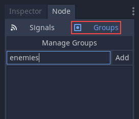
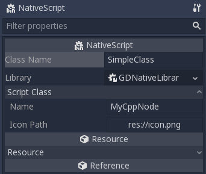

.. _doc_scripting_continued:

Scripting (continued)
=====================

Processing
----------

Several actions in Godot are triggered by callbacks or virtual functions,
so there is no need to write code that runs all the time.

However, it is still common to need a script to be processed on every
frame. There are two types of processing: idle processing and physics
processing.

Idle processing is activated when the method :ref:`Node._process() <class_Node_method__process>`
is found in a script. It can be turned off and on with the
:ref:`Node.set_process() <class_Node_method_set_process>` function.

This method will be called every time a frame is drawn:

.. tabs::
 .. code-tab:: gdscript GDScript

    func _process(delta):
        # Do something...
        pass

 .. code-tab:: csharp

    public override void _Process(float delta)
    {
        // Do something...
    }

It's important to bear in mind that the frequency with which ``_process()``
will be called depends on how many frames per second (FPS) your application
is running at. This rate can vary over time and devices.

To help manage this variability, the ``delta`` parameter contains the time
elapsed in seconds as a floating-point number since the previous call to ``_process()``.

This parameter can be used to make sure things always take the same
amount of time, regardless of the game's FPS.

For example, movement is often multiplied with a time delta to make movement
speed both constant and independent of the frame rate.

Physics processing with ``_physics_process()`` is similar, but it should be used for processes that
must happen before each physics step, such as controlling a character.
It always runs before a physics step and it is called at fixed time intervals:
60 times per second by default. You can change the interval from the Project Settings, under
Physics -> Common -> Physics Fps.

The function ``_process()``, however, is not synced with physics. Its frame rate is not constant and is dependent
on hardware and game optimization. Its execution is done after the physics step on single-threaded games.

A simple way to see the ``_process()`` function at work is to create a scene with a single Label node,
with the following script:

.. tabs::
 .. code-tab:: gdscript GDScript

    extends Label

    var accum = 0

    func _process(delta):
        accum += delta
        text = str(accum) # 'text' is a built-in label property.

 .. code-tab:: csharp

    public class CustomLabel : Label
    {
        private float _accum;

        public override void _Process(float delta)
        {
            _accum += delta;
            Text = _accum.ToString(); // 'Text' is a built-in label property.
        }
    }

Which will show a counter increasing each frame.

Groups
------

Groups in Godot work like tags you might have come across in other software.
A node can be added to as many groups as desired. This is a useful feature for
organizing large scenes. There are two ways to add nodes to groups. The
first is from the UI, using the Groups button under the Node panel:

And the second way is from code. The following script would add the current
node to the ``enemies`` group as soon as it appeared in the scene tree.

.. tabs::
 .. code-tab:: gdscript GDScript

    func _ready():
        add_to_group("enemies")

 .. code-tab:: csharp

    public override void _Ready()
    {
        base._Ready();

        AddToGroup("enemies");
    }

This way, if the player is discovered sneaking into a secret base,
all enemies can be notified about its alarm sounding by using
:ref:`SceneTree.call_group() <class_SceneTree_method_call_group>`:

.. tabs::
 .. code-tab:: gdscript GDScript

    func _on_discovered(): # This is a purely illustrative function.
        get_tree().call_group("enemies", "player_was_discovered")

 .. code-tab:: csharp

    public void _OnDiscovered() // This is a purely illustrative function.
    {
        GetTree().CallGroup("enemies", "player_was_discovered");
    }

The above code calls the function ``player_was_discovered`` on every
member of the group ``enemies``.

It is also possible to get the full list of ``enemies`` nodes by
calling
:ref:`SceneTree.get_nodes_in_group() <class_SceneTree_method_get_nodes_in_group>`:

.. tabs::
 .. code-tab:: gdscript GDScript

    var enemies = get_tree().get_nodes_in_group("enemies")

 .. code-tab:: csharp

    var enemies = GetTree().GetNodesInGroup("enemies");

The :ref:`SceneTree <class_SceneTree>` class provides many useful methods,
like interacting with scenes, their node hierarchy and groups of nodes.
It allows you to easily switch scenes or reload them,
to quit the game or pause and unpause it.
It even comes with interesting signals.
So check it out if you have some time!

Notifications
-------------

Godot has a system of notifications. These are usually not needed for
scripting, as it's too low-level and virtual functions are provided for
most of them. It's just good to know they exist. For example,
you may add an
:ref:`Object._notification() <class_Object_method__notification>`
function in your script:

.. tabs::
 .. code-tab:: gdscript GDScript

    func _notification(what):
        match what:
            NOTIFICATION_READY:
                print("This is the same as overriding _ready()...")
            NOTIFICATION_PROCESS:
                print("This is the same as overriding _process()...")

 .. code-tab:: csharp

    public override void _Notification(int what)
    {
        base._Notification(what);

        switch (what)
        {
            case NotificationReady:
                GD.Print("This is the same as overriding _Ready()...");
                break;
            case NotificationProcess:
                var delta = GetProcessDeltaTime();
                GD.Print("This is the same as overriding _Process()...");
                break;
        }
    }

The documentation of each class in the :ref:`Class Reference <toc-class-ref>`
shows the notifications it can receive. However, in most cases GDScript
provides simpler overridable functions.

Overridable functions
---------------------

Such overridable functions, which are described as
follows, can be applied to nodes:

.. tabs::
 .. code-tab:: gdscript GDScript

    func _enter_tree():
        # When the node enters the Scene Tree, it becomes active
        # and  this function is called. Children nodes have not entered
        # the active scene yet. In general, it's better to use _ready()
        # for most cases.
        pass

    func _ready():
        # This function is called after _enter_tree, but it ensures
        # that all children nodes have also entered the Scene Tree,
        # and became active.
        pass

    func _exit_tree():
        # When the node exits the Scene Tree, this function is called.
        # Children nodes have all exited the Scene Tree at this point
        # and all became inactive.
        pass

    func _process(delta):
        # This function is called every frame.
        pass

    func _physics_process(delta):
        # This is called every physics frame.
        pass

 .. code-tab:: csharp

    public override void _EnterTree()
    {
        // When the node enters the Scene Tree, it becomes active
        // and  this function is called. Children nodes have not entered
        // the active scene yet. In general, it's better to use _ready()
        // for most cases.
        base._EnterTree();
    }

    public override void _Ready()
    {
        // This function is called after _enter_tree, but it ensures
        // that all children nodes have also entered the Scene Tree,
        // and became active.
        base._Ready();
    }

    public override void _ExitTree()
    {
        // When the node exits the Scene Tree, this function is called.
        // Children nodes have all exited the Scene Tree at this point
        // and all became inactive.
        base._ExitTree();
    }

    public override void _Process(float delta)
    {
        // This function is called every frame.
        base._Process(delta);
    }

    public override void _PhysicsProcess(float delta)
    {
        // This is called every physics frame.
        base._PhysicsProcess(delta);
    }

As mentioned before, it's better to use these functions instead of
the notification system.

Creating nodes
--------------

To create a node from code, call the ``.new()`` method, like for any
other class-based datatype. For example:

.. tabs::
 .. code-tab:: gdscript GDScript

    var s
    func _ready():
        s = Sprite.new() # Create a new sprite!
        add_child(s) # Add it as a child of this node.

 .. code-tab:: csharp

    private Sprite _sprite;

    public override void _Ready()
    {
        base._Ready();

        _sprite = new Sprite(); // Create a new sprite!
        AddChild(_sprite); // Add it as a child of this node.
    }

To delete a node, be it inside or outside the scene, ``free()`` must be
used:

.. tabs::
 .. code-tab:: gdscript GDScript

    func _someaction():
        s.free() # Immediately removes the node from the scene and frees it.

 .. code-tab:: csharp

    public void _SomeAction()
    {
        _sprite.Free(); // Immediately removes the node from the scene and frees it.
    }

When a node is freed, it also frees all its child nodes. Because of
this, manually deleting nodes is much simpler than it appears. Free
the base node and everything else in the subtree goes away with it.

A situation might occur where we want to delete a node that
is currently "blocked", because it is emitting a signal or calling a
function. This will crash the game. Running Godot
with the debugger will often catch this case and warn you about it.

The safest way to delete a node is by using
:ref:`Node.queue_free() <class_Node_method_queue_free>`.
This erases the node safely during idle.

.. tabs::
 .. code-tab:: gdscript GDScript

    func _someaction():
        s.queue_free() # Removes the node from the scene and frees it when it becomes safe to do so.

 .. code-tab:: csharp

    public void _SomeAction()
    {
        _sprite.QueueFree(); // Removes the node from the scene and frees it when it becomes safe to do so.
    }

Instancing scenes
-----------------

Instancing a scene from code is done in two steps. The
first one is to load the scene from your hard drive:

.. tabs::
 .. code-tab:: gdscript GDScript

    var scene = load("res://myscene.tscn") # Will load when the script is instanced.

 .. code-tab:: csharp

    var scene = GD.Load<PackedScene>("res://myscene.tscn"); // Will load when the script is instanced.

Preloading it can be more convenient, as it happens at parse
time (GDScript only):

.. tabs::
 .. code-tab:: gdscript GDScript

    var scene = preload("res://myscene.tscn") # Will load when parsing the script.

But ``scene`` is not yet a node. It's packed in a
special resource called :ref:`PackedScene <class_PackedScene>`.
To create the actual node, the function
:ref:`PackedScene.instance() <class_PackedScene_method_instance>`
must be called. This will return the tree of nodes that can be added to
the active scene:

.. tabs::
 .. code-tab:: gdscript GDScript

    var node = scene.instance()
    add_child(node)

 .. code-tab:: csharp

    var node = scene.Instance();
    AddChild(node);

The advantage of this two-step process is that a packed scene may be
kept loaded and ready to use so that you can create as many
instances as desired. This is especially useful to quickly instance
several enemies, bullets, and other entities in the active scene.

.. _doc_scripting_continued_class_name:

Register scripts as classes
---------------------------

Godot has a "Script Class" feature to register individual scripts with the
Editor. By default, you can only access unnamed scripts by loading the file
directly.

You can name a script and register it as a type in the editor with the
``class_name`` keyword followed by the class's name. You may add a comma and an
optional path to an image to use as an icon. You will then find your new type in
the Node or Resource creation dialog.

.. tabs::
 .. code-tab:: gdscript GDScript

    extends Node

    # Declare the class name here
    class_name ScriptName, "res://path/to/optional/icon.svg"

    func _ready():
        var this = ScriptName           # reference to the script
        var cppNode = MyCppNode.new()   # new instance of a class named MyCppNode

        cppNode.queue_free()

.. warning:: In Godot 3.1:

            - Only GDScript and NativeScript, i.e., C++ and other GDNative-powered languages, can register scripts.
            - Only GDScript creates global variables for each named script.
