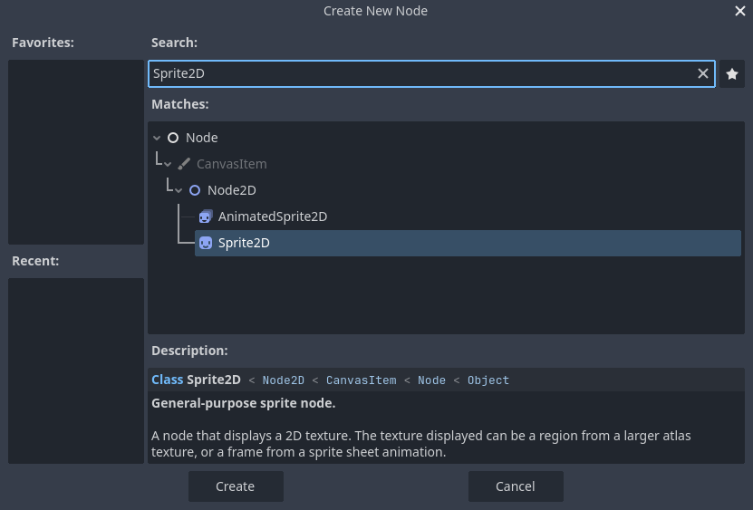
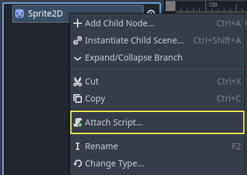
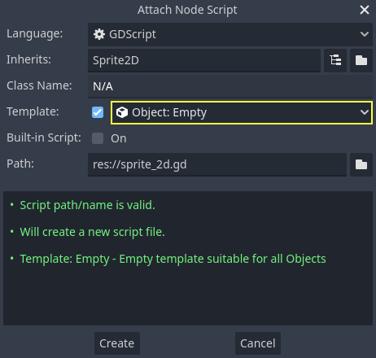
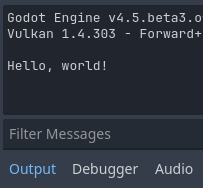

..
    Intention:

    - Giving a *short* and sweet hands-on intro to GDScript. The page should
      focus on working in the code editor.
    - We assume the reader has programming foundations. If you don't, consider
      taking the course we recommend in the :ref:`introduction to Godot page <doc_learning_programming>`.

    Techniques:

    - Creating a sprite.
    - Creating a script.
    - _init() and _process().
    - Moving an object on screen.

.. _doc_scripting_first_script:

Creating your first script
==========================

In this lesson, you will code your first script to make the Godot icon turn in
circles using GDScript. As we mentioned :ref:`in the introduction
<toc-learn-introduction>`, we assume you have programming foundations.
The equivalent C# code has been included in another tab for convenience.

.. image:: img/scripting_first_script_rotating_godot.gif

.. seealso:: To learn more about GDScript, its keywords, and its syntax, head to
             the :ref:`GDScript reference<doc_gdscript>`.

.. seealso:: To learn more about C#, head to the :ref:`C# basics <doc_c_sharp>` page.

Project setup
-------------

Please :ref:`create a new project <doc_creating_and_importing_projects>` to
start with a clean slate. Your project should contain one picture: the Godot
icon, which we often use for prototyping in the community.

.. Godot icon

We need to create a Sprite2D node to display it in the game. In the Scene dock,
click the Other Node button.

.. image:: img/scripting_first_script_click_other_node.webp

Type "Sprite2D" in the search bar to filter nodes and double-click on Sprite2D
to create the node.

Your Scene tab should now only have a Sprite2D node.

.. image:: img/scripting_first_script_scene_tree.webp

A Sprite2D node needs a texture to display. In the Inspector on the right, you
can see that the Texture property says "[empty]". To display the Godot icon,
click and drag the file ``icon.svg`` from the FileSystem dock onto the Texture
slot.

.. image:: img/scripting_first_script_setting_texture.webp

.. note::

    You can create Sprite2D nodes automatically by dragging and dropping images
    on the viewport.

Then, click and drag the icon in the viewport to center it in the game view.

.. image:: img/scripting_first_script_centering_sprite.webp

Creating a new script
---------------------

To create and attach a new script to our node, right-click on Sprite2D in the
scene dock and select "Attach Script".

The Attach Node Script window appears. It allows you to select the script's
language and file path, among other options.

Change the Template field from "Node: Default" to "Object: Empty" to start with a clean file. Leave the
other options set to their default values and click the Create button to create the script.

.. note::

    C# script names need to match their class name. In this case, you should name the
    file ``MySprite2D.cs``.

The Script workspace should appear with your new ``sprite_2d.gd`` file open and
the following line of code:

.. tabs::
 .. code-tab:: gdscript GDScript

    extends Sprite2D

 .. code-tab:: csharp C#

    using Godot;

    public partial class MySprite2D : Sprite2D
    {
    }

Every GDScript file is implicitly a class. The ``extends`` keyword defines the
class this script inherits or extends. In this case, it's ``Sprite2D``, meaning
our script will get access to all the properties and functions of the Sprite2D
node, including classes it extends, like ``Node2D``, ``CanvasItem``, and
``Node``.

.. note:: In GDScript, if you omit the line with the ``extends`` keyword, your
          class will implicitly extend :ref:`RefCounted <class_RefCounted>`, which
          Godot uses to manage your application's memory.

Inherited properties include the ones you can see in the Inspector dock, like
our node's ``texture``.

.. note::

    By default, the Inspector displays a node's properties in "Title Case", with
    capitalized words separated by a space. In GDScript code, these properties
    are in "snake_case", which is lowercase with words separated by an underscore.

    You can hover over any property's name in the Inspector to see a description and
    its identifier in code.

Hello, world!
-------------

Our script currently doesn't do anything. Let's make it print the text "Hello,
world!" to the Output bottom panel to get started.

Add the following code to your script:

.. tabs::
 .. code-tab:: gdscript GDScript

    func _init():
        print("Hello, world!")

 .. code-tab:: csharp C#

    public MySprite2D()
    {
        GD.Print("Hello, world!");
    }

Let's break it down. The ``func`` keyword defines a new function named
``_init``. This is a special name for our class's constructor. The engine calls
``_init()`` on every object or node upon creating it in memory, if you define
this function.

.. note:: GDScript is an indent-based language. The tab at the start of the line
          that says ``print()`` is necessary for the code to work. If you omit
          it or don't indent a line correctly, the editor will highlight it in
          red and display the following error message: "Indented block expected".

Save the scene as ``sprite_2d.tscn`` if you haven't already, then press :kbd:`F6` (:kbd:`Cmd + R` on macOS)
to run it. Look at the **Output** bottom panel that expands.
It should display "Hello, world!".

Delete the ``_init()`` function, so you're only left with the line ``extends
Sprite2D``.

Turning around
--------------

It's time to make our node move and rotate. To do so, we're going to add two
member variables to our script: the movement speed in pixels per second and the
angular speed in radians per second.  Add the following after the ``extends Sprite2D`` line.

.. tabs::
 .. code-tab:: gdscript GDScript

    var speed = 400
    var angular_speed = PI

 .. code-tab:: csharp C#

    private int _speed = 400;
    private float _angularSpeed = Mathf.Pi;

Member variables sit near the top of the script, after any "extends" lines,
but before functions. Every node
instance with this script attached to it will have its own copy of the ``speed``
and ``angular_speed`` properties.

.. note:: Angles in Godot work in radians by default,
          but you have built-in functions and properties available if you prefer
          to calculate angles in degrees instead.

To move our icon, we need to update its position and rotation every frame in the
game loop. We can use the ``_process()`` virtual function of the ``Node`` class.
If you define it in any class that extends the Node class, like Sprite2D, Godot
will call the function every frame and pass it an argument named ``delta``, the
time elapsed since the last frame.

.. note::

    Games work by rendering many images per second, each called a frame, and
    they do so in a loop. We measure the rate at which a game produces images in
    Frames Per Second (FPS). Most games aim for 60 FPS, although you might find
    figures like 30 FPS on slower mobile devices or 90 to 240 for virtual
    reality games.

    The engine and game developers do their best to update the game world and
    render images at a constant time interval, but there are always small
    variations in frame render times. That's why the engine provides us with
    this delta time value, making our motion independent of our framerate.

At the bottom of the script, define the function:

.. tabs::
 .. code-tab:: gdscript GDScript

    func _process(delta):
        rotation += angular_speed * delta

 .. code-tab:: csharp C#

    public override void _Process(double delta)
    {
        Rotation += _angularSpeed * (float)delta;
    }

The ``func`` keyword defines a new function. After it, we have to write the
function's name and arguments it takes in parentheses. A colon ends the
definition, and the indented blocks that follow are the function's content or
instructions.

.. note:: Notice how ``_process()``, like ``_init()``, starts with a leading
          underscore. By convention, Godot's virtual functions, that is to say,
          built-in functions you can override to communicate with the engine,
          start with an underscore.

The line inside the function, ``rotation += angular_speed * delta``, increments
our sprite's rotation every frame. Here, ``rotation`` is a property inherited
from the class ``Node2D``, which ``Sprite2D`` extends. It controls the rotation
of our node and works with radians.

.. tip:: In the code editor, you can ctrl-click on any built-in property or
         function like ``position``, ``rotation``, or ``_process`` to open the
         corresponding documentation in a new tab.

Run the scene to see the Godot icon turn in-place.

.. image:: img/scripting_first_script_godot_turning_in_place.gif

.. note:: In C#, notice how the ``delta`` argument taken by ``_Process()`` is a
          ``double``. We therefore need to convert it to ``float`` when we apply
          it to the rotation.

Moving forward
~~~~~~~~~~~~~~

Let's now make the node move. Add the following two lines inside of the ``_process()``
function, ensuring the new lines are indented the same way as the ``rotation += angular_speed * delta`` line before
them.

.. tabs::
 .. code-tab:: gdscript GDScript

    var velocity = Vector2.UP.rotated(rotation) * speed

    position += velocity * delta

 .. code-tab:: csharp C#

    var velocity = Vector2.Up.Rotated(Rotation) * _speed;

    Position += velocity * (float)delta;

As we already saw, the ``var`` keyword defines a new variable. If you put it at
the top of the script, it defines a property of the class. Inside a function, it
defines a local variable: it only exists within the function's scope.

We define a local variable named ``velocity``, a 2D vector representing both a
direction and a speed. To make the node move forward, we start from the Vector2
class's constant ``Vector2.UP``, a vector pointing up, and rotate it by calling the
Vector2 method ``rotated()``. This expression, ``Vector2.UP.rotated(rotation)``,
is a vector pointing forward relative to our icon. Multiplied by our ``speed``
property, it gives us a velocity we can use to move the node forward.

We add ``velocity * delta`` to the node's ``position`` to move it. The position
itself is of type :ref:`Vector2 <class_Vector2>`, a built-in type in Godot
representing a 2D vector.

Run the scene to see the Godot head run in circles.

.. image:: img/scripting_first_script_rotating_godot.gif

.. note:: Moving a node like that does not take into account colliding with
          walls or the floor. In :ref:`doc_your_first_2d_game`, you will learn
          another approach to moving objects while detecting collisions.

Our node currently moves by itself. In the next part,
:ref:`doc_scripting_player_input`, we'll use player input to control it.

Complete script
---------------

Here is the complete ``sprite_2d.gd`` file for reference.

.. tabs::
 .. code-tab:: gdscript GDScript

    extends Sprite2D

    var speed = 400
    var angular_speed = PI

    func _process(delta):
        rotation += angular_speed * delta

        var velocity = Vector2.UP.rotated(rotation) * speed

        position += velocity * delta

 .. code-tab:: csharp C#

    using Godot;

    public partial class MySprite2D : Sprite2D
    {
        private int _speed = 400;
        private float _angularSpeed = Mathf.Pi;

        public override void _Process(double delta)
        {
            Rotation += _angularSpeed * (float)delta;
            var velocity = Vector2.Up.Rotated(Rotation) * _speed;

            Position += velocity * (float)delta;
        }
    }
