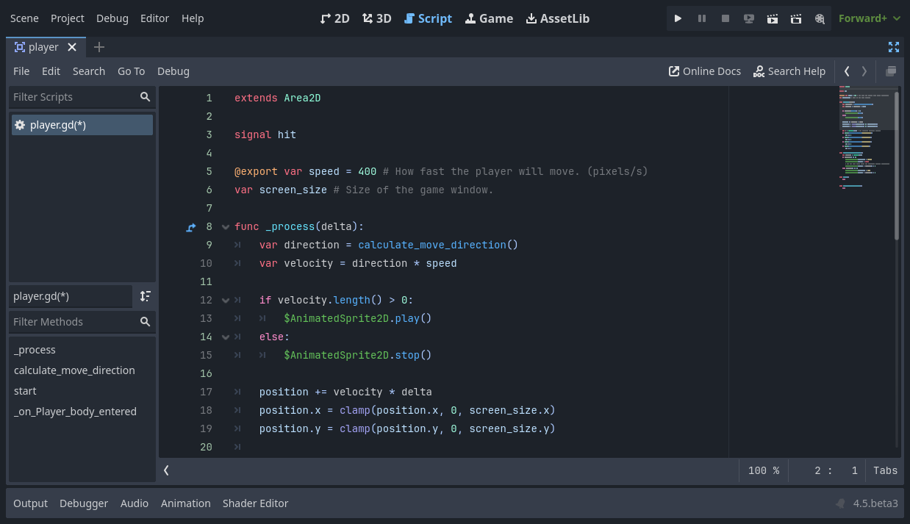

:article_outdated: True

.. Intention: only introduce what a script does in general and options for
   scripting languages.

.. _doc_scripting:

Scripting languages
===================

This lesson will give you an overview of the available scripting languages in
Godot. You will learn the pros and cons of each option. In the next part, you
will write your first script using GDScript.

**Scripts attach to a node and extend its behavior**. This means that scripts
inherit all functions and properties of the node they attach to.

For example, take a game where a Camera2D node follows a ship. The Camera2D node
follows its parent by default. Imagine you want the camera to shake when the player
takes damage. As this feature is not built into Godot, you would attach a script
to the Camera2D node and code the shake.

.. image:: img/scripting_camera_shake.gif

Available scripting languages
-----------------------------

Godot offers **four gameplay programming languages**: GDScript, C#,
and, via its GDExtension technology, C and C++. There are more
community-supported languages, but these are the official ones.

You can use multiple languages in a single project. For instance, in a team, you
could code gameplay logic in GDScript as it's fast to write, and use C# or C++ to
implement complex algorithms and maximize their performance. Or you can write
everything in GDScript or C#. It's your call.

We provide this flexibility to answer the needs of different game projects and
developers.

Which language should I use?
----------------------------

If you're a beginner, we recommend to **start with GDScript**. We made this
language specifically for Godot and the needs of game developers. It has a
lightweight and straightforward syntax and provides the tightest integration
with Godot.

For C#, you will need an external code editor like
`VSCode <https://code.visualstudio.com/>`_ or Visual Studio. While C# support is
now mature, you will find fewer learning resources for it compared to
GDScript. That's why we recommend C# mainly to users who already have experience
with the language.

Let's look at each language's features, as well as its pros and cons.

GDScript
~~~~~~~~

:ref:`GDScript<doc_gdscript>` is an
`object-oriented <https://en.wikipedia.org/wiki/Object-oriented_programming>`_ and
`imperative <https://en.wikipedia.org/wiki/Imperative_programming>`_
programming language built for Godot. It's made by and for game developers
to save you time coding games. Its features include:

- A simple syntax that leads to short files.
- Blazing fast compilation and loading times.
- Tight editor integration, with code completion for nodes, signals, and more
  information from the scene it's attached to.
- Built-in vector and transform types, making it efficient for heavy use of
  linear algebra, a must for games.
- Supports multiple threads as efficiently as statically typed languages.
- No `garbage collection
  <https://en.wikipedia.org/wiki/Garbage_collection_(computer_science)>`_, as
  this feature eventually gets in the way when creating games. The engine counts
  references and manages the memory for you in most cases by default, but you
  can also control memory if you need to.
- `Gradual typing <https://en.wikipedia.org/wiki/Gradual_typing>`_. Variables
  have dynamic types by default, but you also can use type hints for strong type
  checks.

GDScript looks like Python as you structure your code blocks using indentations,
but it doesn't work the same way in practice. It's inspired by multiple
languages, including Squirrel, Lua, and Python.

.. note::

    Why don't we use Python or Lua directly?

    Years ago, Godot used Python, then Lua. Both languages' integration took a
    lot of work and had severe limitations. For example, threading support was a
    big challenge with Python.

    Developing a dedicated language doesn't take us more work and we can tailor
    it to game developers' needs. We're now working on performance optimizations
    and features that would've been difficult to offer with third-party
    languages.

.NET / C#
~~~~~~~~~

As Microsoft's `C#
<https://en.wikipedia.org/wiki/C_Sharp_(programming_language)>`_ is a favorite
amongst game developers, we officially support it. C# is a mature and flexible
language with tons of libraries written for it. We were able to add support for it
thanks to a generous donation from Microsoft.

.. image:: img/scripting_csharp.png

C# offers a good tradeoff between performance and ease of use, although you
should be aware of its garbage collector.

.. note:: You must use the .NET edition of the Godot editor to script in C#. You
          can download it on the Godot website's `download
          <https://godotengine.org/download/>`_ page.

Since Godot uses .NET 8, in theory, you can use any third-party .NET library or
framework in Godot, as well as any Common Language Infrastructure-compliant
programming language, such as F#, Boo, or ClojureCLR. However, C# is the only
officially supported .NET option.

.. note:: GDScript code itself doesn't execute as fast as compiled C# or C++.
          However, most script code calls functions written with fast algorithms
          in C++ code inside the engine. In many cases, writing gameplay logic
          in GDScript, C#, or C++ won't have a significant impact on
          performance.

.. attention::

    Projects written in C# using Godot 4 currently cannot be exported to the web
    platform. To use C# on that platform, consider Godot 3 instead.
    Android and iOS platform support is available as of Godot 4.2, but is
    experimental and :ref:`some limitations apply <doc_c_sharp_platforms>`.

.. seealso:: To learn more about C#, head to the :ref:`doc_c_sharp` section.

C++ via GDExtension
~~~~~~~~~~~~~~~~~~~

GDExtension allows you to write game code in C++ without needing to recompile
Godot.

.. image:: img/scripting_cpp.png

You can use any version of the language or mix compiler brands and versions for
the generated shared libraries, thanks to our use of an internal C API Bridge.

GDExtension is the best choice for performance. You don't need to use it
throughout an entire game, as you can write other parts in GDScript or C#.

When working with GDExtension, the available types, functions, and properties
closely resemble Godot's actual C++ API.

Summary
-------

Scripts are files containing code that you attach to a node to extend its
functionality.

Godot supports four official scripting languages, offering you flexibility
between performance and ease of use.

You can mix languages, for instance, to implement demanding algorithms with C or
C++ and write most of the game logic with GDScript or C#.
