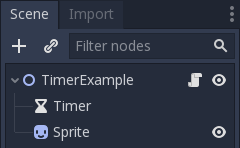
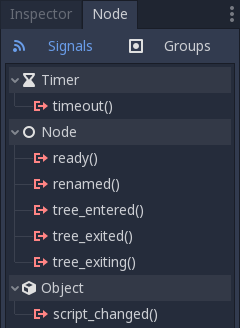
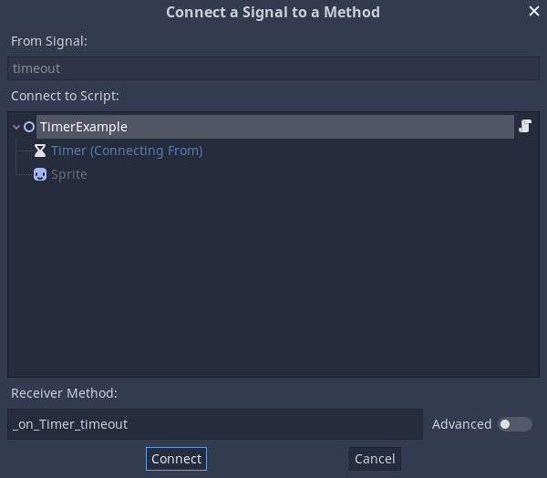
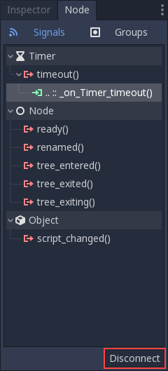

.. meta::
    :keywords: Signal

.. _doc_signals:

Signals
=======

Introduction
------------

Signals are Godot's version of the *observer* pattern. They allow a node to
send out a message that other nodes can listen for and respond to. For example,
rather than continuously checking a button to see if it's being pressed, the
button can emit a signal when it's pressed.

.. note:: You can read more about the observer pattern here: https://gameprogrammingpatterns.com/observer.html

Signals are a way to *decouple* your game objects, which leads to better organized
and more manageable code. Instead of forcing game objects to expect other objects
to always be present, they can instead emit signals that all interested objects can
subscribe to and respond to.

Below you can see some examples of how you can use signals in your own projects.

Timer example
-------------

To see how signals work, let's try using a :ref:`Timer <class_Timer>` node. Create
a new scene with a Node2D and two children: a Timer and a :ref:`Sprite <class_Sprite>`.
In the Scene dock, rename Node2D to TimerExample.

For the Sprite's texture, you can use the Godot icon, or any other image you
like. Do so by selecting ``Load`` in the Sprite's Texture attribute drop-down menu.
Attach a script to the root node, but don't add any code to it yet.

Your scene tree should look like this:

In the Timer node's properties, check the "On" box next to *Autostart*. This will
cause the timer to start automatically when you run the scene. You can leave the
*Wait Time* at 1 second.

Next to the "Inspector" tab is a tab labeled "Node". Click on this tab and you'll
see all of the signals that the selected node can emit. In the case of the Timer
node, the one we're concerned with is "timeout". This signal is emitted whenever
the Timer reaches ``0``.

Click on the "timeout()" signal and click "Connect..." at the bottom of the signals
panel. You'll see the following window, where you can define how you want to connect
the signal:

On the left side, you'll see the nodes in your scene and can select the node that
you want to "listen" for the signal. Note that the Timer node is blue, this is a
visual indication that it's the node that is emitting the signal. Select the root
node.

.. warning:: The target node *must* have a script attached or you'll receive
             an error message.

If you toggle the Advanced menu, you'll see on the right side that you can bind an arbitrary number of arguments of (possibly) different
types. This can be useful when you have more than one signal connected to the same method,
as each signal propagation will result in different values for those extra call arguments.

On the bottom of the window is a field labeled "Receiver Method". This is the name
of the function in the target node's script that you want to use. By default,
Godot will create this function using the naming convention ``_on_<node_name>_<signal_name>``
but you can change it if you wish.

Click "Connect" and you'll see that the function has been created in the script:

.. tabs::
 .. code-tab:: gdscript GDScript

    extends Node2D

    func _on_Timer_timeout():
        pass # Replace with function body.

 .. code-tab:: csharp

    public class TimerExample : Node2D
    {
        public void _on_Timer_timeout()
        {
            // Replace with function body.
        }
    }

Now we can replace the placeholder code with whatever code we want to run when
the signal is received. Let's make the Sprite blink:

.. tabs::
 .. code-tab:: gdscript GDScript

    extends Node2D

    func _on_Timer_timeout():
        # Note: the `$` operator is a shorthand for `get_node()`,
        # so `$Sprite` is equivalent to `get_node("Sprite")`.
        $Sprite.visible = !$Sprite.visible

 .. code-tab:: csharp

    public class TimerExample : Node2D
    {
        public void _on_Timer_timeout()
        {
            var sprite = GetNode<Sprite>("Sprite");
            sprite.Visible = !sprite.Visible;
        }
    }

Run the scene and you'll see the Sprite blinking on and off every second. You can
change the Timer's *Wait Time* property to alter this.

Connecting signals in code
~~~~~~~~~~~~~~~~~~~~~~~~~~

You can also make the signal connection in code rather than with the editor. This
is usually necessary when you're instancing nodes via code and so you can't use
the editor to make the connection.

First, disconnect the signal by selecting the connection in the Timer's "Node"
tab and clicking disconnect.

To make the connection in code, we can use the ``connect`` function. We'll put it
in ``_ready()`` so that the connection will be made on run. The syntax of the
function is ``<source_node>.connect(<signal_name>, <target_node>, <target_function_name>)``.
Here is the code for our Timer connection:

.. tabs::
 .. code-tab:: gdscript GDScript

    extends Node2D

    func _ready():
        $Timer.connect("timeout", self, "_on_Timer_timeout")

    func _on_Timer_timeout():
        $Sprite.visible = !$Sprite.visible

 .. code-tab:: csharp

    public class TimerExample : Node2D
    {
        public override void _Ready()
        {
            GetNode("Timer").Connect("timeout", this, nameof(_on_Timer_timeout));
        }

        public void _on_Timer_timeout()
        {
            var sprite = GetNode<Sprite>("Sprite");
            sprite.Visible = !sprite.Visible;
        }
    }

Custom signals
--------------

You can also declare your own custom signals in Godot:

.. tabs::
 .. code-tab:: gdscript GDScript

    extends Node2D

    signal my_signal

 .. code-tab:: csharp

    public class Main : Node2D
    {
        [Signal]
        public delegate void MySignal();
    }

Once declared, your custom signals will appear in the Inspector and can be connected
in the same way as a node's built-in signals.

To emit a signal via code, use the ``emit_signal`` function:

.. tabs::
 .. code-tab:: gdscript GDScript

    extends Node2D

    signal my_signal

    func _ready():
        emit_signal("my_signal")

 .. code-tab:: csharp

    public class Main : Node2D
    {
        [Signal]
        public delegate void MySignal();

        public override void _Ready()
        {
            EmitSignal(nameof(MySignal));
        }
    }

A signal can also optionally declare one or more arguments. Specify the
argument names between parentheses:

.. tabs::
 .. code-tab:: gdscript GDScript

    extends Node

    signal my_signal(value, other_value)

 .. code-tab:: csharp

    public class Main : Node
    {
        [Signal]
        public delegate void MySignal(bool value, int other_value);
    }

.. note::

    The signal arguments show up in the editor's node dock, and Godot
    can use them to generate callback functions for you. However, you can still
    emit any number of arguments when you emit signals. So it's up to you to
    emit the correct values.

To pass values, add them as the second argument to the ``emit_signal`` function:

.. tabs::
 .. code-tab:: gdscript GDScript

    extends Node

    signal my_signal(value, other_value)

    func _ready():
        emit_signal("my_signal", true, 42)

 .. code-tab:: csharp

    public class Main : Node
    {
        [Signal]
        public delegate void MySignal(bool value, int other_value);

        public override void _Ready()
        {
            EmitSignal(nameof(MySignal), true, 42);
        }
    }

Conclusion
----------

Many of Godot's built-in node types provide signals you can use to detect
events. For example, an :ref:`Area2D <class_Area2D>` representing a coin emits
a ``body_entered`` signal whenever the player's physics body enters its collision
shape, allowing you to know when the player collected it.

In the next section, :ref:`doc_your_first_game`, you'll build a complete game
including several uses of signals to connect different game components.
