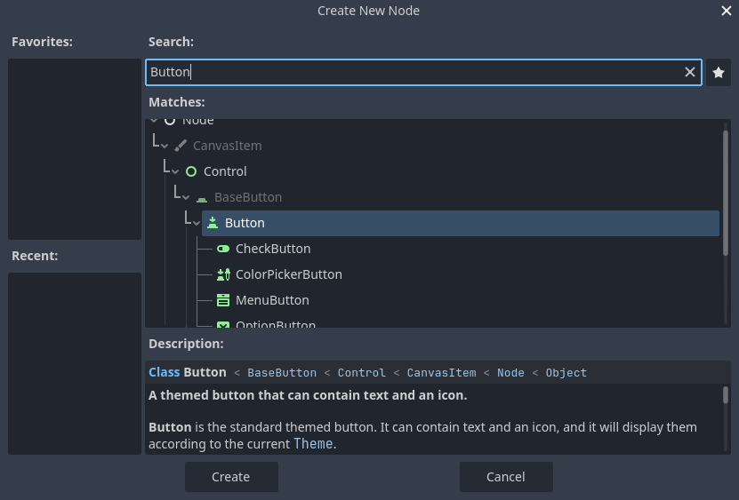
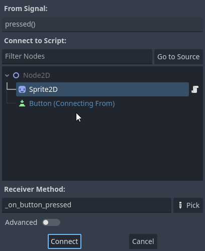
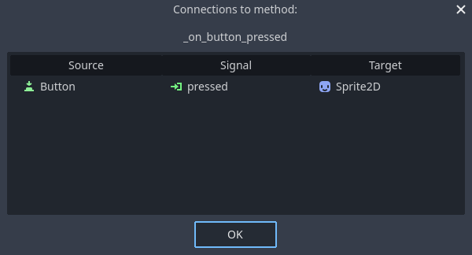
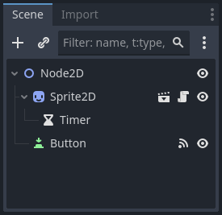
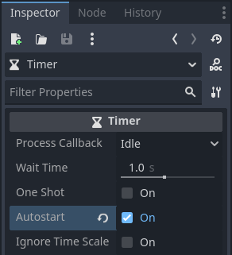
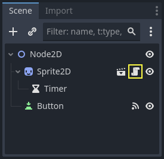

.. Intention: give the user a first taste of signals. We should write more
   documentation in the scripting/ section.
.. Note: GDScript snippets use one line return instead of two because they're
   really short.

.. meta::
    :keywords: Signal

.. _doc_signals:

Using signals
=============

In this lesson, we will look at signals. They are messages that nodes emit when
something specific happens to them, like a button being pressed. Other nodes can
connect to that signal and call a function when the event occurs.

Signals are a delegation mechanism built into Godot that allows one game object to
react to a change in another without them referencing one another. Using signals
limits `coupling
<https://en.wikipedia.org/wiki/Coupling_(computer_programming)>`_ and keeps your
code flexible.

For example, you might have a life bar on the screen that represents the
player's health. When the player takes damage or uses a healing potion, you want
the bar to reflect the change. To do so, in Godot, you would use signals.

Like methods (:ref:`class_callable`), signals are a first-class type since Godot
4.0. This means you can pass them around as method arguments directly without
having to pass them as strings, which allows for better autocompletion and is
less error-prone. See the :ref:`class_signal` class reference for a list of
what you can do with the Signal type directly.

.. seealso::

    As mentioned in the introduction, signals are Godot's version of the
    observer pattern. You can learn more about it in
    `Game Programming Patterns <https://gameprogrammingpatterns.com/observer.html>`__.

We will now use a signal to make our Godot icon from the previous lesson
(:ref:`doc_scripting_player_input`) move and stop by pressing a button.

.. note:: For this project, we will be following the Godot naming conventions.

          - **GDScript**: Classes (nodes) use PascalCase, variables and
            functions use snake_case, and constants use ALL_CAPS (See
            :ref:`doc_gdscript_styleguide`).

          - **C#**: Classes, export variables and methods use PascalCase,
            private fields use _camelCase, local variables and parameters use
            camelCase (See :ref:`doc_c_sharp_styleguide`). Be careful to type
            the method names precisely when connecting signals.

Scene setup
-----------

To add a button to our game, we will create a new scene which will include
both a :ref:`Button <class_button>` and the ``sprite_2d.tscn`` scene we created in
the :ref:`doc_scripting_first_script` lesson.

Create a new scene by going to the menu :menu:`Scene > New Scene`.

.. image:: img/signals_01_new_scene.webp

In the Scene dock, click the :button:`2D Scene` button. This will add
a :ref:`Node2D <class_Node2D>` as our root.

.. image:: img/signals_02_2d_scene.webp

In the FileSystem dock, click and drag the ``sprite_2d.tscn`` file you saved
previously onto the Node2D to instantiate it.

.. image:: img/signals_03_dragging_scene.png

We want to add another node as a sibling of the Sprite2D. To do so, right-click
on Node2D and select :button:`Add Child Node`.

.. image:: img/signals_04_add_child_node.webp

Search for the :ref:`Button <class_button>` node and add it.

The node is small by default. Click and drag on the bottom-right handle of the
Button in the viewport to resize it.

.. image:: img/signals_06_drag_button.png

If you don't see the handles, ensure the select tool is active in the toolbar.

.. image:: img/signals_07_select_tool.webp

Click and drag on the button itself to move it closer to the sprite.

You can also write a label on the Button by editing its :inspector:`Text` property
in the :ui:`Inspector`. Enter ``Toggle motion``.

.. image:: img/signals_08_toggle_motion_text.webp

Your scene tree and viewport should look like this.

.. image:: img/signals_09_scene_setup.png

Save your newly created scene as ``node_2d.tscn``, if you haven't already.
You can then run it with :kbd:`F6` (:kbd:`Cmd + R` on macOS).
At the moment, the button will be visible, but nothing will happen if you
press it.

Connecting a signal in the editor
---------------------------------

Here, we want to connect the Button's "pressed" signal to our Sprite2D, and we
want to call a new function that will toggle its motion on and off. We need to
have a script attached to the Sprite2D node, which we do from the previous
lesson.

You can connect signals in the :ui:`Node` dock. Select the Button node and, on the
right side of the editor, click on the tab named :ui:`Node` next to the
:ui:`Inspector`.

.. image:: img/signals_10_node_dock.webp

The dock displays a list of signals available on the selected node.

.. image:: img/signals_11_pressed_signals.webp

Double-click the "pressed" signal to open the node connection window.

There, you can connect the signal to the Sprite2D node. The node needs a
receiver method, a function that Godot will call when the Button emits the
signal. The editor generates one for you. By convention, we name these callback
methods "_on_node_name_signal_name". Here, it'll be "_on_button_pressed".

.. note::

   When connecting signals via the editor's Node dock, you can use two
   modes. The simple one only allows you to connect to nodes that have a
   script attached to them and creates a new callback function on them.

   .. image:: img/signals_advanced_connection_window.png

   The advanced view lets you connect to any node and any built-in
   function, add arguments to the callback, and set options. You can
   toggle the mode in the window's bottom-right by clicking the :button:`Advanced`
   button.

.. note::

    If you are using an external editor (such as VS Code), this
    automatic code generation might not work. In this case, you need to connect
    the signal via code as explained in the next section.

Click the :button:`Connect` button to complete the signal connection and jump to the
:ui:`Script` workspace. You should see the new method with a connection icon in the
left margin.

.. image:: img/signals_13_signals_connection_icon.webp

If you click the icon, a window pops up and displays information about the
connection. This feature is only available when connecting nodes in the editor.

Let's replace the line with the ``pass`` keyword with code that'll toggle the
node's motion.

Our Sprite2D moves thanks to code in the ``_process()`` function. Godot provides
a method to toggle processing on and off: :ref:`Node.set_process()
<class_Node_method_set_process>`. Another method of the Node class,
``is_processing()``, returns ``true`` if idle processing is active. We can use
the ``not`` keyword to invert the value.

.. tabs::
 .. code-tab:: gdscript GDScript

    func _on_button_pressed():
        set_process(not is_processing())

 .. code-tab:: csharp C#

    // We also specified this function name in PascalCase in the editor's connection window.
    private void OnButtonPressed()
    {
        SetProcess(!IsProcessing());
    }

This function will toggle processing and, in turn, the icon's motion on and off
upon pressing the button.

Before trying the game, we need to simplify our ``_process()`` function to move
the node automatically and not wait for user input. Replace it with the
following code, which we saw two lessons ago:

.. tabs::
 .. code-tab:: gdscript GDScript

    func _process(delta):
        rotation += angular_speed * delta
        var velocity = Vector2.UP.rotated(rotation) * speed
        position += velocity * delta

 .. code-tab:: csharp C#

    public override void _Process(double delta)
    {
        Rotation += _angularSpeed * (float)delta;
        var velocity = Vector2.Up.Rotated(Rotation) * _speed;
        Position += velocity * (float)delta;
    }

Your complete ``sprite_2d.gd`` code should look like the following.

.. tabs::
 .. code-tab:: gdscript GDScript

    extends Sprite2D

    var speed = 400
    var angular_speed = PI

    func _process(delta):
        rotation += angular_speed * delta
        var velocity = Vector2.UP.rotated(rotation) * speed
        position += velocity * delta

    func _on_button_pressed():
        set_process(not is_processing())

 .. code-tab:: csharp C#

    using Godot;

    public partial class MySprite2D : Sprite2D
    {
        private float _speed = 400;
        private float _angularSpeed = Mathf.Pi;

        public override void _Process(double delta)
        {
            Rotation += _angularSpeed * (float)delta;
            var velocity = Vector2.Up.Rotated(Rotation) * _speed;
            Position += velocity * (float)delta;
        }

        // We also specified this function name in PascalCase in the editor's connection window.
        private void OnButtonPressed()
        {
            SetProcess(!IsProcessing());
        }
    }

Run the current scene by pressing :kbd:`F6` (:kbd:`Cmd + R` on macOS),
and click the button to see the sprite start and stop.

Connecting a signal via code
----------------------------

You can connect signals via code instead of using the editor. This is necessary
when you create nodes or instantiate scenes inside of a script.

Let's use a different node here. Godot has a :ref:`Timer <class_Timer>` node
that's useful to implement skill cooldown times, weapon reloading, and more.

Head back to the 2D workspace. You can either click the "2D" text at the top of
the window or press :kbd:`Ctrl + F1` (:kbd:`Ctrl + Cmd + 1` on macOS).

In the Scene dock, right-click on the Sprite2D node and add a new child node.
Search for Timer and add the corresponding node. Your scene should now look like
this.

With the Timer node selected, go to the :ui:`Inspector` and enable the :inspector:`Autostart`
property.

Click the script icon next to Sprite2D to jump back to the scripting workspace.

We need to do two operations to connect the nodes via code:

1. Get a reference to the Timer from the Sprite2D.
2. Call the ``connect()`` method on the Timer's "timeout" signal.

.. note:: To connect to a signal via code, you need to call the ``connect()``
          method of the signal you want to listen to. In this case, we want to
          listen to the Timer's "timeout" signal.

We want to connect the signal when the scene is instantiated, and we can do that
using the :ref:`Node._ready() <class_Node_private_method__ready>` built-in function,
which is called automatically by the engine when a node is fully instantiated.

To get a reference to a node relative to the current one, we use the method
:ref:`Node.get_node() <class_Node_method_get_node>`. We can store the reference
in a variable.

.. tabs::
 .. code-tab:: gdscript GDScript

    func _ready():
        var timer = get_node("Timer")

 .. code-tab:: csharp C#

    public override void _Ready()
    {
        var timer = GetNode<Timer>("Timer");
    }

The function ``get_node()`` looks at the Sprite2D's children and gets nodes by
their name. For example, if you renamed the Timer node to "BlinkingTimer" in the
editor, you would have to change the call to ``get_node("BlinkingTimer")``.

.. add seealso to a page that explains node features.

We can now connect the Timer to the Sprite2D in the ``_ready()`` function.

.. tabs::
 .. code-tab:: gdscript GDScript

    func _ready():
        var timer = get_node("Timer")
        timer.timeout.connect(_on_timer_timeout)

 .. code-tab:: csharp C#

    public override void _Ready()
    {
        var timer = GetNode<Timer>("Timer");
        timer.Timeout += OnTimerTimeout;
    }

The line reads like so: we connect the Timer's "timeout" signal to the node to
which the script is attached. When the Timer emits ``timeout``, we want to call
the function ``_on_timer_timeout()``, that we need to define. Let's add it at the
bottom of our script and use it to toggle our sprite's visibility.

.. note:: By convention, we name these callback methods in GDScript as
          "_on_node_name_signal_name" and in C# as "OnNodeNameSignalName".
          Here, it'll be "_on_timer_timeout" for GDScript and OnTimerTimeout() for C#.

.. tabs::
 .. code-tab:: gdscript GDScript

    func _on_timer_timeout():
        visible = not visible

 .. code-tab:: csharp C#

    private void OnTimerTimeout()
    {
        Visible = !Visible;
    }

The ``visible`` property is a boolean that controls the visibility of our node.
The line ``visible = not visible`` toggles the value. If ``visible`` is
``true``, it becomes ``false``, and vice-versa.

If you run the Node2D scene now, you will see that the sprite blinks on and off, at one
second intervals.

Complete script
---------------

That's it for our little moving and blinking Godot icon demo!
Here is the complete ``sprite_2d.gd`` file for reference.

.. tabs::
 .. code-tab:: gdscript GDScript

    extends Sprite2D

    var speed = 400
    var angular_speed = PI

    func _ready():
        var timer = get_node("Timer")
        timer.timeout.connect(_on_timer_timeout)

    func _process(delta):
        rotation += angular_speed * delta
        var velocity = Vector2.UP.rotated(rotation) * speed
        position += velocity * delta

    func _on_button_pressed():
        set_process(not is_processing())

    func _on_timer_timeout():
        visible = not visible

 .. code-tab:: csharp C#

    using Godot;

    public partial class MySprite2D : Sprite2D
    {
        private float _speed = 400;
        private float _angularSpeed = Mathf.Pi;

        public override void _Ready()
        {
            var timer = GetNode<Timer>("Timer");
            timer.Timeout += OnTimerTimeout;
        }

        public override void _Process(double delta)
        {
            Rotation += _angularSpeed * (float)delta;
            var velocity = Vector2.Up.Rotated(Rotation) * _speed;
            Position += velocity * (float)delta;
        }

        // We also specified this function name in PascalCase in the editor's connection window.
        private void OnButtonPressed()
        {
            SetProcess(!IsProcessing());
        }

        private void OnTimerTimeout()
        {
            Visible = !Visible;
        }
    }

Custom signals
--------------

.. note:: This section is a reference on how to define and use your own signals,
          and does not build upon the project created in previous lessons.

You can define custom signals in a script. Say, for example, that you want to
show a game over screen when the player's health reaches zero. To do so, you
could define a signal named "died" or "health_depleted" when their health
reaches 0.

.. tabs::
 .. code-tab:: gdscript GDScript

    extends Node2D

    signal health_depleted

    var health = 10

 .. code-tab:: csharp C#

    using Godot;

    public partial class MyNode2D : Node2D
    {
        [Signal]
        public delegate void HealthDepletedEventHandler();

        private int _health = 10;
    }

.. note:: As signals represent events that just occurred, we generally use an
          action verb in the past tense in their names.

Your signals work the same way as built-in ones: they appear in the :ui:`Node` tab and
you can connect to them like any other.

.. image:: img/signals_17_custom_signal.webp

To emit a signal in your scripts, call ``emit()`` on the signal.

.. tabs::
 .. code-tab:: gdscript GDScript

    func take_damage(amount):
        health -= amount
        if health <= 0:
            health_depleted.emit()

 .. code-tab:: csharp C#

    public void TakeDamage(int amount)
    {
        _health -= amount;

        if (_health <= 0)
        {
            EmitSignal(SignalName.HealthDepleted);
        }
    }

A signal can optionally declare one or more arguments. Specify the argument
names between parentheses:

.. tabs::
 .. code-tab:: gdscript GDScript

    extends Node2D

    signal health_changed(old_value, new_value)

    var health = 10

 .. code-tab:: csharp C#

    using Godot;

    public partial class MyNode : Node
    {
        [Signal]
        public delegate void HealthChangedEventHandler(int oldValue, int newValue);

        private int _health = 10;
    }

.. note::

    The signal arguments show up in the editor's node dock, and Godot can use
    them to generate callback functions for you. However, you can still emit any
    number of arguments when you emit signals. So it's up to you to emit the
    correct values.

To emit values along with the signal, add them as extra arguments to the
``emit()`` function:

.. tabs::
 .. code-tab:: gdscript GDScript

    func take_damage(amount):
        var old_health = health
        health -= amount
        health_changed.emit(old_health, health)

 .. code-tab:: csharp C#

    public void TakeDamage(int amount)
    {
        int oldHealth = _health;
        _health -= amount;
        EmitSignal(SignalName.HealthChanged, oldHealth, _health);
    }

Summary
-------

Any node in Godot emits signals when something specific happens to them, like a
button being pressed. Other nodes can connect to individual signals and react to
selected events.

Signals have many uses. With them, you can react to a node entering or exiting
the game world, to a collision, to a character entering or leaving an area, to
an element of the interface changing size, and much more.

For example, an :ref:`Area2D <class_Area2D>` representing a coin emits a
``body_entered`` signal whenever the player's physics body enters its collision
shape, allowing you to know when the player collected it.

In the next section, :ref:`doc_your_first_2d_game`, you'll create a complete 2D
game and put everything you learned so far into practice.
