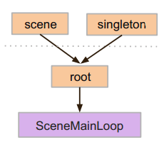
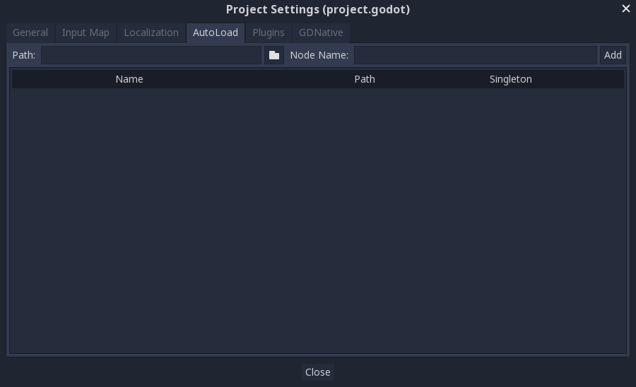
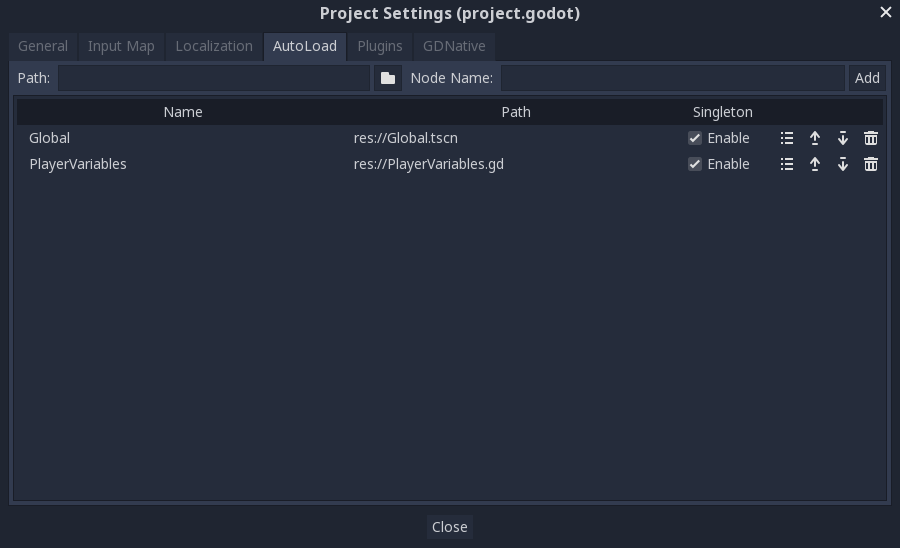
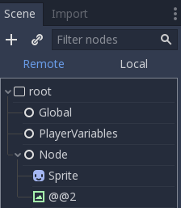
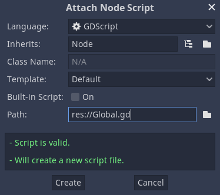
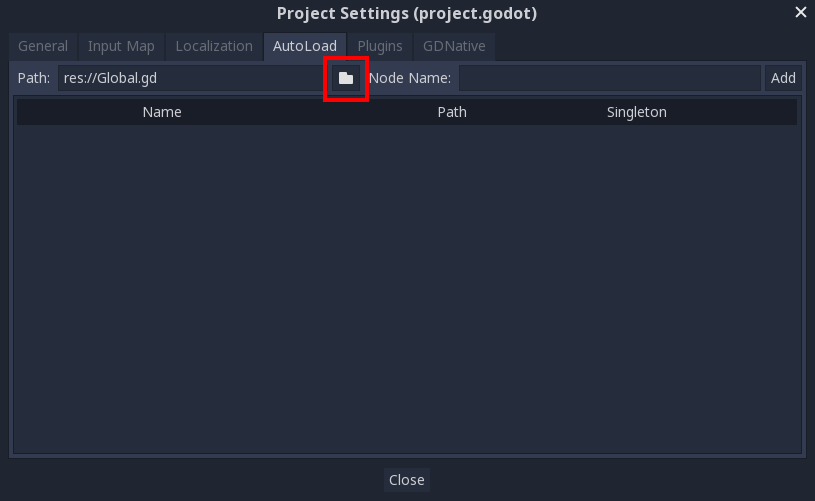

.. _doc_singletons_autoload:

Singletons (AutoLoad)
=====================

Introduction
------------

Godot's scene system, while powerful and flexible, has a drawback: there is no
method for storing information (e.g. a player's score or inventory) that is
needed by more than one scene.

It's possible to address this with some workarounds, but they come with their
own limitations:

-  You can use a "master" scene that loads and unloads other scenes as
   its children. However, this means you can no longer run those scenes
   individually and expect them to work correctly.
-  Information can be stored to disk in ``user://`` and then loaded by scenes
   that require it, but frequently saving and loading data is cumbersome and
   may be slow.

The `Singleton Pattern <https://en.wikipedia.org/wiki/Singleton_pattern>`_ is
a useful tool for solving the common use case where you need to store
persistent information between scenes. In our case it is possible re-use the
same scene or class for multiple singletons, so long as they have different
names.

Using this concept, you can create objects that:

-  Are always loaded, no matter which scene is currently running
-  Can store global variables, such as player information
-  Can handle switching scenes and between-scene transitions
-  Act like a singleton, since GDScript does not support global variables by design

Autoloading nodes and scripts can give us these characteristics.

AutoLoad
--------

You can use AutoLoad to load a scene or a script that inherits from
:ref:`Node <class_Node>`. Note: when autoloading a script, a Node will be
created and the script will be attached to it. This node will be added to the
root viewport before any other scenes are loaded.

To autoload a scene or script, select ``Project -> Project Settings`` from the
menu and switch to the "AutoLoad" tab.

Here you can add any number of scenes or scripts. Each entry in the list
requires a name, which is assigned as the node's ``name`` property. The order of
the entries as they are added to the global scene tree can be manipulated using
the up/down arrow keys.

This means that any node can access a singleton named "PlayerVariables" with:

.. tabs::
 .. code-tab:: gdscript GDScript

   var player_vars = get_node("/root/PlayerVariables")
   player_vars.health -= 10

 .. code-tab:: csharp

    var playerVariables = (PlayerVariables)GetNode("/root/PlayerVariables");
    playerVariables.Health -= 10; // Instance field.

If the "Enable" column is checked (default ``true``) then the singleton can simply
be accessed directly:

.. tabs::
 .. code-tab:: gdscript GDScript

   PlayerVariables.health -= 10

 .. code-tab:: csharp

    // Static members can be accessed by using the class name.
    PlayerVariables.Health -= 10;

Note that autoload objects (scripts and/or scenes) are accessed just like any
other node in the scene tree. In fact, if you look at the running scene tree,
you'll see the autoloaded nodes appear:

Custom scene switcher
---------------------

This tutorial will demonstrate building a scene switcher using autoload. For
basic scene switching, you can use the
:ref:`SceneTree.change_scene() <class_SceneTree_method_change_scene>`
method (see :ref:`doc_scene_tree` for details). However, if you need more
complex behavior when changing scenes, this method provides more functionality.

To begin, download the template from here:
:download:`autoload.zip <files/autoload.zip>` and open it in Godot.

The project contains two scenes: ``Scene1.tscn`` and ``Scene2.tscn``. Each
scene contains a label displaying the scene name and a button with its
``pressed()`` signal connected. When you run the project, it starts in
``Scene1.tscn``. However, pressing the button does nothing.

Global.gd
~~~~~~~~~

Switch to the "Script" tab and create a new script called Global.gd. Make sure
it inherits from ``Node``:

The next step is to add this script to the autoLoad list. Open
``Project > Project Settings`` from the menu, switch to the "AutoLoad" tab and
select the script by clicking the browse button or typing its path:
``res://Global.gd``. Press "Add" to add it to the autoload list:

Now whenever we run any scene in the project, this script will always be loaded.

Returning to the script, it needs to fetch the current scene in the
`_ready()` function. Both the current scene (the one with the button) and
``global.gd`` are children of root, but autoloaded nodes are always first. This
means that the last child of root is always the loaded scene.

.. tabs::
 .. code-tab:: gdscript GDScript

    extends Node

    var current_scene = null

    func _ready():
        var root = get_tree().get_root()
        current_scene = root.get_child(root.get_child_count() - 1)

 .. code-tab:: csharp

    using Godot;
    using System;

    public class Global : Godot.Node
    {
        public Node CurrentScene { get; set; }

        public override void _Ready()
        {
            Viewport root = GetTree().GetRoot();
            CurrentScene = root.GetChild(root.GetChildCount() - 1);
        }
    }

Now we need a function for changing the scene. This function needs to free the
current scene and replace it with the requested one.

.. tabs::
 .. code-tab:: gdscript GDScript

    func goto_scene(path):
        # This function will usually be called from a signal callback,
        # or some other function in the current scene.
        # Deleting the current scene at this point is
        # a bad idea, because it may still be executing code.
        # This will result in a crash or unexpected behavior.

        # The solution is to defer the load to a later time, when
        # we can be sure that no code from the current scene is running:

        call_deferred("_deferred_goto_scene", path)

    func _deferred_goto_scene(path):
        # It is now safe to remove the current scene
        current_scene.free()

        # Load the new scene.
        var s = ResourceLoader.load(path)

        # Instance the new scene.
        current_scene = s.instance()

        # Add it to the active scene, as child of root.
        get_tree().get_root().add_child(current_scene)

        # Optionally, to make it compatible with the SceneTree.change_scene() API.
        get_tree().set_current_scene(current_scene)

 .. code-tab:: csharp

    public void GotoScene(string path)
    {
        // This function will usually be called from a signal callback,
        // or some other function from the current scene.
        // Deleting the current scene at this point is
        // a bad idea, because it may still be executing code.
        // This will result in a crash or unexpected behavior.

        // The solution is to defer the load to a later time, when
        // we can be sure that no code from the current scene is running:

        CallDeferred(nameof(DeferredGotoScene), path);
    }

    public void DeferredGotoScene(string path)
    {
        // It is now safe to remove the current scene
        CurrentScene.Free();

        // Load a new scene.
        var nextScene = (PackedScene)GD.Load(path);

        // Instance the new scene.
        CurrentScene = nextScene.Instance();

        // Add it to the active scene, as child of root.
        GetTree().GetRoot().AddChild(CurrentScene);

        // Optionally, to make it compatible with the SceneTree.change_scene() API.
        GetTree().SetCurrentScene(CurrentScene);
    }

Using :ref:`Object.call_deferred() <class_Object_method_call_deferred>`,
the second function will only run once all code from the current scene has
completed. Thus, the current scene will not be removed while it is
still being used (i.e. its code is still running).

Finally, we need to fill the empty callback functions in the two scenes:

.. tabs::
 .. code-tab:: gdscript GDScript

    # Add to 'Scene1.gd'.

    func _on_Button_pressed():
        Global.goto_scene("res://Scene2.tscn")

 .. code-tab:: csharp

    // Add to 'Scene1.cs'.

    public void OnButtonPressed()
    {
        var global = (Global)GetNode("/root/Global");
        global.GotoScene("res://Scene2.tscn");
    }

and

.. tabs::
 .. code-tab:: gdscript GDScript

    # Add to 'Scene2.gd'.

    func _on_Button_pressed():
        Global.goto_scene("res://Scene1.tscn")

 .. code-tab:: csharp

    // Add to 'Scene2.cs'.

    public void OnButtonPressed()
    {
        var global = (Global)GetNode("/root/Global");
        global.GotoScene("res://Scene1.tscn");
    }

Run the project and test that you can switch between scenes by pressing
the button.

Note: When scenes are small, the transition is instantaneous. However, if your
scenes are more complex, they may take a noticeable amount of time to appear. To
learn how to handle this, see the next tutorial: :ref:`doc_background_loading`
