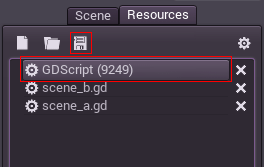
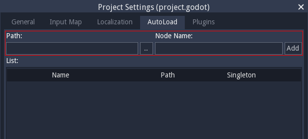

.. _doc_singletons_autoload:

Singletons (AutoLoad)
=====================

Introduction
------------

Scene singletons are useful, catering to a common use case where you need
to store persistent information between scenes.

Albeit powerful, the scene system by itself has a few drawbacks:

-  There is no common place to store information (e.g. a player's items etc.)
   required by more than one scene.
-  While it is possible for a scene that loads and unloads other scenes as 
   its children to store information common to these child scenes, it is no 
   longer possible to run these scenes by themselves and expect them to work 
   correctly.
-  While information can be stored to disk in \`user://\` and this information 
   can be loaded by scenes that require it, continuously saving and loading this 
   data when changing scenes is cumbersome and may be slow.

However there is still a need in Godot to create parts of a scene that:

-  Are always loaded, no matter which scene is opened from the editor
-  Can store global variables, such as player information, items, money
   etc. and share information between scenes
-  Can handle switching scenes and transitions
-  Acts like a singleton, since GDScript does not support global variables by design.

Auto-loading nodes and scripts caters to this need.

AutoLoad
--------

You can use AutoLoad to load a scene, or a script that inherits from Node (a node
will be created and the script will be set to it). 

To autoload a scene or script, select Project > Project Settings from the menu and switch
to the AutoLoad tab. Each entry in the list requires a name, which is used as the name
of the node, and the node is always added to the root viewport before any other scenes 
are loaded.

.. image:: img/singleton.png

This means that any node can access a singleton named "playervariables" with:

.. tabs::
 .. code-tab:: gdscript GDScript

   var player_vars = get_node("/root/playervariables")
   player_vars.health

 .. code-tab:: csharp
 
    var playerVariables = (PlayerVariables)GetNode("/root/PlayerVariables");
    playerVariables.Health -= 10; // Instance field.

Or even simpler using the name directly:

.. tabs::
 .. code-tab:: gdscript GDScript

   playervariables.health

 .. code-tab:: csharp

    // Static members can be accessed by using the class name.
    PlayerVariables.Health -= 10;

Custom scene switcher
---------------------

This short tutorial will explain how to make a scene switcher using
autoload. For simple scene switching, the
:ref:`SceneTree.change_scene() <class_SceneTree_change_scene>`
method suffices (described in :ref:`doc_scene_tree`), so this method is for
more complex behavior when switching between scenes.

First download the template from here:
:download:`autoload.zip <files/autoload.zip>`, then open it.

Two scenes are present, scene_a.tscn and scene_b.tscn on an otherwise
empty project. Each are identical and contain a button connected to a
callback for switching to the other scene. When the project runs, it
starts in scene_a.tscn. However, this currently does nothing and pressing the
button does not work.

global.gd
---------

First of all, create a global.gd script. The easy way to create a
resource from scratch is from the new resource button in the inspector tab:

.. image:: img/newscript.png

Save the script as `global.gd`:

The script should open in the script editor. The next step is to add
it to AutoLoad list. Select Project > Project Settings from the menu,
switch to the AutoLoad tab and add a new entry with name "global" that
points to this file:

Now, whenever you run any of your scenes, the script is always loaded.

Returning to our script, the current scene needs to be fetched in the 
`_ready()` function. Both the current scene and `global.gd` are children of
root, but the autoloaded nodes are always first. This means that the
last child of root is always the loaded scene.

Note: Make sure that global.gd extends Node, otherwise it won't be
loaded!

.. tabs::
 .. code-tab:: gdscript GDScript

    extends Node

    var current_scene = null

    func _ready():
            var root = get_tree().get_root()
            current_scene = root.get_child(root.get_child_count() -1)

 .. code-tab:: csharp

    using Godot;
    using System;

    public class Global : Godot.Node
    {
        public Node CurrentScene { get; set; }

        public override void _Ready()
        {
            Viewport root = GetTree().GetRoot();
            CurrentScene = root.GetChild(root.GetChildCount() - 1);
        }
    }

Next up is the function for changing the scene. This function frees the
current scene and replaces it with the requested one.

.. tabs::
 .. code-tab:: gdscript GDScript

    func goto_scene(path):
        # This function will usually be called from a signal callback,
        # or some other function from the running scene.
        # Deleting the current scene at this point might be
        # a bad idea, because it may be inside of a callback or function of it.
        # The worst case will be a crash or unexpected behavior.

        # The way around this is deferring the load to a later time, when
        # it is ensured that no code from the current scene is running:

        call_deferred("_deferred_goto_scene", path)

    func _deferred_goto_scene(path):
        # Immediately free the current scene,
        # there is no risk here.    
        current_scene.free()

        # Load new scene.
        var s = ResourceLoader.load(path)

        # Instance the new scene.
        current_scene = s.instance()

        # Add it to the active scene, as child of root.
        get_tree().get_root().add_child(current_scene)

        # Optional, to make it compatible with the SceneTree.change_scene() API.
        get_tree().set_current_scene(current_scene)

 .. code-tab:: csharp

    public void GotoScene(string path)
    {
        // This function will usually be called from a signal callback,
        // or some other function from the running scene.
        // Deleting the current scene at this point might be
        // a bad idea, because it may be inside of a callback or function of it.
        // The worst case will be a crash or unexpected behavior.

        // The way around this is deferring the load to a later time, when
        // it is ensured that no code from the current scene is running:

        CallDeferred(nameof(DeferredGotoScene), path);
    }

    public void DeferredGotoScene(string path)
    {
        // Immediately free the current scene, there is no risk here.
        CurrentScene.Free();

        // Load a new scene.
        var nextScene = (PackedScene)GD.Load(path);

        // Instance the new scene.
        CurrentScene = nextScene.Instance();

        // Add it to the active scene, as child of root.
        GetTree().GetRoot().AddChild(CurrentScene);

        // Optional, to make it compatible with the SceneTree.change_scene() API.
        GetTree().SetCurrentScene(CurrentScene);
    }

As mentioned in the comments above, we want to avoid the
situation of having the current scene being deleted while being used
(code from functions of it being run), so using
:ref:`Object.call_deferred() <class_Object_call_deferred>`
is desired at this point. The result is that execution of the commands
in the second function will happen at a later time when no code from
the current scene is running.

Finally, all that is left is to fill the empty functions in scene_a.gd
and scene_b.gd:

.. tabs::
 .. code-tab:: gdscript GDScript

    # Add to 'scene_a.gd'.

    func _on_goto_scene_pressed():
            get_node("/root/global").goto_scene("res://scene_b.scn")

 .. code-tab:: csharp

    // Add to 'SceneA.cs'.

    public void OnGotoScenePressed()
    {
        var global = (Global)GetNode("/root/Global");
        global.GotoScene("res://scene_b.tscn");
    }

and

.. tabs::
 .. code-tab:: gdscript GDScript

    # Add to 'scene_b.gd'.

    func _on_goto_scene_pressed():
            get_node("/root/global").goto_scene("res://scene_a.scn")

 .. code-tab:: csharp

    // Add to 'SceneB.cs'.

    public void OnGotoScenePressed()
    {
        var global = (Global)GetNode("/root/Global");
        global.GotoScene("res://scene_a.tscn");
    }

Now if you run the project, you can switch between both scenes by pressing
the button!

To load scenes with a progress bar, check out the next tutorial,
:ref:`doc_background_loading`
