.. _doc_ui_code_a_life_bar:

Control the game's UI with code
===============================

Intro
-----

In this tutorial, you will connect a character to a life bar and animate
the health loss.

.. figure:: img/lifebar_tutorial_final_result.gif

   Here's what you'll create: the bar and the counter animate when
   the character takes a hit. They fade when it dies.

You will learn:

-  How to **connect** a character to a GUI with signals
-  How to **control** a GUI with GDscript
-  How to **animate** a life bar with the :ref:`Tween <class_Tween>` node

If you want to learn how to set up the interface instead, check out the
step-by-step UI tutorials:

-  Create a main menu screen
-  Create a game user interface

When you code a game, you want to build the core gameplay first: the
main mechanics, player input, win and loss conditions. The UI comes a
bit later. You want to keep all the elements that make up your project
separate if possible. Each character should be in its own scene, with
its own scripts, and so should the UI elements. This prevents bugs,
keeps your project manageable, and allows different team members to work
on different parts of the game.

Once the core gameplay and the UI are ready, you'll need to connect them
somehow. In our example, we have the Enemy who attacks the Player at
constant time intervals. We want the life bar to update when the Player
takes damage.

To do this, we will use **signals**.

.. note::

    Signals are Godot's version of the Observer pattern. They allow us to send out some message. Other nodes can connect to the object that **emits** the signal and receive the information. It's a powerful tool we use a lot for User Interface and achievement systems. You don't want to use them everywhere, though. Connecting two nodes adds some coupling between them. When there's a lot of connections, they become hard to manage.
    For more information, check out the `signals video tutorial <https://youtu.be/l0BkQxF7X3E>`_ on GDquest.

Download and explore the start project
--------------------------------------

Download the Godot project: :download:`ui_code_life_bar.zip <files/ui_code_life_bar.zip>`. It contains all the assets and scripts you
need to get started. Extract the .zip archive to get two folders: `start` and `end`.

Load the ``start`` project in Godot. In the ``FileSystem`` dock,
double click on LevelMockup.tscn to open it. It's an RPG game's mockup
where 2 characters face each other. The pink enemy attacks and damages
the green square at regular time intervals, until its death. Feel free
to try out the game: the basic combat mechanics already work. But as the
character isn't connected to the life bar, the ``GUI`` doesn't do
anything.

.. note::

    This is typical of how you'd code a game: you implement the core gameplay first, handle the player's death, and only then you'll add the interface. That's because the UI listens to what's happening in the game. So it can't work if other systems aren't in place yet.
    If you design the UI before you prototype and test the gameplay, chances are it won't work well and you'll have to re-create it from scratch.

The scene contains a background sprite, a GUI, and two characters.

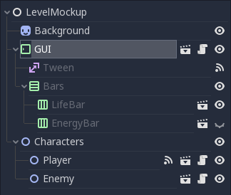

   The scene tree, with the GUI scene set to display its children

The GUI scene encapsulates all of the game's Graphical User Interface. It comes with
a barebones script where we get the path to nodes that exist inside the
scene:

.. tabs::
 .. code-tab:: gdscript GDScript

    onready var number_label = $Bars/LifeBar/Count/Background/Number
    onready var bar = $Bars/LifeBar/TextureProgress
    onready var tween = $Tween

 .. code-tab:: csharp

    public class Gui : MarginContainer
    {
        private Tween _tween;
        private Label _numberLabel;
        private TextureProgress _bar;

        public override void _Ready()
        {
            // C# doesn't have an onready feature, this works just the same.
            _bar = (TextureProgress) GetNode("Bars/LifeBar/TextureProgress");
            _tween = (Tween) GetNode("Tween");
            _numberLabel = (Label) GetNode("Bars/LifeBar/Count/Background/Number");
        }
    }

-  ``number_label`` displays a life count as a number. It's a ``Label``
   node
-  ``bar`` is the life bar itself. It's a ``TextureProgress`` node
-  ``tween`` is a component-style node that can animate and control any
   value or method from any other node

.. note::

    The project uses a simple organization that works for game jams and tiny games.

    At the root of the project, in the `res://` folder, you will find the `LevelMockup`. That's the main game scene and the one we will work with. All the components that make up the game are in the `scenes/` folder. The `assets/` folder contains the game sprites and the font for the HP counter. In the `scripts/` folder you will find the enemy, the player, and the GUI controller scripts.

    Click the edit scene icon to the right of the node in the scene tree to open the scene in the editor. You'll see the LifeBar and EnergyBar are sub-scenes themselves.

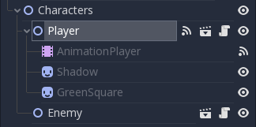

       The scene tree, with the Player scene set to display its children

Set up the Lifebar with the Player's max\_health
------------------------------------------------

We have to tell the GUI somehow what the player's current health is, to
update the lifebar's texture, and to display the remaining health in the
HP counter in the top left corner of the screen. To do this we send the
player's health to the GUI every time they take damage. The GUI will then
update the ``Lifebar`` and ``Number`` nodes with this value.

We could stop here to display the number, but we need to initialize the
bar's ``max_value`` for it to update in the right proportions. The first
step is thus to tell the ``GUI`` what the green character's
``max_health`` is.

.. tip::

    The bar, a `TextureProgress`, has a `max_value` of `100` by default. If you don't need to display the character's health with a number, you don't need to change its `max_value` property. You send a percentage from the `Player` to the `GUI` instead:  `health / max_health * 100`.

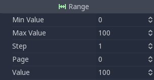

Click the script icon to the right of the ``GUI`` in the Scene dock to
open its script. In the ``_ready`` function, we're going to store the
``Player``'s ``max_health`` in a new variable and use it to set the
``bar``'s ``max_value``:

.. tabs::
 .. code-tab:: gdscript GDScript

    func _ready():
        var player_max_health = $"../Characters/Player".max_health
        bar.max_value = player_max_health

 .. code-tab:: csharp

    public override void _Ready()
    {
        // Add this below _bar, _tween, and _numberLabel.
        var player = (Player) GetNode("../Characters/Player");
        _bar.MaxValue = player.MaxHealth;
    }

Let's break it down. ``$"../Characters/Player"`` is a shorthand that
goes one node up in the scene tree, and retrieves the
``Characters/Player`` node from there. It gives us access to the node.
The second part of the statement, ``.max_health``, accesses the
``max_health`` on the Player node.

The second line assigns this value to ``bar.max_value``. You could
combine the two lines into one, but we'll need to use
``player_max_health`` again later in the tutorial.

``Player.gd`` sets the ``health`` to ``max_health`` at the start of the
game, so we could work with this. Why do we still use ``max_health``?
There are two reasons:

We don't have the guarantee that ``health`` will always equal
``max_health``: a future version of the game may load a level where
the player already lost some health.

.. note::

    When you open a scene in the game, Godot creates nodes one by one, following the order in your Scene dock, from top to bottom. `GUI` and `Player` are not part of the same node branch. To make sure they both exist when we access each other, we have to use the `_ready` function. Godot calls `_ready` right after it loaded all nodes, before the game starts. It's the perfect function to set everything up and prepare the game session.
    Learn more about _ready: :doc:`scripting_continued`

Update health with a signal when the player takes a hit
-------------------------------------------------------

Our GUI is ready to receive the ``health`` value updates from the
``Player``. To achieve this we're going to use **signals**.

.. note::

    There are many useful built-in signals like `enter_tree` and `exit_tree`, that all nodes emit when they are respectively created and destroyed. You can also create your own using the `signal` keyword. On the `Player` node, you'll find two signals we created for you: `died` and `health_changed`.

Why don't we directly get the ``Player`` node in the ``_process``
function and look at the health value? Accessing nodes this way creates
tight coupling between them. If you did it sparingly it may work. As
your game grows bigger, you may have many more connections. If you get
nodes this way it gets complex quickly. Not only that: you
need to listen to the state change constantly in the ``_process``
function. This check happens 60 times a second and you'll likely break
the game because of the order in which the code runs.

On a given frame you may look at another node's property *before* it was
updated: you get a value from the last frame. This leads to obscure
bugs that are hard to fix. On the other hand, a signal is emitted right
after a change happened. It **guarantees** you're getting a fresh piece
of information. And you will update the state of your connected node
*right after* the change happened.

.. note::

    The Observer pattern, that signals derive from, still adds a bit of coupling between node branches. But it's generally lighter and more secure than accessing nodes directly to communicate between two separate classes. It can be okay for a parent node to get values from its children. But you'll want to favor signals if you're working with two separate branches.
    Read Game Programming Patterns for more information on the `Observer pattern <https://gameprogrammingpatterns.com/observer.html>`_.
    The `full book <https://gameprogrammingpatterns.com/contents.html>`_ is available online for free.

With this in mind, let's connect the ``GUI`` to the ``Player``. Click on
the ``Player`` node in the scene dock to select it. Head down to the
Inspector and click on the Node tab. This is the place to connect nodes
to listen to the one you selected.

The first section lists custom signals defined in ``Player.gd``:

-  ``died`` is emitted when the character died. We will use it in a
   moment to hide the UI.
-  ``health_changed`` is emitted when the character got hit.

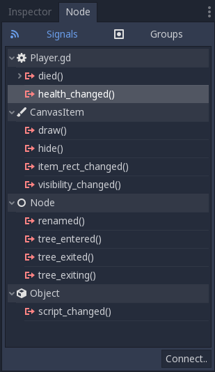

   We're connecting to the health\_changed signal

Select ``health_changed`` and click on the Connect button in the bottom
right corner to open the Connect Signal window. On the left side you can
pick the node that will listen to this signal. Select the ``GUI`` node.
The right side of the screen lets you pack optional values with the
signal. We already took care of it in ``Player.gd``. In general I
recommend not to add too many arguments using this window as they're
less convenient than doing it from the code.

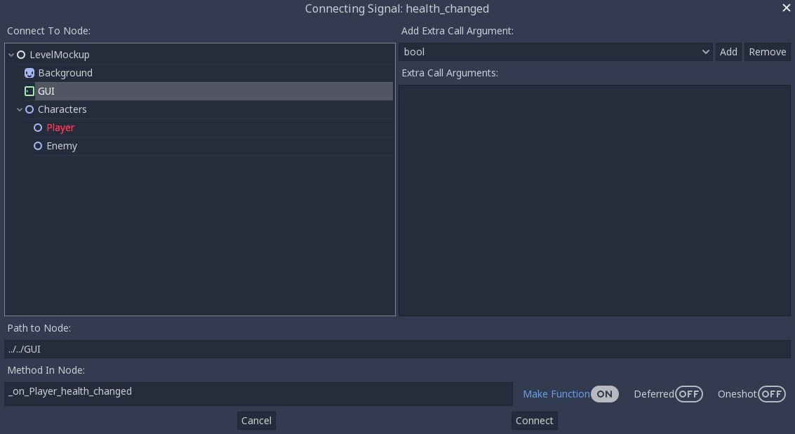

   The Connect Signal window with the GUI node selected

.. tip::

    You can optionally connect nodes from the code. However doing it from the editor has two advantages:

    1. Godot can write new callback functions for you in the connected script
    2. An emitter icon appears next to the node that emits the signal in the Scene dock

At the bottom of the window you will find the path to the node you
selected. We're interested in the second row called "Method in Node".
This is the method on the ``GUI`` node that gets called when the signal
is emitted. This method receives the values sent with the signal and
lets you process them. If you look to the right, there is a "Make
Function" radio button that is on by default. Click the connect button
at the bottom of the window. Godot creates the method inside the ``GUI``
node. The script editor opens with the cursor inside a new
``_on_Player_health_changed`` function.

.. note::

   When you connect nodes from the editor, Godot generates a
   method name with the following pattern: ``_on_EmitterName_signal_name``.
   If you wrote the method already, the "Make Function" option will keep
   it. You may replace the name with anything you'd like.

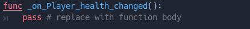

   Godot writes the callback method for you and takes you to it

Inside the parentheses after the function name, add a ``player_health``
argument. When the player emits the ``health_changed`` signal, it will send
its current ``health`` alongside it. Your code should look like:

.. tabs::
 .. code-tab:: gdscript GDScript

    func _on_Player_health_changed(player_health):
        pass

 .. code-tab:: csharp

    public void OnPlayerHealthChanged(int playerHealth)
    {
    }

.. note::

    The engine does not convert PascalCase to snake_case, for C# examples we'll be using
    PascalCase for method names & camelCase for method parameters, which follows the official `C#
    naming conventions. <https://docs.microsoft.com/en-us/dotnet/standard/design-guidelines/capitalization-conventions>`_

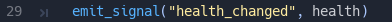

   In Player.gd, when the Player emits the health\_changed signal, it also
   sends its health value

Inside ``_on_Player_health_changed``, let's call a second function called
``update_health`` and pass it the ``player_health`` variable.

.. note::

    We could directly update the health value on `LifeBar` and `Number`. There are two reasons to use this method instead:

    1. The name makes it clear for our future selves and teammates that when the player took damage, we update the health count on the GUI
    2. We will reuse this method a bit later

Create a new ``update_health`` method below ``_on_Player_health_changed``.
It takes a new\_value as its only argument:

.. tabs::
 .. code-tab:: gdscript GDScript

    func update_health(new_value):
        pass

 .. code-tab:: csharp

    public void UpdateHealth(int health)
    {
    }

This method needs to:

-  set the ``Number`` node's ``text`` to ``new_value`` converted to a
   string
-  set the ``TextureProgress``'s ``value`` to ``new_value``

.. tabs::
 .. code-tab:: gdscript GDScript

    func update_health(new_value):
        number_label.text = str(new_value)
        bar.value = new_value

 .. code-tab:: csharp

    public void UpdateHealth(int health)
    {
        _numberLabel.Text = health.ToString();
        _bar.Value = health;
    }

.. tip::

    ``str`` is a built-in function that converts about any value to
    text. ``Number``'s ``text`` property requires a string, so we can't
    assign it to ``new_value`` directly

Also call ``update_health`` at the end of the ``_ready`` function to
initialize the ``Number`` node's ``text`` with the right value at the
start of the game. Press :kbd:`F5` to test the game: the life bar updates with
every attack!

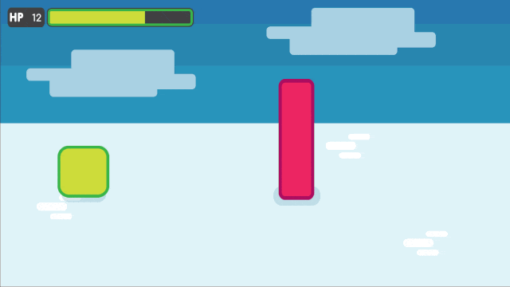

   Both the Number node and the TextureProgress update when the Player
   takes a hit

Animate the loss of life with the Tween node
--------------------------------------------

Our interface is functional, but it could use some animation. That's a
good opportunity to introduce the ``Tween`` node, an essential tool to
animate properties. ``Tween`` animates anything you'd like from a start
to an end state over a certain duration. For example, it can animate the
health on the ``TextureProgress`` from its current level to the
``Player``'s new ``health`` when the character takes damage.

The ``GUI`` scene already contains a ``Tween`` child node stored in the
``tween`` variable. Let's now use it. We have to make some changes to
``update_health``.

We will use the ``Tween`` node's ``interpolate_property`` method. It
takes seven arguments:

1. A reference to the node who owns the property to animate
2. The property's identifier as a string
3. The starting value
4. The end value
5. The animation's duration in seconds
6. The type of the transition
7. The easing to use in combination with the equation.

The last two arguments combined correspond to an easing
equation. This controls how the value evolves from the start to
the end point.

Click the script icon next to the ``GUI`` node to open it again. The
``Number`` node needs text to update itself, and the ``Bar`` needs a
float or an integer. We can use ``interpolate_property`` to animate a
number, but not to animate text directly. We're going to use it to
animate a new ``GUI`` variable named ``animated_health``.

At the top of the script, define a new variable, name it
``animated_health``, and set its value to 0. Navigate back to the ``update_health`` method and
clear its content. Let's animate the ``animated_health`` value. Call the
``Tween`` node's ``interpolate_property`` method:

.. tabs::
 .. code-tab:: gdscript GDScript

    func update_health(new_value):
        tween.interpolate_property(self, "animated_health", animated_health, new_value, 0.6, Tween.TRANS_LINEAR, Tween.EASE_IN)

 .. code-tab:: csharp

    // Add this to the top of your class.
    private float _animatedHealth = 0;

    public void UpdateHealth(int health)
    {
        _tween.InterpolateProperty(this, "_animatedHealth", _animatedHealth, health, 0.6f, Tween.TransitionType.Linear,
            Tween.EaseType.In);
    }

Let's break down the call:

::

    tween.interpolate_property(self, "animated_health", ...

We target ``animated_health`` on ``self``, that is to say the ``GUI``
node. ``Tween``'s interpolate\_property takes the property's name as a
string. That's why we write it as ``"animated_health"``.

::

    ... _health", animated_health, new_value, 0.6 ...

The starting point is the current value the bar's at. We still have to
code this part, but it's going to be ``animated_health``. The end point
of the animation is the ``Player``'s ``health`` after the
``health_changed``: that's ``new_value``. And ``0.6`` is the animation's
duration in seconds.

::

    ...  0.6, Tween.TRANS_LINEAR, Tween.EASE_IN)

The last two arguments are constants from the ``Tween`` class.
``TRANS_LINEAR`` means the animation should be linear. ``EASE_IN``
doesn't do anything with a linear transition, but we must provide this
last argument or we'll get an error.

The animation will not play until we activated the ``Tween`` node with
``tween.start()``. We only have to do this once if the node is not
active. Add this code after the last line:

.. tabs::
 .. code-tab:: gdscript GDScript

        if not tween.is_active():
            tween.start()

 .. code-tab:: csharp

        if (!_tween.IsActive())
        {
            _tween.Start();
        }

.. note::

    Although we could animate the `health` property on the `Player`, we shouldn't. Characters should lose life instantly when they get hit. It makes it a lot easier to manage their state, like to know when one died. You always want to store animations in a separate data container or node. The `tween` node is perfect for code-controlled animations. For hand-made animations, check out `AnimationPlayer`.

Assign the animated\_health to the LifeBar
------------------------------------------

Now the ``animated_health`` variable animates but we don't update the
actual ``Bar`` and ``Number`` nodes anymore. Let's fix this.

So far, the update\_health method looks like this:

.. tabs::
 .. code-tab:: gdscript GDScript

    func update_health(new_value):
        tween.interpolate_property(self, "animated_health", animated_health, new_value, 0.6, Tween.TRANS_LINEAR, Tween.EASE_IN)
        if not tween.is_active():
            tween.start()

 .. code-tab:: csharp

    public void UpdateHealth(int health)
    {
        _tween.InterpolateProperty(this, "_animatedHealth", _animatedHealth, health, 0.6f, Tween.TransitionType.Linear,
            Tween.EaseType.In);

        if(!_tween.IsActive())
        {
            _tween.Start();
        }
    }

In this specific case, because ``number_label`` takes text, we need to
use the ``_process`` method to animate it. Let's now update the
``Number`` and ``TextureProgress`` nodes like before, inside of
``_process``:

.. tabs::
 .. code-tab:: gdscript GDScript

    func _process(delta):
        number_label.text = str(animated_health)
        bar.value = animated_health

 .. code-tab:: csharp

    public override void _Process(float delta)
    {
        _numberLabel.Text = _animatedHealth.ToString();
        _bar.Value = _animatedHealth;
    }

.. note::

    `number_label` and `bar` are variables that store references to the `Number` and `TextureProgress` nodes.

Play the game to see the bar animate smoothly. But the text displays
decimal number and looks like a mess. And considering the style of the
game, it'd be nice for the life bar to animate in a choppier fashion.

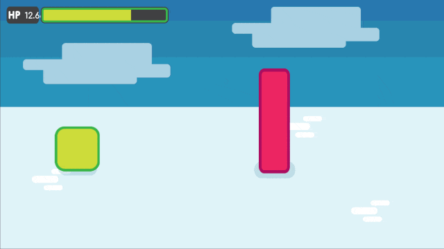

   The animation is smooth, but the number is broken

We can fix both problems by rounding out ``animated_health``. Use a
local variable named ``round_value`` to store the rounded
``animated_health``. Then assign it to ``number_label.text`` and
``bar.value``:

.. tabs::
 .. code-tab:: gdscript GDScript

    func _process(delta):
        var round_value = round(animated_health)
        number_label.text = str(round_value)
        bar.value = round_value

 .. code-tab:: csharp

    public override void _Process(float delta)
    {
        var roundValue = Mathf.Round(_animatedHealth);
        _numberLabel.Text = roundValue.ToString();
        _bar.Value = roundValue;
    }

Try the game again to see a nice blocky animation.

.. figure:: img/lifebar_tutorial_number_animation_working.gif

   By rounding out animated\_health, we kill two birds with one stone

.. tip::

    Every time the player takes a hit, the ``GUI`` calls
    ``_on_Player_health_changed``, which in turn calls ``update_health``. This
    updates the animation and the ``number_label`` and ``bar`` follow in
    ``_process``. The animated life bar that shows the health going down gradually
    is a trick. It makes the GUI feel alive. If the ``Player`` takes 3 damage,
    it happens in an instant.

Fade the bar when the Player dies
---------------------------------

When the green character dies, it plays a death animation and fades out.
At this point, we shouldn't show the interface anymore. Let's fade the
bar as well when the character died. We will reuse the same ``Tween``
node as it manages multiple animations in parallel for us.

First, the ``GUI`` needs to connect to the ``Player``'s ``died`` signal
to know when it died. Press :kbd:`F1` to jump back to the 2D
Workspace. Select the ``Player`` node in the Scene dock and click on the
Node tab next to the Inspector.

Find the ``died`` signal, select it, and click the Connect button.

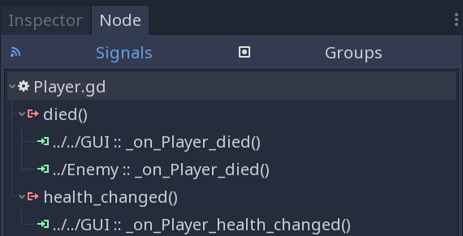

   The signal should already have the Enemy connected to it

In the Connecting Signal window, connect to the ``GUI`` node again. The
Path to Node should be ``../../GUI`` and the Method in Node should show
``_on_Player_died``. Leave the Make Function option on and click Connect
at the bottom of the window. This will take you to the ``GUI.gd`` file
in the Script Workspace.

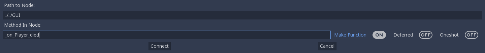

   You should get these values in the Connecting Signal window

.. note::

    You should see a pattern by now: every time the GUI needs a new piece of information, we emit a new signal. Use them wisely: the more connections you add, the harder they are to track.

To animate a fade on a UI element, we have to use its ``modulate``
property. ``modulate`` is a ``Color`` that multiplies the colors of our
textures.

.. note::

    `modulate` comes from the `CanvasItem` class, All 2D and UI nodes inherit from it. It lets you toggle the visibility of the node, assign a shader to it, and modify it using a color with `modulate`.

``modulate`` takes a ``Color`` value with 4 channels: red, green, blue
and alpha. If we darken any of the first three channels it darkens the
interface. If we lower the alpha channel, our interface fades out.

We're going to tween between two color values: from a white with an
alpha of ``1``, that is to say at full opacity, to a pure white with an
alpha value of ``0``, completely transparent. Let's add two variables at
the top of the ``_on_Player_died`` method and name them ``start_color``
and ``end_color``. Use the ``Color()`` constructor to build two
``Color`` values.

.. tabs::
 .. code-tab:: gdscript GDScript

    func _on_Player_died():
        var start_color = Color(1.0, 1.0, 1.0, 1.0)
        var end_color = Color(1.0, 1.0, 1.0, 0.0)

 .. code-tab:: csharp

    public void OnPlayerDied()
    {
        var startColor = new Color(1.0f, 1.0f, 1.0f);
        var endColor = new Color(1.0f, 1.0f, 1.0f, 0.0f);
    }

``Color(1.0, 1.0, 1.0)`` corresponds to white. The fourth argument,
respectively ``1.0`` and ``0.0`` in ``start_color`` and ``end_color``,
is the alpha channel.

We then have to call the ``interpolate_property`` method of the
``Tween`` node again:

.. tabs::
 .. code-tab:: gdscript GDScript

    tween.interpolate_property(self, "modulate", start_color, end_color, 1.0, Tween.TRANS_LINEAR, Tween.EASE_IN)

 .. code-tab:: csharp

    _tween.InterpolateProperty(this, "modulate", startColor, endColor, 1.0f, Tween.TransitionType.Linear,
      Tween.EaseType.In);

This time, we change the ``modulate`` property and have it animate from
``start_color`` to the ``end_color``. The duration is of one second,
with a linear transition. Here again, because the transition is linear,
the easing does not matter. Here's the complete ``_on_Player_died``
method:

.. tabs::
 .. code-tab:: gdscript GDScript

    func _on_Player_died():
        var start_color = Color(1.0, 1.0, 1.0, 1.0)
        var end_color = Color(1.0, 1.0, 1.0, 0.0)
        tween.interpolate_property(self, "modulate", start_color, end_color, 1.0, Tween.TRANS_LINEAR, Tween.EASE_IN)

 .. code-tab:: csharp

    public void OnPlayerDied()
    {
        var startColor = new Color(1.0f, 1.0f, 1.0f);
        var endColor = new Color(1.0f, 1.0f, 1.0f, 0.0f);

        _tween.InterpolateProperty(this, "modulate", startColor, endColor, 1.0f, Tween.TransitionType.Linear,
            Tween.EaseType.In);
    }

And that is it. You may now play the game to see the final result!

.. figure:: img/lifebar_tutorial_final_result.gif

   The final result. Congratulations for getting there!

.. note::

    Using the exact same techniques, you can change the color of the bar when the Player gets poisoned, turn the bar red when its health drops low, shake the UI when they take a critical hit... the principle is the same: emit a signal to forward the information from the `Player` to the `GUI` and let the `GUI` process it.
