.. _doc_ui_game_user_interface:

Design the GUI
==============

Now that you've nailed the basics, we're going to see how to build a
game Graphical User Interface (GUI) with reusable UI components: a life bar, an
energy bar, and bomb and emerald counters. By the end of this tutorial,
you'll have a game GUI, ready to control with GDscript or VisualScript:

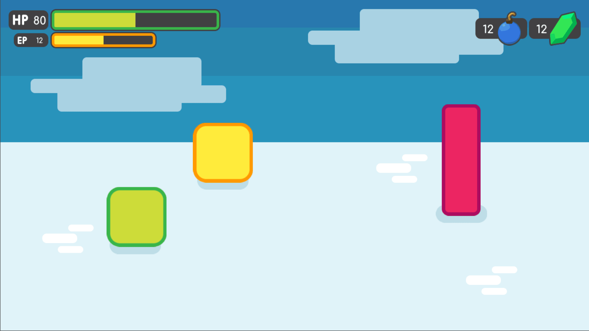

   The final result

You'll also learn to:

1. Create flexible UI components
2. Use scene inheritance
3. Build a complex UI

Download the project files: :download:`ui_gui_design.zip <files/ui_gui_design.zip>` and extract the archive. Import the `start/` project in Godot to follow this tutorial. The `end/` folder contains the final result.

.. note::

    You can watch this tutorial as a `video on YouTube <https://www.youtube.com/watch?v=y1E_y9AIqow>`_.

Breaking down the UI
--------------------

Let's break down the final UI and plan the containers we'll use. As in
the :doc:`ui_main_menu`, it starts with a ``MarginContainer``.
Then, we can see up to three columns:

1. The life and energy counters on the left
2. The life and energy bars
3. The bomb and emerald counters on the right

But the bar's label and the gauge are two parts of the same UI element.
If we think of them this way, we're left with two columns:

1. The life and energy bars on the left
2. The bomb and emerald counters on the right

This makes it easier to nest containers: we have some margins around the
border of the screen using a ``MarginContainer``, followed by an
``HBoxContainer`` to manage our two columns. The two bars stack on top
of one another inside a ``VBoxContainer``. And we'll need a last
``HBoxContainer`` in the right column to place the bomb and emerald
counters side-by-side.

.. figure:: ./img/ui_gui_step_tutorial_containers_structure.png

   We get a clean UI layout with only 4 containers

We will need extra containers inside the individual UI components, but
this gives us the main GUI scene's structure. With this plan in place,
we can jump into Godot and create our GUI.

Create the base GUI
-------------------

There are two possible approaches to the GUI: we can design elements in
separate scenes and put them together, or prototype everything in a
single scene and break it down later. I recommend working with a single
scene as you can play with your UI's placement and proportions faster
this way. Once it looks good, you can save entire sections of the node
tree as reusable sub-scenes. We'll do that in a moment.

For now, let's start with a few containers.

Create a new scene and add a ``MarginContainer``. Select the node and name it
``GUI``.

We want our interface to anchor to the top of the screen. Select the ``GUI``
node and click the Layout button at the top of the viewport. Select the ``Top
Wide`` option. The ``GUI`` node will anchor to the top edge of its parent, the
viewport by default. It will resize automatically on the vertical axis to make
space for its child UI components.

Save the scene as ``GUI.tscn``. We will put the entire GUI in it.

With the ``MarginContainer`` selected, head to the inspector and scroll
down to the custom constants section. Unfold it and click the field next
to each of the ``Margin`` properties. Set them all to ``20`` pixels.
Next, add an ``HBoxContainer`` node. This one will contain our two bars
on the left and separate them from the two counters on the right.

We want to stack the bars vertically inside the ``HBoxContainer``.
Add a ``VBoxContainer`` as a child of ``HBoxContainer`` and name it ``Bars``. Select the parent
``HBoxContainer`` again and this time, add another ``HBoxContainer`` as a child of it.
Call it ``Counters``. With these four containers, we have the base for our GUI scene.

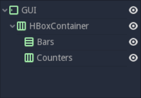

   You should have 4 containers that look like this

.. note::

    We can work this way because we first broke down our UI design
    and took a few moments to think about the containers we'd use. When you
    follow a tutorial like this, it may seem weird. But once you're working
    on real games, you'll see it's an efficient workflow.

Create the bars' base
~~~~~~~~~~~~~~~~~~~~~

Each bar is split into two sub-elements that align horizontally: the
label with the health count on the left, and the gauge on the right.
Once again, the ``HBoxContainer`` is the perfect tool for the job.
Select the ``Bars`` node and add a new ``HBoxContainer`` inside of it.
Name it ``Bar``.

The label itself requires at least three nodes: a ``NinePatchRect``
for the background, on top of which we'll add a texture on the left,
either ``HP`` or ``EP``, and a ``Label`` on the right for the value. We
can nest ``Control`` nodes however we want. We could use the
``NinePatchRect`` as a parent for the two other elements, as it
encompasses them. In general, you want to use containers instead, as
their role is to help organize UI components. We'll need a
``MarginContainer`` later anyway to add some space between the life
count and the gauge. Select the ``Bar`` and add a ``MarginContainer``.
Name it ``Count``. Inside of it, add three nodes:

1. A ``NinePatchRect`` named ``Background``
2. A ``TextureRect`` named ``Title``
3. And a ``Label`` named ``Number``

To add the nodes as siblings, always select the ``Count`` node first.

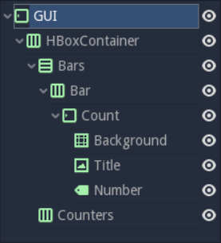

   Your scene tree should look like this. We're ready to throw in some
   textures

Our scene is still empty. It's time to throw in some textures. To load
the textures, head to the FileSystem dock to the left of the viewport.
Browse down to the res://assets/GUI folder.

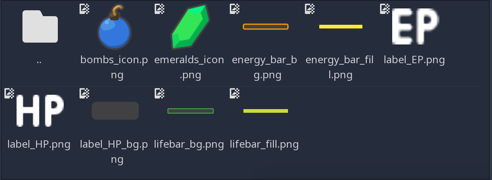

   You should see a list of textures that we'll use to skin our
   interface.

Select the ``Background`` in the Scene dock. In the Inspector, you
should see a ``Texture`` property. In the FileSystem tab, click and drag
``label_HP_bg.png`` onto the ``Texture`` slot. It stays squashed. The
parent MarginContainer will force its size down to 0 until we force
elements inside the container to have a minimum size. Select the
``Background`` node. In the Inspector, scroll down to the Rect section.
Set ``Min Size`` to (100, 40). You should see the ``Background`` resize
along with its parent containers.

Next, select the ``Title`` and drag and drop ``label_HP.png`` into its
``Texture`` slot. Select the ``Number`` node, click the field next to
the ``Text`` property and type ``10``. This way, we can see both nodes
in the viewport. They should stack up in the top-left corner of their
parent ``MarginContainer``.

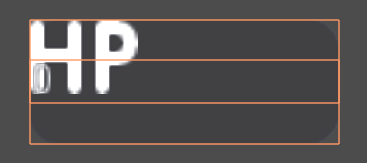

   If you select both nodes, you should see something like this

As they have a container as their direct parent, we cannot move them
freely: the ``Count`` node will always reset their anchors, their size
and position. Try to move and resize the nodes in the viewport. Then,
select any of the three textures and press :kbd:`Ctrl + Up` or :kbd:`Ctrl + Down` to
reorder them in the Scene dock. They'll snap back to their previous size
and position.

Parent containers control the size, the scale, the margins, and the
anchors of their direct children. To modify the nodes, you must nest
them inside a regular Control or another UI element. We'll use the
``Background`` as a parent for the ``Title`` and ``Number``. Select both
the ``Title`` and ``Number``, and drag and drop them onto
``Background``.

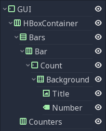

   By using the Background node as the two textures' parent, we take
   control away from the Count MarginContainer

Select the ``Title`` and in the Inspector, change its ``Stretch Mode`` property
to ``Keep Centered``. Next find the ``Rect`` category in the Inspector and
change the ``Size`` property to (50, 40) so it only takes the left half of
the background.  Next, select the ``Number`` node. In the viewport, click the
``Layout`` menu and click ``Full Rect``. The node will resize to fit
the ``Background``. Head to the Inspector and change its ``Align``
property to ``Right``, and the ``Valign`` property to ``Center``. The
text should snap to the center of the ``Background``'s right edge.
Resize the node horizontally, so it takes the right half of the
``Background`` and there's a bit of padding with the right edge.

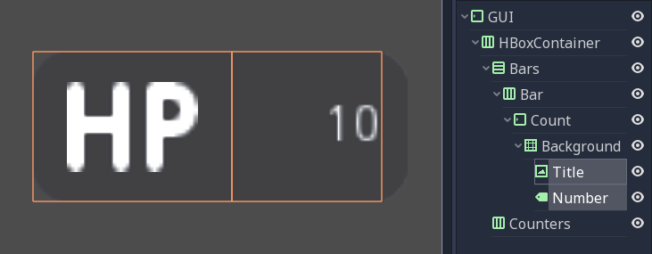

   Here's how the nodes' bounding boxes should look in the viewport.
   Keep it rough, you don't need to place them too precisely for now.

Replace the Label's font
~~~~~~~~~~~~~~~~~~~~~~~~

The label's font is too small. We need to replace it. Select the
``Number`` node and in the Inspector, scroll down to the ``Control``
class, and find the ``Custom Font`` category. Click the field next to
the ``Font`` property and click on ``New Dynamic Font``. Click on the
field again and select Edit.

You will enter the ``Dynamic Font`` resource. Unfold the ``Font``
category and click the field next to ``Font Data``. Click the ``Load``
button. In the file browser, navigate down to the assets/font folder and
double click ``Comfortaa-Bold.ttf`` to open it. You should see the font
update in the viewport. Unfold the settings category to change the font
size. Set the ``Size`` property to a higher value, like ``24`` or
``28``.

We now need the text's baseline, the number's lower edge, to align with
the HP texture on the left. To do so, still in the ``DynamicFont``
resource, you can tweak the ``Bottom`` property under the
``Extra Spacing`` category. It adds some bottom padding to the text.
Click the ``Number`` node in the Scene tab to go back to the node's
properties and change the ``Valign`` to ``Bottom``. To adjust the text's
baseline, click on the font field under the ``Custom Font`` category
again and tweak the ``Bottom`` property until the text aligns with the
``Title`` node. I used a value of ``2`` pixels.

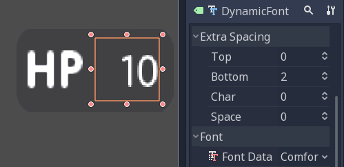

   With a Bottom value of 2 pixels, the Number aligns with the Title

With this, we finished the hardest part of the GUI.
Congratulations! Let's move on to the simpler nodes.

Add the progress bar
~~~~~~~~~~~~~~~~~~~~

We need one last element to complete our life bar: the gauge itself.
Godot ships with a ``TextureProgress`` node that has everything we need.

Select the Bar node and add a ``TextureProgress`` inside of it. Name it
``Gauge``. In the inspector unfold the ``Textures`` section. Head to the
FileSystem dock and drag and drop the ``lifebar_bg.png`` texture onto
the ``Under`` slot. Do the same with the ``lifebar_fill.png`` image and
drop it onto the ``Progress`` slot. Under the ``Range`` class in the
inspector, change the ``Value`` property to ``50`` to see the gauge fill
up.

With only five ``Control`` nodes, our first bar is ready to use.

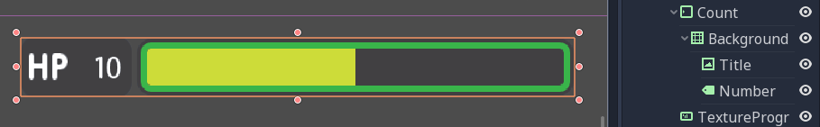

   That's it, our life bar is ready. This last part was quick, wasn't
   it? That's thanks to our robust container setup.

Design the bomb and emerald counters
------------------------------------

The bomb and emerald counters are like the bar's ``Count`` node. So we'll
duplicate it and use it as a template.

Under the ``Bar`` node, select ``Count`` and press :kbd:`Ctrl + D` to duplicate
it. Drag and drop the new node under the ``Counters`` ``HBoxContainer``
at the bottom of the scene tree. You should see it resize automatically.
Don't worry about this for now, we'll fix the size soon.

Rename the ``Count2`` node to ``Counter``. Unlike the bars, we want the
number to be on the left, and an icon to sit on the right. The setup is
the same: we need a background (a ``NinePatchRect``), the title, and the
number nodes. The ``Title`` node is a ``TextureRect``, so it's what we
need to display the icon. In the scene tree, select the ``Title`` node,
and rename it to ``Icon``.

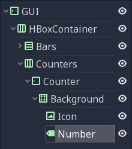

   Here's how your node tree should look so far

With the ``Icon`` node selected, in the inspector, scroll to the top to
see the ``Texture`` slot. Head to the FileSystem dock on the left and
select the ``bombs_icon.png``. Drag and drop it onto the ``Texture``
slot. In the Scene Tab select both the ``Icon`` and the ``Number``
nodes. Click the Layout menu in the toolbar at the top of the viewport
and select ``Full Rect``. Both nodes will update to fit
the size of the ``Background``.

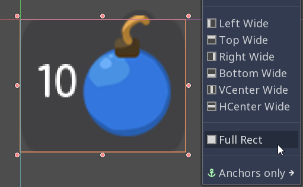

   The nodes anchor to the entire Background, but their position is off

Let's change the ``Number``'s align properties to move it to the left
and center of the ``Background``. Select the ``Number`` node, change its
``Align`` property to left and the ``Valign`` property to centre. Then
resize its left edge a bit to add some padding between the left
edge of the ``Background`` and the text.

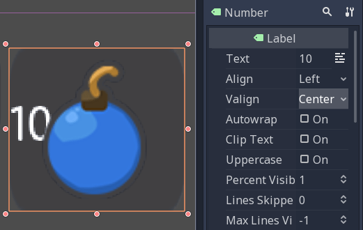

   The Number node aligned to the left and centre

To overlap the Icon and the background, we need a few tweaks. First, our
background is a bit too tall. It's because it's inside a margin
container that is controlled by the top-most GUI node. Select the GUI
node at the top of the scene tree and downsize it vertically so that
it's as thin as possible. You'll see the gauge prevents you from making
it too small. A container cannot be smaller than the minimal size of its
children. The container's margins also weigh in.

Select the Icon, click the Layout menu, and select
``Full Rect`` to re-center it. We need it to anchor to
the ``Background``'s right edge. Open the Layout menu again and select
``Center Right``. Move the icon up so it is centered vertically with the
``Background``.

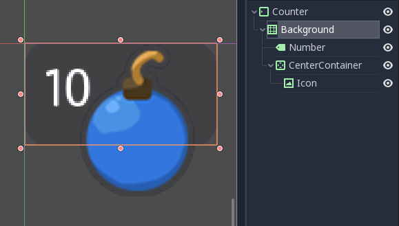

   The bomb icon anchors to the Background's right edge. Resize the
   Counter container to see the Icon node stick to its right side

Because we duplicated the ``Counter`` from the bar's ``Count``, the
``Number`` node's font is off. Select the ``Number`` node again, head to
the ``Font`` property, and click it to access the ``DynamicFont``
resource. In the ``Extra Spacing`` section, change the ``Bottom`` value
to ``0`` to reset the font's baseline. Our counter now works as
expected.

Let's make the ``Counters`` anchor to the right edge of the viewport. To do so,
we need to set the ``Bars`` container take all the available horizontal space it
can. Select the ``Bars`` node and scroll down to the ``Size Flags`` category. In
the ``Horizontal`` category, check the ``Expand`` value. The ``Bars`` node
should resize and push the counter to the right side of the screen.

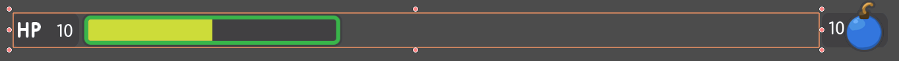

   An expanding container eats all the space it can from its parent,
   pushing everything else along the way

Turn the bar and counter into reusable UI components
----------------------------------------------------

We have one bar and one counter widget. But we need two of each. We may
need to change the bars' design or their functionality later on. It'd be
great if we could have a single scene to store a UI element's template,
and child scenes to work on variations. Godot lets us do this with
Inherited Scenes.

Let's save both the ``Counter`` and the ``Bar`` branches as separate
scenes that we'll reduce to create the ``LifeBar``, the ``EnergyBar``,
the ``BombCounter``, and the ``EmeraldCounter``. Select the ``Bar``
HBoxContainer. Right click on it and click on ``Save Branch as Scene``.
Save the scene as ``Bar.tscn``. You should see the node branch turn it
to a single ``Bar`` node.

.. tip::

    A scene is a tree of nodes. The topmost node is the tree's
    **root**, and the children at the bottom of the hierarchy are
    **leaves**. Any node other than the root along with one or more children is
    a **branch**. We can encapsulate node branches into separate scenes, or
    load and merge them from other scenes into the active one. Right click
    on any node in the Scene dock and select ``Save Branch as Scene`` or
    ``Merge from Scene``.

Then, select the ``Counter`` node and do the same. Right click,
``Save Branch as Scene``, and save it as ``Counter.tscn``. A new edit
scene icon appears to the right of the nodes in the scene tree. Click on
the one next to ``Bar`` to open the corresponding scene. Resize the
``Bar`` node so that its bounding box fits its content. The way we named
and placed the Control nodes, we're ready to inherit this template and
create the life bar. It's the same for the ``Counter``.

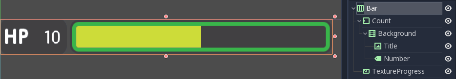

   With no extra changes, our Bar is ready to use

Use scene inheritance to create the remaining elements
------------------------------------------------------

We need two bars that work the same way: they should feature a label on
the left, with some value, and a horizontal gauge on the right. The only
difference is that one has the HP label and is green, while the other is
called EP and is yellow. Godot gives us a powerful tool to create a
common base to reuse for all bars in the game: **inherited scenes**.

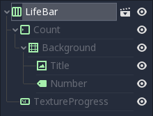

   Inherited scenes help us keep the GUI scene clean. In the end, we
   will only have containers and one node for each UI component.

On an inherited scene, you can change any property of every node in the
inspector, aside from its name. If you modify and save the parent scene,
all the inherited scenes update to reflect the changes. If you change a
value in the inherited scene, it will always override the parent's
property. It's useful for UIs, as they often require variations of the same
elements. In general, in UI design, buttons, panels etc. share a common
base style and interactions. We don't want to copy it over to all
variations manually.

A reload icon will appear next to the properties you override. Click it
to reset the value to the parent scene's default.

.. note::

    Think of scene inheritance like the node tree, or the
    ``extends`` keyword in GDScript. An inherited scene does everything like
    its parent, but you can override properties, resources and add extra
    nodes and scripts to extend its functionality.

Inherit the Bar Scene to build the LifeBar
~~~~~~~~~~~~~~~~~~~~~~~~~~~~~~~~~~~~~~~~~~

Go to ``Scene -> New Inherited Scene`` to create a new type of ``Bar``.
Select the Bar scene and open it. You should see a new [unsaved] tab,
that's like your ``Bar``, but with all nodes except the root in grey.
Press :kbd:`Ctrl + S` (:kbd:`Cmd + S` on macOS) to save the new inherited scene and name it
``LifeBar``.

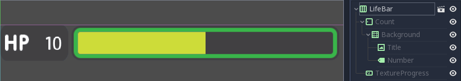

   You can't rename grey nodes. This tells you they have a parent scene

First, rename the root or top level node to ``LifeBar``. We always want
the root to describe exactly what this UI component is. The name
differentiates this bar from the ``EnergyBar`` we'll create next. The
other nodes inside the scene should describe the component's structure
with broad terms, so it works with all inherited scenes. Like our
``TextureProgress`` and ``Number`` nodes.

.. note::

    If you've ever done web design, it's the same spirit as
    working with CSS: you create a base class, and add variations with
    modifier classes. From a base button class, you'll have button-green and
    button-red variations for the user to accept and refuse prompts. The new
    class contains the name of the parent element and an extra keyword to
    explain how it modifies it. When we create an inherited scene and change
    the name of the top level node, we're doing the same thing.

Design the EnergyBar
~~~~~~~~~~~~~~~~~~~~

We already setup the ``LifeBar``'s design with the main ``Bar`` scene.
Now we need the ``EnergyBar``.

Let's create a new inherited scene, and once again select the
``Bar.tscn`` scene and open it. Double-click on the ``Bar`` root node and rename it
to ``EnergyBar``. Save the new scene as ``EnergyBar.tscn``.
We need to replace the HP texture with EP one, and to
change the textures on the gauge.

Head to the FileSystem dock on the left, select the ``Title`` node in
the Scene tree and drag and drop the ``label_EP.png`` file onto the
texture slot. Select the ``Number`` node and change the ``Text``
property to a different value like ``14``.

You'll notice the EP texture is smaller than the HP one. We should
update the ``Number``'s font size to better fit it. A font is a
resource. All the nodes in the entire project that use this resource
will be affected by any property we change. You can try to change the
size to a huge value like ``40`` and switch back to the ``LifeBar`` or
the ``Bar`` scenes. You will see the text increased in size.

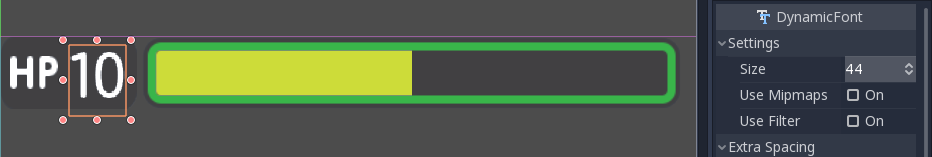

   If we change the font resource, all the nodes that use it are
   affected

To change the font size on this node only, we must create a copy of the
font resource. Select the ``Number`` node again and click on the wrench
and screwdriver icon on the top right of the inspector. In the drop-down
menu, select the ``Make Sub-Resources Unique`` option. Godot will find
all the resources this node uses and create unique copies for us.

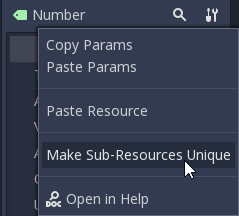

   Use this option to create unique copies of the resources for one node

.. tip::

    When you duplicate a node from the Scene tree, with
    :kbd:`Ctrl + D` (:kbd:`Cmd + D` on macOS), it shares its resources with the original node. You
    need to use ``Make Sub-Resources Unique`` before you can tweak the
    resources without affecting the source node.

Scroll down to the ``Custom Font`` section and open ``Font``. Lower the
``Size`` to a smaller value like ``20`` or ``22``. You may also need to
adjust the ``Bottom`` spacing value to align the text's baseline with
the EP label on the left.

.. figure:: ./img/ui_gui_step_tutorial_design_EnergyBar_3.png

   The EP Count widget, with a smaller font than its HP counterpart

Now, select the ``TextureProgress`` node. Drag the ``energy_bar_bg.png``
file onto the ``Under`` slot and do the same for ``energy_bar_fill.png``
and drop it onto the ``Progress`` texture slot.

You can resize the node vertically so that its bounding rectangle fits
the gauge. Do the same with the ``Count`` node until its size aligns
with that of the bar. Because the minimal size of ``TextureProgress`` is
set based on its textures, you won't be able to downsize the ``Count``
node below that. That is also the size the ``Bar`` container will have.
You may downscale this one as well.

Last but not least, the ``Background`` container has a minimum size that
makes it a bit large. Select it and in the ``Rect`` section, change the
``Min Size`` property down to ``80`` pixels. It should resize
automatically and the ``Title`` and ``Number`` nodes should reposition
as well.

   The Count looks better now it's a bit smaller

.. tip::

    The Count node's size affects the position of the
    TextureProgress. As we'll align our bars vertically in a moment, we're
    better off using the Counter's left margin to resize our EP label. This
    way both the EnergyBar's Count and the LifeBar's Count nodes are one
    hundred pixels wide, so both gauges will align perfectly.

Prepare the bomb and emerald counters
~~~~~~~~~~~~~~~~~~~~~~~~~~~~~~~~~~~~~

Let us now take care of the counters. Go to
``Scene -> New Inherited Scene`` and select the ``Counter.tscn`` as a
base. Rename the root node as ``BombCounter`` too.
Save the new scene as ``BombCounter.tscn``. That's all for this scene.

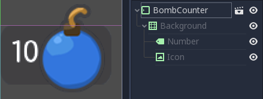

   The bomb counter is the same as the original Counter scene

Go to ``Scene -> New Inherited Scene`` again and select ``Counter.tscn``
once more. Rename the root node ``EmeraldCounter`` and save the scene as ``EmeraldCounter.tscn``.
For this one, we mainly need to replace the bomb icon
with the emerald icon. In the FileSystem tab, drag the ``emeralds_icon.png``
onto the ``Icon`` node's ``Texture`` slot. ``Icon`` already anchors to
the right edge of the ``Background`` node so we can change its position
and it will scale and reposition with the ``EmeraldCounter`` container.
Shift the emerald icon a bit to the right and down. Use the Arrow
Keys on the keyboard to nudge its position. Save, and we're done with
all the UI elements.

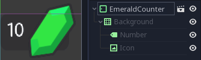

   The emerald counter should look something like this

Add the UI components to the final GUI
--------------------------------------

Time to add all the UI elements to the main GUI scene. Open the
``GUI.tscn`` scene again, and delete the ``Bar`` and ``Counter`` nodes.
In the FileSystem dock, find the ``LifeBar.tscn`` and drag and drop it
onto the ``Bars`` container in the scene tree. Do the same for the
``EnergyBar``. You should see them align vertically.

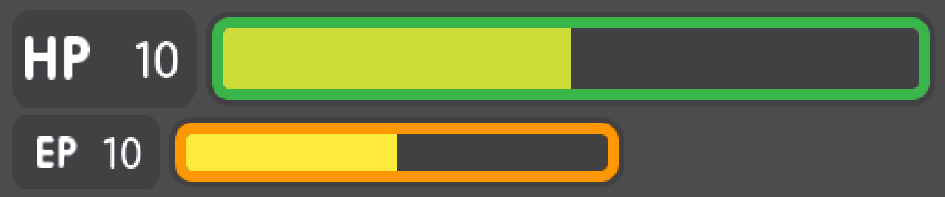

   The LifeBar and the EnergyBar align automatically

Now, drag and drop the ``BombCounter.tscn`` and ``EmeraldCounter.tscn`` scenes onto the
``Counters`` node. They'll resize automatically.

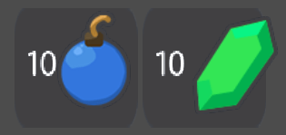

   The nodes resize to take all the available vertical space

To let the ``EmeraldCounter`` and ``BombCounter`` use the size we defined
in ``Counter.tscn``, we need to change the ``Size Flags`` on the
``Counters`` container. Select the ``Counters`` node and unfold the
``Size Flags`` section in the Inspector. Uncheck the ``Fill`` tag for
the ``Vertical`` property, and check ``Shrink Center`` so the container
centers inside the ``HBoxContainer``.

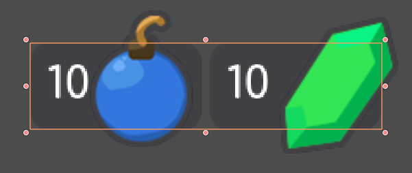

   Now both counters have a decent size

.. tip::

    Change the ``Min Size`` property of the ``Counters`` container
    to control the height of the counters' background.

We have one small issue left with the EP label on the EnergyBar: the 2
bars should align vertically. Click the icon next to the ``EnergyBar``
node to open its scene. Select the ``Count`` node and scroll down to the
``Custom Constants`` section. Add a ``Margin Left`` of ``20``. In
the ``Rect`` section set the node's ``Min Size`` back to 100, the same
value as on the LifeBar. The ``Count`` should now have some margin on
the left. If you save and go back to the GUI scene, it will be aligned
vertically with the ``LifeBar``.

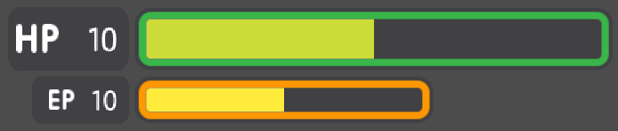

   The 2 bars align perfectly

.. note::

    We could have set up the ``EnergyBar`` this way a few moments
    ago. But this shows you that you can go back to any scene anytime, tweak
    it, and see the changes propagate through the project!

Place the GUI onto the game's mockup
------------------------------------

To wrap up the tutorial we're going to insert the GUI onto the game's
mockup scene.

Head to the FileSystem dock and open ``LevelMockup.tscn``.

Drag-and-drop the ``GUI.tscn`` scene right below the ``bg`` node and
above the ``Characters``. The GUI will scale to fit the entire viewport.
Head to the Layout menu and select the ``Center Top`` option so it anchors
to the top edge of the game window. Then resize the GUI to make it as
small as possible vertically. Now you can see how the interface looks in
the context of the game.

Congratulations for getting to the end of this long tutorial. You can
find the final project here: :download:`ui_gui_design.zip <files/ui_gui_design.zip>`.

   The final result

.. note::

    **A final note about Responsive Design**. If you resize the
    GUI, you'll see the nodes move, but the textures and text won't scale.
    The GUI also has a minimum size, based on the textures inside of it. In
    games, we don't need the interface to be as flexible as that of a
    website. You almost never want to support both landscape and portrait
    screen orientations. It's one or the other. In landscape orientation,
    the most common ratios range from 4:3 to 16:9. They are close to one
    another. That's why it's enough for the GUI elements to only move
    horizontally when we change the window size.
