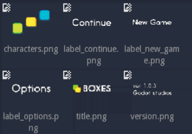
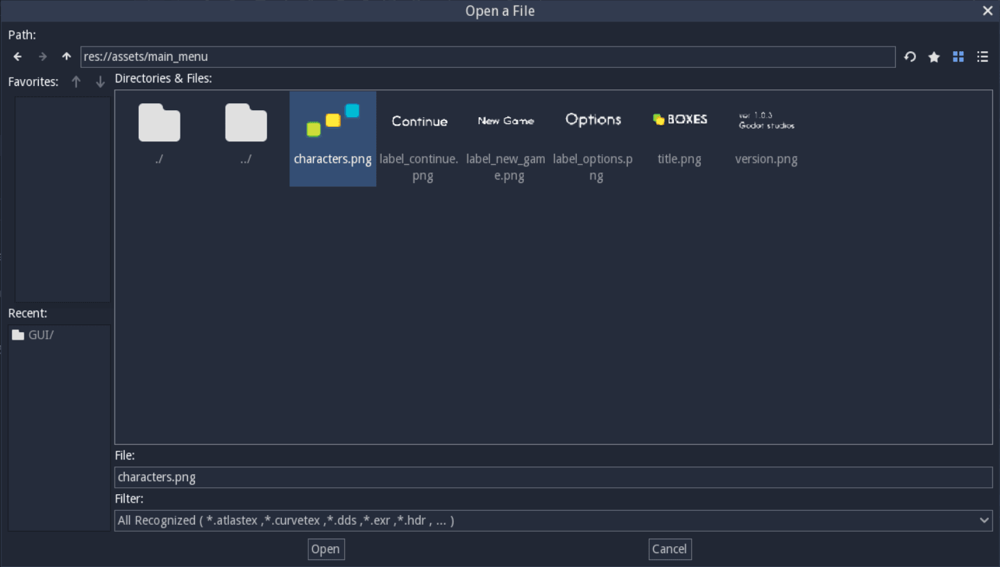
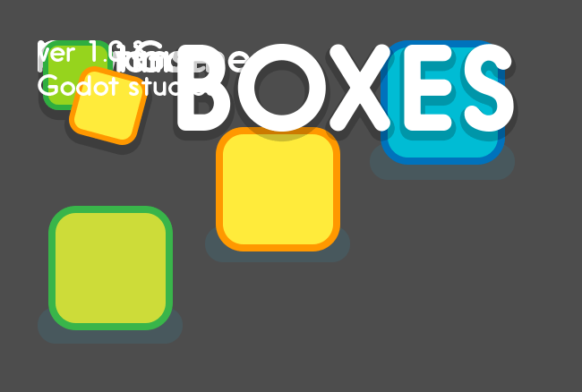
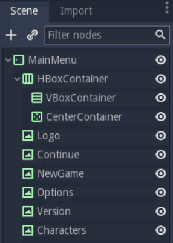
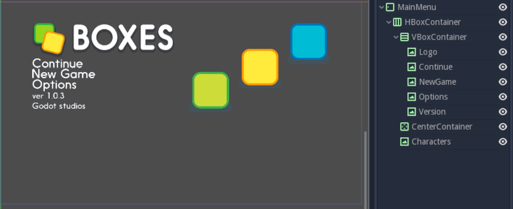
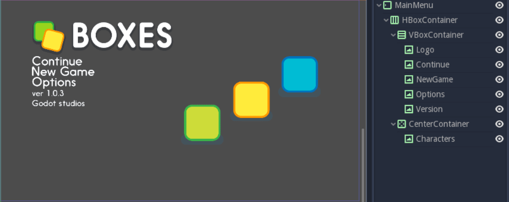
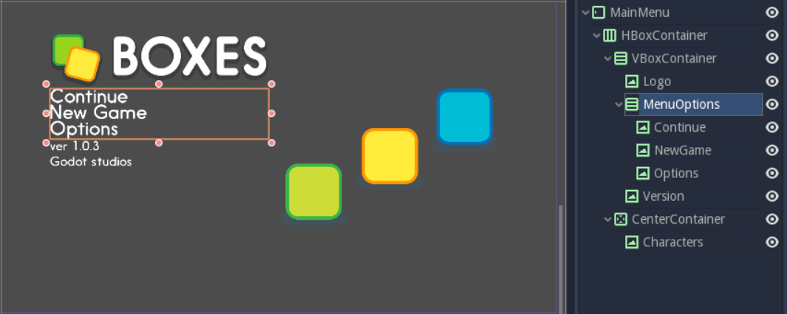
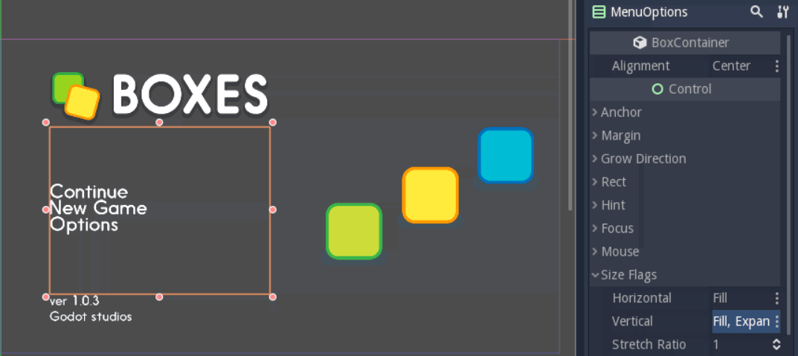

.. _doc_ui_main_menu:

Design a title screen
=====================

In the next two tutorials, you will build two responsive UI (user interface)
scenes step-by-step using the engine's UI system:

1. A main menu.
2. A game UI with a health bar, energy bar, bomb and money counters.

You will learn how to design game UIs efficiently, and how to use Godot's
Control nodes. This page focuses on the visual part: everything you do
from the editor. To learn how to code a life bar,
read :doc:`ui_code_a_life_bar`.

.. figure:: img/ui_main_menu_design_final_result.png

   The GUI you're going to create.

Download the project files: :download:`ui_main_menu_design.zip
<files/ui_main_menu_design.zip>` and extract the archive. Import the ``start/``
project in Godot to follow this tutorial. The ``end/`` folder contains the
final result. You'll find all the sprites in the ``start/assets/main_menu``
folder.

.. note::

    Read the :doc:`ui_introduction_to_the_ui_system` first to learn how
    Godot's UI system works.

How to design your game UI
--------------------------

To design a good UI, you want to come up with a rough mockup first: a
plain drawing version that focuses on the placement of your UI
components, their size, and user interaction. Pen and paper is all you
need. You shouldn't use fancy and final graphics at this stage. Then,
you only need simple placeholder sprites and you're good to jump into
Godot. You want to make sure the players can find their way around the
interface using those placeholders.

.. figure:: img/ui_design_rough.png

   The UI's rough plan or mockup

Placeholder doesn't have to mean ugly, but you should keep the graphics
simple and clean. Avoid special effects, animation, and detailed
illustration before you have players playtest your UI. Otherwise:

1. The graphics might skew the players' perception of the experience and
   you'll miss out on valuable feedback.
2. If the User Experience doesn't work, you'll have to redo some sprites.

.. tip::

    Always try to make the interface work with simple text and
    boxes first. It's easy to replace the textures later. Professional UX
    designers often work with plain outlines and boxes in greyscale. When
    you take colors and fancy visuals away, it's a lot easier to size and
    place UI elements properly. It helps you refine the design foundation
    you'll build upon.

There are two ways to design your UI in Godot. You can:

1. Build it all in a single scene, and eventually save some branches as
   reusable scenes.
2. Build template scenes for reusable components and create specific
   components that inherit from your base scenes.

We will use the first approach, because the first version of your UI may
not work as well as you'd like. You're likely to throw parts away and
redesign components as you go. When you're sure everything works, it's
easy to make some parts reusable, as you'll see below.

   The files you'll find in Godot. The graphics look cleaner than on the
   rough design, but they're still placeholders.

Design the main menu
--------------------

Before we jump into the editor, we want to plan how we'll nest
containers based on our mockup image.

Break down the UI mockup
~~~~~~~~~~~~~~~~~~~~~~~~

Here are my three rules of thumb to find the right containers:

1. Break down the UI into nested boxes, from the largest that contains
   everything, to the smallest ones, that encompass one widget, like a
   bar with its label, a panel or a button.
2. If there's some padding around an area, use a ``MarginContainer``.
3. If the elements are arranged in rows or columns, use an
   ``HBoxContainer`` or ``VBoxContainer``.

These rules are enough to get us started, and work well for simple
interfaces.

For the main menu, the largest box is the entire game window. There's
padding between the edges of the window and the first components: this
should be a ``MarginContainer``. Then, the screen is split into two
columns, so we'll use an ``HBoxContainer``. In the left column, we'll
manage the rows with a ``VBoxContainer``. And in the right column, we'll
center the illustration with a ``CenterContainer``.

.. figure:: img/ui_mockup_break_down.png

   Interface building blocks, broken down using the three rules of thumb.

.. tip::

    Containers adapt to the window's resolution and width-to-height
    ratio. Although we could place UI elements by hand, containers are
    faster, more precise, and **responsive**.

Prepare the Main Menu scene
~~~~~~~~~~~~~~~~~~~~~~~~~~~

Let's create the main menu. We'll build it in a single scene. To create
an empty scene, click on **Scene > New Scene**.

We have to add a root node before we can save the scene. Your UI's root
should be the outermost container or element. In this case it's a
``MarginContainer``. ``MarginContainer`` is a good starting point for
most interfaces, as you often need padding around the UI. Press
:kbd:`Ctrl + S` (:kbd:`Cmd + S` on macOS) to save the scene to the disk. Name it *MainMenu*.

Select the ``MarginContainer`` again, and head to the inspector to
define the margins' size. Scroll down the ``Control`` class, to the
``Custom Constants`` section. Unfold it. Set the margins as such:

-  Margin Right: *120*
-  Margin Top: *80*
-  Margin Left: *120*
-  Margin Bottom: *80*

We want the container to fit the window. In the toolbar above the Viewport,
open the **Layout** menu and select the last option, **Full Rect**.

Add the UI sprites
~~~~~~~~~~~~~~~~~~

Select the ``MarginContainer``, and create the UI elements as
``TextureRect`` nodes. We need:

1. the title or logo,
2. the three text options as individual nodes,
3. the version note,
4. and the main menu's illustration.

Click the **Add Node** button or press :kbd:`Ctrl + A` (:kbd:`Cmd + A` on macOS) on your keyboard.
Start to type ``TextureRect`` to find the corresponding node and press
enter. With the new node selected, press :kbd:`Ctrl + D` (:kbd:`Cmd + D` on macOS) five times to
create five extra ``TextureRect`` instances.

Click each of the nodes to select it. In the inspector, find the **Texture**
property and click **[empty] > Load**. A file browser opens and lets
you pick a sprite to load into the texture slot.

   The file browser lets you find and load textures.

Repeat the operation for all ``TextureRect`` nodes. You should have the
logo, the illustration, the three menu options and the version note,
each as a separate node. Then, double click on each of the nodes in the
Scene tab to rename them. Nothing has been placed in containers yet so this
should look messy.

   The six nodes with textures loaded.

.. note::

    If you want to support localization in your game, use
    ``Labels`` for menu options instead of ``TextureRect``.

Add containers to place UI elements automatically
~~~~~~~~~~~~~~~~~~~~~~~~~~~~~~~~~~~~~~~~~~~~~~~~~

Our main menu has some margin around the edges of the screen. It is
split in two parts: on the left, you have the logo and the menu options.
On the right, you have the characters. We can use one of two containers
to achieve this: ``HSplitContainer`` or ``HBoxContainer``. Split
containers split the area into two: a left and a right side or a top and
a bottom side. They also allow the user to resize the left and right
areas using an interactive bar. On the other hand, ``HBoxContainer``
just splits itself into as many columns as it has children. Although you
can deactivate the split container's resize behavior, I recommend to
favor box containers.

Select the ``MarginContainer`` and add an ``HBoxContainer``. Then, we
need two containers as children of our ``HBoxContainer``: a
``VBoxContainer`` for the menu options on the left, and a
``CenterContainer`` for the illustration on the right.

   You should have four nested containers and the TextureRect nodes
   sitting aside from it.

In the node tree, select all the ``TextureRect`` nodes that should go on the
left side: the logo, the menu options (Continue, NewGame, Options), and the
version note. Drag and drop them into the ``VBoxContainer``. The nodes should
position automatically.

   Containers automatically place and resize textures

We're left with two problems to solve:

1. The characters on the right aren't centered.
2. There's no space between the logo and the other UI elements.

To center the characters on the right, first select the ``CenterContainer``.
Then in the Inspector, scroll down to the **Size Flags** category and click
on the field to the right of the **Vertical** property, and check **Expand**
in addition to **Fill**. Do the same for the **Horizontal** property. This
makes the ``CenterContainer`` expand into all available space while
respecting its neighbour ``VBoxContainer``. Finally, drag and drop the
Characters node into the ``CenterContainer``. The Characters element will center
automatically.

   The character node centers inside the right half of the screen as
   soon as you place it inside the CenterContainer.

To space out the menu options and the logo on the left, we'll use one
final container and its size flags. Select the ``VBoxContainer`` and
press :kbd:`Ctrl + A` (:kbd:`Cmd + A` on macOS) to add a new node inside it. Add a second
``VBoxContainer`` and name it *MenuOptions*. Select all three menu
options, ``Continue``, ``NewGame`` and ``Options``, and drag and drop
them inside the new ``VBoxContainer``. The UI's layout should barely
change, if at all.

   Place the new container between the other two nodes to retain the
   UI's layout.

Now we grouped the menu options together, we can tell their container to
expand to take as much vertical space as possible. Select the
``MenuOptions`` node. In the Inspector, scroll down to the
**Size Flags** category. Click on the field to the right of the
**Vertical** property, and check **Expand** in addition to **Fill**.
The container expands to take all the available vertical space
while respecting its neighbors, the ``Logo`` and ``Version`` elements.

To center the nodes in the ``VBoxContainer``, scroll to the top of the
Inspector and change the **Alignment** property to **Center**.

   The menu options should center vertically in the UI's left column.

To wrap things up, let's add some separation between the menu options.
Expand the **Custom Constants** category below **Size Flags**, and click
the field next to the **Separation** parameter. Set it to 30. Once you
press enter, the **Separation** property becomes active and Godot adds
30 pixels between menu options.

.. figure:: img/ui_main_menu_design_final_result.png

   The final interface.

Without a single line of code, we have a precise and responsive main
menu.

Congratulations for getting there! You can download the final
menu :download:`ui_main_menu_design.zip <files/ui_main_menu_design.zip>`
to compare with your own. In the next tutorial, you'll
create a Game User Interface with bars and item counters.

Break down the UI mockup
~~~~~~~~~~~~~~~~~~~~~~~~

A responsive User Interface is all about making sure our UIs scale well on
all screen types. TV screens and computer displays have different sizes
and ratios. In Godot, we use containers to control the position and the
size of UI elements.

The order in which you nest matters. To see if your
UI adapts nicely to different screen ratios, select the root node, press
:kbd:`Q` to activate the Select Mode, select the container and click
and drag on one of the container's corners to resize it. The UI
components should flow inside of it.

You'll notice that although
containers move sprites around, they don't scale them. This is normal.
We want the UI system to handle different screen ratios, but we also
need the entire game to adapt to different screen resolutions. To do
this, Godot scales the entire window up and down.

You can change the scale mode in the project settings: click
**Project > Project Settings** in the top menu. In the window's left column,
look for the **Display** category. Click on the **Window** sub-category.
On the right side of the window, you'll find a **Stretch** section.
The three settings, **Mode**, **Aspect**, and **Shrink**, control the
screen size. For more information, see :ref:`doc_multiple_resolutions`.
