.. _doc_your_first_game:

Your First Game
===============

Overview
--------

This tutorial will guide you through making your first Godot
project. You will learn how the Godot editor works, how to structure
a project, and how to build a 2D game.

.. note:: This project is an introduction to the Godot engine. It
          assumes that you have some programming experience already. If
          you're new to programming entirely, you should start here:
          :ref:`doc_scripting`.

The game is called "Dodge the Creeps!". Your character must move and
avoid the enemies for as long as possible. Here is a preview of the
final result:

.. image:: img/dodge_preview.gif

**Why 2D?** 3D games are much more complex than 2D ones. You should stick to 2D
until you have a good understanding of the game development process.

Project Setup
-------------

Launch Godot and create a new project. Then, download
:download:`dodge_assets.zip <files/dodge_assets.zip>` - the images and sounds you'll be
using to make the game. Unzip these files to your project folder.

.. note:: For this tutorial, we will assume you are familiar with the
          editor. If you haven't read :ref:`doc_scenes_and_nodes`, do so now
          for an explanation of setting up a project and using the editor.

This game will use portrait mode, so we need to adjust the size of the
game window. Click on Project -> Project Settings -> Display -> Window and
set "Width" to 480 and "Height" to 720.

Organizing the Project
~~~~~~~~~~~~~~~~~~~~~~

In this project, we will make 3 independent scenes: ``Player``,
``Mob``, and ``HUD``, which we will combine into the game's ``Main``
scene. In a larger project, it might be useful to make folders to hold
the various scenes and their scripts, but for this relatively small
game, you can save your scenes and scripts in the root folder,
referred to as ``res://``.  You can see your project folders in the FileSystem
Dock in the upper left corner:

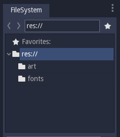

Player Scene
------------

The first scene we will make defines the ``Player`` object. One of the benefits
of creating a separate Player scene is that we can test it separately, even
before we've created other parts of the game.

Node Structure
~~~~~~~~~~~~~~

To begin, click the "Add/Create a New Node" button and add an :ref:`Area2D <class_Area2D>`
node to the scene.

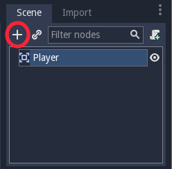

With ``Area2D`` we can detect objects that overlap or run into the player.
Change its name to ``Player`` by clicking on the node's name.
This is the scene's root node. We can add additional nodes to the player to add functionality.

Before we add any children to the ``Player`` node, we want to make sure we don't
accidentally move or resize them by clicking on them. Select the node and
click the icon to the right of the lock; its tooltip says "Makes sure the object's children
are not selectable."

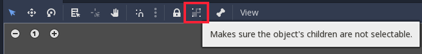

Save the scene. Click Scene -> Save, or press ``Ctrl+S`` on Windows/Linux or ``Command+S`` on Mac.

.. note:: For this project, we will be following the Godot naming
          conventions. Classes (nodes) use ``CamelCase``, variables and
          functions use ``snake_case``, and constants use ``ALL_CAPS``.

Sprite Animation
~~~~~~~~~~~~~~~~

Click on the ``Player`` node and add an :ref:`AnimatedSprite <class_AnimatedSprite>` node as a
child. The ``AnimatedSprite`` will handle the appearance and animations
for our player. Notice that there is a warning symbol next to the node.
An ``AnimatedSprite`` requires a :ref:`SpriteFrames <class_SpriteFrames>` resource, which is a
list of the animations it can display. To create one, find the
``Frames`` property in the Inspector and click "<null>" ->
"New SpriteFrames". Next, in the same location, click
``<SpriteFrames>`` to open the "SpriteFrames" panel:

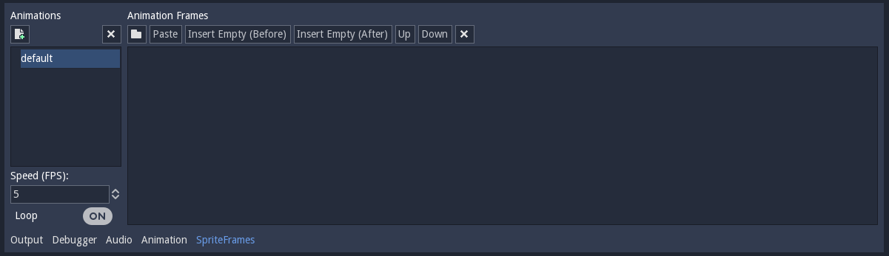

On the left is a list of animations. Click the "default" one and rename
it to "right". Then click the "Add" button to create a second animation
named "up". Drag the two images for each animation, named ``playerGrey_up[1/2]`` and ``playerGrey_walk[1/2]``,
into the "Animation Frames" side of the panel:

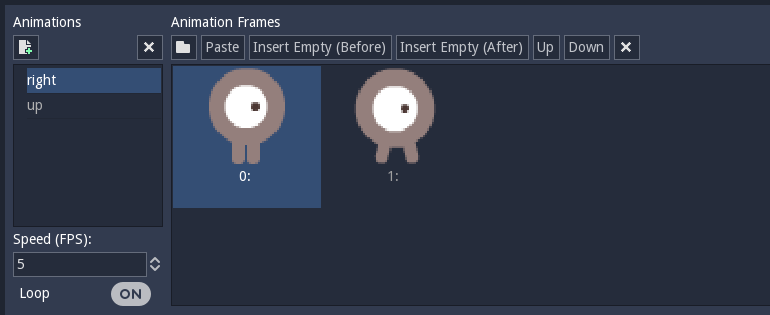

The player images are a bit too large for the game window, so we need to
scale them down. Click on the ``AnimatedSprite`` node and set the ``Scale``
property to ``(0.5, 0.5)``. You can find it in the Inspector under the
``Node2D`` heading.

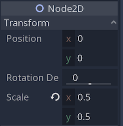

Finally, add a :ref:`CollisionShape2D <class_CollisionShape2D>` as a child
of ``Player``. This will determine the player's "hitbox", or the
bounds of its collision area. For this character, a ``CapsuleShape2D``
node gives the best fit, so next to "Shape" in the Inspector, click
"<null>"" -> "New CapsuleShape2D".  Resize the shape to cover the sprite:

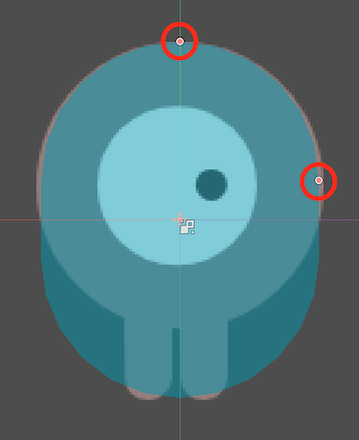

.. warning:: Don't scale the shape's outline! Only use the
             size handles (circled in red) to adjust the shape!

When you're finished, your ``Player`` scene should look like this:

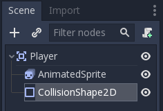

Moving the Player
~~~~~~~~~~~~~~~~~

Now we need to add some functionality that we can't get from a built-in
node, so we'll add a script. Click the ``Player`` node and click the
"Add Script" button:

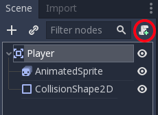

In the script settings window, you can leave the default settings alone. Just
click "Create":

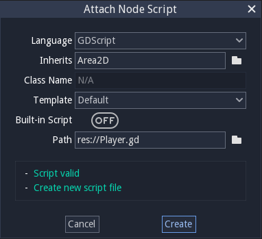

.. note:: If this is your first time encountering GDScript, please read
          :ref:`doc_scripting` before continuing.

Start by declaring the member variables this object will need:

::

    extends Area2D

    export (int) var SPEED  # how fast the player will move (pixels/sec)
    var velocity = Vector2()  # the player's movement vector
    var screensize  # size of the game window

Using the ``export`` keyword on the first variable ``SPEED`` allows us to
set its value in the Inspector. This can be very handy for values that you
want to be able to adjust just like a node's built-in properties. Click on
the ``Player`` node and set the speed property to ``400``.

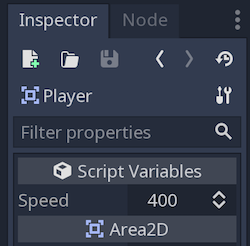

The ``_ready()`` function is called when a node enters the scene tree, 
which is a good time to find the size of the game window:

::

    func _ready():
        screensize = get_viewport_rect().size

Now we can use the ``_process()`` function to define what the player will do.
``_process()`` is called every frame, so we'll use it to update
elements of our game which we expect will change often. Here we'll make it:

- Check for input.
- Move in the given direction.
- Play the appropriate animation.

First, we need to check for input - is the player pressing a key? For
this game, we have 4 direction inputs to check. Input actions are defined
in the Project Settings under "Input Map". You can define custom events and
assign different keys, mouse events, or other inputs to them. For this demo,
we will use the default events that are assigned to the arrow keys on the
keyboard.

You can detect whether a key is pressed using
``Input.is_action_pressed()``, which returns ``true`` if it is pressed
or ``false`` if it isn't.

::

    func _process(delta):
        velocity = Vector2()
        if Input.is_action_pressed("ui_right"):
            velocity.x += 1
        if Input.is_action_pressed("ui_left"):
            velocity.x -= 1
        if Input.is_action_pressed("ui_down"):
            velocity.y += 1
        if Input.is_action_pressed("ui_up"):
            velocity.y -= 1
        if velocity.length() > 0:
            velocity = velocity.normalized() * SPEED
            $AnimatedSprite.play()
        else:
            $AnimatedSprite.stop()

We check each input and add/subtract from the ``velocity`` to obtain a
total direction. For example, if you hold ``right`` and ``down`` at
the same time, the resulting ``velocity`` vector will be ``(1, 1)``. In
this case, since we're adding a horizontal and a vertical movement, the
player would move *faster* than if it just moved horizontally.

We can prevent that if we *normalize* the velocity, which means we set
its *length* to ``1``, and multiply by the desired speed. This means no
more fast diagonal movement.

.. tip:: If you've never used vector math before, or just need a refresher,
         you can see an explanation of vector usage in Godot at :ref:`doc_vector_math`.
         It's good to know but won't be necessary for the rest of this tutorial.

We also check whether the player is moving so we can start or stop the
AnimatedSprite animation.

.. tip:: ``$`` returns the node at the relative path from this node, or returns ``null`` if the node is not found.
         Since AnimatedSprite is a child of the current node, we can just use ``$AnimatedSprite``.
         
         ``$`` is shorthand for ``get_node()``.
         So in the code above, ``$AnimatedSprite.play()`` is the same as ``get_node("AnimatedSprite").play()``.

Now that we have a movement direction, we can update ``Player``'s position
and use ``clamp()`` to prevent it from leaving the screen:

::

        position += velocity * delta
        position.x = clamp(position.x, 0, screensize.x)
        position.y = clamp(position.y, 0, screensize.y)

.. tip:: *Clamping* a value means restricting it to a given range.

Click "Play the edited scene" (``F6``) and confirm you can move the player
around the screen in all directions.

.. warning:: If you get an error in the "Debugger" panel that refers to a "null instance",
             this likely means you spelled the node name wrong. Node names are case-sensitive
             and ``$NodeName`` or ``get_node("NodeName")`` must match the name you see in the scene tree.

Choosing Animations
~~~~~~~~~~~~~~~~~~~

Now that the player can move, we need to change which animation the
AnimatedSprite is playing based on direction. We have a ``right``
animation, which should be flipped horizontally using the ``flip_h``
property for left movement, and an ``up`` animation, which should be
flipped vertically with ``flip_v`` for downward movement.
Let's place this code at the end of our ``_process()`` function:

::

        if velocity.x != 0:
            $AnimatedSprite.animation = "right"
            $AnimatedSprite.flip_v = false
            $AnimatedSprite.flip_h = velocity.x < 0
        elif velocity.y != 0:
            $AnimatedSprite.animation = "up"
            $AnimatedSprite.flip_v = velocity.y > 0

Play the scene again and check that the animations are correct in each
of the directions. When you're sure the movement is working correctly,
add this line to ``_ready()`` so the player will be hidden when the game
starts:

::
    
    hide()

Preparing for Collisions
~~~~~~~~~~~~~~~~~~~~~~~~

We want ``Player`` to detect when it's hit by an enemy, but we haven't
made any enemies yet! That's OK, because we're going to use Godot's
*signal* functionality to make it work.

Add the following at the top of the script, after ``extends Area2d``:

::

    signal hit

This defines a custom signal called "hit" that we will have our player
emit (send out) when it collides with an enemy. We will use ``Area2D`` to
detect the collision. Select the ``Player`` node and click the "Node" tab
next to the Inspector tab to see the list of signals the player can emit:

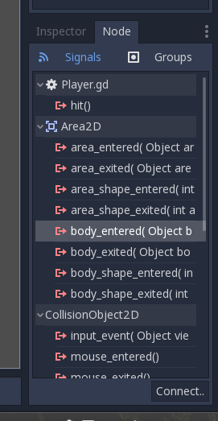

Notice our custom "hit" signal is there as well! Since our enemies are
going to be ``RigidBody2D`` nodes, we want the
``body_entered( Object body )`` signal; this will be emitted when a
body contacts the player. Click "Connect.." and then "Connect" again on
the "Connecting Signal" window. We don't need to change any of these
settings - Godot will automatically create a function called
``_on_Player_body_entered`` in your player's script.

.. tip:: When connecting a signal, instead of having Godot create a
         function for you, you can also give the name of an existing
         function that you want to link the signal to.

Add this code to the function:

::

    func _on_Player_body_entered( body ):
        hide() # Player disappears after being hit
        emit_signal("hit")
        $CollisionShape2D.disabled = true

.. Note:: Disabling the area's collision shape means
          it won't detect collisions. By turning it off, we make
          sure we don't trigger the ``hit`` signal more than once.

The last piece for our player is to add a function we can call to reset
the player when starting a new game.

::

    func start(pos):
        position = pos
        show()
        $CollisionShape2D.disabled = false

Enemy Scene
-----------

Now it's time to make the enemies our player will have to dodge. Their
behavior will not be very complex: mobs will spawn randomly at the edges
of the screen and move in a random direction in a straight line, then
despawn when they go offscreen.

We will build this into a ``Mob`` scene, which we can then *instance* to
create any number of independent mobs in the game.

Node Setup
~~~~~~~~~~

Click Scene -> New Scene and we'll create the Mob.

The Mob scene will use the following nodes:

-  :ref:`RigidBody2D <class_RigidBody2D>` (named ``Mob``)

   -  :ref:`AnimatedSprite <class_AnimatedSprite>`
   -  :ref:`CollisionShape2D <class_CollisionShape2D>`
   -  :ref:`VisibilityNotifier2D <class_VisibilityNotifier2D>` (named ``Visibility``)

Don't forget to set the children so they can't be selected, like you did with the
Player scene.

In the :ref:`RigidBody2D <class_RigidBody2D>` properties, set ``Gravity Scale`` to ``0``, so
the mob will not fall downward. In addition, under the
``PhysicsBody2D`` section, click the ``Mask`` property and
uncheck the first box. This will ensure the mobs do not collide with each other.

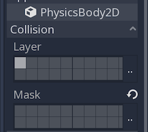

Set up the :ref:`AnimatedSprite <class_AnimatedSprite>` like you did for the player.
This time, we have 3 animations: ``fly``, ``swim``, and ``walk``. Set the ``Playing``
property in the Inspector to "On" and adjust the "Speed (FPS)" setting as shown below.
We'll select one of these animations randomly so that the mobs will have some variety.

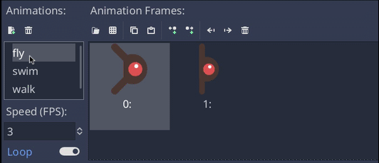

``fly`` should be set to 3 FPS, with ``swim`` and ``walk`` set to 4 FPS. 

Like the player images, these mob images need to be scaled down. Set the
``AnimatedSprite``'s ``Scale`` property to ``(0.75, 0.75)``.

As in the ``Player`` scene, add a ``CapsuleShape2D`` for the
collision. To align the shape with the image, you'll need to set the
``Rotation Degrees`` property to ``90`` under ``Node2D``.

Enemy Script
~~~~~~~~~~~~

Add a script to the ``Mob`` and add the following member variables:

::

    extends RigidBody2D

    export (int) var MIN_SPEED # minimum speed range
    export (int) var MAX_SPEED # maximum speed range
    var mob_types = ["walk", "swim", "fly"]

We'll pick a random value between ``MIN_SPEED`` and ``MAX_SPEED`` for
how fast each mob will move (it would be boring if they were all moving
at the same speed). Set them to ``150`` and ``250`` in the Inspector. We
also have an array containing the names of the three animations, which
we'll use to select a random one.

Now let's look at the rest of the script. In ``_ready()`` we will randomly 
choose one of the three animation types:

::

    func _ready():
        $AnimatedSprite.animation = mob_types[randi() % mob_types.size()]

.. note:: You must use ``randomize()`` if you want
          your sequence of "random" numbers to be different every time you run
          the scene. We're going to use ``randomize()`` in our ``Main`` scene,
          so we won't need it here. ``randi() % n`` is the standard way to get
          a random integer between ``0`` and ``n-1``.

The last piece is to make the mobs delete themselves when they leave the
screen. Connect the ``screen_exited()`` signal of the ``Visibility``
node and add this code:

::

    func _on_Visibility_screen_exited():
        queue_free()

This completes the `Mob` scene.

Main Scene
----------

Now it's time to bring it all together. Create a new scene and add a
:ref:`Node <class_Node>` named ``Main``. Click the "Instance" button and select your
saved ``Player.tscn``.

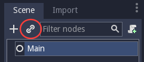

.. note:: See :ref:`doc_instancing` to learn more about instancing.

Now add the following nodes as children of ``Main``, and name them as
shown (values are in seconds):

-  :ref:`Timer <class_Timer>` (named ``MobTimer``) - to control how often mobs spawn
-  :ref:`Timer <class_Timer>` (named ``ScoreTimer``) - to increment the score every second
-  :ref:`Timer <class_Timer>` (named ``StartTimer``) - to give a delay before starting
-  :ref:`Position2D <class_Position2D>` (named ``StartPosition``) - to indicate the player's start position

Set the ``Wait Time`` property of each of the ``Timer`` nodes as
follows:

-  ``MobTimer``: ``0.5``
-  ``ScoreTimer``: ``1``
-  ``StartTimer``: ``2``

In addition, set the ``One Shot`` property of ``StartTimer`` to "On" and
set ``Position`` of the ``StartPosition`` node to ``(240, 450)``.

Spawning Mobs
~~~~~~~~~~~~~

The Main node will be spawning new mobs, and we want them to appear at a
random location on the edge of the screen. Add a :ref:`Path2D <class_Path2D>` node named
``MobPath`` as a child of ``Main``. When you select ``Path2D``, 
you will see some new buttons at the top of the editor:

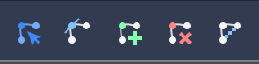

Select the middle one ("Add Point") and draw the path by clicking to add
the points at the corners shown. To have the points snap to the grid, make sure "Snap to
Grid" is checked. This option can be found under the "Snapping options"
button to the left of the "Lock" button, appearing as a series of three
vertical dots.

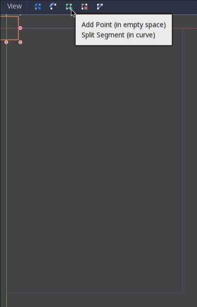

.. important:: Draw the path in *clockwise* order, or your mobs will spawn
               pointing *outwards* instead of *inwards*!

After placing point ``4`` in the image, click the "Close Curve" button and
your curve will be complete.

Now that the path is defined, add a :ref:`PathFollow2D <class_PathFollow2D>`
node as a child of ``MobPath`` and name it ``MobSpawnLocation``. This node will
automatically rotate and follow the path as it moves, so we can use it
to select a random position and direction along the path.

Main Script
~~~~~~~~~~~

Add a script to ``Main``. At the top of the script we use
``export (PackedScene)`` to allow us to choose the Mob scene we want to
instance.

::

    extends Node

    export (PackedScene) var Mob
    var score

    func _ready():
        randomize()

Drag ``Mob.tscn`` from the "FileSystem" panel and drop it in the
``Mob`` property.

Next, click on the Player and connect the ``hit`` signal. We want to make a
new function named ``game_over``, which will handle what needs to happen when a
game ends. Type "game_over" in the "Method In Node" box at the bottom of the
"Connecting Signal" window. Add the following code, as well as a ``new_game``
function to set everything up for a new game:

::

    func game_over():
        $ScoreTimer.stop()
        $MobTimer.stop()

    func new_game():
        score = 0
        $Player.start($StartPosition.position)
        $StartTimer.start()

Now connect the ``timeout()`` signal of each of the Timer nodes.
``StartTimer`` will start the other two timers. ``ScoreTimer`` will
increment the score by 1.

::

    func _on_StartTimer_timeout():
        $MobTimer.start()
        $ScoreTimer.start()

    func _on_ScoreTimer_timeout():
        score += 1

In ``_on_MobTimer_timeout()`` we will create a mob instance, pick a
random starting location along the ``Path2D``, and set the mob in
motion. The ``PathFollow2D`` node will automatically rotate as it
follows the path, so we will use that to select the mob's direction as
well as its position.

Note that a new instance must be added to the scene using
``add_child()``.

::

    func _on_MobTimer_timeout():
        # choose a random location on Path2D
        $MobPath/MobSpawnLocation.set_offset(randi())
        # create a Mob instance and add it to the scene
        var mob = Mob.instance()
        add_child(mob)
        # set the mob's direction perpendicular to the path direction
        var direction = $MobPath/MobSpawnLocation.rotation + PI/2
        # set the mob's position to a random location
        mob.position = $MobPath/MobSpawnLocation.position
        # add some randomness to the direction
        direction += rand_range(-PI/4, PI/4)
        mob.rotation = direction
        # choose the velocity
        mob.set_linear_velocity(Vector2(rand_range(mob.MIN_SPEED, mob.MAX_SPEED), 0).rotated(direction))

.. important:: In functions requiring angles, GDScript uses *radians*,
               not degrees. If you're more comfortable working with
               degrees, you'll need to use the ``deg2rad()`` and
               ``rad2deg()`` functions to convert between the two.

HUD
---

The final piece our game needs is a UI: an interface to display things
like score, a "game over" message, and a restart button. Create a new
scene, and add a :ref:`CanvasLayer <class_CanvasLayer>` node named ``HUD``. "HUD" stands for
"heads-up display", an informational display that appears as an
overlay on top of the game view.

The :ref:`CanvasLayer <class_CanvasLayer>` node lets us draw our UI elements on
a layer above the rest of the game, so that the information it displays isn't
covered up by any game elements like the player or mobs.

The HUD displays the following information:

-  Score, changed by ``ScoreTimer``.
-  A message, such as "Game Over" or "Get Ready!"
-  A "Start" button to begin the game.

The basic node for UI elements is :ref:`Control <class_Control>`. To create our UI,
we'll use two types of :ref:`Control <class_Control>` nodes: :ref:`Label <class_Label>`
and :ref:`Button <class_Button>`.

Create the following as children of the ``HUD`` node:

-  :ref:`Label <class_Label>` named ``ScoreLabel``.
-  :ref:`Label <class_Label>` named ``MessageLabel``.
-  :ref:`Button <class_Button>` named ``StartButton``.
-  :ref:`Timer <class_Timer>` named ``MessageTimer``.

.. note:: **Anchors and Margins:** ``Control`` nodes have a position and size,
          but they also have anchors and margins. Anchors define the
          origin - the reference point for the edges of the node. Margins
          update automatically when you move or resize a control node. They
          represent the distance from the control node's edges to its anchor.
          See :ref:`doc_design_interfaces_with_the_control_nodes` for more details.

Arrange the nodes as shown below. Click the "Anchor" button to
set a Control node's anchor:

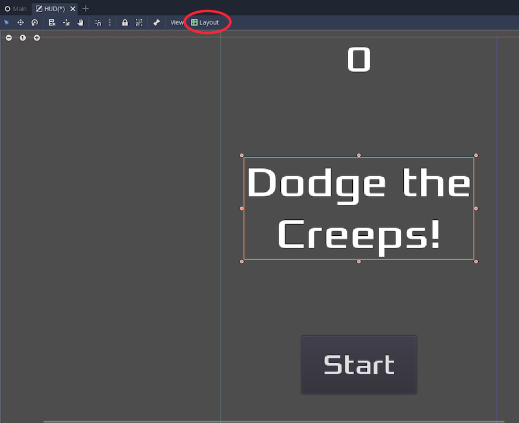

You can drag the nodes to place them manually, or for more precise
placement, use the following settings:

ScoreLabel
~~~~~~~~~~

-  ``Layout``: "Center Top"
-  ``Margin``:

   -  Left: ``-25``
   -  Top: ``0``
   -  Right: ``25``
   -  Bottom: ``100``

-  Text: ``0``

MessageLabel
~~~~~~~~~~~~

-  ``Layout``: "Center Bottom"
-  ``Margin``:

   -  Left: ``-100``
   -  Top: ``-200``
   -  Right: ``100``
   -  Bottom: ``-100``

-  Text: ``Dodge the Creeps!``

StartButton
~~~~~~~~~~~

-  ``Layout``: "Center"
-  ``Margin``:

   -  Left: ``-60``
   -  Top: ``70``
   -  Right: ``60``
   -  Bottom: ``150``

-  Text: ``Start``

The default font for ``Control`` nodes is very small and doesn't scale
well. There is a font file included in the game assets called
"Xolonium-Regular.ttf". To use this font, do the following for each of
the three ``Control`` nodes:

1. Under "Custom Fonts", choose "New DynamicFont"

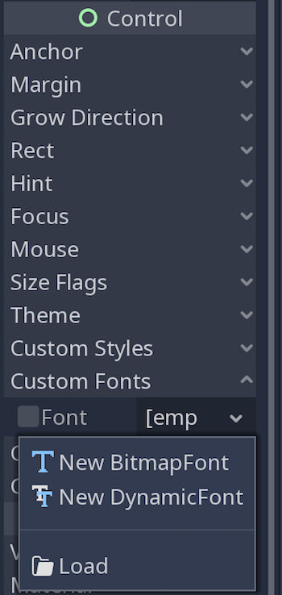

2. Click on the "DynamicFont" you just added, and under "Font Data",
   choose "Load" and select the "Xolonium-Regular.ttf" file. You must
   also set the font's ``Size``. A setting of ``64`` works well.

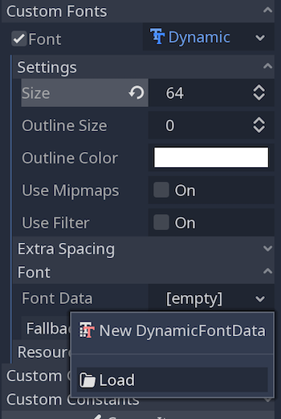

Now add this script to ``HUD``:

::

    extends CanvasLayer

    signal start_game

The ``start_game`` signal tells the ``Main`` node that the button
has been pressed.

::

    func show_message(text):
        $MessageLabel.text = text
        $MessageLabel.show()
        $MessageTimer.start()

This function is called when we want to display a message
temporarily, such as "Get Ready". On the ``MessageTimer``, set the
``Wait Time`` to ``2`` and set 	the ``One Shot`` property to "On".

::

    func show_game_over():
        show_message("Game Over")
        yield($MessageTimer, "timeout")
        $StartButton.show()
        $MessageLabel.text = "Dodge the\nCreeps!"
        $MessageLabel.show()

This function is called when the player loses. It will show "Game
Over" for 2 seconds, then return to the title screen and show the
"Start" button.

::

    func update_score(score):
        $ScoreLabel.text = str(score)

This function is called in ``Main`` whenever the score changes.

Connect the ``timeout()`` signal of ``MessageTimer`` and the
``pressed()`` signal of ``StartButton``.

::

    func _on_StartButton_pressed():
        $StartButton.hide()
        emit_signal("start_game")

    func _on_MessageTimer_timeout():
        $MessageLabel.hide()

Connecting HUD to Main
~~~~~~~~~~~~~~~~~~~~~~

Now that we're done creating the ``HUD`` scene, save it and go back to ``Main``.
Instance the ``HUD`` scene in ``Main`` like you did the ``Player`` scene, and place it at the
bottom of the tree. The full tree should look like this,
so make sure you didn't miss anything:

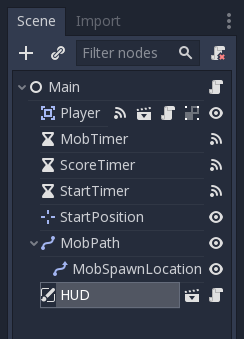

Now we need to connect the ``HUD`` functionality to our ``Main`` script.
This requires a few additions to the ``Main`` scene:

In the Node tab, connect the HUD's ``start_game`` signal to the
``new_game()`` function.

In ``new_game()``, update the score display and show the "Get Ready"
message:

::

        $HUD.update_score(score)
        $HUD.show_message("Get Ready")

In ``game_over()`` we need to call the corresponding ``HUD`` function:

::

        $HUD.show_game_over()

Finally, add this to ``_on_ScoreTimer_timeout()`` to keep the display in
sync with the changing score:

::

        $HUD.update_score(score)

Now you're ready to play! Click the "Play the Project" button. You will
be asked to select a main scene, so choose ``Main.tscn``.

Finishing Up
------------

We have now completed all the functionality for our game. Below are some
remaining steps to add a bit more "juice" to improve the game
experience. Feel free to expand the gameplay with your own ideas.

Background
~~~~~~~~~~

The default gray background is not very appealing, so let's change its
color. One way to do this is to use a :ref:`ColorRect <class_ColorRect>` node. Make it the
first node under ``Main`` so that it will be drawn behind the other
nodes. ``ColorRect`` only has one property: ``Color``. Choose a color
you like and drag the size of the ``ColorRect`` so that it covers the
screen.

You can also add a background image, if you have one, by using a
``Sprite`` node.

Sound Effects
~~~~~~~~~~~~~

Sound and music can be the single most effective way to add appeal to
the game experience. In your game assets folder, you have two sound
files: "House In a Forest Loop.ogg" for background music, and
"gameover.wav" for when the player loses.

Add two :ref:`AudioStreamPlayer <class_AudioStreamPlayer>` nodes as children of ``Main``. Name one of
them ``Music`` and the other ``DeathSound``. On each one, click on the
``Stream`` property, select "Load", and choose the corresponding audio
file.

To play the music, add ``$Music.play()`` in the ``new_game()`` function
and ``$Music.stop()`` in the ``game_over()`` function.

Finally, add ``$DeathSound.play()`` in the ``game_over()`` function.

Particles
~~~~~~~~~

For one last bit of visual appeal, let's add a trail effect to the
player's movement. Choose your ``Player`` scene and add a
:ref:`Particles2D <class_Particles2D>` node named ``Trail``.

There are a very large number of properties to choose from when
configuring particles. Feel free to experiment and create different
effects. For the effect in this example, use the following settings:

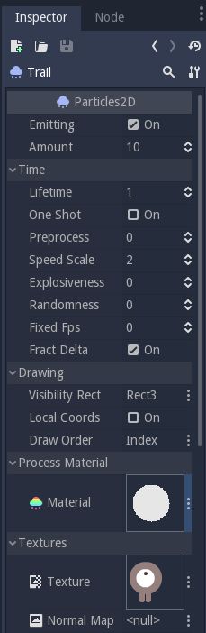

You also need to create a ``Material`` by clicking on ``<null>`` and
then "New ParticlesMaterial". The settings for that are below:

.. image:: img/particle_trail_settings2.png

To make the gradient for the "Color Ramp" setting, we want a gradient taking
the alpha (transparency) of the sprite from 0.5 (semi-transparent) to
0.0 (fully transparent).

Click "New GradientTexture", then under "Gradient", click "New Gradient". You'll
see a window like this:

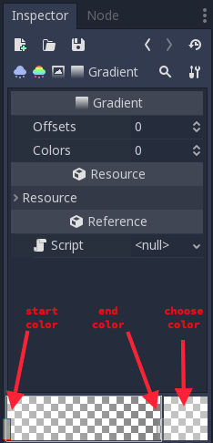

The left and right boxes represent the start and end colors. Click on each
and then click the large square on the right to choose the color. For the first
color, set the ``A`` (alpha) value to around halfway. For the second, set it
all the way to ``0``.

.. seealso:: See :ref:`Particles2D <class_Particles2D>` for more details on using
             particle effects.

Project Files
-------------

You can find a completed version of this project here:
https://github.com/kidscancode/Godot3_dodge/releases
