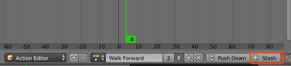
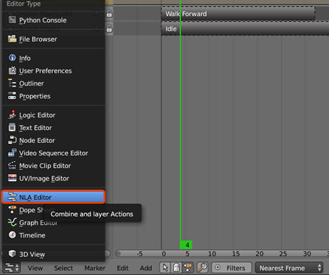
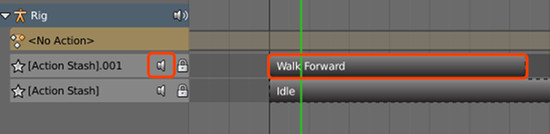
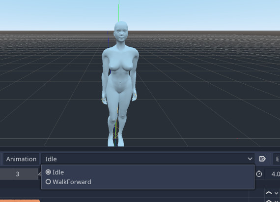

Animation
=========
Animation supported:
 - transform animation of all types of objects
 - transform animation of pose bones
 - shape key animation
 - light animation
 - camera animation

Multiple Actions For Single Object 
----------------------------------
In most games, one objects would have serveral animations to switch between. 
This addon have a support for exporting multiple actions all at once into
a single AnimationPlayer and makes it easy to switch actions.

This worksflow makes use of blender nla_tracks. Here is a brief guide of how
to use this feature:

**1. Switch workspace to 'Dope Sheet'**

.. image:: img/dope_sheet.jpg

**2. Stash the active action**

the stashed action while not action would still be exported

**3. Check stashed actions in 'NLA Editor' [optional]**

Switch workspace to 'NLA Editor'

Make sure all stashed actions are muted

**4. Export the scene**

all the stashed action as well as the active action are exported
to the an AnimationPlayer

Constraints
-----------
Sometimes complicated animation is built with object constraint, an usual
example is inverse kinematics. The addon would automatically check if an
object has some constraint, if it does, all the constraints are baked into
every action the object has and then exported.

Animation Mode
---------------------------
Godot and Blender have different structure to store animation data.
In Godot animation data is stored in an AnimationPlayer node, instead
of in each animated node. In order to fix this inconsistence and still
make the animation play versatile, this addon has three aimation exporting
modes.

**Mode 'Animation as Actions'**

Treat all the animation as object actions, so in the exported scene, every
object would have its own AnimationPlayer and hold its actions.

**Mode 'Scene Animation'**

If you want your animation generate same result as playing at Blender's
timeline, this is what you want. In this mode, all the animation in the scene
are placed in just one AnimationPlayer in the scene root.

**Mode 'Animation as Action with Squash'**

This mode has very similar behaviour of mode 'Animation as Action', but it
can generate less AnimationPlayers, objects in parent-children relation would
share their AnimationPlayer. It is useful when you have several rigs, and each
Skeleton and Mesh has actions, then one rig would have just one AnimationPlayer.
