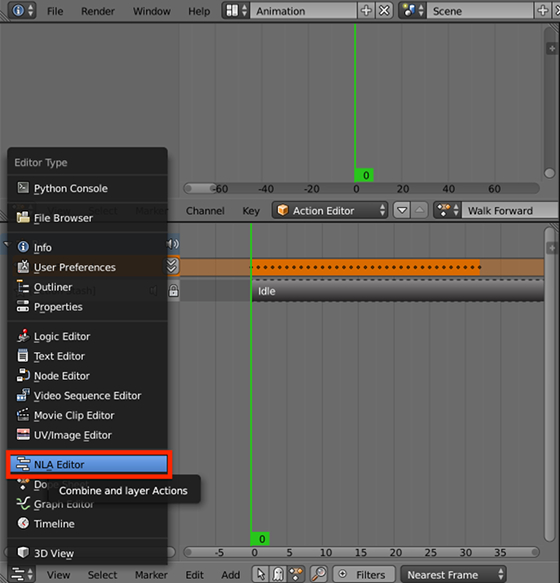
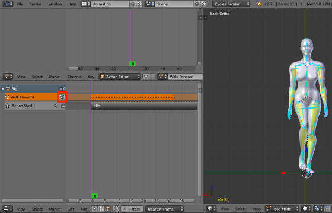
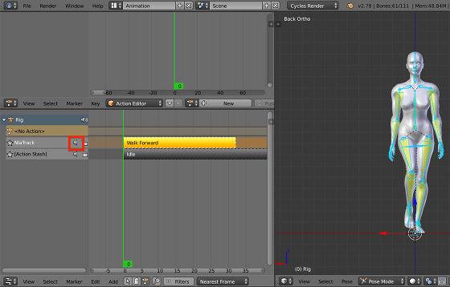
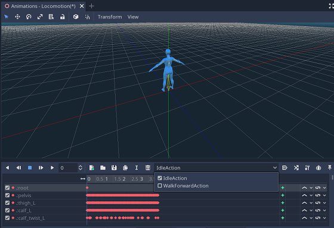
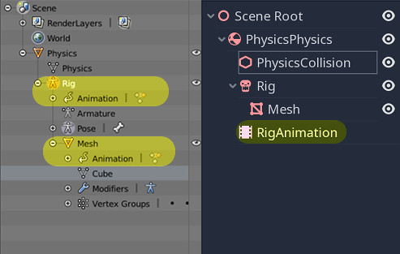

Animation
=========
Animation supported:
 - transform animation of all types of objects
 - transform animation of pose bones
 - shape key animation
 - light animation
 - camera animation

Multiple Actions For Single Object 
----------------------------------
In most games, objects would have different animations to be played in different
states. This addon have a support for exporting multiple actions all at once into
a single AnimationPlayer and enable artist to easily switch between them.

This worksflow makes use of blender nla_tracks. Here is a brief guide:

1. switch workspace to NLA_Editor

2. stash an active action to nla_tracks, then other active action can be bind
to this object

3. mute stashed actions, then they do not affect your current active action

4. export the scene use the addon, you can see all the stashed action and the
active action are exported to the corresponding AnimationPlayer

Constraints
-----------
Sometimes complicated animation is built with object constraint, an usual
example is inverse kinematics. The addon would automatically check if an
object has some constraint, if it does, all the constraints are baked into
every action the object has and then exported.

Placing of AnimationPlayer
---------------------------
Godot and Blender have different structure to store animation data.
In Godot animation data is stored in an AnimationPlayer node, instead
of in each animated node.

The exporter has an option :code:`Separate AnimationPlayer For Each Object`
which controls how the exported AnimationPlayers are placed.

.. note::
    If :code:`Separate AnimationPlayer For Each Object` is **disabled**
    children node of an animated object shares one AnimationPlayer.
    This configuration would create less AnimationPlayer and suitable
    for some highly connected child-parent nodes (e.g. Armatures)

In the following case, animation data of "Mesh" is exported to its
parent node "Armature"'s AnimationPlayer.

.. note::
    If :code:`Separate AnimationPlayer For Each Object` is **enabled**
    every animated object got its own AnimationPlayer. This configuration
    is useful when you want to play multiple animation concurrently,
    because one AnimationPlayer node can only play one animation at a time.

In the following case, "Mesh" and "Armature" have their own AnimationPlayer

.. image:: img/animation_sep.jpg
