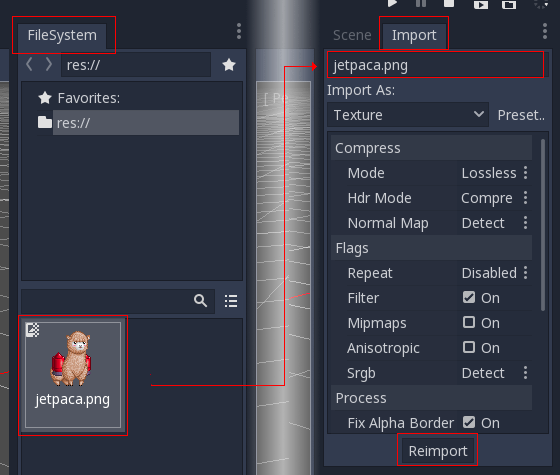
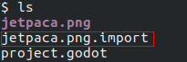
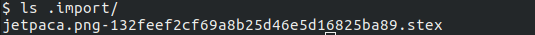
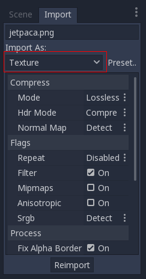
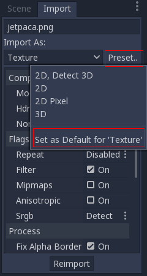

.. _doc_import_process:

Import process
==============

Importing assets in Godot 3.0+
------------------------------

Previously, importing assets in Godot 2.x required manual maintenance
of a separate directory with source assets. Without doing this, it was
impossible to specify how to convert and change import flags for
textures, audio files, scenes, etc.

In Godot 3.0, we use a more modern approach to importing: Simply drop
your assets (image files, scenes, audio files, fonts, etc) directly in the
project folder (copy them manually with your OS file explorer).
Godot will automatically import these files internally
and keep the imported resources hidden in a res://.import folder.

This allows changing all the import parameters transparently.

Changing import parameters
--------------------------

Changing the import parameters of an asset in Godot (again, keep in mind
import parameters are only present in non-native Godot resource types) is
easy. Select the relevant resource in the filesystem dock:

Then, after adjusting the parameters, press "Reimport". These parameters
will only be used for this asset and on future reimports.

Changing the import parameters of several assets at the same time is also
possible. Simply select all of them together in the resources dock and the
exposed parameters will apply to all of them when reimporting.

Automatic reimport
------------------

When the MD5 checksum of the source asset changes, Godot will perform an
automatic reimport of it, applying the preset configured for that specific
asset.

Files generated
-----------------

Importing will add an extra <asset>.import file, containing the import
configuration. Make sure to commit these to your version control system!

Additionally, extra assets will be preset in the hidden res://.import folder:

If any of the files present in this folder is erased (or the whole folder), the
asset or assets will be reimported automatically. As such, committing this folder
to the version control system is optional. It can shorten
reimporting time when checking out on another computer, but it takes considerably
more space and transfer time. Pick your poison!

Changing import resource type
-----------------------------

Some source assets can be imported as different types of resources.
For this, select the relevant type of resource desired and
press "Reimport":

Changing default import parameters
-----------------------------------

Different types of games might require different defaults.
Changing the defaults per project can be achieved by using the
"Preset.." Menu. Besides some resource types offering presets,
the default setting can be saved and cleared too:

Simplicity is key!
------------------

This is a very simple workflow which should take very little time to get used to. It also enforces a more
correct way to deal with resources.

There are many types of assets available for import, so please continue reading to understand how to work
with all of them!
