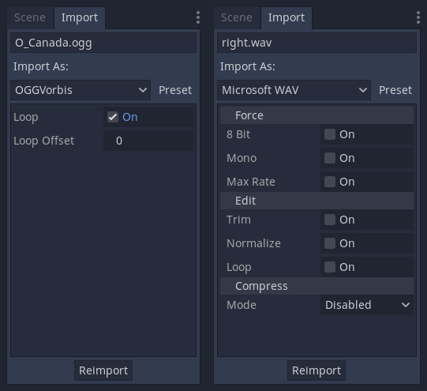
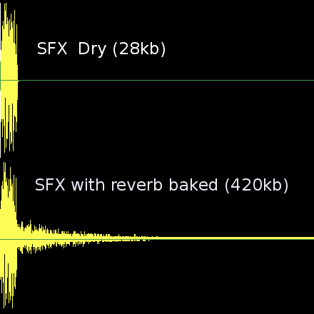

.. _doc_importing_audio_samples:

Importing audio samples
=======================

Why importing?
--------------

Raw audio data in general is large and undesired. Godot provides two main
options to import your audio data: WAV and OGG Vorbis.

Each has different advantages. 
* Wav files use raw data or light compression, require small amount of CPU to play back (hundreds of simultaneous voices in this format are fine), but take up significant space.
* Ogg Vorbis files use a stronger compression that results in much smaller file size, but uses significantly more processor to play back.

Here is a comparative chart.

+-------------------------------+---------------------+
| Format                        | 1 Second of Audio   |
+===============================+=====================+
| WAV 24 bits, 96 kHz, Stereo   | 576kb               |
+-------------------------------+---------------------+
| WAV 16 bits, 44 kHz, Mono     | 88kb                |
+-------------------------------+---------------------+
| WAV 16 bits, IMA-ADPCM, Mono  | 22kb                |
+-------------------------------+---------------------+
| OGG 128kbps, Stereo           | 16kb                |
+-------------------------------+---------------------+
| OGG Vorbis 96kbps, Stereo     | 12kb                |
+-------------------------------+---------------------+

In general, what is recommended, is to use WAV for most sound effects, especially those that are short and repetitive, and OGG for music, voice and long sound effects.

Best Practices
--------------

Godot 3+ has an amazing bus system with built in effects. This saves
SFX artists the need to add reverb to the sound effects, reducing their
size greatly and ensuring correct trimming. Say no to SFX with baked
reverb!

As you can see above, sound effects become huge with reverb added.

Trimming
~~~~~~~~

One issue that happens often is that the waveform are exported with long 
silences at the beginning and at the end. These are inserted by
DAWs when saving to a waveform, increase their size unnecessarily and
add latency to the moment they are played back. 

Importing as WAV with the Trimming option enabled solves
this.

Looping
~~~~~~~

Godot supports looping in the samples (Tools such as Sound Forge or
Audition can add loop points to wav files). This is useful for sound
effects such as engines, machine guns, etc. Ping-pong looping is also
supported.

As an alternative, the import screen has a "loop" option that enables
looping for the entire sample when importing.

