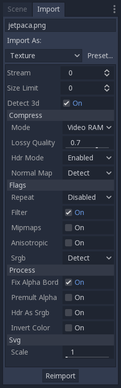
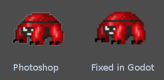

.. _doc_import_images:

Importing images
================

Why import them?
----------------

In Godot 3+, image files are no longer native resources and they must be imported.
The reason behind this is the large amount of configuration parameters that
image files can be imported with.

This small tutorial will explain what these parameters are and how to best
make use of them.

Importing textures
------------------

The default action in Godot is to import images as textures. Textures are stored
in video memory and can't be accessed directly. This is what makes drawing them
efficient.

Import options are vast:

Detect 3D
~~~~~~~~~

This option makes Godot be aware of when a texture (which is imported for 2D as default) is used in 3D. If this happens, setting are changed so the texture flags
are friendlier to 3D (mipmaps, filter and repeat become enabled and compression is changed to VRAM). Texture is also reimported automatically.

Supported image formats
-----------------------

Godot can import the following image formats:

- BMP (``.bmp``)
  - No support for 16-bit per pixel images. Only 1-bit, 4-bit, 8-bit, 24-bit, and 32-bit per pixel images are supported.
- DirectDraw Surface (``.dds``)
  - If mipmaps are present in the texture, they will be loaded directly.
  This can be used to achieve effects using custom mipmaps.
- OpenEXR (``.exr``)
  - Supports HDR (highly recommended for panorama skies).
- Radiance HDR (``.hdr``)
  - Supports HDR (highly recommended for panorama skies).
- JPEG (``.jpg``, ``.jpeg``)
  - Doesn't support transparency per the format's limitations.
- PNG (``.png``)
  - Precision is limited to 8 bits per channel upon importing (no HDR images).
- Truevision Targa (``.tga``)
- SVG (``.svg``, ``.svgz``)
  - SVGs are rasterized using `NanoSVG <https://github.com/memononen/nanosvg>`__
  when importing them. Support is limited; complex vectors may not render correctly.
  For complex vectors, rendering them to PNGs using Inkscape is often a better solution.
  This can be automated thanks to its `command-line interface <https://wiki.inkscape.org/wiki/index.php/Using_the_Command_Line#Export_files>`__.
- WebP (``.webp``)

.. note::

    If you've compiled the Godot editor from source with specific modules disabled,
    some formats may not be available.

Compression
-----------

Images are one of the largest assets in a game. To handle them efficiently, they need to be compressed.
Godot offers several compression methods, depending on the use case.

Compress Mode
~~~~~~~~~~~~~

- **VRAM Compression:** This is the most common compression mode for 3D assets.
  Size on disk is reduced and video memory usage is also decreased considerably
  (usually by a factor between 4 and 6). This mode should be avoided for 2D as it
  exhibits noticeable artifacts.
- **Lossless Compression:** This is the most common compression mode for 2D assets.
  It shows assets without any kind of artifacting, and disk compression is
  decent. It will use considerably more amount of video memory than
  VRAM Compression, though. This is also the recommended setting for pixel art.
- **Lossy Compression:** This is a good choice for large 2D assets. It has some
  artifacts, but less than VRAM and the file size is several times lower
  compared to Lossless or Uncompressed. Video memory usage isn't decreased by
  this mode; it's the same as with Lossless Compression or Uncompressed.
- **Uncompressed:** Only useful for formats that can't be compressed (such as
  raw float images).

In this table, each of the four options are described together with their
advantages and disadvantages (|good| = best, |bad| = worst):

+----------------+------------------------+---------------------------+-------------------------+------------------------------------------------------+
|                | Uncompressed           | Compress Lossless (PNG)   | Compress Lossy (WebP)   | Compress VRAM                                        |
+================+========================+===========================+=========================+======================================================+
| Description    | Stored as raw pixels   | Stored as PNG             | Stored as WebP          | Stored as S3TC/BC or PVRTC/ETC depending on platform |
+----------------+------------------------+---------------------------+-------------------------+------------------------------------------------------+
| Size on Disk   | |bad| Large            | |regular| Small           | |good| Very Small       | |regular| Small                                      |
+----------------+------------------------+---------------------------+-------------------------+------------------------------------------------------+
| Memory Usage   | |bad| Large            | |bad| Large               | |bad| Large             | |good| Small                                         |
+----------------+------------------------+---------------------------+-------------------------+------------------------------------------------------+
| Performance    | |regular| Normal       | |regular| Normal          | |regular| Normal        | |good| Fast                                          |
+----------------+------------------------+---------------------------+-------------------------+------------------------------------------------------+
| Quality Loss   | |good| None            | |good| None               | |regular| Slight        | |bad| Moderate                                       |
+----------------+------------------------+---------------------------+-------------------------+------------------------------------------------------+
| Load Time      | |regular| Normal       | |bad| Slow                | |bad| Slow              | |good| Fast                                          |
+----------------+------------------------+---------------------------+-------------------------+------------------------------------------------------+

.. |good| image:: img/good.png

HDR Mode
~~~~~~~~

Godot supports high dynamic range textures (as .HDR or .EXR). These are mostly useful as high dynamic range equirectangular panorama skies (the internet
has plenty if you search for them), which replace Cubemaps in Godot 2.x. Modern PCs support the BC6H VRAM format, but there are still plenty that do not.

If you want Godot to ensure full compatibility in terms of the kind of textures, enable the "Force RGBE" option.

Normal Map
~~~~~~~~~~

When using a texture as normal map, only the red and green channels are required. Given regular texture compression algorithms produce artifacts that don't
look that nice in normal maps, the RGTC compression format is the best fit for this data. Forcing this option to "Enabled" will make Godot import the
image as RGTC compressed. By default, it's set to "Detect", which means that if the texture is ever used as a normal map, it will be changed to "Enabled" and
reimported automatically.

Note that RGTC compression affects the resulting normal map image. You will have to adjust custom shaders that use the normal map to take this into account.

.. note::

  Godot requires the normal map to use the X+, Y- and Z+ coordinates. In other
  words, if you've imported a material made to be used with another engine, you
  may have to convert the normal map so its Y axis is flipped. Otherwise, the
  normal map direction may appear to be inverted on the Y axis.

  More information about normal maps (including a coordinate order table for
  popular engines) can be found
  `here <http://wiki.polycount.com/wiki/Normal_Map_Technical_Details>`__.

Flags
-----

There are plenty of settings that can be toggled when importing an image as a texture, depending on the use case.

Repeat
~~~~~~

This setting is most commonly used in 3D, and is therefore generally disabled in 2D. It sets UV coordinates going beyond the 0,0 - 1,1 range to "loop".

Repeating can optionally be set to mirrored mode.

Filter
~~~~~~

When pixels become larger than the screen pixels, this option enables linear interpolation for them. The result is a smoother (less blocky) texture. This setting can be commonly used in 2D and 3D, but it's usually disabled when making pixel perfect games.

Mipmaps
~~~~~~~

When pixels become smaller than the screen, mipmaps kick in. This helps reduce the grainy effect when shrinking the textures. Keep in mind that, in older hardware
(GLES2, mainly mobile), there are some requirements to use mipmaps:

* Texture width and height must be powers of 2
* Repeat must be enabled

Keep in mind the above when making phone games and applications, want to aim for full compatibility, and need mipmaps.

When doing 3D, mipmap should be turned on, as this also improves performance (smaller versions of the texture are used for objects further away).

Anisotropic
~~~~~~~~~~~

When textures are near parallel to the view (like floors), this option makes them have more detail by reducing blurriness.

SRGB
~~~~

Godot uses Linear colorspace when rendering 3D. Textures mapped to albedo or detail channels need to have this option turned on in order for colors to look correct.
When set to "Detect" mode, the texture will be marked as SRGB when used in albedo channels.

Process
-------

Some special processes can be applied to images when imported as textures.

Fix Alpha Border
~~~~~~~~~~~~~~~~

This puts pixels of the same surrounding color in transition from transparency to non transparency. It helps mitigate the outline effect when exporting images
from Photoshop and the like.

It's a good idea to leave it on by default, unless specific values are needed.

Premultiplied Alpha
~~~~~~~~~~~~~~~~~~~

An alternative to fix darkened borders is to use premultiplied alpha. By enabling this option, the texture will be converted to this format.
Keep in mind that a material will need to be created that uses the PREMULT ALPHA blend mode on canvas items that need it.

HDR as sRGB
~~~~~~~~~~~

A few HDR files are broken and contain sRGB color data. It is advised not to use them, but, in the worst-case scenario, toggling this option on will make them look right.

Invert Color
~~~~~~~~~~~~

Reverses the image's color. This is useful, for example, to convert a height map generated by external programs to depth map to use with :ref:`doc_spatial_material`.
