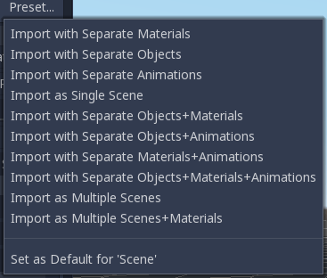
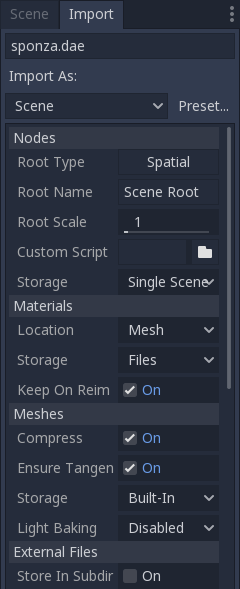
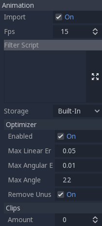
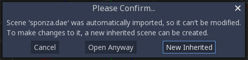
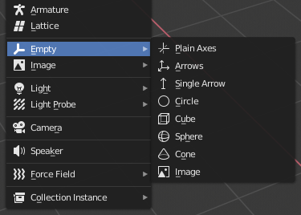

.. _doc_importing_3d_scenes:

Importing 3D scenes
===================

Godot scene importer
--------------------

When dealing with 3D assets, Godot has a flexible and configurable importer.

Godot works with *scenes*. This means that the entire scene being worked on in your favorite 3D DCC will be
transferred as close as possible.

Godot supports the following 3D *scene file formats*:

* glTF 2.0. Godot has full support for text and binary formats.
* DAE (COLLADA), an older format that is fully supported.
* OBJ (Wavefront) formats. It is also fully supported, but pretty limited (no support for pivots, skeletons, etc).
* ESCN, a Godot specific format that Blender can export with a plugin.
* FBX, supported via the Open Asset Import library. However, FBX is proprietary, so we recommend using other formats
  listed above, if suitable for your workflow.

Just copy the scene file together with the texture to the project repository, and Godot will do a full import.

It is important that the mesh is not deformed by bones when exporting. Make sure that the skeleton is reset to its T-pose
or default rest pose before exporting with your favorite 3D editor.

Exporting DAE files from Maya and 3DS Max
~~~~~~~~~~~~~~~~~~~~~~~~~~~~~~~~~~~~~~~~~

Autodesk added built-in COLLADA support to Maya and 3DS Max, but it's
broken by default and should not be used. The best way to export this format
is by using the
`OpenCollada <https://github.com/KhronosGroup/OpenCOLLADA/wiki/OpenCOLLADA-Tools>`__
plugins. They work well, although they are not always up-to date
with the latest version of the software.

Exporting glTF 2.0 files from Blender
~~~~~~~~~~~~~~~~~~~~~~~~~~~~~~~~~~~~~

There are three ways to export glTF files from Blender. As a glTF binary (``.glb`` file), glTF embedded (``.gltf`` file),
and with textures (``gltf`` + ``.bin`` + textures).

glTF binary files are the smallest of the three options. They include the mesh and textures set up in Blender.
When brought into Godot the textures are part of the object's material file.

glTF embedded files function the same way as binary files. They don't provide extra functionality in Godot,
and shouldn't be used since they have a larger file size.

There are two reasons to use glTF with the textures separate. One is to have the scene description in a
text based format and the binary data in a separate binary file. This can be useful for version control if you want to review
changes in a text based format. The second is you need the texture files separate from the material file. If you don't need
either of those glTF binary files are fine.

.. note:: Blender does not export emissive textures with the glTF file. If your model uses one it must be brought in separately.

Exporting DAE files from Blender
~~~~~~~~~~~~~~~~~~~~~~~~~~~~~~~~

Blender has built-in COLLADA support, but it does not work properly for the needs of game engines
and should not be used as is.

Godot provides a `Blender plugin <https://github.com/godotengine/collada-exporter>`_
that will correctly export COLLADA scenes for use in Godot.

Exporting ESCN files from Blender
~~~~~~~~~~~~~~~~~~~~~~~~~~~~~~~~~

The most powerful one, called `godot-blender-exporter
<https://github.com/godotengine/godot-blender-exporter>`__.
It uses a .escn file, which is kind of another name for a .tscn file (Godot scene file);
it keeps as much information as possible from a Blender scene.

The ESCN exporter has a detailed `document <escn_exporter/index.html>`__ describing
its functionality and usage.

Import workflows
----------------

Godot scene importer allows different workflows regarding how data is imported. Depending on many options, it is possible to
import a scene with:

* External materials (default): Where each material is saved to a file resource. Modifications to them are kept.
* External meshes: Where each mesh is saved to a different file. Many users prefer to deal with meshes directly.
* External animations: Allowing saved animations to be modified and merged when sources change.
* External scenes: Save each of the root nodes of the imported scenes as a separate scene.
* Single scene: A single scene file with everything built in.

As different developers have different needs, this import process is highly customizable.

Import options
--------------

The importer has several options, which will be discussed below:

Nodes
~~~~~

Root Type
^^^^^^^^^

By default, the type of the root node in imported scenes is "Spatial", but this can be modified.

Root Name
^^^^^^^^^

Allows setting a specific name to the generated root node.

Root Scale
^^^^^^^^^^

The scale of the root node.

Custom Script
^^^^^^^^^^^^^

A special script to process the whole scene after import can be provided.
This is great for post processing, changing materials, doing funny stuff
with the geometry etc.

Create a script like this:

::

    tool # Needed so it runs in the editor.
    extends EditorScenePostImport

    func post_import(scene):
        # Do your stuff here.
        return scene # remember to return the imported scene

The ``post_import`` function takes the imported scene as argument (the
parameter is actually the root node of the scene). The scene that
will finally be used must be returned. It can be a different one.

Storage
^^^^^^^

By default, Godot imports a single scene. This option allows specifying
that nodes below the root will each be a separate scene and instanced
into the imported one.

Of course, instancing such imported scenes in other places manually works, too.

Materials
~~~~~~~~~

Location
^^^^^^^^

Godot supports materials in meshes or nodes. By default, materials will be put
on each node.

Storage
^^^^^^^

Materials can be stored within the scene or in external files. By default,
they are stored in external files so editing them is possible. This is because
most 3D DCCs don't have the same material options as those present in Godot.

When materials are built-in, they will be lost each time the source scene
is modified and re-imported.

Keep On Reimport
^^^^^^^^^^^^^^^^

Once materials are edited to use Godot features, the importer will keep the
edited ones and ignore the ones coming from the source scene. This option
is only present if materials are saved as files.

Meshes
~~~~~~

Compress
^^^^^^^^

Makes meshes use less precise numbers for multiple aspects of the mesh in order
to save space.

These are:
 * Transform Matrix (Location, rotation, and scale)             : 32-bit float to 16-bit signed integer.
 * Vertices                                                     : 32-bit float to 16-bit signed integer.
 * Normals                                                      : 32-bit float to 32-bit unsigned integer.
 * Tangents                                                     : 32-bit float to 32-bit unsigned integer.
 * Vertex Colors                                                : 32-bit float to 32-bit unsigned integer.
 * UV                                                           : 32-bit float to 32-bit unsigned integer.
 * UV2                                                          : 32-bit float to 32-bit unsigned integer.
 * Vertex weights                                               : 32-bit float to 16-bit unsigned integer.
 * Armature bones                                               : 32-bit float to 16-bit unsigned integer.
 * Array index                                                  : 32-bit or 16-bit unsigned integer based on how many elements there are.

Additional info:
 * UV2 = The second UV channel for detail textures and baked lightmap textures.
 * Array index = An array of numbers that number each element of the arrays above; i.e. they number the vertices and normals.

In some cases, this might lead to loss of precision, so disabling this option
may be needed. For instance, if a mesh is very big or there are multiple meshes
being imported that cover a large area, compressing the import of this mesh(es)
may lead to gaps in geometry or vertices not being exactly where they should be.

Ensure Tangents
^^^^^^^^^^^^^^^

If textures with normal mapping are to be used, meshes need to have tangent arrays.
This option ensures that these are generated if not present in the source scene.
Godot uses Mikktspace for this, but it's always better to have them generated in
the exporter.

Storage
^^^^^^^

Meshes can be stored in separate files (resources) instead of built-in. This does
not have much practical use unless one wants to build objects with them directly.

This option is provided to help those who prefer working directly with meshes
instead of scenes.

Light Baking
^^^^^^^^^^^^

Whether or not the mesh is used in baked lightmaps.

- **Disabled:** The mesh is not used in baked lightmaps.
- **Enable:** The mesh is used in baked lightmaps.
- **Gen Lightmaps:** The mesh is used in baked lightmaps, and unwraps a second UV layer for lightmaps.

.. note:: For more information on light baking see :ref:`doc_baked_lightmaps`.

External Files
~~~~~~~~~~~~~~

Generated meshes and materials can be optionally stored in a subdirectory with the
name of the scene.

Animation options
-----------------

Godot provides many options regarding how animation data is dealt with. Some exporters
(such as Blender) can generate many animations in a single file. Others, such as
3DS Max or Maya, need many animations put into the same timeline or, at worst, put
each animation in a separate file.

Import of animations is enabled by default.

FPS
~~~

Most 3D export formats store animation timeline in seconds instead of frames. To ensure
animations are imported as faithfully as possible, please specify the frames per second
used to edit them. Failing to do this may result in shaky animations.

Filter Script
~~~~~~~~~~~~~

It is possible to specify a filter script in a special syntax to decide which tracks from which
animations should be kept.

The filter script is executed against each imported animation. The syntax consists of two types of
statements, the first for choosing which animations to filter, and the second for filtering
individual tracks within the matched animation. All name patterns are performed using a case
insensitive expression match, using ``?`` and ``*`` wildcards (using ``String.matchn()`` under the
hood).

The script must start with an animation filter statement (as denoted by the line beginning with an
``@``). For example, if we would like to apply filters to all imported animations which have a name
ending in ``"_Loop"``::

    @+*_Loop

Similarly, additional patterns can be added to the same line, separated by commas. Here is a
modified example to additionally *include* all animations with names that begin with ``"Arm_Left"``,
but also *exclude* all animations which have names ending in ``"Attack"``::

    @+*_Loop, +Arm_Left*, -*Attack

Following the animation selection filter statement, we add track filtering patterns to indicate
which animation tracks should be kept or discarded. If no track filter patterns are specified, then
all tracks within the matched animations will be discarded!

It's important to note that track filter statements are applied in order for each track within the
animation, this means that one line may include a track, a later rule can still discard it.
Similarly, a track excluded by an early rule may then be re-included once again by a filter rule
further down in the filter script.

For example: include all tracks in animations with names ending in ``"_Loop"``, but discard any
tracks affecting a ``"Skeleton"`` which end in ``"Control"``, unless they have ``"Arm"`` in their
name::

    @+*_Loop
    +*
    -Skeleton:*Control
    +*Arm*

In the above example, tracks like ``"Skeleton:Leg_Control"`` would be discarded, while tracks such
as ``"Skeleton:Head"`` or ``"Skeleton:Arm_Left_Control"`` would be retained.

Any track filter lines that do not begin with a ``+`` or ``-`` are ignored.

Storage
~~~~~~~

By default, animations are saved as built-in. It is possible to save them to a file instead. This
allows adding custom tracks to the animations and keeping them after a reimport.

Optimizer
~~~~~~~~~

When animations are imported, an optimizer is run, which reduces the size of the animation considerably.
In general, this should always be turned on unless you suspect that an animation might be broken due to it being enabled.

Clips
~~~~~

It is possible to specify multiple animations from a single timeline as clips. For this to work, the model
must have only one animation that is named ``default``. To create clips, change the clip amount to something
greater than zero. You can then name a clip, specify which frames it starts and stops on, and choose whether
the animation loops or not.

.. If this PR (https://github.com/godotengine/godot/pull/36709) is merged for Godot 4.0 this section must
   be updated to reflect that for the 4.0 documentation.

Scene inheritance
-----------------

In many cases, it may be desired to make modifications to the imported scene. By default, this is not possible because
if the source asset changes (source ``.dae``, ``.gltf``, ``.obj`` file re-exported from 3D modelling app), Godot will re-import the whole scene.

It is possible, however, to make local modifications by using *Scene Inheritance*. Try to open the imported scene and the
following dialog will appear:

In inherited scenes, the only limitations for modifications are:

* Nodes can't be removed (but can be added anywhere).
* Sub-Resources can't be edited (save them externally as described above for this)

Other than that, everything is allowed!

Import hints
------------

Many times, when editing a scene, there are common tasks that need to be done after exporting:

* Adding collision detection to objects
* Setting objects as navigation meshes
* Deleting nodes that are not used in the game engine (like specific lights used for modelling)

To simplify this workflow, Godot offers a few suffixes that can be added to the names of the
objects in your 3D modelling software. When imported, Godot will detect them and perform
actions automatically:

Remove nodes (-noimp)
~~~~~~~~~~~~~~~~~~~~~

Node names that have this suffix will be removed at import time, no
matter what their type is. They will not appear in the imported scene.

Create collisions (-col, -colonly, -convcolonly)
~~~~~~~~~~~~~~~~~~~~~~~~~~~~~~~~~~~~~~~~~~~~~~~~

Option "-col" will work only for Mesh nodes. If it is detected, a child
static collision node will be added, using the same geometry as the mesh.

However, it is often the case that the visual geometry is too complex or
too un-smooth for collisions, which ends up not working well.

To solve this, the "-colonly" modifier exists, which will remove the mesh upon
import and create a :ref:`class_staticbody` collision instead.
This helps the visual mesh and actual collision to be separated.

Option "-convcolonly" will create a :ref:`class_convexpolygonshape` instead of a :ref:`class_concavepolygonshape`.

Option "-colonly" can also be used with Blender's empty objects.
On import, it will create a :ref:`class_staticbody` with
a collision node as a child. The collision node will have one of a number of predefined shapes,
depending on Blender's empty draw type:

-  Single arrow will create a :ref:`class_rayshape`
-  Cube will create a :ref:`class_boxshape`
-  Image will create a :ref:`class_planeshape`
-  Sphere (and the others not listed) will create a :ref:`class_sphereshape`

For better visibility in Blender's editor, the user can set "X-Ray" option on collision
empties and set some distinct color for them in User Preferences / Themes / 3D View / Empty.

Create navigation (-navmesh)
~~~~~~~~~~~~~~~~~~~~~~~~~~~~

A mesh node with this suffix will be converted to a navigation mesh. Original Mesh node will be
removed.

Create a VehicleBody (-vehicle)
~~~~~~~~~~~~~~~~~~~~~~~~~~~~~~~

A mesh node with this suffix will be imported as a child to a :ref:`VehicleBody <class_VehicleBody>` node.

Create a VehicleWheel (-wheel)
~~~~~~~~~~~~~~~~~~~~~~~~~~~~~~

A mesh node with this suffix will be imported as a child to a :ref:`VehicleWheel <class_VehicleWheel>` node.

Rigid Body (-rigid)
~~~~~~~~~~~~~~~~~~~

Creates a rigid body from this mesh.

Animation loop (-loop, -cycle)
~~~~~~~~~~~~~~~~~~~~~~~~~~~~~~

Animation clips in the COLLADA document that start or end with the token "loop" or "cycle"
will be imported as a Godot Animation with the loop flag set. This is case-sensitive and
does not require a hyphen.

In Blender, this requires using the NLA Editor and naming the Action with the "loop" or
"cycle" prefix or suffix.
