.. _doc_android_custom_build:

Custom builds for Android
=========================

Godot provides the option to use custom build Android templates. Instead of
using the already pre-built template that ships with Godot, an actual Android
Java project gets installed into your project folder. Godot will then build it
and use it as an export template every time you export the project.

There are some reasons why you may want to do this:

* Modify the project before it's built.
* Add external SDKs that build with your project.

Configuring the custom build is a more or less straightforward process,
but it may take a while to get used to how the Android SDK works.

Instructions will be provided as detailed as possible to do this process.

Set up the custom build environment
-----------------------------------

Go to the Project menu, and install the *Custom Build* template:

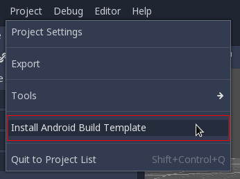

Make sure export templates are downloaded. If not, this menu will help you
download them.

This will create an Gradle-based Android project in ``res://android/build`` and
place a ``.gdignore`` file in ``res://android`` so the Godot filesystem ignores
this folder. Editing these files is not needed unless you want to :ref:`create
your own add-ons<doc_android_plugin>`, or you really need to modify the project.

Install the Android SDK (command-line version)
----------------------------------------------

These are the steps for installing the Android SDK using command line. The
advantage of this approach is the simplicity and small download/install size. It
can be more challenging though. The Android Studio approach is easier, but it
requires downloading and installing Android Studio (which may require more than
1 GB of storage).

Install a JDK
^^^^^^^^^^^^^

The Android SDK doesn't come with Java, so it needs to be installed manually.
You need to install a Java SDK (**not** just the runtime or JRE).
`OpenJDK 8 <https://adoptopenjdk.net/index.html>`__ is required, newer
versions won't work.

Download the command-line tools
^^^^^^^^^^^^^^^^^^^^^^^^^^^^^^^

Go to the `Android Studio download page <https://developer.android.com/studio/#command-tools>`_.
To save disk space, you don't want the full IDE, so don't download it.

.. note::

    If you do want Android Studio, read further down for instructions for
    doing the same using Android Studio.

Look on that page for the *Command line tools only* section. Currently, they are listed under
*Download Options*. Scroll down a bit until you see them.

Download the ZIP file for your platform, there will be a single ``tools``
folder inside:

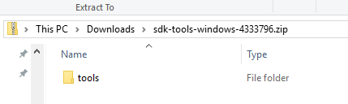

This may appear a little confusing, but be sure to follow these instructions
carefully:

Create a new folder anywhere you want named ``android-sdk`` (it **must** be
an empty directory). On Windows, the following path is usually good enough:

.. code-block:: none

  C:\users\<yourusername>\Documents\android-sdk
  
.. note::

    If you already have an android-sdk folder, normally located in ``%LOCALAPPDATA%\Android\Sdk``, 
    then use this folder instead of creating an empty ``android-sdk`` folder. 

Unzip the Android SDK ZIP file into the ``android-sdk`` folder. This folder should 
now contain the unzipped folder called ``tools``. Rename ``tools`` to ``latest``. 
Finally, create an empty folder named ``cmdline-tools`` and place ``latest`` into it. 
Your final directory structure should look like this :

.. code-block:: none

  android-sdk/
  android-sdk/cmdline-tools/
  android-sdk/cmdline-tools/latest
  android-sdk/cmdline-tools/latest/allTheOtherFiles
  
We need to setup the directory structure this way for the sdkmanager (inside the bin folder) to work.

Accepting the licenses
^^^^^^^^^^^^^^^^^^^^^^

To be able to use the Android SDK tools, Google requires you to accept
its licenses.

To do this, the ``sdkmanager`` must be executed from the command line with a
special argument. Navigate to the ``tools/bin`` directory inside the SDK folder
(instructions provided for Windows users, as Linux and macOS users are expected
to understand how command line navigation works):

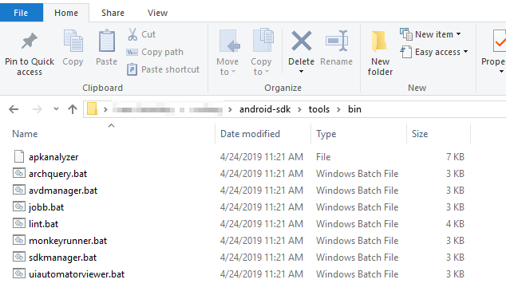

Then open a command line window:

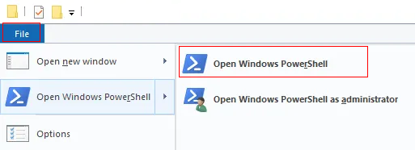

In there, run ``sdkmanager --licenses``:

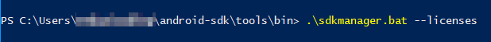

This will ask you to accept several licenses, just write ``y`` and press :kbd:`Enter`
on every of them until it's done.

Afterwards, install the platform tools (this is required to install ``adb``):

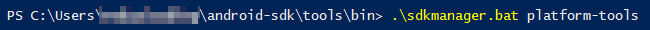

If you get an error saying ``Warning: Could not create settings``, try ``./sdkmanager --sdk_root=../../ --licenses`` or ``./sdkmanager --sdk_root=../../ platform-tools``. These must be executed inside the ``/tools/bin/`` folder because the path for ``--sdk_root`` is relative.

Generating the keystore
^^^^^^^^^^^^^^^^^^^^^^^

Once the *platform tools* are installed, the last step is to generate a debug
keystore (this is needed to build). Go up two folders by writing:

.. code-block:: shell

    cd ..\..

(or open a new shell in the ``android-sdk`` folder).

And you need to input the following line (on Linux and macOS, this should work
out of the box, for Windows there are further instructions below):

.. code-block:: shell

    keytool -keyalg RSA -genkeypair -alias androiddebugkey -keypass android -keystore debug.keystore -storepass android -dname "CN=Android Debug,O=Android,C=US" -validity 9999

On Windows, the full path to Java should be provided. You need to add ``&`` at
the beginning of the line if you use PowerShell; it's not needed for the regular
``cmd.exe`` console.

To make it clearer, here is an capture of a line that works on PowerShell (by
adding ``&`` and the full Java path before ``keytool.exe``). Again, keep in mind that you
need Java installed:

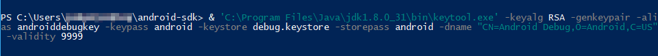

(right-click and open the image in a new tab if this appears too small)

Setting up Godot
^^^^^^^^^^^^^^^^

Go to the **Editor Settings** and set up a few fields in **Export > Android**.
Make sure they look like the following:

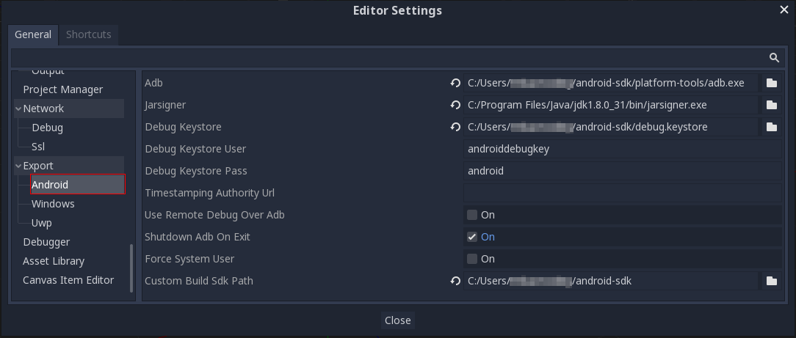

(right-click and open the image in a new tab if this appears too small)

As it can be seen, most paths are inside either the ``android-sdk`` folder you
originally created, or inside the Java install. For Linux and macOS users,
``jarsigner`` is often located in ``/usr/bin``.

With this, you should be all set.

Install the Android SDK (Android Studio)
----------------------------------------

If you just finished installing the SDK via the command-line tools, feel free to
skip this section entirely. The Android Studio path is easier, but it takes up
more disk space. It's also useful if you plan to develop Godot for Android
(modify the Java source code) or if you plan to develop add-ons.

Download and install Android Studio
^^^^^^^^^^^^^^^^^^^^^^^^^^^^^^^^^^^^

Download the latest version of Android Studio. When installing, pay attention to
where the *android-sdk* directory is created.

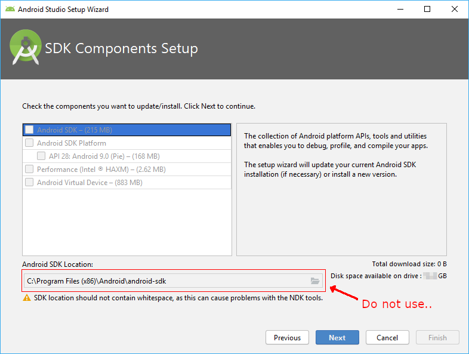

.. note:: This is funny, the path it proposes by default contains whitespace (and complains about it). It must be changed.

In any case, it's better to select a different path inside your user folders.
The recommended one is usually:

.. code-block:: none

  C:\Users\<yourusername>\Documents\android-sdk

Replace *yourusername* by your actual user name. Once it's correct, select from
the list above in the same screen:

* Android SDK
* Android SDK Platform

The rest are not needed, because the build system will fetch them itself. After
selecting them, go on with the installation.

Generating the keystore
^^^^^^^^^^^^^^^^^^^^^^^

Go to the folder where you installed ``android-sdk`` in the previous step, use File
Explorer and open a command line tool there:

The actual command line to type is the following. On Linux and macOS, it should
work out of the box, but on Windows, it needs additional details (keep reading
afterwards).

.. code-block:: shell

    keytool -keyalg RSA -genkeypair -alias androiddebugkey -keypass android -keystore debug.keystore -storepass android -dname "CN=Android Debug,O=Android,C=US" -validity 9999

On Windows, the full path to Java should be provided (and ``&`` needs to be
added at the beginning on the line if you use PowerShell, it's not needed for
the regular ``cmd.exe`` console). Don't worry, at least by using Android Studio
on Windows, Java comes bundled with it.

To make it clearer, here is a screen capture of a line that works on PowerShell
(by adding ``&`` and the full Java Path to ``keytool.exe``; remove ``&`` if you
use ``cmd.exe``). It uses a path to the Java version that comes with Android
Studio:

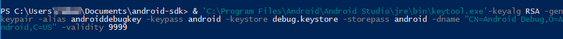

(right-click and open the image in a new tab if this appears too small)

Setting up Godot
^^^^^^^^^^^^^^^^

Go to the **Editor Settings** and set up a few fields in **Export > Android**.
Make sure they look like the following:

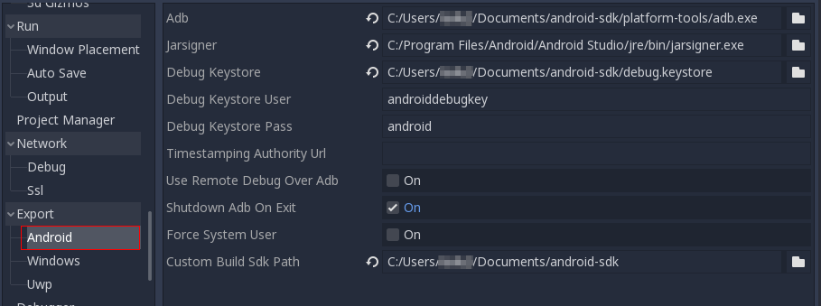

(right-click and open the image in a new tab if this appears too small)

As it can be seen, most paths are inside either the ``android-sdk`` folder you
originally created, or inside the Java install. For Linux and macOS users,
``jarsigner`` is often located in ``/usr/bin``.

With this, you should be all set.

Enabling the custom build and exporting
---------------------------------------

When setting up the Android project in the **Project > Export** dialog,
**Custom Build** needs to be enabled:

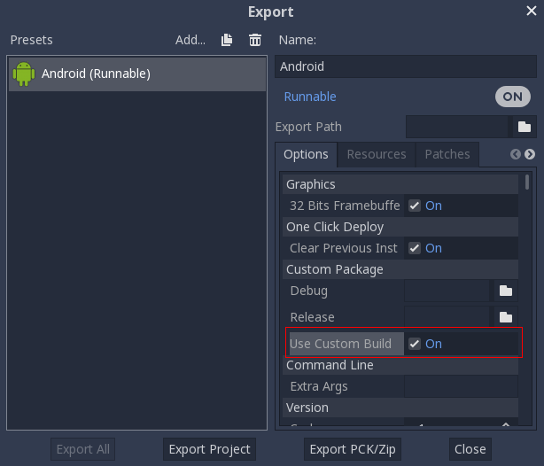

From now on, attempting to export the project or one-click deploy will call the
`Gradle <https://gradle.org/>`__ build system to generate fresh templates (this
window will appear every time):

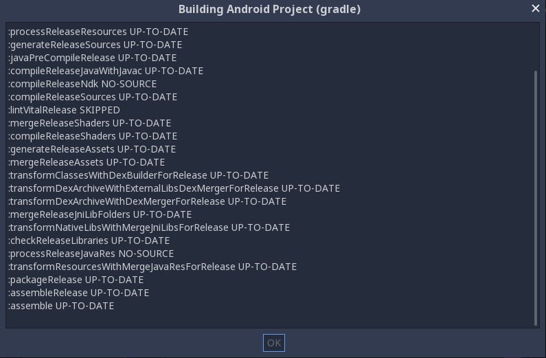

The templates built will be used automatically afterwards, so no further
configuration is needed.
