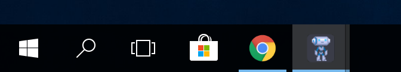
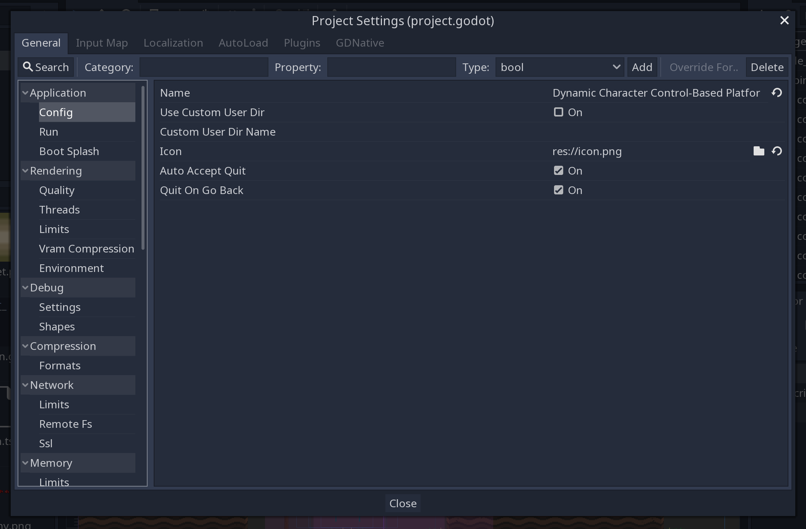
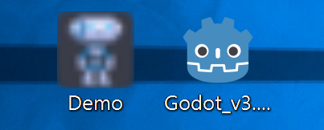
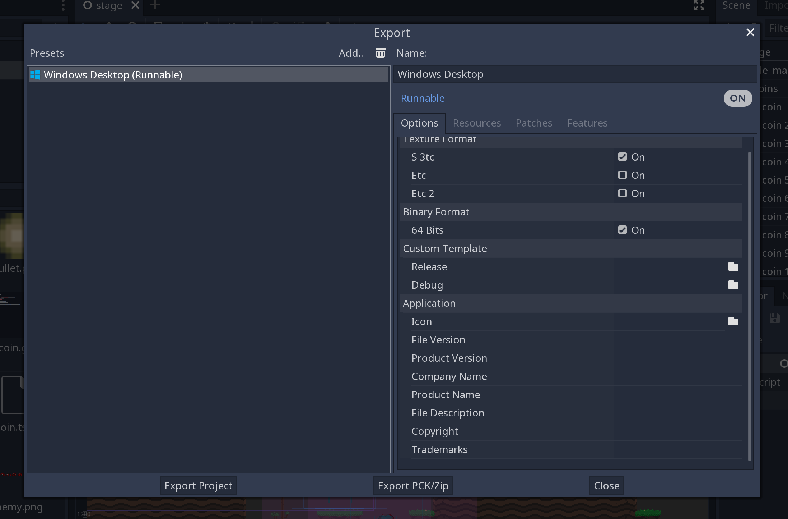

.. _doc_changing_application_icon_for_windows:

Changing application icon for Windows
=====================================

By default, the exported project's icon will be the Godot icon.
You will most likely want to change that for your project. There are two types
of icons that can be changed on Windows: the file icon and the taskbar icon.

Changing the taskbar icon
-------------------------

The taskbar icon is the icon that shows up on the taskbar when your project
is running.

To change the taskbar icon, go to
**Project → Project Settings → Application → Config → Icon**.
Click on the folder icon and select your desired icon.

.. note:: This is also the icon that gets displayed in the Godot project list.

Changing the file icon
----------------------

The file icon is the icon of the executable that you click on to start
the project.

Before selecting it in the export options, you will need to install
an extra tool called **rcedit**.
You can download it `here <https://github.com/electron/rcedit/releases>`_.

After downloading, you need to tell Godot the path to the rcedit executable
on your computer.
Go to **Editor → Editor Settings → Export → Windows**.
Click on the folder icon for the **rcedit** entry.
Navigate to and select the rcedit executable.

.. note:: Linux and macOS users will also need to install
          `WINE <https://www.winehq.org/>`_ to use rcedit.

.. image:: img/icon_rcedit.png

You should now have everything in place to change the file icon.
To do that, you will need to specify the icon when exporting.
Go to **Project → Export**. Assuming you have already created
a Windows Desktop preset, select your icon in ICO format in
the **Application → Icon** field.

.. note:: You can use software such as GIMP to export an ICO image.
          For more information, please refer to
          `this tutorial <http://skyboygames.com/easily-create-a-windows-app-icon-with-gimp/>`_.

Testing the result
------------------

You can now export the project. If it worked correctly, you should see this:

.. image:: img/icon_result.png

ICO file requirements
---------------------

Regardless of which program you use to create your
`ICO file <https://en.wikipedia.org/wiki/ICO_(file_format)>`_, there are
some requirements to ensure the icon (and your executable) works on Windows.

This is a bit tricky, as can be seen in the following Stack Overflow threads:
`one <https://stackoverflow.com/q/3236115/>`_,
`two <https://stackoverflow.com/q/40749785/>`_.

Your ICO file should at least contain icons in the following resolutions:
16×16, 48×48 and 256×256.

If you want to fully support high-DPI screens, this is the full list of
supported icon sizes on Windows 10:
16, 20, 24, 28, 30, 31, 32, 40, 42, 47, 48, 56, 60, 63, 84
and one larger than 255 pixels (such as 256, 512 or 1024).

It is also possible to convert a PNG image to an hiDPI-friendly ICO file
using this `ImageMagick <https://www.imagemagick.org/>`_ command:

.. code-block:: none

    magick convert icon.png -define icon:auto-resize=256,128,64,48,32,16 icon.ico
