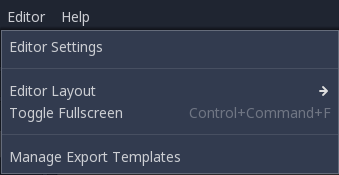
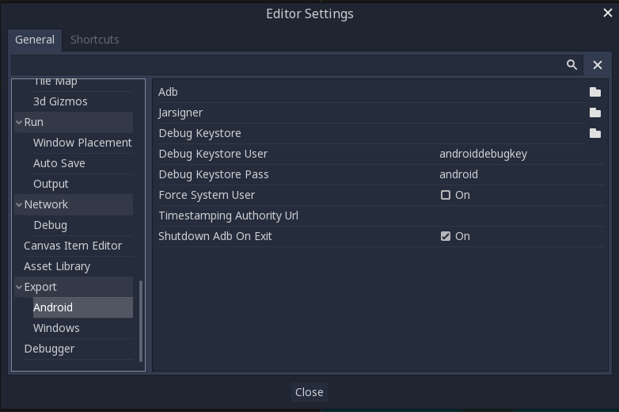
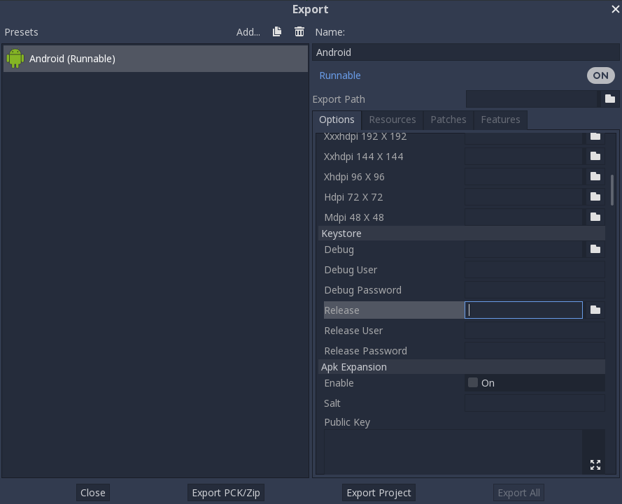
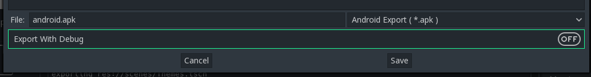

.. _doc_exporting_for_android:

Exporting for Android
=====================

Exporting for Android has fewer requirements than compiling Godot for it.
The following steps detail what is needed to setup the SDK and the engine.

Download the Android SDK
------------------------

Download and install the Android SDK from
`developer.android.com <https://developer.android.com/studio/>`__.

If you install Android Studio, you need to run it once to complete the SDK setup.

Install OpenJDK or Oracle JDK
-----------------------------

Download and install  `OpenJDK <https://github.com/ojdkbuild/ojdkbuild>`__ or `Oracle JDK <http://www.oracle.com/technetwork/java/javase/downloads/index.html>`__. Versions below JDK 8 may not work; some users have reported issues with the jarsigner (used to sign the APKs) in JDK 7.

If you install OpenJDK, choose ``1.8``. Don't choose the ``openjdk-jre`` files as that only contains the JRE, not the JDK which is required here.

Create a debug.keystore
-----------------------

Android needs a debug keystore file to install to devices and distribute
non-release APKs. If you have used the SDK before and have built
projects, ant or eclipse probably generated one for you (on Linux and
macOS, you can find it in the ``~/.android`` directory).

If you can't find it or need to generate one, the keytool command from
the JDK can be used for this purpose::

    keytool -keyalg RSA -genkeypair -alias androiddebugkey -keypass android -keystore debug.keystore -storepass android -dname "CN=Android Debug,O=Android,C=US" -validity 9999

This will create a ``debug.keystore`` file in your current directory. You should move it to a memorable location such as ``%USERPROFILE%\.android\``, because you will need its location in a later step. For more information on ``keytool`` usage, see `this Q&A article <https://godotengine.org/qa/21349/jdk-android-file-missing>`__.

Make sure you have adb
----------------------

Android Debug Bridge (``adb``) is the command line tool used to communicate with
Android devices. It's installed with the SDK, but you may need to install one
(any) of the Android API levels for it to be installed in the SDK directory.

Setting it up in Godot
----------------------

Enter the Editor Settings screen. This screen contains the editor
settings for the user account in the computer (it's independent of the
project).

Scroll down to the section where the Android settings are located:

In that screen, the path to 3 files needs to be set:

- The ``adb`` executable (``adb.exe`` on Windows)
  - It can usually be found at ``%LOCALAPPDATA%\Android\Sdk\platform-tools\adb.exe``.

- The ``jarsigner`` executable (from JDK 6 or 8)
  - On Windows, OpenJDK installs to a dir like ``%PROGRAMFILES%\ojdkbuild\java-1.8.0-openjdk-1.8.0.232-2\bin``. On Linux, it typically installs to a dir like ``/usr/bin/jarsigner``. The exact path may vary depending on the OpenJDK update you've installed and your machine's operating system.

- The debug ``.keystore`` file
  - It can be found in the folder where you put the ``debug.keystore`` file you created above.

Once that is configured, everything is ready to export to Android!

Providing launcher icons
------------------------

Launcher icons are used by Android launcher apps to represent your application to users. Godot only requires high-resolution icons (for ``xxxhdpi`` density screens) and will automatically generate lower-resolution variants.

There are two types of icons required by Godot:

- **Main Icon:** The "classic" icon. This will be used on all Android versions up to Android 8 (Oreo), exclusive. Must be at least 192×192 px.
- **Adaptive Icons:** Starting from Android 8 (inclusive), `Adaptive Icons <https://developer.android.com/guide/practices/ui_guidelines/icon_design_adaptive>`_ were introduced. Applications will need to include separate background and foreground icons to have a native look. The user's launcher application will control the icon's animation and masking. Must be at least 432×432 px.

.. seealso:: It's important to adhere to some rules when designing adaptive icons. `Google Design has provided a nice article <https://medium.com/google-design/designing-adaptive-icons-515af294c783>`_ that helps to understand those rules and some of the capabilities of adaptive icons.

.. caution:: The most important adaptive icon design rule is to have your icon critical elements inside the safe zone: a centered circle with a diameter of 66dp (264 pixels on ``xxxhdpi``) to avoid being clipped by the launcher.

If you don't provide some of the requested icons, Godot will replace them using a fallback chain, trying the next in line when the current one fails:

- **Main Icon:** Provided main icon -> Project icon -> Default Godot main icon.
- **Adaptive Icon Foreground:** Provided foreground icon -> Provided main icon -> Project icon -> Default Godot foreground icon.
- **Adaptive Icon Background:** Provided background icon -> Default Godot background icon.

It's highly recommended to provide all requested icons, and at least with the specified resolutions. Only this way your application will look great on all Android devices and versions.

Exporting for Google Play Store
-------------------------------

Uploading an APK to Google's Play Store requires you to sign using a non-debug
keystore file; such file can be generated like this:

.. code-block:: shell

    keytool -v -genkey -v -keystore mygame.keystore -alias mygame -keyalg RSA -validity 10000

This keystore and key are used to verify your developer identity, remember the password and keep it in a safe place!
Use Google's Android Developer guides to learn more about `APK signing <https://developer.android.com/studio/publish/app-signing>`__.

Now fill in the following forms in your Android Export Presets:

- **Release:** Enter the path to the keystore file you just generated.
- **Release User:** Replace with the key alias.
- **Release Password:** Key password. Note that the keystore password and the key password currently have to be the same.

**Your export_presets.cfg file now contains sensitive information.** If you use
a version control system, you should remove it from public repositories and add
it to your ``.gitignore`` file or equivalent.

Don't forget to uncheck the **Export With Debug** checkbox while choosing the APK's name.

Optimizing the APK size
-----------------------

By default, the APK will contain native libraries for both ARMv7 and ARMv8
architectures. This increases its size significantly. To create a smaller APK,
uncheck either **Armeabi-v 7a** or **Arm 64 -v 8a** in your project's Android
export preset. This will create an APK that only contains a library for
a single architecture. Note that applications targeting ARMv7 can also run on
ARMv8 devices, but the opposite is not true.

Since August 2019, Google Play requires all applications to be available in
64-bit form. This means you cannot upload an APK that contains *just* an ARMv7
library. To solve this, you can upload several APKs to Google Play using its
`Multiple APK support <https://developer.android.com/google/play/publishing/multiple-apks>`__.
Each APK should target a single architecture; creating an APK for ARMv7
and ARMv8 is usually sufficient to cover most devices in use today.

You can optimize the size further by compiling an Android export template with
only the features you need. See :ref:`doc_optimizing_for_size` for more
information.
